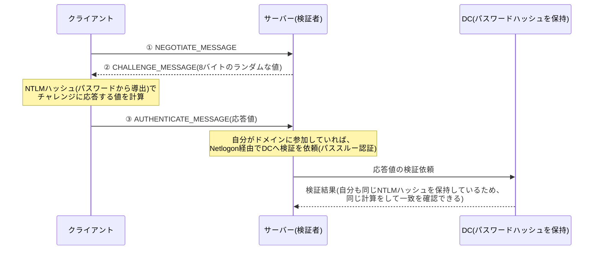

## はじめに

- **この記事で得られること**: [Kerberos認証の仕組み](/articles/ad-kerberos-guide)で扱った「Kerberosとの違い」の比較表の、**NTLM側の内部の仕組みそのもの**を、実際のやり取り(ネゴシエート・チャレンジ・オーセンティケート)の3段階に沿って理解します。あわせて、**非ドメイン参加端末やワークグループ環境が、なぜ今でもNTLMを使わざるを得ないのか**という構造的な理由と、それを回避する既存の手段(KDCプロキシ)までを扱います。
- **対象読者**: Kerberosとの違いは理解したものの、NTLM認証そのものの内部メカニズム(チャレンジレスポンスが具体的に何を計算しているのか)を説明できない方を想定しています。
- **読むのにかかる想定時間**: 約18分

この記事は[『上位1%』シリーズ 全記事ガイド](/sitemap)の一部、[Active Directoryシリーズ](/sitemap#シリーズ一覧)の13.1本目です。[Kerberos認証の仕組み](/articles/ad-kerberos-guide)を先に読んでおくと、本記事の対比がスムーズです。

## 前提知識

- **Kerberos認証との対比**: [Kerberos認証の仕組み](/articles/ad-kerberos-guide)で扱った、チケットベースの認証方式との違いを前提とします。
- **Netlogonとセキュアチャネル**: [Netlogonサービスとセキュアチャネルの仕組み](/articles/ad-netlogon-guide)で扱った、サーバーとDCの間の信頼関係です。NTLMの検証の裏側で、この仕組みが使われます。

## 全体像をつかむ

NTLM認証は、名前の通り**NT LAN Manager**という古いプロトコルの系譜であり、**チャレンジレスポンス方式**という、Kerberosとは根本的に異なる発想で本人確認を行います。

## 基礎から徹底解説

### 3回のやり取りが、それぞれ何を意味しているのか

1. **NEGOTIATE_MESSAGE**: クライアントが、サーバーに対して「NTLM認証を開始したい」と伝え、対応している機能(文字コード、署名の要否など)を提示します。
2. **CHALLENGE_MESSAGE**: サーバーが、**8バイトのランダムな値(チャレンジ)を生成し**、クライアントへ送り返します。**この値は、毎回の認証ごとに異なる、使い捨ての値**です。
3. **AUTHENTICATE_MESSAGE**: クライアントが、**NTLMハッシュ(パスワードから導出した値)を鍵として、このチャレンジを含むデータに対してHMAC-MD5を計算した結果**を、応答値としてサーバーへ送ります(現在主流のNet-NTLMv2の場合)。

**ここで、パスワードそのものも、NTLMハッシュそのものも、ネットワーク上には一切流れていません。** ネットワーク上を流れるのは、「NTLMハッシュを鍵として、サーバーが出したチャレンジを使って計算した結果」だけです。

検証者は、どうやって「正解」を知るのか

**検証者(サーバー、あるいはそのサーバーが問い合わせるDC)は、対象アカウントのNTLMハッシュを、AD DS側(あるいはローカルのSAMデータベース)に、あらかじめ保持しています。** クライアントから受け取った応答値を検証する際、検証者は**自分が保持しているNTLMハッシュを使って、クライアントとまったく同じ計算を、自分でもう一度行います。** 計算結果が、クライアントから送られてきた応答値と一致すれば、「クライアントは、同じNTLMハッシュを導出できる、正しいパスワードを知っている」と判断できます。これが、Kerberosの事前認証(タイムスタンプの暗号化・復号)と、発想として同じ「双方が独立に同じ値を計算できることを、本人確認の証明として使う」という原理です。

### サーバー自身がDCでない場合、誰が検証しているのか

**サーバー自身がドメインに参加した通常のメンバーサーバーである場合、そのサーバー自身はドメインユーザーのNTLMハッシュを保持していません。** このとき、サーバーは、[Netlogonサービスとセキュアチャネルの仕組み](/articles/ad-netlogon-guide)で扱った、**サーバーとDCの間に確立されたセキュアチャネルを使い、クライアントから受け取った応答値の検証そのものを、DCへ依頼します。** これが**パススルー認証**です。サーバー自身は、クライアントの応答値が正しいかどうかを、自分では一切判断せず、「DCが正しいと言ったかどうか」だけで判断しています。この、**認証のたびに必ずDCへの問い合わせが発生する**という性質が、[Kerberosとの違いの比較表](/articles/ad-kerberos-guide#kerberos認証とntlm認証の違い)で挙げた「DCへの都度の問い合わせ」の、具体的な正体です。

## プロが見ている視点(上位1%の理解)

### 非ドメイン参加端末が、今でもNTLMを使わざるを得ない構造的な理由

**Kerberosが成立するためには、クライアントとサーバーの両方が、同じKDC(信頼されたレルム)を介して、お互いの正当性を証明できる関係にある必要があります。** ドメインに参加していない端末や、ワークグループ環境のローカルアカウントには、**そもそも対応するKDCが存在しません。** ローカルアカウントのパスワード情報は、各端末のローカルSAMデータベースに保持されているだけであり、そこにはKerberosのチケットを発行してくれる相手が存在しないのです。

これに対して、**NTLMは、「検証者が、対象アカウントのNTLMハッシュをどこかから入手できれば、それだけで成立する」という、より緩い前提の仕組みです。** ローカルアカウント同士の認証であれば、検証者(アクセス先のPC自身)が、まさにそのローカルアカウントのNTLMハッシュを自分のSAMデータベースに持っているため、KDCという第三者を介さずに、その場で検証が完結します。**「KDCという信頼の基盤が存在しない状況でも成立する」という、NTLMの構造的な緩さこそが、非ドメイン参加端末がNTLMに依存し続けている、本当の理由**です。

### 既存の回避策:KDCプロキシ

とはいえ、非ドメイン参加端末からでも、Kerberosを使いたい場面は実務上多くあります(例:社外のPCから、リモートデスクトップゲートウェイ経由で社内のドメインリソースへアクセスする場合)。この課題に対して、**KDCプロキシ**という既存の仕組みが使われています。**KDCプロキシは、クライアントの代わりに、KDCプロキシサーバー自身がDCへKerberosのやり取りを中継(プロキシ)してくれる**ことで、クライアント自身がDCへ直接到達できなくても(社外ネットワークからDCへ直接通信できなくても)、HTTPS経由でKerberosのチケットを取得できるようにする仕組みです。これは、次の記事で扱う、より新しい**IAKerbとローカルKDC**という仕組みの、先行事例と位置づけられます。

## よくある誤解・つまずきポイント

- **誤解1: 「NTLM認証では、パスワードやそのハッシュ値が、ネットワーク上を流れている」**
  ネットワーク上を流れるのは、NTLMハッシュを鍵として計算した「チャレンジへの応答値」だけであり、NTLMハッシュそのものは一切送信されません。
- **誤解2: 「NTLM認証を受け付けるサーバーは、自分自身でパスワードの正しさを判断している」**
  サーバー自身がDCでない場合、応答値の検証は、Netlogon経由のパススルー認証によって、DCへ委ねられています。
- **誤解3: 「非ドメイン参加端末は、永久にNTLMしか使えない」**
  KDCプロキシという既存の仕組みがすでに存在し、次の記事で扱うIAKerb・ローカルKDCという新しい仕組みも登場しています。

## 障害・トラブルシューティングの視点

1. **ドメインメンバーサーバーで、NTLM認証が失敗する**: パススルー認証が正しく行われているか、サーバーとDCの間のセキュアチャネルが健全かを、[Netlogonサービスとセキュアチャネルの仕組み](/articles/ad-netlogon-guide)で扱った`Test-ComputerSecureChannel`で確認します。
2. **特定のサーバーだけ、NTLM認証が極端に遅い**: そのサーバーが、都度DCへ問い合わせるパススルー認証に依存しているため、DCとの通信経路(ネットワーク遅延など)に問題がないかを確認します。
3. **非ドメイン参加端末から、社内リソースへのKerberosアクセスができない**: KDCプロキシが構成されているか、あるいは次の記事で扱うIAKerb/ローカルKDCの利用を検討します。

## まとめ

- NTLM認証は、ネゴシエート・チャレンジ・オーセンティケートという3回のやり取りで成立する、チャレンジレスポンス方式の認証です。
- ネットワーク上を流れるのは、NTLMハッシュを鍵として計算した応答値だけであり、パスワードやハッシュそのものは流れません。
- サーバー自身がDCでない場合、応答値の検証はパススルー認証によってDCへ委ねられ、認証のたびにDCへの問い合わせが発生します。
- 非ドメイン参加端末がNTLMに依存するのは、Kerberosの前提であるKDCが、そもそも存在しないためです。KDCプロキシという既存の回避策も存在します。

**今日から意識すべきこと**
1. NTLM認証のトラブルに遭遇したら、「検証そのものはDCで行われている」という前提で、サーバーとDCの間のセキュアチャネルを確認しましょう。
2. 「非ドメイン参加端末はKerberosを使えない」という前提を、固定観念にせず、KDCプロキシなどの既存の回避策を把握しておきましょう。

## 参考文献

- [NTLM Overview | Microsoft Learn](https://learn.microsoft.com/en-us/windows-server/security/kerberos/ntlm-overview)
- [Microsoft NTLM | Microsoft Learn](https://learn.microsoft.com/en-us/windows/win32/secauthn/microsoft-ntlm)
- [KDC Proxy Protocol [MS-KKDCP] | Microsoft Learn](https://learn.microsoft.com/en-us/openspecs/windows_protocols/ms-kkdcp/5bcebb8d-b747-4ee5-9453-428aec1c5c38)
