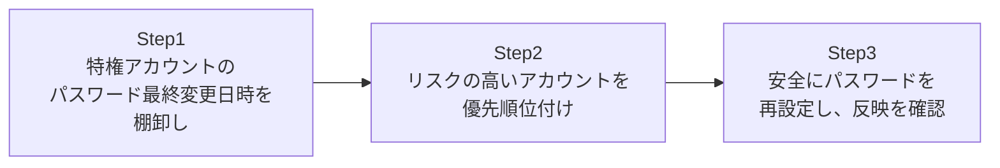

## はじめに

- **この記事で得られること**: [【障害調査】新DC昇格後にAdministratorでログインできなくなる事象を、エラーから調査するハンズオン](/articles/ad-dc-replace-ntlm-lockout-investigation-guide)で明らかになった、「**パスワードが長期間変更されていないアカウントは、古い暗号方式のキーしか持っていない可能性がある**」というリスクを、**DCリプレース作業の前に、自分の手で棚卸しし、予防的に解消する**手順を身につけます。事後対応ではなく、事前の予防策として扱えるようになることが目標です。
- **対象読者**: 前回の障害調査記事を読み、同様の事象を未然に防ぐ方法を知りたい方、これからDCリプレースやドメイン移行作業を予定している方を想定しています。
- **読むのにかかる想定時間**: 約20分(ハンズオン実施込み)

この記事は[『上位1%』シリーズ 全記事ガイド](/sitemap)の一部、[Active Directoryシリーズ](/sitemap#シリーズ一覧)の15.2本目です。

## 前提知識

- **AESキー欠落のリスク**: [【障害調査】新DC昇格後にAdministratorでログインできなくなる事象を、エラーから調査するハンズオン](/articles/ad-dc-replace-ntlm-lockout-investigation-guide)で扱った、パスワード変更とKerberosキーの関係です。

## 全体像をつかむ

このハンズオンで行うことは、次の3ステップです。



## ハンズオン手順

### Step 1: 特権アカウントのパスワード最終変更日時を、一覧で棚卸しする

まず、Administrators・Domain Admins・Enterprise Adminsという、主要な特権グループに所属するアカウントを対象に、パスワードの最終変更日時を一覧化します。

```powershell
$privilegedGroups = "Administrators", "Domain Admins", "Enterprise Admins"
$targets = foreach ($group in $privilegedGroups) {
    Get-ADGroupMember -Identity $group -Recursive | Where-Object { $_.objectClass -eq "user" }
}
$targets | Select-Object -Unique -ExpandProperty SamAccountName |
    ForEach-Object {
        Get-ADUser -Identity $_ -Properties PasswordLastSet, whenCreated |
            Select-Object SamAccountName, PasswordLastSet, whenCreated
    } | Sort-Object PasswordLastSet
```

**実行結果(イメージ):**

```
SamAccountName  PasswordLastSet       whenCreated
--------------  ---------------       -----------
Administrator   2019-04-02 09:12:00   2019-04-02 09:10:15
svc-backup       2020-11-15 14:30:00   2020-11-15 14:28:40
j.tanaka         2026-08-10 10:00:00   2024-03-01 09:00:00
```

**このリストを、パスワード最終変更日時の古い順に並べることで、「どのアカウントが、最も古い暗号方式のキーしか持っていない可能性が高いか」を、一目で確認できます。** 特に、組み込みのAdministratorアカウントは、ドメイン作成時から一度もパスワードが変更されていないケースが多く、**リストの先頭に来ることが珍しくありません。**

### Step 2: リスクの高いアカウントを、優先順位付けする

棚卸しした一覧から、次の2つの条件に当てはまるアカウントを、**最優先で対応すべきリスクの高いアカウント**として特定します。

- **組み込みのAdministratorアカウントである**(どのドメインにも必ず存在し、DCリプレース時のトラブルシューティングで実際に使われる可能性が高いため)
- **パスワード最終変更日時が、ドメイン作成時または数年以上前のままである**

```powershell
# whenCreatedとPasswordLastSetが、ほぼ同じ時刻(=一度も変更されていない)のアカウントを抽出
$targets | Select-Object -Unique -ExpandProperty SamAccountName |
    ForEach-Object {
        Get-ADUser -Identity $_ -Properties PasswordLastSet, whenCreated
    } | Where-Object {
        ($_.PasswordLastSet - $_.whenCreated).TotalMinutes -lt 5
    } | Select-Object SamAccountName, PasswordLastSet
```

**実行結果(該当部分、イメージ):**

```
SamAccountName  PasswordLastSet
--------------  ---------------
Administrator   2019-04-02 09:12:00
```

**`whenCreated`(アカウント作成日時)と`PasswordLastSet`(パスワード最終変更日時)が、ほぼ同じ時刻になっているアカウントは、「作成時に設定されたパスワードが、一度も変更されていない」ことを意味します。** このハンズオンの例では、Administratorアカウントが、まさにこの条件に当てはまりました。

### Step 3: 安全にパスワードを再設定し、新DCへの反映を確認する

リスクの高いアカウントが特定できたら、**DCリプレース作業の、本番の切り替えより前に**、計画的にパスワードを再設定します。

```powershell
# 安全な新しいパスワードを生成し、再設定する
$newPassword = ConvertTo-SecureString -String "<強固な新しいパスワード>" -AsPlainText -Force
Set-ADAccountPassword -Identity Administrator -NewPassword $newPassword -Reset
```

<details>
<summary>なぜ、1回の再設定ではなく、2回の再設定が推奨される場合があるのか</summary>

AD内部の実装の都合により、**パスワードを変更した直後は、新しいキー情報が、いったん「予備」の領域(`KerberosNew`と呼ばれる領域)に書き込まれ、現在有効なキーの領域(`Kerberos`)へは、まだ反映されていない**、という段階を経ることがあります。**この「予備」から「現在有効」への反映は、次にもう一度パスワードが変更されたタイミングで行われる**ため、特に重要なアカウントについては、**1回の再設定だけで終わらせず、時間を置いて2回再設定する**ことが、より確実な対応として推奨されます。

</details>

再設定後、このアカウントのパスワード変更が、すべてのDC(新DCを含む)へ正しくレプリケーションされたことを確認します。

```powershell
repadmin /showrepl <新DCのホスト名>
```

**この手順を、DCリプレース作業の正式な手順書の一部として組み込むことで、[前回の障害調査](/articles/ad-dc-replace-ntlm-lockout-investigation-guide)で遭遇したような、Administratorアカウントのログイン不能事象を、事前に防げます。**

## プロが見ている視点(上位1%の理解)

### 「棚卸し」は、一度だけ実施すればよい作業ではない

このハンズオンで行った棚卸しは、**DCリプレースの直前だけ実施すればよい、一回限りの作業ではありません。** 組織内のアカウントは、時間が経つにつれて、新しく作られるものもあれば、長期間パスワードが変更されないまま放置されるものも出てきます。**「パスワードの古さ」は、暗号方式の古さだけでなく、[推測されやすいパスワードが使われ続けるリスク](/articles/ad-fgpp-handson-guide)とも、構造的につながっています。** 上位1%のエンジニアは、この棚卸しを、DCリプレースという特定のイベントのためだけの作業ではなく、**定期的なセキュリティ運用の一部として、カレンダーに組み込んで繰り返し実施します。**

## よくある誤解・つまずきポイント

- **誤解1: 「パスワードの棚卸しは、DCリプレースのときだけ必要な、特別な作業である」**
  パスワードの古さに関するリスクは、DCリプレースの有無に関わらず、常に蓄積し続けます。定期的な棚卸しが望ましいです。
- **誤解2: 「パスワードを1回再設定すれば、必ずすべてのキーが即座に、完全に反映される」**
  AD内部の実装の都合により、特に重要なアカウントについては、2回の再設定がより確実な対応として推奨される場合があります。
- **誤解3: 「棚卸しの対象は、組み込みのAdministratorアカウントだけで十分である」**
  サービスアカウントや、長期間在籍している管理者個人のアカウントも、同様のリスクを抱えている可能性があるため、棚卸しの対象に含めるべきです。

## 障害・トラブルシューティングの視点

1. **棚卸しスクリプトが、想定より多くのアカウントを「リスクあり」と判定する**: 組織の実際の運用(定期的なパスワード変更ポリシーの有無)を確認し、優先順位をさらに絞り込みます。
2. **パスワードを再設定したが、新DCへの反映が確認できない**: `repadmin /showrepl`で、レプリケーションエラーが発生していないかを確認します。
3. **サービスアカウントのパスワードを再設定したら、サービスが起動しなくなった**: パスワード変更後は、そのパスワードを利用しているサービス側の設定も、あわせて更新する必要があります。[gMSA(グループ管理サービスアカウント)](/articles/ad-gmsa-handson-guide)のような、パスワード管理そのものから解放される仕組みの採用も検討してください。

## まとめ

- DCリプレースの前に、特権アカウントのパスワード最終変更日時を棚卸しすることで、AESキー欠落のリスクを事前に把握できます。
- `whenCreated`と`PasswordLastSet`がほぼ同じ時刻のアカウントは、パスワードが一度も変更されていない、リスクの高いアカウントです。
- 重要なアカウントについては、1回だけでなく2回のパスワード再設定が、より確実な対応として推奨される場合があります。
- この棚卸しは、DCリプレースのためだけの作業ではなく、定期的なセキュリティ運用の一部として繰り返し実施すべきです。

**今日から意識すべきこと**
1. DCリプレースやドメイン移行の計画を立てる際は、必ず特権アカウントのパスワード棚卸しを、作業手順の最初のステップに組み込みましょう。
2. パスワードの棚卸しを、特定のイベントのためだけでなく、定期的なセキュリティ運用の一部として、カレンダーに組み込みましょう。

## 参考文献

- [【障害調査】新DC昇格後にAdministratorでログインできなくなる事象を、エラーから調査するハンズオン](/articles/ad-dc-replace-ntlm-lockout-investigation-guide)
- [Set-ADAccountPassword | Microsoft Learn](https://learn.microsoft.com/en-us/powershell/module/activedirectory/set-adaccountpassword)
