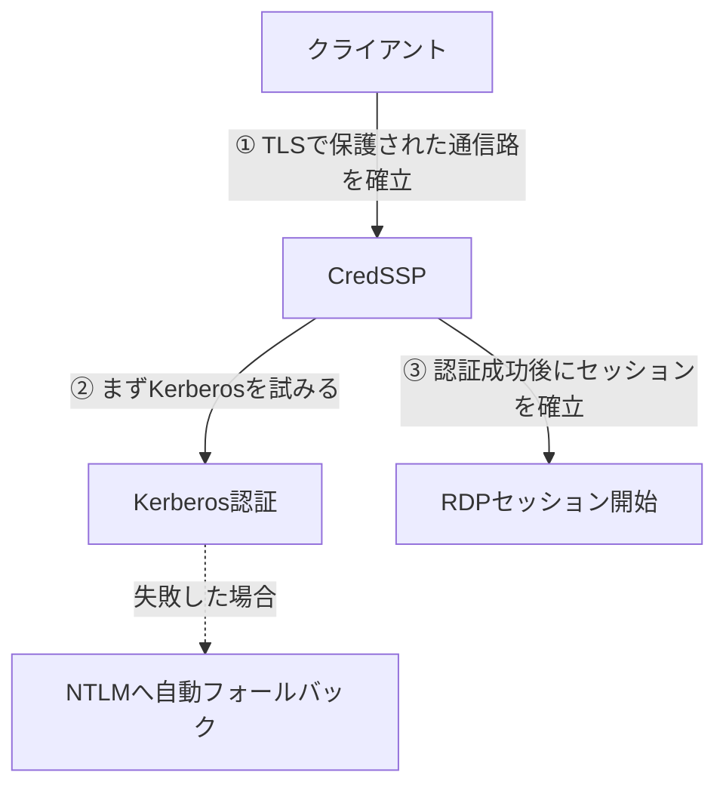

## はじめに

- **この記事で得られること**: [【障害調査】新DC昇格後にAdministratorでログインできなくなる事象](/articles/ad-dc-replace-ntlm-lockout-investigation-guide)で触れた、「RDP接続のポップアップ認証と、Windows自身のログオン処理は、別々のやり取りである」という前提をさらに掘り下げ、**RDP接続時のNLA(ネットワークレベル認証)が、実際にはCredSSPという仕組みを通じて、Kerberosを優先しつつNTLMへ自動的にフォールバックする**という裏側の挙動を理解します。そのうえで、Windows 11 24H2・WindowsServer 2025から実際に入った3つの変更——**NTLMv1の廃止**、**クローンされた端末の重複SID検出の強化**、**Credential Guardの既定有効化**——が、実務にどう影響するのかを体系的に整理します。
- **対象読者**: [IAKerbとローカルKDCの仕組み](/articles/ad-iakerb-localkdc-guide)で、「WS2025でNTLMがデフォルト無効化されている」という説が不正確であることは理解したものの、「じゃあWS2025・Windows 11 24H2では、実際に何が変わったのか」を具体的に説明できない方を想定しています。
- **読むのにかかる想定時間**: 約20分

この記事は[『上位1%』シリーズ 全記事ガイド](/sitemap)の一部、[Active Directoryシリーズ](/sitemap#シリーズ一覧)の13.4本目です。

## 前提知識

- [NTLM認証の仕組みを『上位1%』の視点で理解する](/articles/ad-ntlm-mechanism-guide): NTLMのチャレンジレスポンス方式の基本が前提になっています。
- [IAKerbとローカルKDCの仕組みを『上位1%』の視点で理解する](/articles/ad-iakerb-localkdc-guide): NTLM廃止の正確なロードマップが前提になっています。

## 全体像をつかむ

RDP接続時に表示される資格情報の入力ポップアップは、**NLA**(Network Level Authentication)という仕組みによるものです。しかし、**NLAはあくまで「接続前に認証を済ませる」という方針(ポリシー)の名前であり、その実際の処理を担っているのは、`CredSSP`という、もう1つ別の仕組みです。**

**CredSSPは、まずKerberosでの認証を試み、何らかの理由でKerberosが使えない場合に、自動的にNTLMへフォールバックする**という挙動を持っています。[【障害調査】新DC昇格後にAdministratorでログインできなくなる事象](/articles/ad-dc-replace-ntlm-lockout-investigation-guide)で確認した、「RDPのポップアップでは問題なく認証できたのに、その後のログオン画面で拒否された」という事象は、**この自動フォールバックの挙動と、ポップアップ段階(NLA/CredSSP)と、実際のデスクトップへのログオン処理が、別々のタイミング・別々の判断基準で動いていること**が、組み合わさって起きていたと考えられます。

## 基礎から徹底解説

### 変更点1:NTLMv1の廃止(NTLMv2は引き続き利用可能)

Windows 11 24H2・WindowsServer 2025から、**NTLMv1という、より古いバージョンのNTLMへの対応が、廃止されました。** ここで重要なのは、[IAKerbとローカルKDCの仕組み](/articles/ad-iakerb-localkdc-guide)で訂正した「NTLMがデフォルト無効化されている」という説とは、**まったく別の変更**だという点です。**廃止されたのはNTLMv1だけであり、現在も広く使われているNTLMv2は、引き続き利用可能です。** 「NTLM」という言葉でひとくくりに議論すると、この粒度の違いを見落としてしまいます。

### 変更点2:クローンされた端末の、重複SID検出の強化

AWS上でAMI(マシンイメージ)から複数のインスタンスを起動する運用は、実務でごく一般的です。しかし、**`sysprep`のような、SIDを再生成する手順を踏まずにクローンされた端末が複数存在すると、それらが同じSIDを持ってしまいます。** 最近の累積更新プログラムから、**Windowsが、この重複したSIDを検出し、認証そのものをブロックするようになりました。**

この変更が、なぜ[コンピューター名の記事](/articles/ad-computername-netdom-guide)で扱った事故と関係しているのか

[sysdm.cplとnetdom computernameは何が違うのか](/articles/ad-computername-netdom-guide)で扱った、**DC①がDC②と同じホスト名のままドメインに参加し、コンピューターアカウントのパスワードを上書きしてしまった事故**は、「名前」の重複が引き起こした問題でした。**今回の重複SID検出の強化は、「名前」ではなく「SID」という、より根本的な識別子の重複に対する防御**です。AWSのAMIから複数のインスタンスを起動する際、`sysprep`を実行せずにクローンしてしまうと、**ホスト名を変更していても、SIDレベルでは重複した、まったく同一の端末**が複数できてしまいます。この強化によって、そうした環境で、認証エラーという形で問題が可視化されるようになりました。

### 変更点3:Credential Guardの既定有効化

Windows 11 22H2・WindowsServer 2025から、**Credential Guard**という機能が、既定で有効になりました。これは、**仮想化ベースセキュリティ(VBS)という技術を使い、NTLMハッシュやKerberosのTGTといった、認証情報の「導出された形」を、通常のOS実行環境からは隔離された、保護された領域へ格納する**仕組みです。

この変更が、なぜ[制約なし委任の記事](/articles/ad-unconstrained-delegation-handson-guide)と関係しているのか

[制約なし委任(Unconstrained Delegation)のハンズオン](/articles/ad-unconstrained-delegation-handson-guide)で確認した、**サーバーのメモリ上に残ったTGTを、攻撃者が抽出して悪用する**という危険性は、「そのサーバーの管理者権限・SYSTEM権限を奪取できれば、メモリ上の認証情報に自由にアクセスできる」ことを前提にしていました。**Credential Guardが有効な環境では、通常のOS実行環境(管理者権限やSYSTEM権限を含む)から、この保護された領域への直接アクセスができなくなるため、TGTの抽出そのものが、大幅に困難になります。** ただし、これは制約なし委任という設計上の危険性そのものを無効化するものではなく、**攻撃の難易度を上げる、追加の防御層**として理解する必要があります。

## プロが見ている視点(上位1%の理解)

### 「WS2025で何が変わったか」は、常に粒度を区別して把握する

本記事で扱った3つの変更は、**それぞれ、まったく異なるレイヤーの変更**です。NTLMv1の廃止は「対応プロトコルのバージョン」の変更、重複SID検出は「端末の識別子の一意性」に対する検証の強化、Credential Guardは「認証情報の保存場所」の防御強化です。**「WS2025でセキュリティが強化された」という一言でまとめてしまうと、実際にどの変更が、自分の環境のどの部分に影響するのかを、具体的に判断できなくなります。** 上位1%のエンジニアは、新しいOSバージョンの変更点を調査する際、**「プロトコル」「識別子の検証」「データの保存場所」のように、変更が実際にどのレイヤーに属するのかを、常に分類しながら整理します。**

## よくある誤解・つまずきポイント

- **誤解1: 「NTLMv1が廃止されたので、NTLM全体が使えなくなった」**
  廃止されたのはNTLMv1だけであり、現在も広く使われているNTLMv2は、引き続き利用可能です。
- **誤解2: 「重複SIDの検出強化は、AWSやクラウド環境特有の問題である」**
  これはWindows自身の変更であり、クラウド・オンプレミスを問わず、`sysprep`を実行せずにクローンされた端末があれば、どの環境でも同様に影響します。
- **誤解3: 「Credential Guardを有効にすれば、制約なし委任の危険性そのものがなくなる」**
  Credential Guardは、攻撃の難易度を上げる追加の防御層であり、[制約なし委任そのものの設計上の危険性](/articles/ad-unconstrained-delegation-handson-guide)を根本的に解消するものではありません。

## 障害・トラブルシューティングの視点

1. **AMIからクローンした複数のインスタンスで、認証エラーが発生するようになった**: 各インスタンスで`sysprep`が正しく実行され、SIDが再生成されているかを確認します。
2. **古いクライアントから、RDP接続の認証が失敗するようになった**: そのクライアントが、廃止されたNTLMv1にしか対応していない、古い実装を使っていないかを確認します。
3. **Credential Guardを有効にした後、特定のレガシーアプリケーションが動作しなくなった**: そのアプリケーションが、保護される前提のない形で、認証情報へ直接アクセスしようとしていないかを確認します。

## まとめ

- RDP接続時のNLAは、CredSSPという仕組みによって実現されており、CredSSPはKerberosを優先しつつ、必要に応じてNTLMへ自動的にフォールバックします。
- Windows 11 24H2・WindowsServer 2025では、NTLMv1(NTLMv2は対象外)の廃止、クローンされた端末の重複SID検出の強化、Credential Guardの既定有効化という、3つの異なるレイヤーの変更が入りました。
- クローンされた端末の重複SID検出は、`sysprep`を実行せずにAMIなどからインスタンスを複製した場合に、実務上影響を受けやすい変更です。
- Credential Guardは、制約なし委任のようなKerberosの設計上の危険性そのものを解消するものではなく、攻撃の難易度を上げる追加の防御層です。

**今日から意識すべきこと**
1. 新しいOSバージョンの変更点を調査する際は、「プロトコル」「識別子の検証」「データの保存場所」のように、変更の属するレイヤーを分類して整理しましょう。
2. AMIやテンプレートからインスタンス・端末を複製する運用では、`sysprep`の実行を、必ず標準の手順に組み込みましょう。

## 参考文献

- [How Authentication Works When You Use Remote Desktop | syfuhs.net](https://syfuhs.net/how-authentication-works-when-you-use-remote-desktop)
- [Credential Guard Overview | Microsoft Learn](https://learn.microsoft.com/en-us/windows/security/identity-protection/credential-guard/)
- [NTLM Overview | Microsoft Learn](https://learn.microsoft.com/en-us/windows-server/security/kerberos/ntlm-overview)
