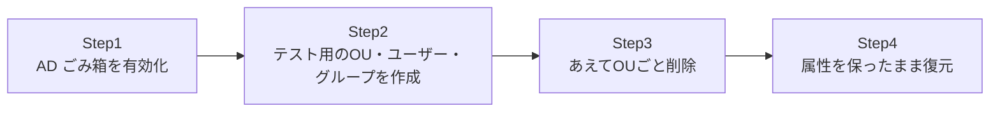

## はじめに

- **この記事で得られること**: 「うっかりOUごとユーザーを削除してしまった」という、AD運用で実際に起きうる事故を想定し、**AD ごみ箱(AD Recycle Bin)を有効化したうえで、削除したオブジェクトをグループメンバーシップなどの属性を保ったまま復元する**手順を、実際に手を動かして体験します。あわせて、AD ごみ箱が既定で無効になっている理由、一度有効化すると二度と無効化できないという不可逆性、そしてAD ごみ箱が登場する前の時代に使われていた復元方法との違いも整理します。
- **対象読者**: AD運用に携わっているものの、誤削除からの復旧手順を実際に試したことがなく、いざというときに慌てたくない方を想定しています。
- **読むのにかかる想定時間**: 約20分(実際に構築しながら進める場合は1時間程度を見込んでください)

この記事は[『上位1%』シリーズ 全記事ガイド](/sitemap)の一部、[Active Directoryシリーズ](/sitemap#シリーズ一覧)の25本目です。既存のDC・ドメイン環境([マルチドメイン・マルチツリーのADフォレストを構築するハンズオン](/articles/ad-multidomain-handson-guide)などで構築したもの)があれば、それをそのまま使って実施できます。

## 前提知識

- **フォレスト機能レベル**: AD ごみ箱の有効化には、フォレスト機能レベルがWindows Server 2008 R2以上である必要があります。詳しくは[ADとDC、ドメインとフォレストの違い](/articles/ad-dc-fundamentals-guide)を参照してください。

## 全体像をつかむ

このハンズオンで行うことは、次の4ステップです。



## ハンズオン手順

### Step 1: AD ごみ箱を有効化する

PowerShellで、AD ごみ箱の機能を有効化します。

```powershell
Enable-ADOptionalFeature -Identity 'Recycle Bin Feature' `
    -Scope ForestOrConfigurationSet -Target <フォレストルートドメイン名> -Confirm:$false
```

**このコマンドを実行すると、確認プロンプトで「この操作は元に戻せません」という趣旨の警告が表示されます。実際にその通りで、AD ごみ箱は一度有効化すると、二度と無効化できません。** これは本番環境ではなく、検証用の環境で試すことを強くお勧めします。

### Step 2: テスト用のOU・ユーザー・グループを作成する

検証用のOUと、その中にユーザー、そしてそのユーザーが所属するグループを作成します。

```powershell
New-ADOrganizationalUnit -Name "TestOU" -Path "DC=example,DC=com" -ProtectedFromAccidentalDeletion $false
New-ADUser -Name "testuser1" -Path "OU=TestOU,DC=example,DC=com" -Enabled $true -AccountPassword (ConvertTo-SecureString "P@ssw0rd123!" -AsPlainText -Force)
New-ADGroup -Name "TestGroup" -Path "OU=TestOU,DC=example,DC=com" -GroupScope Global
Add-ADGroupMember -Identity "TestGroup" -Members "testuser1"
```

**`-ProtectedFromAccidentalDeletion $false`を明示的に指定している点に注目してください。** ADUCで作成したOUには、既定で「誤って削除されないように保護する」チェックボックスが有効になっており、このままでは次のステップの削除操作自体が拒否されます。今回はあえて保護を外し、実際に削除できる状態にしています。

### Step 3: あえてOUごと削除する

作成したOUを、中のユーザー・グループごと削除します。

```powershell
Remove-ADOrganizationalUnit -Identity "OU=TestOU,DC=example,DC=com" -Recursive -Confirm:$false
```

`Get-ADUser -Identity testuser1`を実行すると、オブジェクトが見つからないというエラーが返ってくるはずです。**ここまでが、実務で実際に起きる事故の再現です。**

### Step 4: 属性を保ったまま復元する

削除されたオブジェクトは、実は完全に消えたわけではなく、**削除済みオブジェクト**として一定期間(既定180日)AD DS内に残っています。まずOU自体を探して復元します。

```powershell
Get-ADObject -Filter 'isDeleted -eq $true' -IncludeDeletedObjects |
    Where-Object { $_.Name -like "TestOU*" } |
    Restore-ADObject
```

OUが復元できたら、続けてその中にあったユーザーとグループも同様に復元します。

```powershell
Get-ADObject -Filter 'isDeleted -eq $true' -IncludeDeletedObjects |
    Where-Object { $_.Name -like "testuser1*" -or $_.Name -like "TestGroup*" } |
    Restore-ADObject
```

`Get-ADUser -Identity testuser1 -Properties MemberOf`を実行し、**`testuser1`が元の`TestGroup`のメンバーシップを保ったまま復元されている**ことを確認してください。**これこそがAD ごみ箱の最大の価値です。** ユーザーアカウント自体だけでなく、グループメンバーシップのような関連属性までもが、削除された時点の状態のまま復元されます。

## プロが見ている視点(上位1%の理解)

### AD ごみ箱が登場する前は、どう復元していたのか

AD ごみ箱(Windows Server 2008 R2で登場)以前は、削除されたオブジェクトは**tombstone**(墓石)と呼ばれる、属性の大半が失われた状態でしか残されていませんでした。復元するには、`ntdsutil`を使って一時的にDCをオフラインにし、**tombstoneを権威的に復元(authoritative restore)する**という、はるかに手間のかかる作業が必要でした。しかもこの方法では、**グループメンバーシップのような、削除されたオブジェクトを参照する側の属性(linked attribute)までは復元されません。** AD ごみ箱が画期的だったのは、削除されたオブジェクトを、tombstoneよりもずっと長い期間、ほぼすべての属性を保ったまま保持し、通常のドメイン参加済みサーバーからのコマンド一発で復元できるようにした点にあります。

### なぜAD ごみ箱は既定で無効になっているのか

AD ごみ箱を有効化すると、**削除されたオブジェクトが、既定の`tombstoneLifetime`と同じ期間(既定180日)、通常のオブジェクトとほぼ同じ量の情報を保持したままAD DS内に残り続けます。** これは、AD DSのデータベースサイズの増加と、それに伴うDC間のレプリケーショントラフィックの増加を意味します。小規模な環境では大きな問題になりませんが、大量のオブジェクトの作成・削除が頻繁に発生する大規模環境では、この点を考慮した設計が必要です。とはいえ、実務で誤削除からの復旧が必要になる頻度と、その際の作業負荷の差を考えると、**現在ではほとんどの環境で有効化しておくことが強く推奨されます。**

## よくある誤解・つまずきポイント

- **誤解1: 「AD ごみ箱は、Windows Serverの既定の設定で最初から有効になっている」**
  AD ごみ箱は既定で無効です。管理者が明示的に`Enable-ADOptionalFeature`で有効化する必要があります。
- **誤解2: 「AD ごみ箱を有効化しても、必要なくなればいつでも無効化できる」**
  AD ごみ箱の有効化は不可逆な操作であり、一度有効化すると二度と無効化できません。
- **誤解3: 「削除されたユーザーを復元しても、そのユーザーが元々所属していたグループのメンバーシップは手動で設定し直す必要がある」**
  AD ごみ箱で復元した場合、グループメンバーシップを含む、削除時点のほぼすべての属性がそのまま復元されます。

## 障害・トラブルシューティングの視点

1. **`Enable-ADOptionalFeature`が失敗する**: フォレスト機能レベルがWindows Server 2008 R2以上になっているかを確認します。
2. **`Restore-ADObject`で復元したのに、元の場所に戻らない**: 削除されたオブジェクトの元の親コンテナー(この場合はOU)自体が先に復元されているかを確認します。親が復元されていないと、子オブジェクトは`LostAndFound`のような既定のコンテナーに復元されることがあります。
3. **削除から180日以上経過したオブジェクトが見つからない**: 既定の保持期間(`tombstoneLifetime`、既定180日)を過ぎると、削除済みオブジェクトも完全に消去されます。誤削除に気づいたら、できるだけ早く復元作業を行うことが重要です。

### 予防策・恒久対策

- 本番環境では、AD ごみ箱をできるだけ早い段階(小規模なうちに)有効化しておく。
- 重要なOUには`-ProtectedFromAccidentalDeletion $true`(既定)を維持し、誤削除そのものを未然に防ぐ。
- 誤削除に気づいたら、`tombstoneLifetime`が尽きる前に、できるだけ早く復元作業を行う。

## まとめ

- AD ごみ箱は既定で無効になっており、`Enable-ADOptionalFeature`で明示的に有効化する必要があります。この有効化は不可逆な操作です。
- 削除されたオブジェクトは`Get-ADObject -IncludeDeletedObjects`で見つけ、`Restore-ADObject`で復元できます。
- AD ごみ箱による復元では、グループメンバーシップのような関連属性までも、削除時点の状態のまま復元されます。
- AD ごみ箱以前のtombstoneベースの復元は、はるかに手間がかかり、関連属性も復元できませんでした。

**今日から意識すべきこと**
1. まだAD ごみ箱を有効化していない環境を見つけたら、早めに有効化を検討しましょう(ただし不可逆な操作であることを踏まえて)。
2. 誤削除に気づいたら、まず親コンテナーから順に復元する、という手順を意識しましょう。

## 参考文献

- [Active Directory Recycle Bin: Understanding, Implementing, Best Practices | Microsoft Learn](https://learn.microsoft.com/en-us/windows-server/identity/ad-ds/get-started/adac/introduction-to-active-directory-administrative-center-enhancements--level-100-)
- [Restore-ADObject | Microsoft Learn](https://learn.microsoft.com/en-us/powershell/module/activedirectory/restore-adobject)
