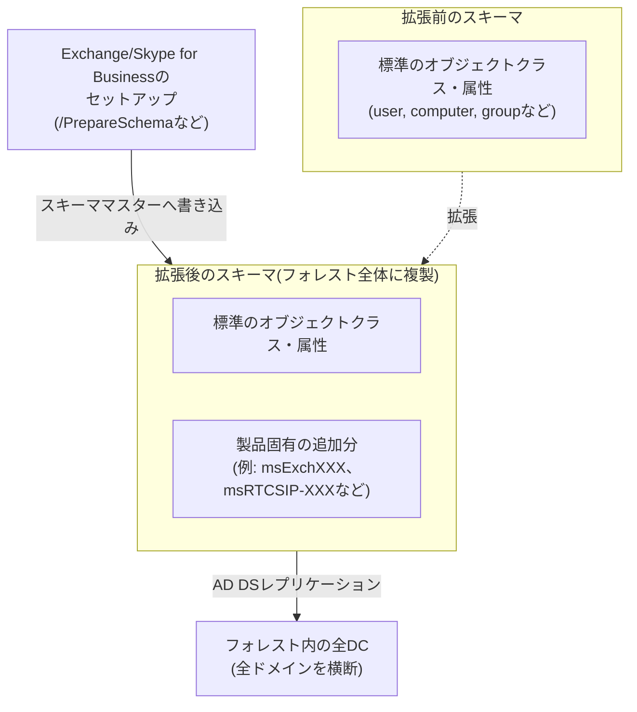

## はじめに

- **この記事で得られること**: [ADとDC、ドメインとフォレストの違い](/articles/ad-dc-fundamentals-guide)以来、本シリーズでは「スキーマとは、オブジェクトの型とその属性を定義したルールブックである」と繰り返し説明してきましたが、実際にこのスキーマが**拡張される瞬間**には立ち入ってきませんでした。この記事では、Exchange ServerやSkype for Businessといった製品の導入時に必ず発生する「スキーマ拡張」が具体的に何をしているのか、なぜそれが特定のドメインではなく**フォレスト全体**に影響するのか、なぜ一度拡張すると実質的に後戻りできないのか、そして実務でスキーマ拡張を安全に進めるための考え方までを体系的に理解します。
- **対象読者**: 「スキーマ拡張」という言葉を、Exchangeの導入手順などで見聞きしたことはあるものの、それが具体的に何を変更しており、なぜそれほど慎重に扱われるのかを説明できない方を想定しています。
- **読むのにかかる想定時間**: 約16分

この記事は[『上位1%』シリーズ 全記事ガイド](/sitemap)の一部、[Active Directoryシリーズ](/sitemap#シリーズ一覧)の21本目です。[ADとDC、ドメインとフォレストの違い](/articles/ad-dc-fundamentals-guide)と[FSMO(操作マスター)とは何か](/articles/fsmo-guide)を先に読んでおくと、本記事の理解がスムーズです。

## 前提知識

- **スキーマ**: [ADとDC、ドメインとフォレストの違い](/articles/ad-dc-fundamentals-guide)で扱った、AD DSに格納できるオブジェクトの型(オブジェクトクラス)と、それぞれが持てる属性を定義したルールブックです。
- **スキーママスター**: [FSMO(操作マスター)とは何か](/articles/fsmo-guide)で扱った5つのFSMOロールの1つで、フォレスト内にただ1台だけ存在し、スキーマへの変更を書き込める権限を持つDCです。
- **フォレスト**: [ADとDC、ドメインとフォレストの違い](/articles/ad-dc-fundamentals-guide)で扱った、複数のドメイン・ツリーを内包する最上位のセキュリティ境界です。

## 全体像をつかむ

### 一言で言うと

**スキーマ拡張とは、AD DSが標準で持っているオブジェクトクラス・属性のセットに、新しいオブジェクトクラスや属性を追加する操作です。** ExchangeやSkype for Businessのようなディレクトリ統合型のアプリケーションは、自前のデータベースを持つ代わりに、「AD DSというフォレスト全体で複製されるデータベース」をそのまま自分の設定・メールボックス情報の保存先として間借りします。そのために、これらの製品のセットアップ時には、AD DSのスキーマへ製品固有のオブジェクトクラス・属性を追加する処理が必ず発生します。

## 基礎から徹底解説

### 実際にスキーマを拡張する製品の例

実務でスキーマ拡張が発生する典型的な場面は、次のような「AD DSをデータストアとして間借りする」製品の初回導入時です。

- **Microsoft Exchange Server**: メールボックスの設定・メッセージルーティング情報・組織全体のExchange構成情報などを保存するため、数百単位のオブジェクトクラス・属性(`msExch`から始まる属性群など)を追加します。セットアップウィザードから、あるいは`setup.exe /PrepareSchema`というコマンドで実行されます。
- **Skype for Business(旧Lync Server)**: 音声ポリシーやダイヤルプランといった、電話機能に関連する属性(`msRTCSIP`から始まる属性群など)を追加します。
- **System Center Configuration Manager(SCCM/MECM)**: クライアント管理のための構成情報をAD DSに公開する機能を使う場合に、任意でスキーマ拡張を行います(SCCM自体はスキーマ拡張なしでも動作できる、という点でExchangeとは事情が異なります)。

なぜAD DSを自前のDBの代わりに使うのか

Exchangeのようなアプリケーションが、専用のデータベースを別途用意するのではなくAD DSを間借りする最大の利点は、**組織内に既に存在する「ユーザー・グループの情報が一元管理された、フォレスト全体で複製済みのデータベース」をそのまま活用できる**ことです。メールボックスの設定をユーザーオブジェクトの属性として持たせれば、「このユーザーは誰か」という情報と「このユーザーのメールボックス設定」という情報を、別々のデータベースで整合性を取り続ける手間から解放されます。

### なぜフォレスト全体に影響し、実質的に後戻りできないのか

スキーマは、[ADとDC、ドメインとフォレストの違い](/articles/ad-dc-fundamentals-guide)で扱った**スキーマパーティション**の一部として、特定のドメインではなく**フォレスト全体**の全DCに複製されるデータです。つまり、フォレスト内のどこか1つのドメインでExchangeを導入するためにスキーマを拡張すると、その拡張内容は、Exchangeとは無関係な他のドメインのDCにも複製されます。

さらに重要なのは、**一度追加したオブジェクトクラス・属性の定義は、後から削除できない**という制約です。これは、その属性やクラスが既にフォレスト内のどこかのオブジェクトで使われてしまっている可能性を、AD DSが完全には否定できないためです。削除の代わりにできるのは、その定義を**無効化**(defunct)とマークし、以後新たに使われないようにすることだけです。

スキーマ変更にはSchema Adminsという特別な権限グループが必要

スキーマへの変更は、既定では**Schema Admins**という特別なセキュリティグループのメンバーであり、かつ**Enterprise Admins**の権限も持つアカウントでなければ実行できません。この権限は、フォレスト全体に影響する破壊的な操作を行える強力な権限であるため、**日常的な管理業務のためにメンバーシップを持たせ続けるべきではない**というのが定石です。スキーマ拡張が必要な作業の直前に一時的にメンバーへ追加し、作業完了後は速やかに削除する、という運用が推奨されます。

## プロが見ている視点(上位1%の理解)

### 実務でのスキーマ拡張の安全な進め方

スキーマ拡張は後戻りが難しい操作であるため、上位1%のエンジニアは本番環境へ直接適用する前に、次のような段取りを踏みます。

1. **本番と同じフォレスト機能レベル・スキーマバージョンを再現した、隔離された検証用フォレストで先に拡張を試す**。拡張後にアプリケーションが期待通り動作するか、既存のオブジェクトに予期しない影響が出ないかを、本番へ影響を与えずに確認します。
2. **スキーママスターを保持するDCの状態(システム状態バックアップなど)を、拡張の直前に取得しておく**。スキーマ定義そのものを個別に「元に戻す」ことはできませんが、万が一の重大な問題発生時に、より広い範囲の復旧手段を確保しておく意味があります。
3. **拡張作業は、フォレスト内の全DCへのレプリケーションが速やかに完了することが期待できる、業務影響の少ない時間帯に実施する**。スキーマの変更は[ADの「サイト」とレプリケーショントポロジー](/articles/ad-sites-guide)で扱ったレプリケーション経路に乗って全DCへ伝播するため、レプリケーションが滞っている状態で拡張を行うと、DCごとにスキーマのバージョンが異なる一時的な不整合状態が長引く可能性があります。
4. **拡張作業中は、対象フォレスト内の全DCが正常にオンライン・複製可能な状態であることを、事前に`repadmin`などで確認しておく**。長期間オフラインだったDCが後から復帰すると、そのDCだけ古いスキーマバージョンのまま復帰し、混乱の原因になることがあります。

## よくある誤解・つまずきポイント

- **誤解1: 「スキーマ拡張は、そのアプリケーションを導入するドメインだけに影響する」**
  スキーマはフォレスト全体で共有・複製されるデータであるため、1つのドメインでの拡張が、フォレスト内の他のすべてのドメインのDCにも複製されます。特定のドメインだけに影響を閉じ込めることはできません。
- **誤解2: 「アプリケーションをアンインストールすれば、追加されたスキーマも元に戻る」**
  アプリケーションのアンインストールは、スキーマに追加されたオブジェクトクラス・属性の定義を削除しません。定義自体は残り続け、無効化(defunct)することはできても、完全に消し去ることはできません。
- **誤解3: 「Schema Adminsグループのメンバーシップは、管理者アカウントに常時付与しておいて構わない」**
  Schema Adminsはフォレスト全体に影響する破壊的な操作が可能な強力な権限であるため、日常的に付与し続けるべきではなく、スキーマ拡張が必要な作業の前後だけ一時的に付与・削除するのが定石です。

## 障害・トラブルシューティングの視点

スキーマ拡張に関連するトラブルは、多くの場合「拡張作業とレプリケーションのタイミングのずれ」、または「権限不足」が原因です。

1. **スキーマ拡張のコマンド(`/PrepareSchema`など)が権限エラーで失敗する**: 実行アカウントがSchema AdminsとEnterprise Adminsの両方のメンバーであるか、スキーママスターへ到達可能かを確認します。
2. **拡張直後、一部のDCでアプリケーションが期待通り動作しない**: そのDCへのスキーマ変更のレプリケーションがまだ完了していない可能性があります。`repadmin /showrepl`でスキーマパーティションの複製状況を確認します。
3. **長期間オフラインだったDCを復帰させたら、環境全体の挙動が不安定になった**: そのDCが古いスキーマバージョンのまま復帰し、他のDCとの間で一時的な不整合が生じている可能性があります。復帰後のレプリケーション完了を待ってから、状態を再確認します。

### 予防策・恒久対策

- スキーマ拡張を伴う製品の導入前には、必ず隔離された検証環境で先に試す。
- Schema Adminsグループのメンバーシップは、必要な作業の前後だけ一時的に付与・削除する運用を徹底する。
- スキーマ拡張作業は、全DCが正常にオンライン・複製可能な状態であることを確認してから、業務影響の少ない時間帯に実施する。

## まとめ

- スキーマ拡張とは、AD DSに新しいオブジェクトクラス・属性を追加する操作であり、ExchangeやSkype for Businessのような、AD DSをデータストアとして間借りする製品の導入時に必ず発生します。
- スキーマはフォレスト全体で複製されるデータであるため、拡張の影響は特定のドメインに閉じず、フォレスト内の全ドメイン・全DCに及びます。
- 一度追加したオブジェクトクラス・属性の定義は削除できず、無効化(defunct)することしかできないため、スキーマ拡張は実質的に後戻りできない操作として扱う必要があります。
- スキーマへの変更にはSchema Admins + Enterprise Adminsの権限が必要であり、日常的な付与ではなく、作業の前後だけ一時的に付与・削除する運用が推奨されます。

**今日から意識すべきこと**
1. スキーマ拡張を伴う製品の導入を検討する際は、必ず隔離された検証環境で先に拡張を試しましょう。
2. Schema Adminsグループのメンバーシップを、常時付与された状態のまま放置していないか確認しましょう。

## 参考文献

- [What is an Active Directory Schema Extension? | JumpCloud](https://jumpcloud.com/it-index/what-is-an-active-directory-schema-extension)
- [Active Directory schema extensions, classes, and attributes | Microsoft Learn](https://learn.microsoft.com/en-us/skypeforbusiness/schema-reference/active-directory-schema-extensions-classes-and-attributes/active-directory-schema-extensions-classes-and-attributes)
- [Prepare Active Directory and domains for Exchange Server | Microsoft Learn](https://learn.microsoft.com/en-us/exchange/plan-and-deploy/prepare-ad-and-domains)
