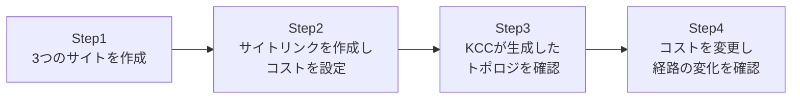

## はじめに

- **この記事で得られること**: [サイトという、物理的な距離をADに教えるための仕組み](/articles/ad-sites-guide)で学んだサイトの概念をもとに、3つの拠点を持つハブアンドスポーク構成を実際に作り、**サイトリンクのコスト**を変更することで、**KCC**(Knowledge Consistency Checker)が自動生成するレプリケーション経路がどう変化するかを、自分の目で確認します。
- **対象読者**: サイトとサイトリンクの概念は理解しているが、実際に複数拠点の環境で、レプリケーション経路がどう決まるのかを見たことがない方を想定しています。
- **読むのにかかる想定時間**: 約25分(実際に構築しながら進める場合は1時間程度を見込んでください)

この記事は[『上位1%』シリーズ 全記事ガイド](/sitemap)の一部、[Active Directoryシリーズ](/sitemap#シリーズ一覧)の41本目です。

## 前提知識

- [サイトという、物理的な距離をADに教えるための仕組みを『上位1%』の視点で理解する](/articles/ad-sites-guide): サイト内・サイト間レプリケーションの違いについて、この記事の前提になっています。

## 全体像をつかむ

このハンズオンで行うことは、次の4ステップです。東京・大阪・名古屋という3拠点を想定し、東京をハブとしたハブアンドスポーク構成を作ります。



## ハンズオン手順

### Step 1: 3つのサイトを作成する

東京・大阪・名古屋、3つのサイトと、それぞれに対応するサブネットを作成します。

```powershell
New-ADReplicationSite -Name "Tokyo"
New-ADReplicationSite -Name "Osaka"
New-ADReplicationSite -Name "Nagoya"
New-ADReplicationSubnet -Name "10.1.0.0/16" -Site "Tokyo"
New-ADReplicationSubnet -Name "10.2.0.0/16" -Site "Osaka"
New-ADReplicationSubnet -Name "10.3.0.0/16" -Site "Nagoya"
```

### Step 2: サイトリンクを作成し、コストを設定する

東京-大阪間、東京-名古屋間にサイトリンクを作成しますが、**大阪-名古屋間には、あえて直接のサイトリンクを作成しません。**

```powershell
New-ADReplicationSiteLink -Name "Tokyo-Osaka" -SitesIncluded "Tokyo","Osaka" -Cost 100 -ReplicationFrequencyInMinutes 15
New-ADReplicationSiteLink -Name "Tokyo-Nagoya" -SitesIncluded "Tokyo","Nagoya" -Cost 100 -ReplicationFrequencyInMinutes 15
```

### Step 3: KCCが生成したトポロジを確認する

KCCに、トポロジの再計算を強制します。

```powershell
repadmin /kcc
```

サイトとサービス(`dssite.msc`)で、大阪のDCの`NTDS Settings`配下にある接続オブジェクトを確認してください。**大阪と名古屋の間には直接のサイトリンクを作成していないにもかかわらず、大阪のDCから見て、名古屋のDCとの間でレプリケーションが成立する経路が、KCCによって自動的に計算されていることが確認できます。** これは、大阪↔東京↔名古屋という経路を、KCCが自動的に見つけ出しているためです。

### Step 4: コストを変更し、経路の変化を確認する

ここで、大阪-名古屋間に、コスト50という、東京経由(合計200)より低いコストの直接リンクを追加してみます。

```powershell
New-ADReplicationSiteLink -Name "Osaka-Nagoya" -SitesIncluded "Osaka","Nagoya" -Cost 50 -ReplicationFrequencyInMinutes 15
repadmin /kcc
```

再度、接続オブジェクトを確認してください。**KCCは、より低いコストの経路を優先するため、大阪と名古屋の間のレプリケーションは、今度は東京を経由せず、新しく作成した直接リンクを使うように、トポロジが自動的に再計算されます。**

## プロが見ている視点(上位1%の理解)

### コストは「帯域幅」ではなく、管理者が割り当てる抽象的な優先度である

サイトリンクの`-Cost`パラメータを見て、「回線の帯域幅を入力するものだ」と誤解しがちですが、これは正確ではありません。**コストは、あくまで管理者が「この経路をどれだけ優先したいか」を表現するための、抽象的な数値です。** KCCは、複数の経路が存在する場合、単純にコストの合計値が最も低い経路を選びます。実務では、実際の回線速度やコスト(金銭的な意味での)、信頼性などを踏まえて、管理者がこの数値を意図的に設計する必要があります。

### サイトリンクの推移性(ブリッジ)という、既定で有効になっている仕組み

Step 3で、大阪-名古屋間に直接のサイトリンクがないにもかかわらずレプリケーション経路が成立したのは、**サイトリンクの推移性**(ブリッジ)という機能が、既定で有効になっているためです。これは、東京-大阪間、東京-名古屋間という2つのサイトリンクを、あたかも1つの大きな橋のようにつなげて扱ってよい、という設定です。**この設定のおかげで、拠点数が増えるたびに、すべての拠点間で総当たり的にサイトリンクを作成する必要がなくなります。** 一部の特殊なネットワーク構成(実際には特定の拠点間で通信が到達しない、など)では、この推移性をあえて無効化し、意図しない経路が計算されることを防ぐ運用が必要になる場合もあります。

### KCCによる自動計算がもたらす、自己修復という利点

このハンズオンで体験した接続オブジェクトは、すべてKCCによって自動的に生成されたものであり、管理者が手動で作成したものではありません。**KCCは、既定で15分ごとにトポロジを再評価しており、たとえば東京のDCが一時的にダウンした場合でも、大阪と名古屋が直接通信できる経路があれば、KCCはそれを自動的に見つけ出し、レプリケーションが完全に停止することを防ぎます。** これは、接続オブジェクトをすべて手動で管理していたなら実現が難しい、自己修復性という、大きな運用上のメリットです。

## よくある誤解・つまずきポイント

- **誤解1: 「サイトリンクを作成していない拠点同士は、絶対にレプリケーションできない」**
  サイトリンクの推移性(既定で有効)により、間接的な経路が自動的に計算されることがあります。
- **誤解2: 「サイトリンクのコストは、実際の回線の帯域幅を入力する項目である」**
  コストは、管理者が経路の優先度を表現するための抽象的な数値であり、実際の帯域幅の数値をそのまま入力するものではありません。
- **誤解3: 「KCCが生成した接続オブジェクトは、一度生成されると固定される」**
  KCCは既定で15分ごとにトポロジを再評価し、必要に応じて経路を自動的に見直します。

## 障害・トラブルシューティングの視点

1. **想定した経路でレプリケーションされていない**: `repadmin /kcc`でトポロジの再計算を強制した後、`dssite.msc`で実際の接続オブジェクトと、各サイトリンクのコストを確認してください。
2. **特定の拠点間だけレプリケーションが極端に遅い**: その経路の合計コストが、他の経路より高くなっていないか、そして経由するホップ数が多くなっていないかを確認してください。
3. **意図しない経路(推移性による迂回)が発生している**: そのサイトリンクでブリッジを無効化するか、`Set-ADReplicationSiteLink`でコストを調整し、意図した経路が優先されるようにしてください。

## まとめ

- サイトリンクのコストは、管理者が経路の優先度を表現するための抽象的な数値であり、帯域幅そのものではありません。
- KCCは、複数の経路が存在する場合、合計コストが最も低い経路を自動的に選びます。
- サイトリンクの推移性(既定で有効)により、直接のサイトリンクがない拠点間でも、間接的な経路が自動的に計算されます。
- KCCは既定で15分ごとにトポロジを再評価し、障害発生時にも自己修復的に経路を見直します。

**今日から意識すべきこと**
1. 新しい拠点を追加する際は、サイトリンクのコストを、実際の回線状況を踏まえて意図的に設計しましょう。
2. レプリケーションの遅延に気づいたら、`repadmin /kcc`と`dssite.msc`で、実際に使われている経路を確認する習慣をつけましょう。

## 参考文献

- [How the Knowledge Consistency Checker Works | Microsoft Learn](https://learn.microsoft.com/en-us/windows-server/identity/ad-ds/get-started/adac/active-directory-replication-concepts)
- [New-ADReplicationSiteLink | Microsoft Learn](https://learn.microsoft.com/en-us/powershell/module/activedirectory/new-adreplicationsitelink)
