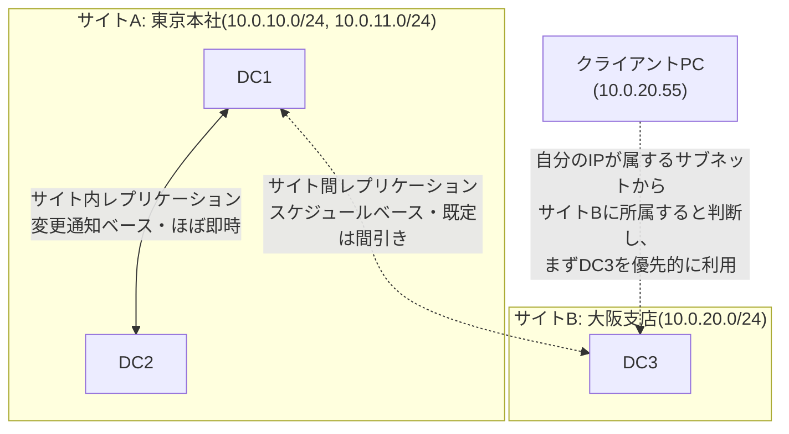
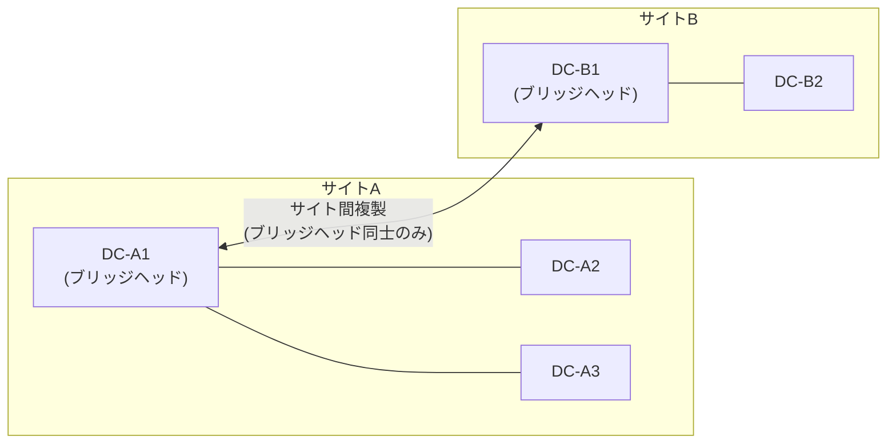

## はじめに

- **この記事で得られること**: `dssite.msc`(Active Directoryサイトとサービス)を開くと必ず目にする**サイト**(Site)という概念の正体、サブネットをサイトに関連付ける理由、そして同じサイト内のDC同士(サイト内レプリケーション)と拠点をまたぐDC同士(サイト間レプリケーション)とで、レプリケーションの速さや仕組みがなぜ異なるのかを体系的に理解できます。あわせて、KCC・ISTG・ブリッジヘッドサーバー・サイトリンクコストという専門用語が、実際に何を計算・決定しているのかを整理し、クライアントが「どのDCに問い合わせるか」を決めている裏側の仕組みまで扱います。
- **対象読者**: `dssite.msc`の画面は見たことがあるものの、サイトが何を表しているのか、なぜサブネットの登録が必要なのかを具体的に説明できない方、複数拠点にDCを配置するAD移行・設計に携わる予定がある方を想定しています。
- **読むのにかかる想定時間**: 約20分

この記事は[『上位1%』シリーズ 全記事ガイド](/sitemap)の一部、[Active Directoryシリーズ](/sitemap#シリーズ一覧)の8本目です。[ADとDC、ドメインとフォレストの違いを『上位1%』の視点で理解する](/articles/ad-dc-fundamentals-guide)で扱った設定パーティション、[DCの正常性確認を『上位1%』の視点で理解する](/articles/dc-health-check-guide)で扱った`repadmin`の内容を前提にしています。

## 前提知識

- **DC(ドメインコントローラー)とレプリケーション**: 複数のDCは、マルチマスターレプリケーションによって互いの変更内容を複製し合います。詳しくは[ADとDC、ドメインとフォレストの違い](/articles/ad-dc-fundamentals-guide)を参照してください。
- **設定パーティション**: サイトの定義やレプリケーショントポロジーは、フォレスト内の全DCへ複製される設定パーティションに保存されます。サイトという概念自体がフォレスト全体で共有される情報である、という点がまず重要です。

## 全体像をつかむ

### 一言で言うと

**サイトとは、「帯域が細い・低速な回線を挟んだ拠点の境界」を、AD DSに教えるための論理的なグループ分けです。** AD DSはこの境界を知ることで、(1)同じ拠点内のDC同士はできるだけ速く複製し合い、(2)拠点をまたぐ複製は帯域を圧迫しないよう間引いて行い、(3)クライアントには自分と同じ拠点にある(=一般に最も高速に到達できる)DCを優先的に案内する、という3つの最適化を行います。サイトの実体は、**IPサブネットの集まり**と**そのサブネットに紐づくDCの一覧**という、シンプルな対応表です。

## 基礎から徹底解説

### サイトの実体:サブネットとDCの対応表

`dssite.msc`を開くと、`Sites`コンテナーの下に、作成済みの各サイト(既定では`Default-First-Site-Name`という1つのサイトのみ)が並び、それぞれのサイトの`Servers`フォルダーには、そのサイトに所属するDCがサーバーオブジェクトとして登録されています。一方、`Subnets`コンテナーには、`10.0.10.0/24`のようなIPサブネットが列挙されており、それぞれのサブネットオブジェクトが「どのサイトに属するか」というプロパティを持っています。

**この「サブネット→サイト」という対応表こそが、サイトという仕組みの実体です。** DCは自分自身のIPアドレスがどのサブネットに属するかを見て、自分がどのサイトに所属するかを判断します。クライアントも同様に、自分のIPアドレスから「自分がどのサイトに属しているか」を判定し、[DNSのSRVレコード](/articles/dns-zones-records-guide)を使ってDCを検索する際、**まず自分と同じサイトに登録されているDCを優先的に問い合わせます**。これが、[Windowsのログインとユーザープロファイルの仕組み](/articles/ad-windows-login-guide)で扱った「PCはどうやってDCを見つけているのか」の、より正確な答えです——PCは単にドメイン内の適当なDCを見つけているのではなく、**自分と同じ拠点(サイト)にある、最も到達性の良いはずのDCを優先して見つけている**のです。

サブネットをサイトに登録し忘れるとどうなるか

あるサブネットがどのサイトにも登録されていない場合、そのサブネットに属するクライアントやDCは、**既定のサイトである`Default-First-Site-Name`に所属しているとみなされます**。複数拠点環境で新しい拠点のサブネットをサイトへ登録し忘れると、その拠点のクライアントが、本来最も近いはずの拠点DCではなく、`Default-First-Site-Name`に属する(多くの場合は本社などの)遠隔地のDCへ優先的に問い合わせてしまい、ログオンやGPO取得が不必要に遅くなる、という実務上よくあるトラブルにつながります。新しい拠点にDCを追加する際は、DCの追加そのものだけでなく、**その拠点のIPサブネットをサイトに正しく登録すること**まで含めて作業チェックリストに入れておく必要があります。

### サイト内レプリケーションとサイト間レプリケーションの違い

同じサイト内のDC同士(サイト内レプリケーション)と、サイトをまたぐDC同士(サイト間レプリケーション)とでは、レプリケーションの仕組みが根本的に異なります。

| | サイト内レプリケーション | サイト間レプリケーション |
|---|---|---|
| 起動のきっかけ | **変更通知**(あるDCで変更が起きたら、能動的に相手へ知らせる) | **スケジュール**(既定では最短15分間隔の定期実行) |
| 反映の速さ | 最初の相手には約15秒後、以降の相手には3秒間隔で追加通知(既定値) | 既定では最短でも15分単位(サイトリンクのスケジュールで変更通知を有効にすれば、サイト内同様に即時化も可能) |
| 圧縮 | 既定では圧縮しない(同一拠点内は帯域が潤沢という前提) | 既定で圧縮する(拠点間の細い回線を圧迫しないため) |
| 設計思想 | **できるだけ速く、全DCの状態を揃える** | **帯域を圧迫しない範囲で、許容できる遅延を受け入れて複製する** |

つまり、「同じ拠点のDC同士は数十秒で変更が伝わるのに、拠点をまたぐと最大15分近く古い情報が残ることがある」というのは、AD DSが意図的に選んでいる設計です。この違いを理解していないと、「**A拠点でパスワードを変更したのに、B拠点のDCではまだ古いパスワードのままログオンが失敗する**」といった、AD移行やマルチサイト運用で頻出する事象を「異常」だと誤解してしまいます。

### KCC・ISTG・ブリッジヘッドサーバー:誰が複製経路を決めているのか

複数のDC・複数のサイトが存在する環境で、「どのDCとどのDCが、どの経路で複製し合うか」というレプリケーショントポロジーは、管理者が手動で設計しなくても、**KCC**(Knowledge Consistency Checker)という仕組みが自動的に計算してくれます。

- **サイト内**: 各DCが持つKCCが、同じサイト内の他のDCとの間で、冗長性を持ちながらも複製の階数(ホップ数)が増えすぎない接続トポロジーを自動生成します。
- **サイト間**: 各サイトごとに、そのサイトの中で最初に稼働したDC(既定の選出ルール)が**ISTG**(Inter-Site Topology Generator)という役割を担い、サイトリンクの**コスト**(数値が小さいほど優先される、回線品質やコストを表す管理者設定値)をもとに、サイト間で複製経路を計算します。この際、サイトごとに実際にサイト間複製を担当するDCとして**ブリッジヘッドサーバー**が自動的に選出され、**拠点内の全DCが個別に他拠点と通信するのではなく、ブリッジヘッドサーバーだけが拠点の代表として他拠点のブリッジヘッドサーバーと複製する**という形で、拠点間のトラフィックを集約します。

この設計により、**拠点間の回線を流れる複製トラフィックは、ブリッジヘッドサーバーを経由する分だけに抑えられます**。手動でブリッジヘッドサーバーを指定することも可能ですが、既定では自動選出に任せるのが一般的です。

## プロが見ている視点(上位1%の理解)

### サイトリンクコストの考え方

複数の拠点が存在し、かつ拠点同士の接続経路が複数ありうる場合(例:本社と2つの支店が、それぞれ直接専用線を持ちつつ、支店同士もVPNで結ばれている場合)、**サイトリンクコスト**によって、どの経路を優先的に複製に使うかを制御します。コストは数値が小さいほど優先され、ISTGはこの値をもとに最小コストで全サイトへ到達できる経路(最小全域木)を計算します。実務では、**回線速度が速く安定している経路ほど低いコスト値を設定する**のが基本方針で、たとえば専用線には100、バックアップ用のVPN経路には500を設定しておけば、平常時は専用線が優先され、専用線に障害が起きた場合だけVPN経路が自動的に使われる、という構成が実現できます。

### `repadmin`の出力とサイトの関係

[DCの正常性確認](/articles/dc-health-check-guide)で扱った`repadmin /showrepl`の出力には、`Site Options`という項目が表示されます。また、パートナーDCとの接続が同じサイト内か、サイトをまたいでいるかによって、正常とみなすべきレプリケーション間隔の感覚も変わってきます。**サイト内のパートナーとの最終成功時刻が15分以上古い場合は明確に異常を疑うべきですが、サイトをまたぐパートナーとの場合は、既定のスケジュール間隔(最短15分、サイトリンクの設定次第ではもっと長い間隔)を踏まえたうえで判断する必要があります。** 同じ「最終成功時刻が20分前」という表示でも、サイト内なのかサイト間なのかで、異常かどうかの解釈が変わる、という点は実務上重要です。

## よくある誤解・つまずきポイント

- **誤解1: 「サイトは、ドメインやフォレストと同じような、認証やセキュリティの境界である」**
  サイトはあくまで**物理的なネットワーク構成(回線の速さ・拠点の区切り)を表す論理的なグループ分け**であり、ドメインのような認証・ポリシーの境界とは無関係です。1つのドメインが複数のサイトにまたがることも、1つのサイトに複数のドメインのDCが混在することも、どちらも普通にあり得ます。
- **誤解2: 「DCを新しい拠点に置けば、自動的にその拠点のサイトが作られる」**
  サイトはあくまで管理者が`dssite.msc`から明示的に作成し、対応するサブネットを登録する必要があります。DCを設置しただけでは、そのDCが自動的に「新しい拠点のサイト」に所属するわけではありません(サブネット登録がなければ`Default-First-Site-Name`に属してしまいます)。
- **誤解3: 「サイト間レプリケーションも、サイト内と同じくらい速く伝わる」**
  既定ではサイト間レプリケーションはスケジュールベースで、最短でも15分程度の遅延を許容する設計です。急ぎで変更を全拠点へ反映させたい場合は、[repadmin /syncall](/articles/dc-health-check-guide)などで手動同期を強制する必要があります。

## 障害・トラブルシューティングの視点

サイト関連の障害は、「**クライアント・DCが、意図した通りのサイトに所属できているか**」と「**サイト間の複製経路が、意図した通りに機能しているか**」の2つの軸で切り分けます。

1. **特定拠点のログオン・GPO取得が異常に遅い**: その拠点のサブネットが、正しいサイトに登録されているかを`dssite.msc`で確認します。登録漏れがあると、遠隔地のDCへ優先的に問い合わせてしまいます。
2. **拠点間で情報の反映に想定以上の時間がかかる**: サイトリンクのスケジュール・レプリケーション間隔の設定を確認します。緊急時は`repadmin /syncall`で手動同期を強制できます([DCの正常性確認](/articles/dc-health-check-guide)で扱った実務コマンドを参照)。
3. **特定のDCがブリッジヘッドとして機能していない(サイト間複製が特定のDCに集中しすぎる)**: KCCによる自動選出に任せている場合、まずISTGが正常に機能しているかを確認します。意図的に特定のDCをブリッジヘッドから除外・固定したい場合は、手動でのブリッジヘッドサーバー指定を検討します。

### 予防策・恒久対策

- 新しい拠点にDCを追加する作業では、DCの構築だけでなく、その拠点のIPサブネットをサイトへ登録する作業を必ずチェックリストに含める。
- 複数経路がありうる拠点間接続では、サイトリンクコストを回線品質に応じて明示的に設定し、暗黙の優先順位に依存しない。
- サイトをまたぐレプリケーションの遅延は設計上の既定動作であることをチーム内で共有し、「反映されない=障害」と即断しない運用基準を作る。

## まとめ

- サイトとは、帯域の細い回線で区切られた拠点の境界をAD DSに教えるための、サブネットとDCの対応表です。
- サイト内レプリケーションは変更通知ベースでほぼ即時、サイト間レプリケーションは既定でスケジュールベース(最短15分)という、意図的な設計の違いがあります。
- KCCが複製トポロジーを自動計算し、サイト間ではISTGが選出するブリッジヘッドサーバーが拠点の代表として複製を担うことで、拠点間の回線負荷を抑えています。
- クライアントは自分のIPアドレスから所属サイトを判定し、[DNSのSRVレコード](/articles/dns-zones-records-guide)を使って、まず自分と同じサイトのDCを優先的に検索します。

**今日から意識すべきこと**
1. 新しい拠点にDCを追加する際は、サブネットのサイトへの登録まで含めて作業チェックリストに入れましょう。
2. 拠点間で変更の反映に時間差があっても、それがサイト間レプリケーションの既定動作である可能性をまず疑い、即座に障害と判断しないようにしましょう。

## 参考文献

- [Active Directory Replication Concepts | Microsoft Learn](https://learn.microsoft.com/en-us/windows-server/identity/ad-ds/get-started/replication/active-directory-replication-concepts)
- [Modify the default intra-site DC replication interval | Microsoft Learn](https://learn.microsoft.com/en-us/troubleshoot/windows-server/active-directory/modify-default-intra-site-dc-replication-interval)
- [What Is the Knowledge Consistency Checker (KCC) | Microsoft Learn](https://learn.microsoft.com/en-us/windows-server/identity/ad-ds/get-started/replication/active-directory-replication-concepts)
