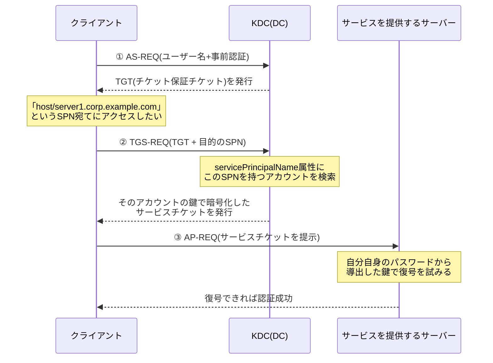

## はじめに

- **この記事で得られること**: [sysdm.cplとnetdom computernameは何が違うのか](/articles/ad-computername-netdom-guide)や[DNSゾーンとレコードの読み方](/articles/dns-zones-records-guide)で繰り返し登場してきた**SPN**(Service Principal Name、サービスプリンシパル名)について、それが具体的に何を表す識別子で、Kerberos認証のチケット要求のやり取りの中で実際にどう使われているのかを体系的に理解します。あわせて、`setspn`コマンドでのSPNの確認・追加・削除の方法、SPNが重複してしまったときに何が起こるのか、そして実務でよく遭遇する「Kerberos認証が通らず、意図せずNTLMに降格してしまう」トラブルの診断方法までを扱います。
- **対象読者**: SPNという言葉を何度も目にしてきたものの、「このサービスはこの名前で呼び出されたときに、このアカウントとして応答する」という説明以上に具体的なイメージを持てていない方、`setspn`コマンドやSPN関連のエラーに実務で遭遇したことがある方を想定しています。
- **読むのにかかる想定時間**: 約19分

この記事は[『上位1%』シリーズ 全記事ガイド](/sitemap)の一部、[Active Directoryシリーズ](/sitemap#シリーズ一覧)の11本目です。[ADとDC、ドメインとフォレストの違いを『上位1%』の視点で理解する](/articles/ad-dc-fundamentals-guide)と[sysdm.cplとnetdom computernameは何が違うのか](/articles/ad-computername-netdom-guide)を先に読んでおくと、本記事の理解がスムーズです。

## 前提知識

- **Kerberos認証の基本的な流れ**: クライアントはまずDC(KDC、鍵配布センター)に自分の身元を証明し、「チケット保証チケット(TGT)」を受け取ります。その後、特定のサービスにアクセスしたいとき、このTGTを使ってKDCに「サービスチケット」の発行を要求します。本記事は、この2段階目の要求の中でSPNがどう使われるかに焦点を当てます。
- **コンピューターアカウントとservicePrincipalName属性**: AD DS上の各コンピューターアカウント(およびユーザーアカウント)には、`servicePrincipalName`という複数値の属性があり、そのアカウントに紐づけられたSPNの一覧がここに格納されます。

## 全体像をつかむ

### 一言で言うと

**SPNとは、「このサービスにアクセスしたい」というクライアントの要求を、AD DS上の"どのアカウント"宛てのチケットとして処理すべきかをKDCが判断するための、サービスの住所のようなものです。** KDCは、クライアントから提示されたSPNを`servicePrincipalName`属性に持つアカウントをAD DS内から検索し、見つかったアカウントのパスワードから導出した鍵でサービスチケットを暗号化します。**SPNが指しているのは"サーバーの名前"そのものではなく、"そのサービスを実行しているアカウント**"である、という点がこの仕組みの本質です。



## 基礎から徹底解説

### SPNの具体的な形式

SPNは、次のような形式で表現されます。

```
サービスクラス/ホスト名:ポート番号/サービス名
```

- **サービスクラス**: そのSPNがどんな種類のサービスかを表す文字列です。`HOST`(汎用ホストサービス、リモート管理や多くの基本サービスが利用)、`HTTP`(Webサービス)、`MSSQLSvc`(SQL Server)、`CIFS`(ファイル共有)、`TERMSRV`(リモートデスクトップ)などがよく使われます。
- **ホスト名:ポート番号**: そのサービスが動作しているコンピューターの名前です。既定のポート番号を使っている場合は省略できます。
- **サービス名**: 省略可能な追加情報で、同じホスト上に複数のインスタンスが存在する場合(SQL Serverの名前付きインスタンスなど)に使われます。

具体例を挙げます。

| SPNの例 | 意味 |
|---|---|
| `HOST/server1.corp.example.com` | `server1`が提供する汎用ホストサービス(リモート管理など多くの基本機能が対象) |
| `HTTP/intranet.corp.example.com` | `intranet.corp.example.com`宛てのWebアクセス(既定ポート80/443) |
| `MSSQLSvc/dbserver.corp.example.com:1433` | `dbserver`上の、TCP 1433番ポートで動くSQL Serverインスタンス |
| `TERMSRV/rdshost.corp.example.com` | `rdshost`へのリモートデスクトップ接続 |

[sysdm.cplとnetdom computernameは何が違うのか](/articles/ad-computername-netdom-guide)で触れた通り、コンピューターアカウントには既定で`HOST/コンピューター名`という形式のSPNが自動登録されています。これは、そのコンピューター上で動く多くの基本的なサービス(ファイル共有、印刷、リモート管理など)が、共通してこの`HOST`のSPNに相乗りする形で認証を受けられるようにするためです。

### SPNはどこに登録されるのか:コンピューターアカウント vs 専用サービスアカウント

SPNは、AD DS上のいずれかのアカウントオブジェクト(コンピューターアカウントまたはユーザーアカウント)の`servicePrincipalName`属性に登録されます。ここで実務上の重要な選択肢が生まれます。

- **サービスが"そのコンピューター自身"のセキュリティコンテキストで動く場合**(多くのWindowsサービスの既定動作): そのサービスのSPNは、コンピューターアカウントに登録されます。前述の`HOST/...`がまさにこのパターンです。
- **サービスが"専用のサービスアカウント"(通常のユーザーアカウント、あるいはgMSA)のセキュリティコンテキストで動く場合**: SQL ServerやIISのアプリケーションプールなど、専用アカウントでサービスを実行する構成では、SPNはそのサービスアカウントに登録する必要があります。このとき、サービスの実行アカウントを変更したのにSPNの登録を移し替えるのを忘れる、というのが実務で非常によくあるトラブルの原因です。

<details>
<summary>gMSA(グループ管理サービスアカウント)とSPNの関係</summary>

グループ管理サービスアカウント(gMSA)を使うと、SPNの登録・更新が多くの場合自動化されます。サービスをgMSAで実行するよう構成すると、Windowsがそのサービスの起動時に必要なSPNを自動的に登録・維持してくれるため、手動で`setspn`を実行する機会が減ります。従来型のサービスアカウント(通常のユーザーアカウント)でSPN管理に手を焼いた経験がある場合、gMSAへの移行がその負担を大きく軽減する選択肢になります。

</details>

### `setspn`コマンドでの確認・追加・削除

SPNの管理には、`setspn`コマンド(またはPowerShellの`Set-ADComputer`/`Set-ADUser`の`-ServicePrincipalNames`パラメーター)を使います。

```powershell
# あるアカウントに登録されているSPNの一覧を確認する
setspn -L server1

# フォレスト内でこのSPNが誰に登録されているかを検索する(重複確認に有効)
setspn -Q HTTP/intranet.corp.example.com

# SPNを追加する(-Aは重複チェックを行わない旧来のオプション)
setspn -A HTTP/intranet.corp.example.com server1

# SPNを追加する(-Sは追加前に重複を自動チェックしてくれる、より安全なオプション)
setspn -S HTTP/intranet.corp.example.com server1

# SPNを削除する
setspn -D HTTP/intranet.corp.example.com server1
```

**`-A`と`-S`の違いは、実務上重要です。** `-A`は指定したSPNをそのまま追加するだけで、フォレスト内の他のアカウントに同じSPNが既に登録されていないかを確認しません。一方`-S`は、追加前にフォレスト全体を検索して重複がないことを確認したうえで追加してくれます。次に説明する「SPN重複」問題を未然に防ぐため、実務では`-A`ではなく`-S`を**使うことが推奨されます**。

### SPNが重複するとどうなるか

SPNは、**フォレスト内で一意である必要があります**。同じSPNが2つ以上のアカウントに登録されてしまうと、KDCはクライアントから提示されたSPNに対応するアカウントを一意に特定できなくなり、次のいずれかのエラーでチケット発行が失敗します。

- `KDC_ERR_S_PRINCIPAL_UNKNOWN`: 指定されたSPNを持つアカウントが見つからない
- `KDC_ERR_PRINCIPAL_NOT_UNIQUE`: 指定されたSPNを持つアカウントが複数見つかり、一意に特定できない

実務でSPN重複が発生する典型的なパターンは、**あるサービスの実行アカウントを変更した際、旧アカウントに登録されていたSPNを削除せずに、新アカウントへSPNを追加してしまう**ケースです。この場合、旧アカウントと新アカウントの両方に同じSPNが残ってしまい、`KDC_ERR_PRINCIPAL_NOT_UNIQUE`エラーでKerberos認証が失敗するようになります。サービスアカウントを変更する作業では、**新アカウントへのSPN追加と、旧アカウントからのSPN削除を必ずセットで実施する**ことが重要です。

### SPNが登録されていないとどうなるか:NTLMへの静かな降格

SPNが正しく登録されていない、あるいは重複していて解決できない場合、Windowsは(構成によっては)**Kerberos認証を諦めてNTLM認証にフォールバックする**ことがあります。これが実務で厄介なのは、**多くの場合エラーで即座に気づけるわけではなく、「認証は通るが、なぜかKerberosではなくNTLMが使われている」という、一見動いているように見える状態になる**ことです。NTLMはKerberosに比べて機能的な制約が多く(委任ができない、パフォーマンスが劣るなど)、後になって「二重ホップ認証ができない」といった別の問題として表面化することがあります。**認証自体は成功しているのに何かがおかしい、と感じたときは、まずそのアクセスが実際にKerberosで行われているかを疑う**のが定石です。

## プロが見ている視点(上位1%の理解)

### SQL Serverで頻発するSPN関連トラブルの診断

実務で特にSPN関連のトラブルが集中しやすいのが、SQL Serverです。SQL Serverのサービスアカウントを変更したにもかかわらず、`MSSQLSvc/...`のSPNが更新されないまま放置されるケースが典型的です。この場合の症状は、「アプリケーションからSQL Serverへの接続自体は(NTLM経由で)成功するが、Kerberos認証を前提とする機能(委任を使った二重ホップ認証など)だけが失敗する」という、部分的な不具合として現れることが多く、原因の特定に時間がかかりがちです。診断の第一歩は、クライアント側で`klist`コマンドを実行し、実際に取得されているチケットの種類を確認することです。

<details>
<summary>klistコマンドでチケットの状態を確認する</summary>

```powershell
# 現在キャッシュされているKerberosチケットの一覧を表示する
klist

# 特定のサービスに対するチケットの詳細を確認する
klist get MSSQLSvc/dbserver.corp.example.com:1433
```

目的のサービスに対応するチケットがキャッシュに存在しない、あるいは取得を試みてエラーになる場合は、SPNの登録に問題がある可能性が高いと判断できます。

</details>

### SPNと委任(Delegation)の関係

SPNは、Kerberos委任(あるサービスが、クライアントに代わって別のサービスへアクセスする仕組み)の設定においても重要な役割を果たします。制約付き委任(Constrained Delegation)を構成する際、「このアカウントが、どのSPN宛てへの委任を許可されているか」をアカウントのプロパティで明示的に指定します。委任を構成しているのに動作しない場合、委任先として指定したSPNと、実際にそのサービスに登録されているSPNが一致しているかを確認することが、トラブルシューティングの基本になります。委任の仕組み自体の詳しい解説は、Kerberos認証を扱う別記事で改めて取り上げます。

## よくある誤解・つまずきポイント

- **誤解1: 「SPNは、サーバーの名前を登録しているだけの仕組みだ」**
  SPNが指しているのは"サーバーそのもの"ではなく、"そのサービスを実行しているアカウント"です。同じサーバー上でも、実行アカウントが異なるサービスは、それぞれ別のアカウントにSPNを登録する必要があります。
- **誤解2: 「SPNを追加すれば、古いSPNは自動的に整理される」**
  SPNの追加と削除は完全に独立した操作です。サービスの実行アカウントを変更した際は、新アカウントへの追加だけでなく、旧アカウントからの削除も忘れずに行う必要があります。
- **誤解3: 「Kerberos認証が失敗すれば、必ず明確なエラーが表示される」**
  SPN関連の問題は、エラーで気づけるとは限らず、NTLMへの静かな降格という形で表面化することがあります。「認証は通っているのに何かがおかしい」という状況こそ、SPNの問題を疑うべきサインです。

## 障害・トラブルシューティングの視点

SPN関連の障害は、「**このSPNは、意図した1つのアカウントだけに、正しく登録されているか**」を軸に切り分けます。

1. **特定のサービスへのアクセスだけがKerberos認証で失敗する**: `setspn -L <アカウント名>`で、そのサービスに対応するSPNが正しいアカウントに登録されているかを確認します。
2. **`KDC_ERR_PRINCIPAL_NOT_UNIQUE`エラーが発生する場合**: `setspn -Q <SPN>`でフォレスト内を検索し、同じSPNが複数のアカウントに登録されていないかを確認し、不要な方を削除します。
3. **認証は成功しているのに、委任を使った機能だけが動かない**: クライアント側で`klist`を実行し、目的のサービスに対して実際にKerberosチケットが取得できているか(NTLMに降格していないか)を確認します。
4. **サービスアカウントを変更した後にKerberos認証が失敗するようになった**: 旧アカウントに登録されたままのSPNが残っていないか、新アカウントへのSPN移行が完全に行われているかを確認します。

### 予防策・恒久対策

- SPNを追加する際は`setspn -A`ではなく、重複を事前にチェックしてくれる`setspn -S`を使う。
- サービスの実行アカウントを変更する作業では、「新アカウントへのSPN追加」と「旧アカウントからのSPN削除」を必ず1つの作業手順としてセットで管理する。
- 可能であれば、SPN管理の手間を減らすためにgMSA(グループ管理サービスアカウント)への移行を検討する。

## まとめ

- SPNは、「このサービス名で呼び出されたときに、AD DS上のどのアカウントとして応答するか」をKDCが判断するための識別子であり、サーバーの名前ではなく実行アカウントに紐づきます。
- SPNは`サービスクラス/ホスト名:ポート番号/サービス名`という形式で表現され、コンピューターアカウントまたは専用のサービスアカウントの`servicePrincipalName`属性に登録されます。
- SPNはフォレスト内で一意である必要があり、重複すると`KDC_ERR_PRINCIPAL_NOT_UNIQUE`などのエラーでKerberos認証が失敗します。
- SPNの問題は明確なエラーとしてではなく、NTLMへの静かな降格として表面化することがあり、「認証は通っているのに何かがおかしい」という状況ではSPNを疑うべきです。

**今日から意識すべきこと**
1. SPNを追加する際は、重複チェックを行ってくれる`setspn -S`を使う習慣をつけましょう。
2. サービスの実行アカウントを変更する作業では、SPNの追加と削除を必ずセットの作業として計画しましょう。

## 参考文献

- [Service Principal Names (SPNs) | Microsoft Learn](https://learn.microsoft.com/en-us/windows-server/security/kerberos/service-principal-names)
- [How to configure SPN for Windows Server | Microsoft Learn](https://learn.microsoft.com/en-us/windows-server/identity/ad-ds/manage/how-to-configure-spn)
- [Kerberos Generates KDC_ERR_S_PRINCIPAL_UNKNOWN or KDC_ERR_PRINCIPAL_NOT_UNIQUE Error | Microsoft Learn](https://learn.microsoft.com/en-us/troubleshoot/windows-server/windows-security/kerberos-error-kdc-err-s-principal-unknown-or-not-unique)
- [Setspn | Microsoft Learn](https://learn.microsoft.com/en-us/windows-server/administration/windows-commands/setspn)
