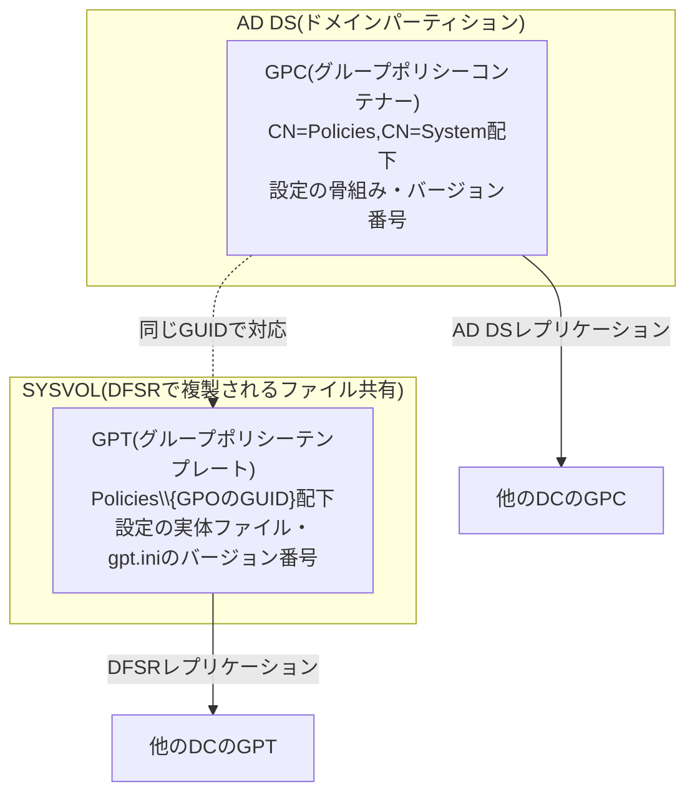

## はじめに

- **この記事で得られること**: [ADとDC、ドメインとフォレストの違い](/articles/ad-dc-fundamentals-guide)や[DCの正常性確認](/articles/dc-health-check-guide)で何度も名前だけ登場してきた**SYSVOL**・**DFSR**・**グループポリシー**(GPO)について、それぞれの正体と、なぜGPOが実は2つの独立した場所に分かれて保存されているのかを体系的に理解します。あわせて、DFSRとその前身であるFRSの違い、そしてこの「2つの独立したレプリケーション経路」がずれることで実際に起きる、GPOバージョン不一致という実務トラブルの診断方法までを扱います。
- **対象読者**: SYSVOL共有やグループポリシーという言葉は日常的に使っているものの、GPOの実体がどこにどう保存されていて、変更がどうやって全DCへ伝わっていくのかを説明できない方を想定しています。
- **読むのにかかる想定時間**: 約19分

この記事は[『上位1%』シリーズ 全記事ガイド](/sitemap)の一部、[Active Directoryシリーズ](/sitemap#シリーズ一覧)の17本目です。[ADとDC、ドメインとフォレストの違い](/articles/ad-dc-fundamentals-guide)と[DCの正常性確認](/articles/dc-health-check-guide)を先に読んでおくと、本記事の理解がスムーズです。

## 前提知識

- **SYSVOL**: [DCの正常性確認](/articles/dc-health-check-guide)で触れた通り、グループポリシーの実体ファイルやログオンスクリプトを格納する、DC間で複製される共有フォルダーです。
- **ドメインパーティションと設定パーティション**: [ADとDC、ドメインとフォレストの違い](/articles/ad-dc-fundamentals-guide)で扱った、AD DSデータベースの複製範囲の区分です。

## 全体像をつかむ

### 一言で言うと

**GPO(グループポリシーオブジェクト)は、実は1つのオブジェクトではなく、AD DS上に存在する「設定の骨組み」と、SYSVOL上に存在する「設定の実体ファイル」という、2つの独立した部分の組み合わせでできています。** この2つは、それぞれ**まったく別のレプリケーションの仕組み**(AD DSレプリケーションと、DFSRによるファイルレプリケーション)によってDC間に複製されます。この設計を理解していないと、「GPOを編集したのに、一部のクライアントにだけ反映されていない」というトラブルに遭遇したとき、どちらの複製が遅れているのかを切り分けられません。



## 基礎から徹底解説

### GPOの2階建て構造:GPCとGPT

GPOを構成する2つの部分には、それぞれ名前が付いています。

**GPC**(Group Policy Container、グループポリシーコンテナー)は、AD DSのドメインパーティションの中の`CN=Policies,CN=System`という場所に存在する、通常のAD DSオブジェクトです。GPOの状態(有効/無効)や、そのGPOが何のバージョンであるかを示す番号などを保持しています。

**GPT**(Group Policy Template、グループポリシーテンプレート)は、SYSVOL共有の中の`Policies\{そのGPOのGUID}`というフォルダーに存在する、実際の設定内容を記述したファイル群です。レジストリに書き込む値の一覧や、ログオンスクリプト本体などが、ここに実ファイルとして置かれています。GPTのフォルダーには`gpt.ini`という小さな設定ファイルがあり、ここにもバージョン番号が記録されています。

GPCとGPTは、GPOのGUID(作成時に割り当てられる一意の識別子)によって、あくまで慣習的に対応づけられているだけの、**実体としては完全に独立した2つのデータ**です。**GPCが「このGPOはどういう状態で、どのバージョンなのか」という設定の骨組み(メタデータ)を持ち、GPTがその骨組みに対応する形で、各設定項目ごとの実際のファイルを持っている**、という理解で正確です。

### GPOで実際に一括設定できること、具体例

GPOで配布できる設定は非常に幅広く、たとえば次のようなものが代表的です。

- **レジストリベースの設定(管理用テンプレート)**: 「パスワードの複雑性要件を有効にする」「USBストレージデバイスの使用を禁止する」「Windows Updateの自動更新を強制する」といった、レジストリキーへの書き込みとして実現される設定です。管理用テンプレート(ADMXファイル)が、GUIのチェックボックス操作とレジストリキーの対応関係を定義しています。
- **ログオンスクリプト・スタートアップスクリプト**: PC起動時やユーザーログオン時に自動実行するスクリプト本体(バッチファイル・PowerShellスクリプトなど)そのものを、GPTのフォルダーに配置して配布します。
- **ソフトウェアの配布(グループポリシーソフトウェアインストール)**: 特定のMSIパッケージを、対象コンピューターやユーザーに自動的にインストールさせる設定です。
- **フォルダーリダイレクト**: 「デスクトップ」「ドキュメント」などのフォルダーを、ローカルディスクではなくファイルサーバー上の共有フォルダーへ向ける設定です。
- **セキュリティ設定**: ローカル管理者グループのメンバー構成を強制したり、監査ログの取得項目を有効にしたりする設定です。

これらはいずれも、GPCが持つ「このGPOは有効で、バージョンはこれです」という骨組み情報と、GPTが持つ「具体的にはこのレジストリ値・このスクリプトファイル」という実体データが揃って初めて、クライアントに正しく適用されます。

### なぜ2つに分かれているのか、そしてなぜ複製経路も別なのか

この分割には理由があります。GPCが保持しているのは、そのGPOの状態やバージョンといった、比較的小さなメタデータです。これは通常のAD DSオブジェクトの一種なので、[ADとDC、ドメインとフォレストの違い](/articles/ad-dc-fundamentals-guide)で扱った**ドメインパーティション**の一部として、通常のAD DSレプリケーションでドメイン内の全DCへ複製されます。

一方GPTが保持しているのは、レジストリ設定の羅列やスクリプトファイルといった、GPOによってはかなりのサイズになりうる実体データです。これはAD DSのオブジェクトではなくファイルであるため、SYSVOLという**ファイル共有**の一部として、AD DSレプリケーションとは別の、**DFSR**(Distributed File System Replication)という専用のファイルレプリケーション機構によって複製されます。

**つまりGPOの複製は、「AD DSレプリケーション」と「DFSRによるファイルレプリケーション」という、2つの独立した経路を経由して、それぞれ別々のタイミングで完了する**ことになります。[ADの「サイト」とレプリケーショントポロジー](/articles/ad-sites-guide)で扱った通り、サイト内・サイト間でレプリケーションの速さが異なることを踏まえると、この2つの経路がまったく同じタイミングで完了する保証はどこにもない、ということが見えてきます。

<details>
<summary>GPCとGPTのバージョン番号がずれるとどうなるか</summary>

あるクライアントがGPOを適用しようとするとき、Windowsは念のため、**GPC側のバージョン番号(AD DS上の値)とGPT側のバージョン番号(`gpt.ini`の値)が一致しているか**を確認します。もしAD DSレプリケーションの方が先に完了し、DFSRによるSYSVOL側の複製がまだ追いついていない状態でクライアントがそのDCに問い合わせると、GPCは「新しいバージョンがあります」と言っているのに、GPTの実体ファイルはまだ古いまま、という**バージョン不一致**の状態が一時的に発生します。`gpresult /h`で生成されるレポートに「SYSVOL Version Mismatch」といった趣旨の警告が出ている場合は、まさにこの状態を指しています。多くの場合はレプリケーションが追いつくのを待てば自然に解消しますが、長時間解消しない場合はDFSRレプリケーション自体の詰まりを疑う必要があります。

</details>

### DFSRと、その前身であるFRSの違い

DFSRは、SYSVOLレプリケーションにおいて、**FRS**(File Replication Service)という古い仕組みの後継として導入されました。両者の決定的な違いは、ファイルの変更をどう複製するかです。

FRSは、ファイルのどこか1バイトでも変更されると、**そのファイル全体をまるごと**複製先へ転送していました。一方DFSRは、**RDC**(Remote Differential Compression)という技術を使い、ファイルの中身をブロック単位でハッシュ比較し、**実際に変更があったブロックだけ**を転送します(既定では64KB以上のファイルが対象)。大きなファイルのごく一部だけを更新した場合、この差は転送量に大きな違いを生みます。

FRSは2008年以降のWindows Serverで非推奨とされ、**Windows Server 2016以降では、SYSVOLレプリケーションにまだFRSを使っているドメインへ新しいDCを追加すること自体ができません**。移行がまだ済んでいないドメインでは、`dfsrmig`というコマンドを使い、**Prepared(準備完了)→Redirected(切り替え完了)→Eliminated**(FRS完全廃止)という3段階のフェーズを順に進めて、DFSRへ移行する必要があります。

<details>
<summary>DFSRにも起こりうる弱点:USNジャーナルラップ</summary>

DFSR(そして旧FRSも同様に)は、NTFSが持つ**USN変更ジャーナル**というログを監視することで、「どのファイルが変更されたか」を検知しています。ところが、DFSRサービスが長時間停止していたり、短時間に大量のファイル変更が発生したりすると、このジャーナルが変更を記録しきれずに古い記録を上書きしてしまう、**USNジャーナルラップ**という現象が起こることがあります。これが起こると、DFSRは「何が変わったのか」を正しく把握できなくなり、該当するフォルダー全体を非権威復元(まるごと再同期)せざるを得なくなります。DFSRサービスを長期間停止させないこと、そして大量のファイル操作を行う前にはDFSRの状態を確認しておくことが、実務上の予防策になります。

</details>

## プロが見ている視点(上位1%の理解)

### `dfsrdiag`コマンドでSYSVOLレプリケーションの詰まりを可視化する

GPOの反映が特定のDCだけ遅い、といった症状に遭遇したら、[DCの正常性確認](/articles/dc-health-check-guide)で扱った`repadmin`とは別に、DFSR専用の診断コマンドである`dfsrdiag`を使います。

```powershell
# 未反映のまま溜まっている複製アイテム(バックログ)を確認する
dfsrdiag backlog /receiveport:5722 /sendport:5722

# DFSRレプリケーション全体の健全性レポートを生成する
dfsrdiag healthreport

# DFSRサービスに、AD DS上の構成変更(サイトやレプリケーショングループの変更など)を
# 今すぐ再取得させる
dfsrdiag pollad
```

`repadmin`がAD DSデータそのものの複製状況を見るコマンドだったのに対し、`dfsrdiag`は**SYSVOLというファイルの複製状況**を見るコマンドです。GPO関連のトラブルシューティングでは、この2つを両方確認して初めて、「GPCとGPTのどちらの複製が遅れているのか」を正確に切り分けられます。

## よくある誤解・つまずきポイント

- **誤解1: 「GPOは1つのオブジェクトとして、AD DS上にまるごと保存されている」**
  GPOの実体は、AD DS上のGPC(骨組み)とSYSVOL上のGPT(実体ファイル)という2つの独立したデータの組み合わせであり、それぞれ別のレプリケーション経路で複製されます。
- **誤解2: 「DFSRはFRSの単なる新しいバージョンで、仕組み自体はほぼ同じ」**
  FRSはファイル全体を毎回まるごと複製するのに対し、DFSRはRDCによってブロック単位の差分だけを複製する、根本的に異なる設計です。
- **誤解3: 「SYSVOLの複製が完了していれば、GPOはすぐに正しく適用される」**
  SYSVOL(GPT)の複製が完了していても、AD DS側(GPC)のレプリケーションが別のタイミングで完了するため、双方のバージョン番号が一致するまでは、一時的な不整合が起こりえます。

## 障害・トラブルシューティングの視点

GPO関連の障害は、「**GPCとGPTのどちらの複製が遅れているのか**」を軸に切り分けます。

1. **特定のクライアント・DCだけGPOの反映が遅い**: `gpresult /h`でSYSVOLバージョン不一致の警告が出ていないかを確認します。出ていれば、AD DSレプリケーションとDFSRレプリケーションのどちらが遅れているかを、それぞれ`repadmin /showrepl`と`dfsrdiag backlog`で個別に確認します。
2. **SYSVOLの複製が特定のDC間だけ止まっている**: `dfsrdiag healthreport`でDFSR全体の健全性を確認し、USNジャーナルラップなどのイベントログが記録されていないかを確認します。
3. **新しいDCをドメインに追加しようとしてエラーになる**: そのドメインがまだFRSでSYSVOLを複製していないかを疑います。Windows Server 2016以降は、FRSのままではDCを追加できません。

### 予防策・恒久対策

- ドメインがまだFRSを使っている場合は、`dfsrmig`を使って計画的にDFSRへ移行しておく。
- DFSRサービスを長期間停止させない。大量のファイル操作を行う前には、`dfsrdiag`でレプリケーションの状態を確認しておく。
- GPOの反映に関するトラブルでは、`repadmin`(AD DS側)と`dfsrdiag`(SYSVOL側)の両方を確認する習慣をつける。

## まとめ

- GPOは、AD DS上のGPC(骨組み・バージョン番号)と、SYSVOL上のGPT(実体ファイル)という、2つの独立した部分の組み合わせでできています。
- GPCはAD DSレプリケーションで、GPTはDFSRで、それぞれ別々の経路・タイミングでDC間に複製されるため、一時的なバージョン不一致が起こりえます。
- DFSRは、FRSと違いRDCによるブロック単位の差分複製を行う、根本的に設計の異なる後継技術です。Windows Server 2016以降、FRSのままでは新しいDCを追加できません。
- GPO関連の障害は、`repadmin`(AD DS側)と`dfsrdiag`(SYSVOL側)を両方確認することで、どちらの複製が遅れているのかを正確に切り分けられます。

**今日から意識すべきこと**
1. GPOの反映が遅いというトラブルに遭遇したら、AD DS側(GPC)とSYSVOL側(GPT)のどちらの複製が遅れているのかを、`repadmin`と`dfsrdiag`の両方で切り分けましょう。
2. まだFRSを使っているドメインを見つけたら、計画的に`dfsrmig`でのDFSR移行を検討しましょう。

## 参考文献

- [Group Policy Storage | Microsoft Learn](https://learn.microsoft.com/en-us/previous-versions/windows/desktop/policy/group-policy-storage)
- [DFS Replication Overview | Microsoft Learn](https://learn.microsoft.com/en-us/previous-versions/windows/desktop/dfsr/dfsr-overview)
- [Migrate SYSVOL replication to DFS Replication | Microsoft Learn](https://learn.microsoft.com/en-us/windows-server/storage/dfs-replication/migrate-sysvol-to-dfsr)
- [Troubleshoot journal_wrap errors on SYSVOL | Microsoft Learn](https://learn.microsoft.com/en-us/troubleshoot/windows-server/networking/how-frs-uses-usn-change-journal-ntfs-file-system)
