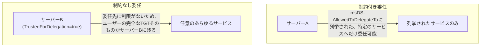

## はじめに

- **この記事で得られること**: [Kerberos制約付き委任で『ダブルホップ問題』を解決するハンズオン](/articles/ad-constrained-delegation-handson-guide)で扱った、「**委任先を特定のサービスに限定する制約付き委任**」と対になる、「**委任先に一切の制限を設けない制約なし委任**」の危険性を、安全な検証環境の中だけで再現します。特権を持つユーザーが、そのサーバーへ一度アクセスしただけで、サーバー側にそのユーザーの完全なTGTが残ってしまう仕組みと、「**センシティブで委任不可**」フラグによる防御を確認します。
- **対象読者**: Kerberos制約付き委任のハンズオンは経験したものの、「制約なし」委任が、具体的にどう危険なのかを説明できない方を想定しています。**このハンズオンは、自分が管理する検証環境の防御力を高めるための、教育・防御目的のものです。実運用中の他者の環境に対して、許可なくこの手順を実行しないでください。**
- **読むのにかかる想定時間**: 約20分

この記事は[『上位1%』シリーズ 全記事ガイド](/sitemap)の一部、[Active Directoryシリーズ](/sitemap#シリーズ一覧)の43.1本目です。

## 前提知識

- [Kerberos制約付き委任で『ダブルホップ問題』を解決するハンズオン](/articles/ad-constrained-delegation-handson-guide): 「委任」そのものの基本的な仕組みと、`msDS-AllowedToDelegateTo`で委任先を限定するという発想が、この記事の前提になっています。
- [Kerberos認証の仕組みを『上位1%』の視点で理解する](/articles/ad-kerberos-guide): TGTが、KDC自身の鍵で暗号化された、クライアント自身も読めない証明書であるという理解が前提になっています。

## 全体像をつかむ

制約付き委任は、「このサーバーは、**明示的に列挙した特定のサービスへ**だけ、ユーザーの代わりにアクセスしてよい」という、委任先を限定する仕組みでした。**制約なし委任は、この限定を一切行わない**、委任の最も古い実装です。



## ハンズオン手順

### Step 1: 検証用サーバーに、制約なし委任を設定する

```powershell
Get-ADComputer -Identity "FILESRV01" | Set-ADAccountControl -TrustedForDelegation $true
```

**実行結果の確認:**

```powershell
Get-ADComputer -Identity "FILESRV01" -Properties TrustedForDelegation | Select-Object Name, TrustedForDelegation
```

```
Name       TrustedForDelegation
----       --------------------
FILESRV01                 True
```

**これは、「このコンピューターは、どのユーザーからのKerberos委任であっても、無条件に信頼する」という設定です。** 実務では、古いアプリケーションサーバーや、構築時に安易に「とりあえず動かすため」にこの設定が行われ、そのまま放置されているケースが、珍しくありません。

### Step 2: 特権ユーザーが、このサーバーへアクセスした際の挙動を確認する

検証用に作成した、Domain Adminsグループに所属するユーザー(`admin-test`)で、このサーバー上の共有フォルダーへアクセスします。

```powershell
# admin-testユーザーのセッションで実行
net use \\FILESRV01\share
```

**この一度のアクセスだけで、裏側で重要なことが起きています。** [Kerberos認証の仕組み](/articles/ad-kerberos-guide)で扱った通り、通常のKerberos認証では、クライアントはサービスチケットだけをサーバーへ提示し、**TGTそのものはクライアント自身の手元に残ります。** しかし、アクセス先が制約なし委任を許可されているサーバーの場合、**KDCは、クライアントのTGTそのものを、サービスチケットに同梱してサーバーへ送り届けます。** 

```powershell
# FILESRV01上で実行(管理者権限)
klist sessions
```

**実行結果(イメージ):**

```
[0] Session 0
    Client Name: admin-test @ EXAMPLE.COM
    ...TGT が、このサーバーのメモリ上にキャッシュされている
```

**`admin-test`が、一度このサーバーへアクセスしただけで、そのユーザーの完全なTGTが、サーバー自身のメモリ上に残ってしまいました。**

<details>
<summary>なぜ、わざわざTGTそのものをサーバーへ送る必要があるのか</summary>

**制約なし委任は、「このサーバーが、ユーザーの代わりに、あらかじめ決められていない、あらゆるサービスへアクセスできるようにする」ことを目的とした仕組みです。** [制約付き委任](/articles/ad-constrained-delegation-handson-guide)が、S4U2Proxyという仕組みを使って、あらかじめ列挙した特定のサービスチケットだけを取得できるようにしていたのに対し、制約なし委任には、そのような限定の仕組みが用意されていません。**「どんなサービスへのアクセスにも対応できるように」という目的のために、サーバー側に、ユーザー本人そのものになりきれる"原本"であるTGTを、そのまま預けてしまう**、という、設計そのものに起因する危険性です。

</details>

### Step 3: 「センシティブで委任不可」フラグによる防御を確認する

Domain Adminsのような特権アカウントを、そもそも委任の対象にさせない、という防御策を設定します。

```powershell
Set-ADAccountControl -Identity "admin-test" -AccountNotDelegated $true
```

```powershell
# 再度FILESRV01へアクセスを試みる
net use \\FILESRV02\share
```

**今度は、サーバー側にTGTが送られなくなります。** `AccountNotDelegated`(GUI上では「このアカウントはセンシティブであるため、委任できません」)というフラグが立っているアカウントは、**どのサーバーが制約なし委任を許可されていても、そのTGTを委任先へ渡すこと自体が、KDCによって拒否されます。**

## プロが見ている視点(上位1%の理解)

### 制約なし委任が許可されたサーバー1台の侵害が、ドメイン全体の侵害につながる理由

このハンズオンで確認した通り、**制約なし委任が許可されたサーバーへ、Domain Adminsのような特権ユーザーが一度でもアクセスすれば、そのサーバーのメモリ上に、そのユーザーの完全なTGTが残ります。** もし攻撃者が、このサーバー自体(ローカル管理者権限、あるいはSYSTEM権限)を何らかの方法で侵害できれば、**メモリ上に残っているTGTを使って、そのままDomain Adminsとして、ドメイン内のあらゆるリソースへアクセスできてしまいます。** これが、**「制約なし委任が許可された、一見何の変哲もないファイルサーバー1台」が、実際には「Domain Admins昇格への、最短の踏み台」になり得る**という、実務上非常に重要な認識です。**上位1%のエンジニアは、ドメイン内のコンピューターオブジェクトを棚卸しする際、`TrustedForDelegation`が`True`になっているサーバーを、常に最優先の調査対象として扱います。**

## よくある誤解・つまずきポイント

- **誤解1: 「制約なし委任と制約付き委任は、委任できる範囲が広いか狭いかだけの違いである」**
  範囲の違いだけでなく、制約なし委任は、クライアントの完全なTGTそのものをサーバーへ送るという、構造的にまったく異なる、より危険な仕組みです。
- **誤解2: 「`AccountNotDelegated`を設定すれば、そのアカウントは一切Kerberos認証を使えなくなる」**
  このフラグは、「そのアカウントのTGTが、委任先のサーバーへ渡されること」だけを防ぎます。そのアカウント自身が通常のKerberos認証を行うことは、問題なく継続できます。
- **誤解3: 「制約なし委任は、古いバージョンのWindowsにしか存在しない、すでに廃止された機能である」**
  制約なし委任は、現在のWindowsServerでも設定可能な、現役の機能です。だからこそ、意図せず設定されたまま放置されているサーバーが、実務上のリスクになり続けています。

## 障害・トラブルシューティングの視点

1. **ドメイン内に、制約なし委任が設定されているコンピューターがどれだけあるか調べたい**: `Get-ADComputer -Filter {TrustedForDelegation -eq $true} -Properties TrustedForDelegation`で、一覧できます。
2. **`AccountNotDelegated`を設定した後、特定の正規の委任処理が動かなくなった**: そのアカウントが、実際に正規の委任(制約付き委任など)を必要としていないかを再確認し、必要であれば制約付き委任への切り替えを検討します。
3. **既存の制約なし委任を今すぐ無効化できない場合の、暫定的な対応を知りたい**: 影響範囲を最小化するため、少なくとも特権アカウント(Domain Admins、Enterprise Adminsなど)だけは、Protected Usersグループへの追加や`AccountNotDelegated`の設定で、個別に保護することを検討してください。

## まとめ

- 制約なし委任が許可されたサーバーへ、ユーザーが一度アクセスするだけで、そのユーザーの完全なTGTが、サーバーのメモリ上に残ってしまいます。
- この危険性は、制約なし委任が「委任先に制限を設けない」ために、クライアントのTGTそのものをサーバーへ預ける、という設計そのものに起因します。
- `AccountNotDelegated`フラグを設定したアカウントは、どのサーバーが制約なし委任を許可されていても、TGTを委任先へ渡すことがKDCによって拒否されます。
- 制約なし委任が許可された、一見普通のサーバー1台が、Domain Admins昇格への最短の踏み台になり得ます。

**今日から意識すべきこと**
1. ドメイン内のコンピューターオブジェクトを棚卸しする際は、`TrustedForDelegation`が`True`のサーバーを、常に最優先の調査対象としましょう。
2. Domain Adminsなどの特権アカウントには、`AccountNotDelegated`の設定か、Protected Usersグループへの追加を、標準の保護策として適用しましょう。

## 参考文献

- [Kerberos Constrained Delegation Overview | Microsoft Learn](https://learn.microsoft.com/en-us/windows-server/security/kerberos/kerberos-constrained-delegation-overview)
- [Guidance About How to Configure Protected Accounts | Microsoft Learn](https://learn.microsoft.com/en-us/windows-server/identity/ad-ds/manage/how-to-configure-protected-accounts)
