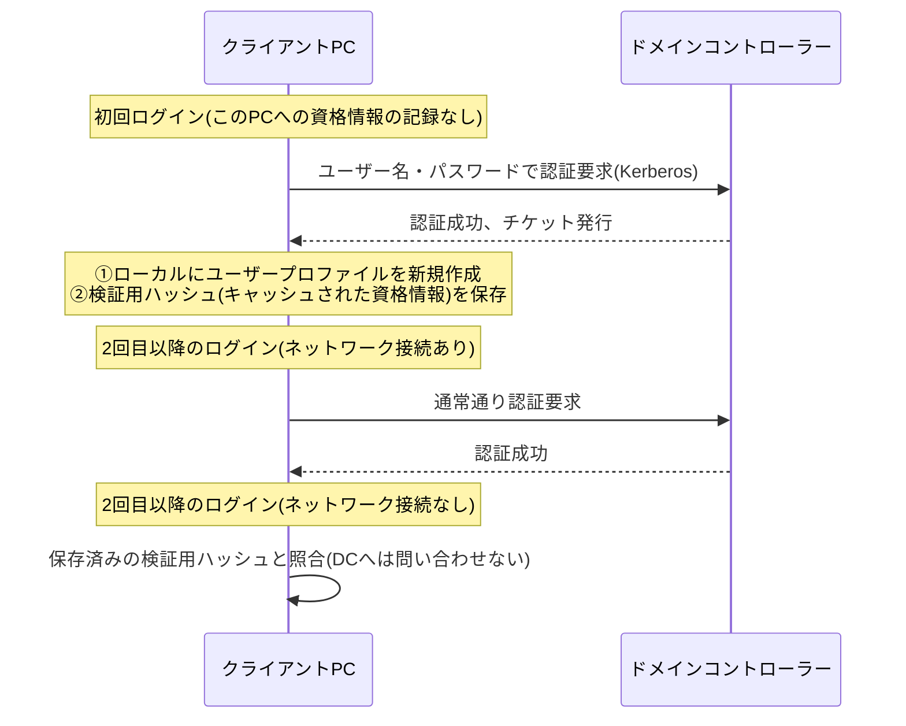
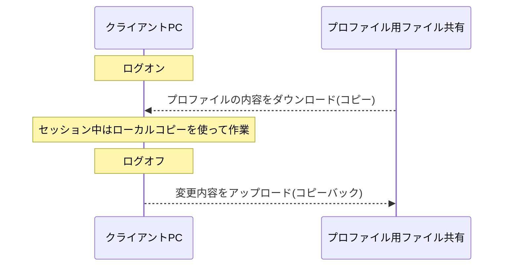

## はじめに

- **この記事で得られること**: 「ドメインアカウントで初めてPCにログインするときだけ、なぜ社内ネットワークへの接続が必要なのか」「2回目以降のログインでは裏側で何が起きているのか」という疑問を出発点に、Windowsのドメインログオン処理、ローカルに作成されるユーザープロファイルの正体、そして**キャッシュされた資格情報**(Cached Credentials)という仕組みまでを体系的に理解します。あわせて、「同じユーザーがどのPCにログインしても同じデスクトップにアクセスできる」VDI(仮想デスクトップインフラ)が、通常のPCへのログインの仕組みとどう異なるアプローチでこれを実現しているのかも整理します。
- **対象読者**: ドメイン参加PCの運用やVDI環境の構築・運用に携わっているものの、初回ログインと2回目以降のログインで何が違うのか、ユーザープロファイルがどのように生成・保存されているのかを具体的に説明できない方を想定しています。
- **読むのにかかる想定時間**: 約17分

この記事は[『上位1%』シリーズ 全記事ガイド](/sitemap)の一部、[Active Directoryシリーズ](/sitemap#シリーズ一覧)の3本目です。

## 前提知識

- **Kerberos認証**: ADドメインの既定の認証プロトコルです。クライアントは認証のたびにドメインコントローラー(DC)へチケットの発行を要求します。チケットのやり取りの裏側の仕組みは[Kerberos認証の仕組みを『上位1%』の視点で理解する](/articles/ad-kerberos-guide)で徹底的に扱います。
- **SID(セキュリティ識別子)**: ユーザーやコンピューターを一意に識別する値です。Windowsの権限管理は、ユーザー名という文字列ではなく、このSIDを基準に行われます。SIDが実際の認証処理の中でどう使われているかは、[Kerberos認証の仕組み](/articles/ad-kerberos-guide)で扱うPAC(特権属性証明書)とあわせて理解すると腑に落ちます。
- **ローカルユーザープロファイル**: `C:\Users\<ユーザー名>`以下に保存される、そのユーザー固有のデスクトップ設定・ドキュメント・アプリケーション設定などの集合です。
- **PCはどうやってDCを見つけているのか**: 本記事はKerberos認証の中身(チケットのやり取り)に焦点を当てますが、その前段として「PCがそもそもどのDCに問い合わせればよいかをどう知るのか」という疑問を持つ方も多いはずです。結論だけ先取りすると、**PCはDNSに登録されたSRVレコードを使ってDCを検索します**。そのため、PCのDNS設定が社内DNS(ADと統合されたDNSサーバー)を指していることが大前提であり、キッティング時にDHCPでこのDNSサーバーを配布しておくか、固定IP環境であれば静的にこの値を設定しておく必要があります。DC検索(DCロケータ)の詳しい仕組みは[DNSゾーンとレコードの仕組みを『上位1%』の視点で理解する](/articles/dns-zones-records-guide)で扱っているので、まだ読んでいない場合は先に目を通しておくと本記事の理解がスムーズです。

## 全体像をつかむ

### 一言で言うと

**ドメインアカウントでの初回ログインに社内ネットワーク接続が必要なのは、「そのユーザーが本当に名乗っている通りの人物かどうかを検証できる情報を、そのPCがまだ一切持っていない」ためです。** 2回目以降のログインでは、初回ログイン時にPC自身が保存しておいた「検証用の手がかり」を使って、ネットワークに接続できない状況でもある程度自力で検証できるようになります。

## 基礎から徹底解説

### 初回ログインで何が起きているのか

ドメインに参加済みのPCで、あるユーザーが**そのPCに初めて**ドメインアカウントでログインしようとすると、次の2つの理由から、そのPCが社内ネットワーク(正確にはDC)へ到達できる必要があります。

1. **認証情報の検証そのものに、DCへの問い合わせが必要**: ユーザーが入力したユーザー名・パスワードが正しいかどうかを判定できる情報(パスワードハッシュなど)は、クライアントPC自身は一切保持していません。この情報はAD DS上にしかないため、DCとの間でKerberos認証のやり取りを行う必要があります。
2. **そのPC上に、そのユーザー専用のローカルプロファイルがまだ存在しない**: 認証に成功すると、Windowsは`C:\Users\<ユーザー名>`以下に、そのユーザー専用のプロファイルフォルダーを新規に作成します。これは`C:\Users\Default`にある既定のテンプレートフォルダーの内容をコピーする形で行われ、レジストリ上のユーザー固有の設定(`HKEY_CURRENT_USER`に相当する`NTUSER.DAT`ファイルなど)もこのとき新規に生成されます。

つまり、初回ログインの「重さ」は、**認証そのもの**(DCとの通信)と、**プロファイルの新規作成**(ローカルディスクへの書き込み)という、2つの異なる処理が同時に発生していることに起因します。

### キャッシュされた資格情報(Cached Credentials):2回目以降のログインの裏側

認証に成功すると、Windowsは同時に、**そのユーザーの資格情報を検証するためのハッシュ値**をローカルのレジストリ(セキュリティで保護された領域)に保存します。これが**キャッシュされた資格情報**(Cached Credentials、実装としてはMSCacheV2と呼ばれるハッシュ形式)です。

ここで重要なのは、**このキャッシュはパスワードそのものを保存しているわけではなく、また保存されたハッシュを使ってネットワーク上の他のリソース(ファイルサーバーなど)にアクセスするためのチケットを取得することもできない**という点です。キャッシュされた資格情報が使えるのは、あくまで「**このPC自身へのローカルログオン(サインイン画面の突破)を許可するかどうかの判定**」だけです。次にPCがDCへ到達できたタイミングで、あらためて正規のKerberos認証が行われ、キャッシュも最新の状態に更新されます。

| | 初回ログイン | 2回目以降(ネットワーク接続あり) | 2回目以降(ネットワーク接続なし) |
|---|---|---|---|
| 認証情報の検証 | DCへ問い合わせて検証(必須) | DCへ問い合わせて検証 | ローカルのキャッシュと照合 |
| ローカルプロファイル | 新規作成 | 既存プロファイルを読み込み | 既存プロファイルを読み込み |
| ネットワークリソースへのアクセス | 正常に可能 | 正常に可能 | **不可**(Kerberosチケットが取得できないため) |

キャッシュされた資格情報を無効化・制限する設定

このキャッシュの保持数は、グループポリシーの「対話型ログオン:キャッシュする過去のログオンの数(ドメインコントローラーが利用できない場合)」(レジストリ上は`CachedLogonsCount`)で制御できます。既定では複数世代分のログオン情報が保持されますが、セキュリティ要件が厳しい環境(例えば、PCの盗難・紛失時にオフラインでのログオン試行自体を許したくない場合)では、この値を`0`に設定してキャッシュそのものを無効化することもあります。ただし`0`にすると、DCへ一切到達できない状況(社内ネットワーク障害時など)ではそのPCへ誰もログオンできなくなるため、可用性とのトレードオフになります。

### ローカルプロファイルはPCごとに独立している

前述の通り、ローカルユーザープロファイルは**そのPCのローカルディスク上**に作成されます。したがって、同じユーザーが別のPCにログインすると、そのPC上にはまだそのユーザーのプロファイルが存在しないため、**まったく新しい、空のプロファイルが新規に作成されます**。デスクトップの背景も、保存したドキュメントも、アプリケーションの設定も、別のPCへは一切引き継がれません。これは「PCごとに独立したプロファイルを持つ」という、既定のWindowsドメインログオンの基本的な性質です。

### ローミングプロファイル:プロファイルをネットワーク上で一元管理する

「複数のPCを使い回すユーザーでも、常に同じデスクトップ環境にしたい」というニーズに対して、ADには古くから**ローミングプロファイル**という機能があります。ADユーザーオブジェクトの「プロファイル」タブに、ネットワーク共有上のパス(例: `\\fileserver\profiles\%username%`)を**プロファイルパス**として設定しておくと、ログオン時にそのパスからプロファイルの内容がローカルにコピーされ、ログオフ時にはローカルでの変更内容がそのネットワーク共有へコピーバックされます。これにより、複数のPC間でプロファイルの内容(の同期)を実現しています。

ただし、ローミングプロファイルには実務上の課題もあります。プロファイルのサイズが大きくなると(デスクトップに大量のファイルを置く、ブラウザキャッシュが肥大化するなど)、ログオン・ログオフのたびに発生するコピー処理に時間がかかり、体感速度の悪化に直結します。また、同じユーザーが複数のPCに同時にログオンしている状態での挙動(後からログオフしたPCの内容で上書きされてしまう、いわゆる「後勝ち」の問題)も、運用上の注意点として知られています。

### VDI(仮想デスクトップ)における「どのPCからでも同じデスクトップ」の実現方式

VDI(Virtual Desktop Infrastructure)環境で「どの端末(シンクライアントや自席のPC)から接続しても、自分の使い慣れたデスクトップにアクセスできる」という体験は、前述のローミングプロファイルの発想を、より徹底した形で実現しています。VDIには大きく2つの方式があります。

- **永続型(Persistent)VDI**: ユーザーごとに専用の仮想マシンが割り当てられ、そのユーザーは常に同じ仮想マシンに接続します。この場合、プロファイルはその仮想マシンのローカルディスク(仮想ディスク)にそのまま保存され続けるため、通常の物理PCと同じ発想で「ローカルプロファイルがそのまま維持される」形になります。
- **非永続型(Non-Persistent)VDI**: 複数のユーザーが、共通の1つのマスターイメージから都度生成される仮想マシンに接続します。セッション終了後は仮想マシン自体が破棄・初期化されるため、ローカルディスクにプロファイルを保存しても次回には引き継がれません。ここで必要になるのが、**プロファイルを仮想マシンの外部(ネットワーク上)で管理する仕組み**です。

非永続型VDIでのプロファイル管理には、伝統的には前述のローミングプロファイルがそのまま使われてきましたが、近年は**FSLogix**(プロファイルコンテナ)という、より新しい方式が主流になっています。

FSLogixがローミングプロファイルとどう違うのか

ローミングプロファイルは、ログオン時にプロファイルの中身(大量の小さなファイル)を1つずつネットワーク経由でローカルにコピーするため、プロファイルサイズに比例してログオン時間が伸びるという課題がありました。FSLogixは、ユーザーごとのプロファイル全体を**1つの仮想ディスクファイル**(VHD/VHDX)としてネットワーク共有上に保持し、ログオン時にはこの仮想ディスクファイルを**そのままネットワーク越しにマウントする**という方式を取ります。ファイルを1つずつコピーするのではなく、ディスクとして直接マウントするため、プロファイルサイズが大きくてもログオン時間がほぼ一定に保たれるという利点があります。VDI環境での大規模な同時ログオン(始業時間に一斉にログオンする「ログオンストーム」)対策として広く採用されています。

これらを踏まえると、「VDIはユーザープロファイルを一括で保管することで、どのPCに接続しても自分のデスクトップ画面にアクセスできるようにしているのではないか」という素朴な理解は、**非永続型VDI+FSLogix(またはローミングプロファイル)という構成に限って、おおむね正しい**といえます。永続型VDIの場合は、この一括管理の仕組みはそもそも使われておらず、通常の物理PCと同じく専用の仮想マシンにプロファイルがそのまま存在し続けます。

## プロが見ている視点(上位1%の理解)

### 「初回ログイン=必ず低速」とは限らない:プレプロビジョニングという選択肢

大量のPCを一斉にキッティング(初期設定)する現場では、「ユーザーが初めてそのPCにログインする瞬間に、初回ログインの重い処理(認証+プロファイル新規作成)が発生する」ことを避けたい場合があります。この対策として、Windowsには**同期のプロビジョニング**や、SCCM/Intuneなどの構成管理ツールと組み合わせた**プレプロビジョニング**の仕組みがあり、ユーザーが実際に使い始める前の段階で、テンプレートとなるプロファイルの生成やアプリケーションの事前配置をあらかじめ済ませておくことができます。VDI環境でも同様に、非永続型VDIのマスターイメージ自体にFSLogixのコンテナテンプレートを組み込んでおくなど、初回アクセス時の体感速度を改善する工夫が実務では重視されます。

### Enterprise State Roaming/OneDriveによる設定同期という、ローミングプロファイルとは別のアプローチ

近年では、伝統的なローミングプロファイル(プロファイル丸ごとのコピー)ではなく、**特定のフォルダー・設定だけを選択的に同期する**アプローチも広く使われています。代表的なものが、OneDriveの**known folder move**(デスクトップ・ドキュメント・ピクチャなどの既知フォルダーをOneDriveの同期対象にする機能)や、Microsoft Entra ID(旧Azure AD)の**Enterprise State Roaming**(ブラウザのお気に入りやWindowsの設定の一部をクラウド経由で同期する機能)です。これらは、ローミングプロファイルのようにプロファイル全体をまるごと同期するのではなく、**同期したい範囲を絞り込む**ことで、ログオン・ログオフ時の待ち時間の問題を回避しつつ、部分的な「どのPCでも同じ体験」を実現するアプローチだと整理できます。

## よくある誤解・つまずきポイント

- **誤解1: 「キャッシュされた資格情報があれば、ネットワーク接続なしでも社内のファイルサーバーにアクセスできる」**
  キャッシュされた資格情報は、あくまでそのPCへのローカルログオンの可否を判定するためだけのものです。ネットワークリソースへのアクセスには正規のKerberosチケットが必要であり、DCへ到達できない状況では取得できません。
- **誤解2: 「ローミングプロファイルを設定すれば、複数のPCに同時にログオンしても問題なく同期される」**
  ローミングプロファイルの同期はログオン時のダウンロード・ログオフ時のアップロードという単純な仕組みであり、複数PCへの同時ログオンでは、後からログオフした側の内容で上書きされる「後勝ち」の問題が起こりえます。
- **誤解3: 「VDIは常にユーザープロファイルを一括管理する仕組みを使っている」**
  永続型VDIでは、通常の物理PCと同様にプロファイルは各仮想マシンのローカルディスクにそのまま存在し続けており、一括管理の仕組み(FSLogixやローミングプロファイル)は使われていません。

## 障害・トラブルシューティングの視点

ログイン・プロファイル関連の障害は、**「認証の問題か、プロファイルの問題か」をまず切り分ける**のが基本です。

1. **社内ネットワーク障害時に、これまでログインできていたPCにログインできなくなった**: キャッシュされた資格情報が無効化されている(`CachedLogonsCount`が0)か、そもそもそのユーザーがそのPCに初めてログインしようとしている(キャッシュがまだ存在しない)可能性を確認します。
2. **ログインはできるが、デスクトップの内容が空になっている・見慣れないものになっている**: ローミングプロファイルのダウンロードに失敗し、一時プロファイルが作成されている可能性があります。イベントログの「ユーザープロファイルサービス」関連のエラーを確認します。
3. **ログオンに極端に時間がかかる(特にVDI環境)**: ローミングプロファイルの肥大化、あるいはログオンストーム(始業時間の一斉ログオンによるファイルサーバー・ストレージへの負荷集中)を疑います。
4. **VDI環境で、前回の設定が引き継がれていない**: 非永続型VDIで、プロファイルコンテナ(FSLogix)のマウントが失敗していないか、正しいユーザーに対して正しいコンテナが割り当てられているかを確認します。

### 予防策・恒久対策

- 大量のPCキッティングを行う環境では、プレプロビジョニングによって初回ログインの負荷をあらかじめ軽減しておく。
- VDI環境では、ローミングプロファイルより高速なFSLogixなどのプロファイルコンテナ方式への移行を検討する。
- キャッシュされた資格情報の保持数(`CachedLogonsCount`)は、セキュリティ要件と可用性のバランスを踏まえて明示的に設計する。

## まとめ

- 初回ログインに社内ネットワーク接続が必要なのは、認証情報の検証にDCへの問い合わせが必要であり、かつそのPC上にまだそのユーザーのローカルプロファイルが存在しないためです。
- 2回目以降のログインでは、初回ログイン時に保存されたキャッシュされた資格情報を使って、ネットワークに接続できない状況でもローカルログオンだけは可能になりますが、ネットワークリソースへのアクセスはできません。
- ローカルプロファイルは既定ではPCごとに独立しており、複数のPCで同じ環境を維持したい場合はローミングプロファイルやFSLogixといった、プロファイルをネットワーク上で一元管理する仕組みが必要です。
- VDIが「どの端末からでも同じデスクトップにアクセスできる」ことを実現しているのは、非永続型VDI+FSLogix(またはローミングプロファイル)という構成であり、永続型VDIでは通常のPCと同じくプロファイルは専用の仮想マシンにそのまま存在し続けます。

**今日から意識すべきこと**
1. 「初回ログインが遅い・ネットワークが必要」というトラブルに遭遇したら、認証(DCとの通信)とプロファイル新規作成という2つの処理が同時に走っていることを思い出しましょう。
2. VDI環境の設計・トラブルシューティングでは、まずそれが永続型か非永続型か、非永続型であればプロファイルの同期方式(ローミングプロファイル/FSLogix)が何かを確認しましょう。

## 参考文献

- [How Windows Logon Works | Microsoft Learn](https://learn.microsoft.com/en-us/windows/security/identity-protection/access-control/microsoft-accounts)
- [Cached and Stored Credentials Technical Overview | Microsoft Learn](https://learn.microsoft.com/en-us/windows-server/security/kerberos/cached-and-stored-credentials-technical-overview)
- [Configure Roaming User Profiles | Microsoft Learn](https://learn.microsoft.com/en-us/windows-server/storage/folder-redirection/roaming-profiles-configuring)
- [FSLogix Profile Container Overview | Microsoft Learn](https://learn.microsoft.com/en-us/fslogix/concepts-profile-container/)
- [Enterprise State Roaming Overview | Microsoft Learn](https://learn.microsoft.com/en-us/entra/identity/users/enterprise-state-roaming-overview)
