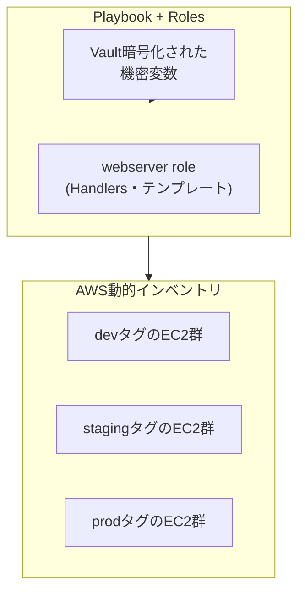

## はじめに

- **この記事で得られること**: ここまでのハンズオンで、1つずつ個別に習得してきた技術(roles/Handlers/テンプレート、Ansible Vault、AWS動的インベントリ、dev/staging/prodの環境分離、Ansible Galaxy、block/rescue/alwaysによるエラーハンドリング、機密情報の保護)を、**1つの架空のスタートアップの構成管理基盤へ、自分の力で統合する**、Ansible/IaC学科の卒業制作です。これまでの記事が「手順をなぞって、1つの技術を確実に身につける」ことを目的としていたのに対し、この記事は**要件だけを提示し、どの技術を、どう組み合わせるかを、自分で設計する**という、実務そのものに近い形式を取ります。
- **対象読者**: Ansible/IaC学科の3年生・4年生・大学院の内容を一通り終え、個々のハンズオンは実施できるが、それらを組み合わせて1つの構成管理基盤を設計した経験がない方を想定しています。
- **読むのにかかる想定時間**: 設計・構築・文書化を含めて、数日〜1週間程度を想定しています(1回のハンズオンとしては最も重量級です)。

この記事は[『上位1%』シリーズ 全記事ガイド](/sitemap)の一部です。[Ansible/IaC学科の全カリキュラム](/university#ansibleiac学科)の、卒業制作にあたる位置づけです。

## 前提知識

このハンズオンは、新しい技術を教えるものではありません。**以下の、すでに実施済みのハンズオンで習得した技術を、組み合わせて使います。**

- [Ansibleのroles・Handlers・テンプレートで実務レベルの構成管理を体験するハンズオン](/articles/ansible-roles-handson-guide)
- [Ansible Vaultでパスワードをgitにプレーンテキストのまま置かないハンズオン](/articles/ansible-vault-handson-guide)
- [AnsibleでAWSの動的インベントリを使い、静的なIPリストから解放されるハンズオン](/articles/ansible-aws-dynamic-inventory-handson-guide)
- [Ansibleでdev/staging/prodを1つのPlaybookで安全に使い分けるハンズオン](/articles/ansible-environments-handson-guide)
- [Ansible Galaxyでコミュニティ製のroleとCollectionを使うハンズオン](/articles/ansible-galaxy-collections-handson-guide)
- [Ansibleのblock/rescue/alwaysで構成変更失敗時のロールバックを設計するハンズオン](/articles/ansible-error-handling-handson-guide)
- [Ansible実行時に機密情報がログとプロセス一覧に漏れる経路を塞ぐハンズオン](/articles/ansible-secrets-exposure-handson-guide)

## 課題設定:架空のスタートアップの構成管理基盤

**あなたは、架空のスタートアップ企業「KoiKoi Tech」のインフラエンジニアです。この会社は、dev・staging・prodという3つの環境で、複数台のWebサーバーをAWS EC2上で運用しています。これまで、サーバー1台ずつに手作業でSSHして設定を行ってきましたが、台数が増えて限界を迎えました。あなたに与えられた課題は、次の要件をすべて満たす、Ansibleによる構成管理基盤を、自分の手で構築することです。**

### 要件1: サーバー一覧を手動管理しない

**AWSのタグ(`Environment=dev`など)に基づいて、対象サーバーを自動的に検出する仕組みを構築してください。** 静的なIPアドレスのリストを、設定ファイルに直接書き込むことは避けてください。

### 要件2: 設定を再利用可能な単位に整理する

**Webサーバーの設定(パッケージインストール、設定ファイルのテンプレート展開、サービスの再起動)を、使い回しが効くroleとして整理してください。** 設定ファイルが変更された場合にのみ、サービスを再起動する仕組みも組み込んでください。

### 要件3: 機密情報をgitリポジトリに平文で残さない

**データベースのパスワードなど、機密情報を含む変数を、暗号化した状態でリポジトリに保存してください。** 環境ごとに異なるパスワードを使い分けられる構成にしてください。

### 要件4: 3つの環境を、1つのPlaybookで安全に切り替えられるようにする

**dev・staging・prodという3つの環境に対して、同じPlaybookを使いながら、環境ごとに異なる変数値(インスタンス数、ドメイン名など)を適用できる構成にしてください。** 誤って本番環境へ検証中の変更を適用してしまう事故を防ぐ工夫も、あわせて検討してください。

### 要件5: 車輪の再発明を避ける

**汎用的な設定(NTPクライアント、ファイアウォール設定など)については、自分でroleを一から書くのではなく、Ansible Galaxy上の実績あるroleやCollectionを活用してください。**

### 要件6: 設定変更の失敗に備える

**設定変更の途中で失敗した場合に、変更前の状態へ自動的にロールバックする仕組みを、少なくとも1つのroleに組み込んでください。**

### 要件7: 実行ログから機密情報が漏れないようにする

**Playbookの実行ログや、対象サーバーのプロセス一覧から、パスワードなどの機密情報が見えてしまう経路がないかを点検し、対策してください。**

## 成果物の要件:ポートフォリオとしてまとめる

**このハンズオンの最終的な成果物は、実際に動いたPlaybookの実行結果だけではありません。** GitHubなどのリポジトリに、次の内容を含む形でまとめてください。

- **README.md**: このシナリオの概要、あなたが採用したディレクトリ構成・role設計の全体像(mermaidなどの図を含む)
- **設計判断の記録**: 「なぜそのディレクトリ構成・変数の持たせ方を選んだのか」という、判断の理由。特に、環境ごとの差分をどう表現したかについて
- **実施手順**: 実際に実行したコマンドや、Playbookの構造の記録(機密情報は必ず除去してください)
- **振り返り**: 実施してみて分かった課題、実際の実務であれば追加で検討すべき点(CI/CDとの連携、Ansible Towerの導入など)

**この成果物こそが、転職活動やポートフォリオとして提示できる、具体的な実績になります。** 単に「Ansible Vaultのハンズオンをやりました」と説明するよりも、「複数環境の構成管理という現実的な制約の中で、複数の技術を組み合わせて設計し、判断の理由を言語化できる」ことを示せる方が、はるかに説得力があります。

## プロが見ている視点(上位1%の理解)

### 「手順をなぞる力」と「要件から設計する力」は、まったく別のスキルである

これまでのハンズオンは、いずれも「Step 1、Step 2……」という、決められた手順をなぞる形式でした。**しかし、実際の実務で評価されるのは、手順書通りに作業を実行する力ではなく、与えられた要件(この記事でいう「要件1〜7」)から、どの技術を、どう組み合わせるべきかを、自分で設計する力です。** この2つは、似ているようでまったく別のスキルです。個々のハンズオンをすべて完了していても、それらを組み合わせて1つの一貫した構成管理基盤を設計した経験がなければ、実務での即戦力にはなりません。この卒業制作は、その橋渡しを行うための、意図的な設計になっています。

### なぜ「複数環境の構成管理」という設定なのか

このハンズオンが、単発の技術デモではなく、あえて「dev・staging・prodという複数環境を、長期的に運用する」という、現実的なプロジェクトを模した設定にしているのには理由があります。**実務のAnsible導入の多くは、単一の環境へ1回だけ設定を投入するだけでは完結せず、複数の環境を、継続的に、安全に、使い分け続ける必要があります。** rolesの書き方だけを知っていても、その先にある環境分離・機密情報保護・失敗時のロールバックまでを見通せなければ、実際のプロジェクトでは通用しません。この卒業制作を通じて、個々の技術の知識を、**継続的な運用を見通す設計力**へと昇華させることが、最終的な狙いです。

## よくある誤解・つまずきポイント

- **誤解1: 「このハンズオンは、決められた1つの正解のディレクトリ構成が存在する」**
  このハンズオンには、唯一の正解はありません。要件を満たす設計であれば、複数の妥当なアプローチが存在します。README.mdに、あなたが選んだ設計とその理由を記録することが重要です。
- **誤解2: 「成果物は、Playbookの実行結果のログだけで十分である」**
  実行ログは重要ですが、それだけでは不十分です。設計判断の理由を言語化できることが、このハンズオンの本当の価値です。
- **誤解3: 「個々のハンズオンをすべて完了していれば、このハンズオンも簡単に終わる」**
  個々の技術を知っていることと、それらを1つの一貫した設計へ統合することの間には、大きな距離があります。多くの時間を要することを想定しておいてください。

## 障害・トラブルシューティングの視点

このハンズオンは、個々の技術的なトラブルシューティングよりも、**設計上の手戻り**が主な課題になります。

1. **要件を満たしているつもりが、後から矛盾に気づく**: 実装を始める前に、README.mdの設計部分だけを先に書き上げ、要件1〜7のすべてを満たせているかを、文章の段階で確認してください。
2. **個々のハンズオンの手順を忘れてしまっている**: 各要件に対応する前提記事のリンクを、遠慮なく読み返してください。この卒業制作は、暗記力ではなく設計力を試すものです。
3. **どこまで作り込めばよいか分からない**: 「転職活動で、初対面の面接官にこのREADME.mdを見せて、設計判断を説明できるか」を、完成度の目安にしてください。

## まとめ

- この卒業制作は、Ansible/IaC学科でこれまで個別に習得した技術を、1つの架空のスタートアップの構成管理基盤へ統合する、総合演習です。
- 求められているのは、手順をなぞる力ではなく、要件から自分で設計する力です。
- 成果物は、実行結果だけでなく、設計判断の理由を言語化した文書として、ポートフォリオにまとめてください。

**今日から意識すべきこと**
1. 個々のハンズオンを学ぶときも、「これは、将来どんな要件の中で使うことになるか」を意識する習慣をつけましょう。
2. 技術的な成果物だけでなく、判断の理由を言語化する習慣を、日々の業務でも意識しましょう。

## 参考文献

- [Ansible/IaC学科の全カリキュラム](/university#ansibleiac学科)
