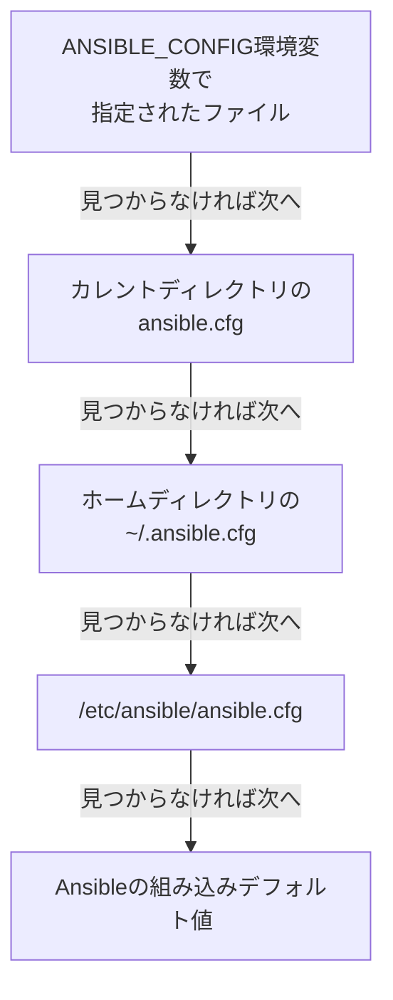

## はじめに

- **この記事で得られること**: [Ansibleとは何かを『上位1%』の視点で理解する](/articles/ansible-guide)で扱った基本概念を土台に、Ansibleの挙動そのものを制御している`ansible.cfg`の仕組みと、複数の設定ソースが重なったときの優先順位を体系的に理解します。
- **対象読者**: Playbookは書けるが、`ansible.cfg`の中身を意識したことがなく、「自分の環境と同僚の環境でAnsibleの挙動が違う」という経験に心当たりがある方を想定しています。
- **読むのにかかる想定時間**: 約12分

この記事は[『上位1%』シリーズ 全記事ガイド](/sitemap)の一部、[Ansibleシリーズ](/sitemap#シリーズ一覧)の13本目です。

## 全体像をつかむ



## 基礎から徹底解説

### ansible.cfgは「4箇所のどこか」から読み込まれる

Ansibleを実行すると、上の図の順序で`ansible.cfg`を探しにいき、**最初に見つかった1つだけ**を読み込みます。複数の場所に置かれていても、マージはされません。実務では、Playbookと同じディレクトリ(カレントディレクトリ)に`ansible.cfg`を置く運用が最も一般的です。プロジェクトごとに設定を切り替えられ、`git`で管理下に置いてチーム全員で共有できるためです。

### ansible.cfgでよく設定される項目

```ini
[defaults]
inventory = ./inventory/hosts.yml
remote_user = deploy
host_key_checking = False
retry_files_enabled = False

[privilege_escalation]
become = True
become_method = sudo
```

- **`inventory`**: `-i`オプションを毎回指定しなくても、既定のインベントリファイルを固定できます。
- **`host_key_checking`**: SSHの既知ホスト確認を無効化します。使い捨ての検証環境では便利ですが、`False`にするとホスト側のなりすましを検知できなくなるため、本番運用では慎重な判断が必要です。
- **`become`/`become_method`**: 既定で特権昇格(`sudo`)を行うかどうかを設定します。

## プロが見ている視点(上位1%の理解)

### 「同じPlaybookなのに結果が違う」の正体は、設定の優先順位

Ansibleの設定値は、**ansible.cfgだけで決まるわけではありません。** 実際には、次の順序で上書きされます(下にあるものほど優先度が高い、つまり最終的に勝ちます)。

1. Ansibleの組み込みデフォルト値
2. `ansible.cfg`
3. 環境変数(例:`ANSIBLE_HOST_KEY_CHECKING=False`)
4. コマンドライン引数(例:`ansible-playbook -i other-inventory.yml`)

**チーム内で「自分の環境だけ挙動が違う」という現象が起きたとき、真っ先に疑うべきなのが、この4段階のどこかで、個人のシェルの環境変数や、個人用のエイリアスに埋め込まれたコマンドライン引数が、チーム共有の`ansible.cfg`を上書きしている、という可能性です。** `ansible.cfg`をgitで共有していても、各自のシェルの`.bashrc`に`export ANSIBLE_*`が書かれていれば、そちらが優先されます。調査する際は、`ansible-config dump --only-changed`コマンドを使うと、デフォルト値からどの項目が、どのソースによって上書きされているかを一覧できます。

## よくある誤解・つまずきポイント

- **誤解1: 「複数の場所にansible.cfgを置けば、設定がマージされる」**
  最初に見つかった1つのファイルだけが読み込まれ、他の場所にあるファイルはマージされずに無視されます。
- **誤解2: 「ansible.cfgに書いた設定が、常に最優先で適用される」**
  環境変数やコマンドライン引数は、`ansible.cfg`よりも優先度が高く、実行時に上書きされます。
- **誤解3: 「host_key_checking = Falseにしておけば、常に安全側の運用である」**
  SSHの既知ホスト確認を無効化する設定であり、なりすましたホストへの接続を検知できなくなるという、明確なトレードオフを伴います。

## 障害・トラブルシューティングの視点

1. **チームメンバーの間でAnsibleの挙動が異なる**: `ansible-config dump --only-changed`を実行し、どの設定が、デフォルト値・`ansible.cfg`・環境変数のどこから来ているかを確認します。
2. **意図したインベントリファイルが使われていない**: `-i`オプションの指定漏れや、`ansible.cfg`の`inventory`設定と、シェルのエイリアスに埋め込まれた`-i`オプションが競合していないかを確認します。
3. **CI環境だけでAnsibleの挙動が変わる**: CIの実行環境に、想定していない`ANSIBLE_*`環境変数が設定されていないかを確認します。

## まとめ

- `ansible.cfg`は、決まった4箇所のどこかから、最初に見つかった1つだけが読み込まれます。
- 設定の優先順位は「組み込みデフォルト値 < ansible.cfg < 環境変数 < コマンドライン引数」の順で、後のものが前のものを上書きします。
- `ansible-config dump --only-changed`で、どの設定がどこから来ているかを確認できます。

**今日から意識すべきこと**
1. プロジェクトの`ansible.cfg`はカレントディレクトリに置き、gitで管理してチーム全員が同じ設定を使えるようにしましょう。
2. 「自分の環境だけ挙動が違う」と感じたら、まず自分のシェルの環境変数を疑いましょう。

## 参考文献

- [Ansible Configuration Settings | Ansible Documentation](https://docs.ansible.com/ansible/latest/reference_appendices/config.html)
