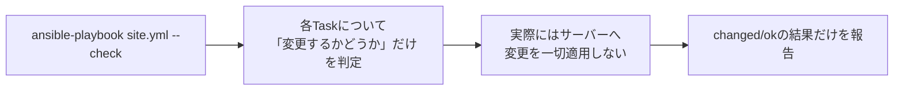

## はじめに

- **この記事で得られること**: [Ansibleとは何かを『上位1%』の視点で理解する](/articles/ansible-guide)で扱った冪等性を土台に、本番環境へ実際の変更を加える前に、**何が変更されるのかを事前に確認する**ための、Check ModeとDiff Modeという2つの機能を体系的に理解します。
- **対象読者**: Playbookを本番環境で実行する前に、内容を目視でレビューするだけで済ませており、「実際にはどのTaskが変更を加えるのか」を事前に確認する手段を知らない方を想定しています。
- **読むのにかかる想定時間**: 約12分

この記事は[『上位1%』シリーズ 全記事ガイド](/sitemap)の一部、[Ansibleシリーズ](/sitemap#シリーズ一覧)の15本目です。

## 全体像をつかむ

## 基礎から徹底解説

### Check Mode:「ドライラン」で変更の予測だけを行う

`ansible-playbook site.yml --check`のように`--check`オプションを付けて実行すると、Ansibleは各Taskについて、**実際には何も変更を加えないまま**、「もし実行したら変更が発生するかどうか」だけを判定して報告します。[Ansibleとは何かを『上位1%』の視点で理解する](/articles/ansible-guide)で扱った`changed`/`ok`の仕組みをそのまま流用し、実際の変更を伴わずに、その判定結果だけを得られる、という機能です。

### Diff Mode:「何が」変わるのかを、具体的な差分で見る

`--diff`オプションを追加すると、ファイルの内容やテンプレートの展開結果について、**変更前と変更後の具体的な差分**を、`diff`コマンドのような形式で表示します。`--check`と`--diff`は組み合わせて使うのが一般的で、`ansible-playbook site.yml --check --diff`と実行すれば、「どのTaskが」「具体的にどう変わるのか」を、実際に変更を加えることなく、事前にレビューできます。

## プロが見ている視点(上位1%の理解)

### すべてのモジュールが、Check Modeに完全対応しているわけではない

**Check Modeの最大の注意点は、すべてのモジュールが正確にシミュレートできるわけではない、という点です。** たとえば、あるコマンドの実行結果に応じて後続のTaskの内容が変わるようなPlaybookでは、`command`モジュールや`shell`モジュールは、Check Mode中は実際にはコマンドを実行しないため、その出力に依存する後続のTaskを正しくシミュレートできません。こうしたモジュールは、Taskごとに`check_mode: false`を指定することで、Check Mode中でも強制的に実行させることができますが、当然、その分だけ実際の変更が発生するリスクも伴います。

**実務では、「Check Modeの結果を鵜呑みにせず、あくまで参考情報として扱う」という姿勢が重要です。** 特に、`command`/`shell`モジュールを多用しているPlaybookでは、Check Modeの結果が実態を正確に反映していない可能性を、常に念頭に置く必要があります。それでもなお、Check Mode + Diff Modeは、「本番環境にいきなり適用する前の、最後のセーフティネット」として、CI/CDパイプラインに組み込む価値があります。

## よくある誤解・つまずきポイント

- **誤解1: 「--checkを付けて実行すれば、どんなPlaybookでも100%正確に予測できる」**
  `command`/`shell`モジュールなど、一部のモジュールはCheck Mode中に実際の処理を行わないため、後続のTaskへの影響を正確にシミュレートできない場合があります。
- **誤解2: 「--checkと--diffは、どちらか片方だけを指定すれば十分である」**
  `--check`は「変更するかどうか」、`--diff`は「具体的に何が変わるか」を示すため、事前レビューの目的では両方を組み合わせるのが実務での定石です。
- **誤解3: 「Check Modeを使えば、本番環境へのテスト実行自体が不要になる」**
  Check Modeはあくまで「変更内容の事前予測」であり、検証環境での実際のテスト実行を代替するものではありません。

## 障害・トラブルシューティングの視点

1. **Check Modeの結果と、実際に実行した結果が食い違う**: Playbookの中で`command`/`shell`モジュールを使っている箇所を洗い出し、それらがCheck Mode中に正しくシミュレートされない可能性を確認します。
2. **Check Mode中にエラーで停止してしまう**: 特定のモジュールがCheck Modeに対応していない可能性があるため、そのTaskに`check_mode: false`を指定するかどうかを検討します。
3. **Diff Modeの差分表示が見づらい**: `-v`(詳細出力)オプションを併用すると、より多くの情報を含む形で差分を確認できます。

## まとめ

- Check Mode(`--check`)は、実際には変更を加えずに、各Taskで変更が発生するかどうかだけを判定します。
- Diff Mode(`--diff`)は、ファイルやテンプレートの変更前後の具体的な差分を表示します。
- `command`/`shell`モジュールなど、一部のモジュールはCheck Modeを正確にシミュレートできない場合があるため、結果を鵜呑みにせず参考情報として扱う必要があります。

**今日から意識すべきこと**
1. 本番環境へPlaybookを適用する前に、`--check --diff`で事前レビューする習慣をつけましょう。
2. `command`/`shell`モジュールを多用しているPlaybookでは、Check Modeの結果を過信しないようにしましょう。

## 参考文献

- [Check Mode ("Dry Run") | Ansible Documentation](https://docs.ansible.com/ansible/latest/playbook_guide/playbooks_checkmode.html)
