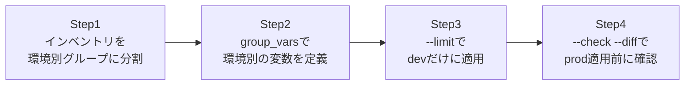

## はじめに

- **この記事で得られること**: [Ansibleのroles・Handlers・テンプレートで実務レベルの構成管理を体験する『上位1%』のハンズオン](/articles/ansible-roles-handson-guide)で作成したroleを、dev/staging/prodという3つの環境それぞれに、異なる設定値で安全に適用します。`group_vars`による環境別の変数管理と、`--limit`による対象ホストの絞り込みという、実務のAnsible運用で毎日のように使う2つの仕組みを体験します。
- **対象読者**: 1つのインベントリファイルにすべてのホストを書いており、環境ごとに設定を変える方法や、対象を間違えて実行してしまうリスクへの対策を考えたことがない方を想定しています。
- **読むのにかかる想定時間**: 約20分(実際に構築しながら進める場合は40分程度を見込んでください)

この記事は[『上位1%』シリーズ 全記事ガイド](/sitemap)の一部、[Ansibleシリーズ](/sitemap#シリーズ一覧)の6本目です。

## 全体像をつかむ

このハンズオンで行うことは、次の4ステップです。



## ハンズオン手順

### Step 1: インベントリを環境別グループに分割する

`inventory.ini`を、`dev`・`staging`・`prod`という3つのグループに分けます。

```ini
[dev]
dev-web1 ansible_host=10.0.1.10

[staging]
staging-web1 ansible_host=10.0.2.10

[prod]
prod-web1 ansible_host=10.0.3.10
prod-web2 ansible_host=10.0.3.11
```

**この時点で、3つのグループはインベントリ上で明確に分離されています。** しかし、これだけではまだ「Playbookを実行する対象を間違える」という事故を防げません。防ぐための仕組みは、この後のステップで作ります。

### Step 2: group_varsで環境別の変数を定義する

`group_vars/`ディレクトリ配下に、グループ名と同名のファイルを作成し、環境ごとに異なる設定値を定義します。

```yaml
# group_vars/dev.yml
app_debug_mode: true
app_worker_count: 1

# group_vars/prod.yml
app_debug_mode: false
app_worker_count: 4
```

**Ansibleは、インベントリのグループ名と`group_vars/`配下のファイル名が一致していれば、明示的に読み込む指定をしなくても、自動的にこの変数を適用します。** Playbook自体は環境ごとに書き分ける必要がなく、常に同じ`app_debug_mode`という変数名を参照するだけで済みます。

### Step 3: --limitでdevだけに適用する

Playbookを、`--limit`オプションで`dev`グループだけに絞り込んで実行します。

```bash
ansible-playbook -i inventory.ini site.yml --limit dev
```

**`--limit`を指定しなかった場合、Playbookの`hosts:`に書かれているグループ全体(たとえば`all`)が対象になります。** 開発中の検証では、常に`--limit`で対象を明示的に絞り込む習慣をつけることが、事故防止の第一歩です。

### Step 4: --check --diffでprod適用前に確認する

`prod`グループに対して、実際には変更を加えない「ドライラン」モードで、何が変わる予定かを事前に確認します。

```bash
ansible-playbook -i inventory.ini site.yml --limit prod --check --diff
```

**`--check`を付けると、Playbookは実際にはどのホストにも変更を加えません。** `--diff`を組み合わせることで、ファイルの内容がどう変わる予定かという差分まで、実行前に目視で確認できます。この出力を見て問題がないことを確認してから、初めて`--check`を外した本番実行に進みます。

## プロが見ている視点(上位1%の理解)

### 「prodに間違えて適用してしまう」事故は、仕組みで防ぐもの

Ansibleの実務運用で最も恐れられている事故は、**開発環境のつもりで実行したPlaybookが、実は本番環境全体に適用されてしまっていた**というケースです。これは「気をつける」という精神論では根本的に防げません。実務では、`--limit`を必須にするラッパースクリプトを用意したり、`prod`グループへの適用には`--check --diff`の出力を人間が確認するまで実行できないCI/CDパイプラインを組んだりすることで、**うっかりミスをしても最後の砦が止めてくれる仕組み**を作ります。これは[S3バケットで静的Webサイトを公開する『上位1%』のハンズオン](/articles/aws-s3-static-website-handson-guide)で扱った、パブリックアクセスブロックという多層防御の考え方と、発想としてまったく同じものです。

### group_varsの優先順位というニッチだが重要な仕様

`group_vars/`には、実は複数の階層が存在します。`group_vars/all.yml`(全ホスト共通)、`group_vars/prod.yml`(特定グループ)、そして`host_vars/prod-web1.yml`(特定ホスト単体)という3つが同時に存在する場合、より具体的な範囲(ホスト単体)の値が、より広い範囲(全ホスト共通)の値を上書きします。この優先順位を正確に把握していないと、「なぜこのホストだけ設定が違うのか」という調査に無駄な時間を使うことになります。

## よくある誤解・つまずきポイント

- **誤解1: 「group_varsのファイルは、Playbook側で明示的にincludeしないと読み込まれない」**
  インベントリのグループ名とファイル名が一致していれば、Ansibleが自動的に読み込みます。明示的なincludeは不要です。
- **誤解2: 「--checkを付けても、実際には何かが変わってしまうことがある」**
  `--check`モードは、多くのモジュールで正確に「変更しない」動作をしますが、一部のモジュール(シェルコマンドを直接実行するものなど)は、`--check`モードに未対応で、実際に実行されてしまうことがあります。
- **誤解3: 「--limitを指定すれば、group_varsの適用も自動的にそのグループだけに絞られる」**
  `--limit`は実行対象のホストを絞るだけです。変数の読み込みルール自体は変わりません。

## 障害・トラブルシューティングの視点

1. **`group_vars/prod.yml`の値が反映されない**: ファイル名がインベントリのグループ名と正確に一致しているか(大文字小文字を含む)確認してください。
2. **`--limit`で絞ったはずなのに、想定と違うホストが対象になる**: インベントリ内でそのホストが複数のグループに属していないか確認してください。
3. **`--check`モードなのに実際に変更が加わってしまった**: 使用しているモジュールが`--check`モードに対応しているか、モジュールのドキュメントで確認してください。

## まとめ

- インベントリを環境別グループに分け、`group_vars/`で環境ごとの変数を管理します。
- `--limit`で対象ホストを明示的に絞り込むことが、誤爆を防ぐ第一歩です。
- `--check --diff`で、本番適用前にドライランと差分確認を必ず行います。
- group_varsにはall/グループ/ホスト単体という優先順位があり、より具体的な範囲が優先されます。

**今日から意識すべきこと**
1. 本番環境への適用は、`--check --diff`の出力を人間が確認する工程を挟んでから行いましょう。
2. `--limit`を省略した場合に何が対象になるかを、実行前に必ず意識しましょう。

## 参考文献

- [Working with inventory | Ansible Documentation](https://docs.ansible.com/ansible/latest/inventory_guide/intro_inventory.html)
- [Check mode ("Dry Run") | Ansible Documentation](https://docs.ansible.com/ansible/latest/playbook_guide/playbooks_checkmode.html)
