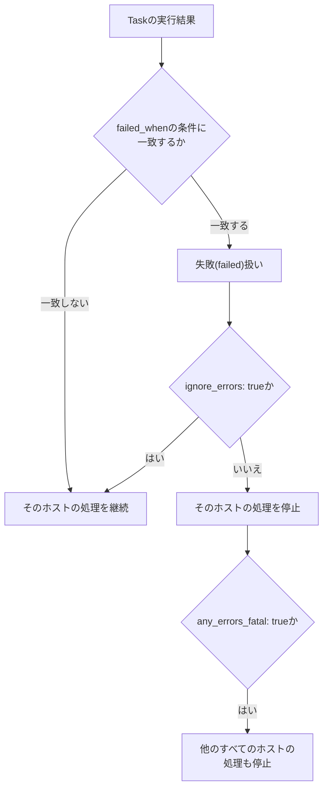

## はじめに

- **この記事で得られること**: [Ansibleのblock/rescue/alwaysで構成変更失敗時のロールバックを設計するハンズオン](/articles/ansible-error-handling-handson-guide)で扱った、Task群単位の例外処理を土台に、**個々のTask単位**でエラーの扱いをより細かく制御する、`ignore_errors`・`any_errors_fatal`・`failed_when`という3つの仕組みを体系的に理解します。
- **対象読者**: block/rescueは使ったことがあるが、`ignore_errors`と`failed_when`の違いを説明できない、あるいは複数ホストにまたがるPlaybookで、1台の失敗を全体に波及させる方法を知らない方を想定しています。
- **読むのにかかる想定時間**: 約13分

この記事は[『上位1%』シリーズ 全記事ガイド](/sitemap)の一部、[Ansibleシリーズ](/sitemap#シリーズ一覧)の17本目です。

## 全体像をつかむ



## 基礎から徹底解説

### ignore_errors:「このTaskの失敗を、このホストの処理では無視する」

`ignore_errors: true`をTaskに付けると、そのTaskが失敗しても、**そのホストにおける後続のTaskの実行は継続されます。** ただし、Playbook全体としては、そのホストで1つでも失敗したTaskがあった、という記録は残ります。「あれば削除する、なければエラーにせず先に進む」といった、失敗しても実害のない処理に使うのが典型例です。

### failed_when:「何をもって失敗とみなすか」を自分で定義する

Ansibleの標準の判定では、モジュールが返す終了コードなどに基づいて`ok`/`changed`/`failed`が決まりますが、`failed_when`を使うと、**その判定ロジックそのものを上書き**できます。

```yaml
- name: ディスク使用率を確認する
  ansible.builtin.command: df -h /
  register: disk_result
  failed_when: "'100%' in disk_result.stdout"
```

このTaskは、`command`モジュール自体は正常終了(終了コード0)していても、出力に`100%`という文字列が含まれていれば、Ansible上は「失敗」として扱われます。

## プロが見ている視点(上位1%の理解)

### any_errors_fatal:「1台の失敗」を、全体の緊急停止スイッチにする

[Ansibleでdev/staging/prodを1つのPlaybookで安全に使い分けるハンズオン](/articles/ansible-environments-handson-guide)で扱ったような、複数台へ同時にデプロイするPlaybookを考えます。**既定のAnsibleの挙動では、あるホストでTaskが失敗しても、それは「そのホストの処理が止まる」だけであり、他のホストへの処理は、失敗に関係なく続行されます。** これは一見合理的に見えますが、たとえば「10台中1台へのデプロイが失敗した」という状況で、残り9台へのデプロイをそのまま進めてしまうと、**バージョンが不揃いな状態のまま、本番トラフィックを受け続けてしまう**、という危険なシナリオになり得ます。

**`any_errors_fatal: true`をPlayに設定すると、この挙動が変わります。** いずれか1台のホストでTaskが失敗した瞬間に、**まだ処理が完了していない、他のすべてのホストの処理も、即座に停止**されます。「全台成功するか、全体を止めるか」という、all-or-nothingの挙動が必要な、ロードバランサー配下の一斉デプロイのようなシナリオでは、`any_errors_fatal`を設定しておくことが、実務上の必須事項だと理解しておく必要があります。

## よくある誤解・つまずきポイント

- **誤解1: 「ignore_errors: trueを付ければ、そのTaskは常に成功したとみなされる」**
  そのホストでの後続処理は継続されますが、Playbook全体としては「そのホストで失敗があった」という記録は残り、最終的な実行結果のサマリーにも反映されます。
- **誤解2: 「any_errors_fatalを設定しなくても、1台の失敗は自動的に他のホストへ波及する」**
  Ansibleの既定の挙動は逆で、あるホストの失敗は、そのホストの処理だけを止め、他のホストへは影響しません。全体を止めたい場合は、明示的に`any_errors_fatal: true`を設定する必要があります。
- **誤解3: 「failed_whenは、Taskの終了コードを直接書き換えるものである」**
  `failed_when`は、Ansible上での「失敗」の判定ロジックを上書きするものであり、実際のコマンドの終了コードそのものを変更するわけではありません。

## 障害・トラブルシューティングの視点

1. **一部のホストでTaskが失敗しても、Playbook全体は成功したように見える**: そのTaskに`ignore_errors: true`が付いていないか、最終的な実行結果のサマリー(`PLAY RECAP`)を確認します。
2. **1台の失敗で、デプロイ全体を止めたいのに止まらない**: 対象のPlayに`any_errors_fatal: true`が設定されているかを確認します。
3. **コマンド自体は正常終了しているのに、Ansible上では失敗と判定される**: そのTaskに`failed_when`が設定されており、意図した条件と実際の出力が一致しているかを確認します。

## まとめ

- `ignore_errors: true`は、Task単位での失敗を、そのホストの後続処理では無視しますが、Playbook全体の記録には残ります。
- `failed_when`は、Ansible上での「失敗」の判定ロジックそのものを、自分で定義し直す仕組みです。
- `any_errors_fatal: true`は、1台の失敗を、他のすべてのホストの処理を即座に停止させる、緊急停止スイッチとして機能します。

**今日から意識すべきこと**
1. 複数台への一斉デプロイを行うPlayでは、`any_errors_fatal`を設定すべきかどうかを、必ず検討しましょう。
2. `ignore_errors`を使う際は、「本当に無視してよい失敗か」を、都度明確に判断しましょう。

## 参考文献

- [Error Handling In Playbooks | Ansible Documentation](https://docs.ansible.com/ansible/latest/playbook_guide/playbooks_error_handling.html)
