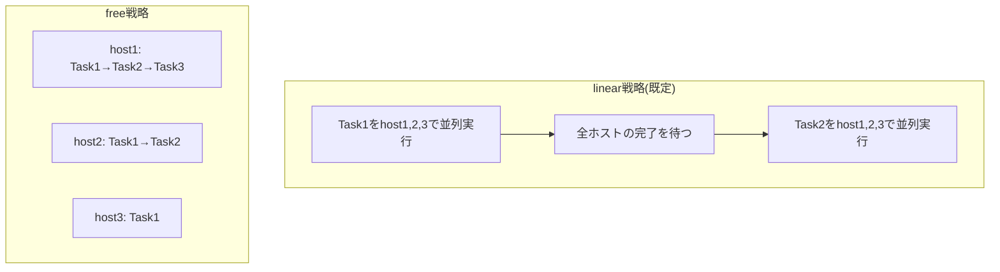

## はじめに

- **この記事で得られること**: [Ansibleのfacts収集をキャッシュして大規模インベントリを高速化するハンズオン](/articles/ansible-facts-caching-handson-guide)で扱った実行時間の最適化に続いて、Ansibleがそもそも**複数のホストへ、どういう順序・並列度で処理を実行しているのか**という、実行戦略(strategy)そのものの仕組みを体系的に理解します。
- **対象読者**: `forks`の値を変更したことはあるが、Ansibleの既定の実行戦略である`linear`が具体的にどう動いているのかを説明できない方を想定しています。
- **読むのにかかる想定時間**: 約13分

この記事は[『上位1%』シリーズ 全記事ガイド](/sitemap)の一部、[Ansibleシリーズ](/sitemap#シリーズ一覧)の16本目です。

## 全体像をつかむ

## 基礎から徹底解説

### linear戦略:「Task単位で足並みを揃える」既定の動作

Ansibleの既定の実行戦略は**linear**です。この戦略では、**あるTaskを、対象ホスト全体で実行し終えるまで、次のTaskには進みません。** Task1をhost1・host2・host3の3台で並列実行し、3台すべてが完了してから、ようやくTask2に進む、という流れを、Playbookに書かれたTaskの数だけ繰り返します。

### forks:「同時に何台へ処理を送るか」という並列度

`forks`は、1つのTaskを、**同時に何台のホストへ向けて実行するか**という並列度の設定です。既定値は5であり、対象ホストが5台を超える場合、5台ずつ処理してから次の5台、という形で処理されます。`ansible.cfg`の`forks`設定や、`-f`オプションで変更できます。

## プロが見ている視点(上位1%の理解)

### linear戦略の弱点:「1台の遅いホスト」が全体を引きずる

**linear戦略の構造的な弱点は、あるTaskについて、最も遅い1台のホストの完了を、他のすべてのホストが待たされる、という点です。** たとえば、100台のホストのうち99台が1秒で終わるTaskを、1台だけがネットワークの問題で30秒かかったとすると、そのTaskの完了は、全体で30秒かかったことになります。この待ち時間が、Playbook内のTaskの数だけ積み重なります。

**この弱点を解消するのが、`free`戦略です。** `free`戦略では、各ホストが、他のホストの進捗を待たずに、**自分のペースで、Playbook内のすべてのTaskを独立して進めます。** 先ほどの例であれば、99台のホストは、遅い1台を待つことなく、次々と後続のTaskへ進んでいきます。ただし、**free戦略には、「あるホストが、他のホストより先に、後続のTaskへ進んでしまう」という副作用があります。** 「全ホストがTask3を完了してから、代表の1台だけでTask4(たとえばロードバランサーへの登録)を実行したい」といった、**ホスト間の同期が必要な処理**を含むPlaybookでは、free戦略を使うと、意図しないタイミングでTask4が実行されてしまう危険があります。

## よくある誤解・つまずきポイント

- **誤解1: 「forksの値を上げれば上げるほど、常にPlaybookは速くなる」**
  制御ノード側のCPU・メモリ・ネットワーク帯域や、対象ホスト側の同時接続数の上限によって、上げすぎるとかえって不安定になることがあります。
- **誤解2: 「free戦略に変更すれば、あらゆるPlaybookが安全に高速化される」**
  ホスト間の実行順序に依存する処理(全ホストの完了を待ってから特定のTaskを実行する、など)を含むPlaybookでは、free戦略が意図しない実行順序を引き起こす可能性があります。
- **誤解3: 「linear戦略は、Task内でもホストを1台ずつ順番に処理している」**
  linear戦略は、Task単位では並列(forksの設定に従う)であり、「次のTaskに進むタイミング」だけを全ホストで足並みを揃えています。

## 障害・トラブルシューティングの視点

1. **ホスト台数が増えるにつれて、Playbookの実行時間が想定以上に伸びる**: `forks`の値が、対象ホスト数に対して低すぎないかを確認します。あわせて、特定のホストだけ極端に遅いTaskがないかを、`-v`オプション付きで確認します。
2. **free戦略に変更したら、想定と異なる順序で処理が実行された**: Playbook内に、他のホストの完了を前提としたTask(ロードバランサーへの登録、代表ホストでの通知など)が含まれていないかを確認します。
3. **並列度を上げたら、SSH接続エラーが増えた**: 対象ホスト側のSSHデーモンの同時接続数上限(`MaxStartups`など)に達していないかを確認します。

## まとめ

- Ansibleの既定の実行戦略はlinearであり、Task単位で全ホストの完了を待ってから、次のTaskへ進みます。
- forksは、1つのTaskを同時に何台のホストへ実行するかという並列度の設定です。
- free戦略では、各ホストが他のホストを待たずに、自分のペースで全Taskを進められますが、ホスト間の同期が必要な処理には向きません。

**今日から意識すべきこと**
1. 台数増加でPlaybookが遅くなってきたら、まずforksの値と、特定ホストのボトルネックを確認しましょう。
2. free戦略への変更を検討する際は、Playbook内にホスト間の同期が必要なTaskがないかを、必ず確認しましょう。

## 参考文献

- [Playbook Execution Strategies | Ansible Documentation](https://docs.ansible.com/ansible/latest/playbook_guide/playbooks_strategies.html)
