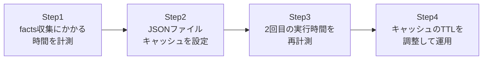

## はじめに

- **この記事で得られること**: Playbookを実行するたびに、対象ホストの数だけ繰り返されている**facts収集**(対象ホストのOS・IPアドレス・ディスク容量などの情報を集める処理)のコストを、ファクトキャッシュによって削減します。対象ホストが数台のうちは気にならないこの処理が、数百台規模になったときにどれほどのコストになるかを体感し、キャッシュによる高速化を体験します。
- **対象読者**: Ansibleを数台のサーバーに対してしか使ったことがなく、`gather_facts`が何をしているか、なぜ実行のたびに時間がかかるのかを深く考えたことがない方を想定しています。
- **読むのにかかる想定時間**: 約20分(実際に構築しながら進める場合は35分程度を見込んでください)

この記事は[『上位1%』シリーズ 全記事ガイド](/sitemap)の一部、[Ansibleシリーズ](/sitemap#シリーズ一覧)の9本目です。

## 前提知識

- [AnsibleでAWSの動的インベントリを使い、静的なIPリストから解放される『上位1%』のハンズオン](/articles/ansible-aws-dynamic-inventory-handson-guide): 対象ホストの台数がオートスケーリングなどで増減する環境では、facts収集のコストもそれに比例して増減します。

## 全体像をつかむ

このハンズオンで行うことは、次の4ステップです。



## ハンズオン手順

### Step 1: facts収集にかかる時間を計測する

キャッシュなしの状態で、facts収集だけを行うPlaybookの実行時間を計測します。

```yaml
# facts_only.yml
- hosts: all
  gather_facts: true
  tasks:
    - name: Do nothing, just gather facts
      debug:
        msg: "Facts gathered"
```

```bash
time ansible-playbook -i inventory.ini facts_only.yml
```

**対象ホストが数台であれば数秒程度ですが、この時間は対象ホストの台数にほぼ比例して増えていきます。** 何百台ものホストに対して、Playbookを実行するたびにこのコストが毎回発生している、という事実がこのハンズオンの出発点です。

### Step 2: JSONファイルキャッシュを設定する

`ansible.cfg`に、factsキャッシュの設定を追加します。

```ini
[defaults]
gathering = smart
fact_caching = jsonfile
fact_caching_connection = /tmp/ansible_facts_cache
fact_caching_timeout = 3600
```

**`gathering = smart`にすることで、キャッシュが有効かつ新しい場合には、facts収集そのものをスキップするようになります。** `fact_caching_timeout`は、キャッシュを有効とみなす秒数(この場合は3600秒=1時間)です。

### Step 3: 2回目の実行時間を再計測する

同じPlaybookを再度実行し、実行時間を比較します。

```bash
time ansible-playbook -i inventory.ini facts_only.yml
```

**1回目よりも大幅に短縮されているはずです。** `/tmp/ansible_facts_cache`ディレクトリの中を確認すると、ホストごとにfactsの内容がJSONファイルとして保存されていることが分かります。

### Step 4: キャッシュのTTLを調整して運用する

キャッシュの有効期限が切れた状態で、再度実行してみます。

```bash
# キャッシュファイルのタイムスタンプを、有効期限切れの状態に見せかける
touch -d "2 hours ago" /tmp/ansible_facts_cache/*

time ansible-playbook -i inventory.ini facts_only.yml
```

**`fact_caching_timeout`で指定した時間を過ぎているため、再びfacts収集が実行され、キャッシュも新しい内容に更新されます。** このTTLの値を、対象ホストの構成がどれだけ頻繁に変わるかに応じて、適切に調整することが実務上のポイントです。

## プロが見ている視点(上位1%の理解)

### gather_factsが裏側で行っている処理の正体

`gather_facts`は、対象ホストへSSH接続したうえで、Pythonスクリプト(`setup`モジュール)を実際に実行し、OSバージョン・ネットワークインターフェイス・ディスク容量・環境変数など、数百項目にも及ぶ情報を収集しています。**この処理自体が、SSH接続の確立とPythonスクリプトの実行という、決して軽くはないコストを持つ**ことを理解していないと、「facts収集くらいすぐ終わるはず」という誤解につながります。台数が増えるほど、このコストが積み重なり、Playbook全体の実行時間に占めるfacts収集の割合が無視できなくなっていきます。

### キャッシュが「古くなる」リスクとの向き合い方

ファクトキャッシュには、当然「キャッシュされた情報が、対象ホストの実際の最新状態と異なってしまう」というリスクが伴います。たとえば、キャッシュ期間中にホストのディスクを増設した場合、キャッシュされた古いディスク情報を参照するタスクは、誤った判断をする可能性があります。**このリスクへの実務上の答えは、「facts収集のたびにSSH接続する重いコスト」と「キャッシュが古くなるリスク」を天秤にかけ、対象システムの構成変更の頻度に応じてTTLを調整する**ことです。頻繁に構成が変わる環境ではTTLを短く、ほとんど変わらない環境ではTTLを長く設定するのが、実務でのバランスの取り方です。

## よくある誤解・つまずきポイント

- **誤解1: 「facts収集はほぼ一瞬で終わるので、キャッシュする意味がない」**
  対象ホストが数百台規模になると、facts収集の累積コストは無視できないものになります。
- **誤解2: 「fact_caching_timeoutを設定すれば、キャッシュは永久に使われ続ける」**
  設定した秒数を過ぎると、自動的にキャッシュが無効化され、facts収集が再度実行されます。
- **誤解3: 「キャッシュを有効にすると、常に古い情報だけが使われるようになる」**
  TTLの範囲内であれば古い情報を使いますが、TTLを過ぎれば自動的に最新の情報へ更新されます。

## 障害・トラブルシューティングの視点

1. **キャッシュを設定したのに実行時間が短縮されない**: `ansible.cfg`の`gathering = smart`が正しく設定されているか、`fact_caching_connection`のパスに書き込み権限があるか確認してください。
2. **古い情報を参照してタスクが誤動作する**: `fact_caching_timeout`の値が長すぎないか、対象システムの構成変更の頻度と照らし合わせて見直してください。
3. **特定のホストだけ最新のfactsが必要になった**: そのタスクにだけ`gather_facts: true`を明示的に指定するか、`meta: clear_facts`でキャッシュをクリアできます。

## まとめ

- `gather_facts`は、SSH接続の確立とPythonスクリプトの実行という、決して軽くないコストを持つ処理です。
- `fact_caching = jsonfile`とTTLの設定で、facts収集のコストを削減できます。
- キャッシュには「古くなる」リスクが伴うため、構成変更の頻度に応じてTTLを調整する必要があります。
- 対象ホストの台数が多いほど、facts収集の累積コストと、キャッシュによる削減効果は大きくなります。

**今日から意識すべきこと**
1. 対象ホストが数十台を超えるPlaybookでは、ファクトキャッシュの導入を検討しましょう。
2. TTLを設定する際は、対象システムの構成変更の頻度を必ず考慮しましょう。

## 参考文献

- [Caching facts | Ansible Documentation](https://docs.ansible.com/ansible/latest/playbook_guide/playbooks_vars_facts.html#caching-facts)
- [ansible.cfg reference | Ansible Documentation](https://docs.ansible.com/ansible/latest/reference_appendices/config.html)
