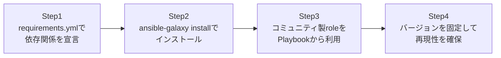

## はじめに

- **この記事で得られること**: [Ansibleのroles・Handlers・テンプレートで実務レベルの構成管理を体験する『上位1%』のハンズオン](/articles/ansible-roles-handson-guide)では自分でroleを作成しましたが、実務では既に世界中の技術者が作り込み、検証してきたroleやCollectionを再利用することの方がはるかに多いです。`requirements.yml`を使って、Ansible Galaxy上のCollectionとroleをバージョン固定でインストールし、実際にNginxのセットアップに使う流れを体験します。
- **対象読者**: Playbookをすべて自分で最初から書くのが当たり前だと思っており、Ansible Galaxyというエコシステムの存在を意識したことがない方を想定しています。
- **読むのにかかる想定時間**: 約20分(実際に構築しながら進める場合は35分程度を見込んでください)

この記事は[『上位1%』シリーズ 全記事ガイド](/sitemap)の一部、[Ansibleシリーズ](/sitemap#シリーズ一覧)の7本目です。

## 全体像をつかむ

このハンズオンで行うことは、次の4ステップです。



## ハンズオン手順

### Step 1: requirements.ymlで依存関係を宣言する

利用したいCollectionとroleを、`requirements.yml`というファイルに宣言します。

```yaml
collections:
  - name: community.general
    version: "8.0.0"

roles:
  - name: geerlingguy.nginx
    version: "3.1.4"
```

**このファイルは、プログラミング言語における`package.json`や`requirements.txt`に相当するものです。** 「何を」「どのバージョンで」使うかを、コードとして明示的に宣言しています。

### Step 2: ansible-galaxy installでインストールする

`requirements.yml`の内容に従って、実際にCollectionとroleをインストールします。

```bash
ansible-galaxy install -r requirements.yml
ansible-galaxy collection install -r requirements.yml
```

**インストールされたroleやCollectionは、ローカルの`~/.ansible/roles/`や`~/.ansible/collections/`配下に展開されます。** 自分のPlaybookのディレクトリを汚すことなく、既存のコードベースとは独立した場所に配置される点が重要です。

### Step 3: コミュニティ製roleをPlaybookから利用する

自作のroleと同じ要領で、Playbookの`roles:`にインストール済みのroleを指定します。

```yaml
- hosts: web
  become: true
  roles:
    - role: geerlingguy.nginx
      vars:
        nginx_vhosts:
          - listen: "80"
            server_name: "example.com"
            root: "/var/www/example.com"
```

**このroleは、世界中の多数のユーザーによって長期間使われ、様々なOS・様々なエッジケースで検証されてきています。** 自分で一から`nginx.conf`のテンプレートを書き起こすよりも、既知の不具合が少なく、設定できる変数の幅も広いことがほとんどです。

### Step 4: バージョンを固定して再現性を確保する

`requirements.yml`にバージョンを明示的に固定した状態を、そのままGitでコミットします。

```bash
git add requirements.yml
git commit -m "Pin geerlingguy.nginx to 3.1.4 and community.general to 8.0.0"
```

**バージョンを固定せずに`ansible-galaxy install`を実行すると、実行するたびに異なるバージョンがインストールされる可能性があります。** ある日突然、role側の仕様変更によってPlaybookの挙動が変わってしまうという事故を防ぐため、バージョン固定は実務上ほぼ必須の運用です。

## プロが見ている視点(上位1%の理解)

### 「ゼロから全部自作する」がむしろ避けるべき選択である理由

Ansibleに限らず、インフラの構成管理においては、「車輪の再発明をしない」という原則が非常に重要です。Nginxのセットアップ一つを取っても、SSL証明書の自動更新、複数バーチャルホストの管理、OSごとのパッケージ名の違いなど、考慮すべき点は無数にあります。**Ansible Galaxy上の実績あるroleは、こうした無数のエッジケースを、既に多くのユーザーのフィードバックを受けて解消済み**であることが多く、自作するよりも品質・保守性の両面で優れていることが少なくありません。上位1%のエンジニアほど、「これは既に誰かが作り込んで検証しているはずだ」とまず疑い、車輪の再発明を避ける判断を早い段階で行います。

### CollectionとRoleは別の概念である

**Collection**は、モジュール・プラグイン・roleなどをまとめて配布するためのパッケージ形式であり、**Role**は、特定のタスク(この場合はNginxのセットアップ)をまとめた、より狭い単位の再利用可能な部品です。1つのCollectionの中に複数のRoleが含まれることもあれば、`geerlingguy.nginx`のように、Collectionとは独立してGalaxy上に公開されているRoleも存在します。この2つの違いを正確に理解していないと、`requirements.yml`の`collections:`と`roles:`のどちらに何を書けばよいのか、実務で混乱する原因になります。

## よくある誤解・つまずきポイント

- **誤解1: 「Ansible Galaxyのroleは、公式にAnsible社が保証した品質のものしかない」**
  Ansible Galaxyは誰でも公開できるオープンなエコシステムです。品質はrole・Collectionごとにまちまちであり、ダウンロード数やGitHubのスター数、更新頻度を確認して選定する必要があります。
- **誤解2: 「requirements.ymlにバージョンを書かなくても、常に同じバージョンがインストールされる」**
  バージョンを指定しない場合、実行時点での最新バージョンがインストールされるため、実行するたびに結果が変わる可能性があります。
- **誤解3: 「CollectionをインストールすればRoleも自動的にすべて使えるようになる」**
  CollectionとRoleは別々にインストールする必要がある場合があります。`requirements.yml`の両方のセクションを確認してください。

## 障害・トラブルシューティングの視点

1. **`ansible-galaxy install`が失敗する**: インターネット接続、または社内プロキシ経由でGalaxyサーバーへ到達できているかを確認してください。
2. **Playbook実行時に「role not found」のエラーになる**: `ansible-galaxy install -r requirements.yml`を事前に実行し忘れていないか確認してください。
3. **ある日突然Playbookの挙動が変わった**: `requirements.yml`にバージョンを固定していない場合、意図せず新しいバージョンのroleがインストールされた可能性があります。

## まとめ

- `requirements.yml`で、利用するCollectionとroleをバージョン付きで宣言します。
- `ansible-galaxy install`でインストールし、自作のroleと同じ要領でPlaybookから利用できます。
- 実績あるコミュニティ製roleは、無数のエッジケースを既に解消していることが多く、自作より優れていることが少なくありません。
- バージョンを固定してGitにコミットすることで、実行結果の再現性を確保します。

**今日から意識すべきこと**
1. 新しいミドルウェアのセットアップが必要になったら、まずAnsible Galaxyに既存のroleがないか検索しましょう。
2. `requirements.yml`のバージョンは必ず固定し、更新するときは意図的にバージョンを上げましょう。

## 参考文献

- [Ansible Galaxy](https://galaxy.ansible.com/)
- [Ansible collections | Ansible Documentation](https://docs.ansible.com/ansible/latest/collections_guide/index.html)
