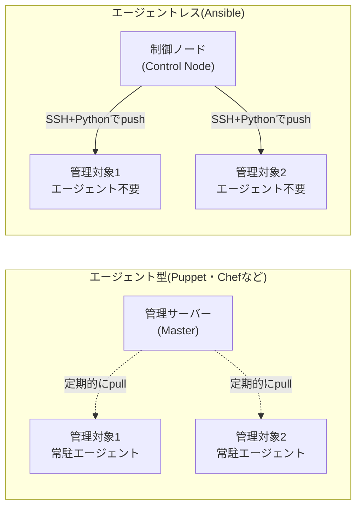

## はじめに

- **この記事で得られること**: 「Ansibleという名前は聞いたことがあるが、何が便利なのか実感が薄い」という状態から、**Ansibleがどういう仕組みで動いているのか**、そして**手作業のシェルスクリプトと比べて何が違うのか**を体系的に理解します。
- **対象読者**: サーバー構築・設定を毎回手作業やシェルスクリプトで行っており、Ansibleという名前は聞いたことがあるものの、実際に何をするツールなのかピンと来ていない方を想定しています。
- **読むのにかかる想定時間**: 約20分

この記事は[『上位1%』シリーズ 全記事ガイド](/sitemap)の一部、Ansibleをテーマにした新シリーズの1本目です。実際に手を動かして試してみたい場合は、続けて[Ansibleで複数サーバーへの設定投入を自動化する『上位1%』のハンズオン](/articles/ansible-handson-guide)へ進んでください。

## 前提知識

- **SSH接続の基本**: [ハンズオン準備マニュアル:Ubuntuサーバーの初期セットアップ](/articles/ubuntu-server-setup-guide)で扱った、`ssh <ユーザー名>@<IPアドレス>`でリモートのLinuxサーバーへ接続する操作です。Ansibleは、このSSH接続を土台にして動作します。
- **YAML形式の基本**: Ansibleの設定は**YAML**という、インデント(字下げ)で構造を表現するデータ形式で記述します。`key: value`という基本の書き方と、`- `(ハイフン+半角スペース)で始まる行がリストの要素を表す、という2点だけ押さえておけば十分です。

## 全体像をつかむ

### 「構成管理ツール」がそもそも解決したい課題

サーバーが1台だけなら、必要なパッケージをインストールし、設定ファイルを編集し、サービスを再起動する、という一連の作業を手作業で行っても大きな問題にはなりません。しかし、**同じ設定を10台・100台のサーバーへ一貫して適用する**必要が出てくると、手作業には限界が来ます。手順書通りに作業しても、人為的なミスや手順の抜け漏れが発生しますし、「このサーバーだけ手順書のバージョンが古いまま適用された」といった<strong>設定のばらつき(構成ドリフト)</strong>も起きやすくなります。

**構成管理ツール**は、この「大量のサーバーへ、一貫した設定を、再現可能な形で適用する」という課題を解決するためのソフトウェアです。Ansibleは、この構成管理ツールの中でも代表的な1つです。

### エージェント型とエージェントレス、2つのアーキテクチャ

構成管理ツールには、大きく2つのアーキテクチャがあります。



- **エージェント型(Puppet・Chefなど)**: 管理対象の各サーバーに、常時稼働する専用の<strong>エージェント(常駐プログラム)</strong>をあらかじめインストールしておく方式です。各エージェントが、管理サーバー(Master)へ定期的に自発的に問い合わせ(pull)、設定の変更を取得して自分自身に適用します。
- **エージェントレス(Ansible)**: 管理対象のサーバーには、エージェントのインストールが不要です。代わりに、作業を実行する<strong>制御ノード(Control Node)</strong>から、管理対象へ**SSHで接続し**、そのつど設定を送り込んで(push)実行します。管理対象側に必要なのは、SSHサーバーと、Ansibleが処理を実行するために使う**Python**だけです。

**Ansibleがエージェントレスを選んだ最大の利点は、導入コストの低さ**です。数百台のサーバーへ専用エージェントを事前に配布・インストール・維持管理する手間がなく、SSHで接続できる状態のサーバーであれば、その場から構成管理を始められます。一方で、エージェント型は管理対象側が自発的に変更を取りに行くため、大規模環境での同時実行性やネットワーク越しの到達性(制御ノードから管理対象への逆方向の接続が不要)に強みがあります。

## 基礎から徹底解説

### Ansibleを構成する5つの基本概念

| 用語 | 意味 |
|---|---|
| **Inventory(インベントリ)** | 管理対象のサーバー一覧を定義するファイルです。IPアドレスやホスト名を、グループ(役割)ごとに整理して記述します。 |
| **Playbook(プレイブック)** | 「どのサーバーに、何を、どういう状態にしたいか」を**YAML形式で宣言的に記述**したファイルです。Ansibleの作業内容の本体にあたります。 |
| **Task(タスク)** | Playbookの中の、1つ1つの作業単位です。「このパッケージをインストールする」「この設定ファイルをこの内容にする」といった単位で記述します。 |
| **Module(モジュール)** | Taskが実際に呼び出す、処理の実体です。`apt`(パッケージ管理)、`copy`(ファイル配置)、`service`(サービス管理)など、目的別に数百種類が標準で用意されています。 |
| **Role(ロール)** | 複数のTaskやファイルを、「Webサーバーの設定」「DBサーバーの設定」といった役割単位でまとめ、再利用可能にした単位です。 |

### PlaybookはYAMLで「命令」ではなく「状態」を書く

Playbookの記述で特徴的なのは、「どうやってその状態にするか(手順)」ではなく、「**最終的にどういう状態にしたいか**」を宣言する、という点です。たとえば、「Nginxをインストールし、起動しておく」というPlaybookのTaskは、次のように記述します。

```yaml
- name: Nginxをインストールする
  ansible.builtin.apt:
    name: nginx
    state: present   # 「インストール済みの状態にしたい」という宣言
- name: Nginxを起動しておく
  ansible.builtin.service:
    name: nginx
    state: started    # 「起動している状態にしたい」という宣言
    enabled: true      # 「OS起動時にも自動起動する状態にしたい」という宣言
```

`state: present`は「パッケージをインストールするコマンドを実行する」という**手順の指定ではなく**、「インストール済みという状態であってほしい」という**状態の宣言**です。この違いが、次に説明する冪等性という設計思想の土台になっています。

## プロが見ている視点(上位1%の理解)

### 冪等性(idempotency)——同じPlaybookを何度実行しても安全という設計思想

Ansibleの中核的な設計思想は、<strong>冪等性(idempotency)</strong>という言葉で説明されます。冪等性とは、**同じ処理を1回実行しても、100回実行しても、最終的な結果が変わらない**という性質です。

シェルスクリプトで同じことをしようとすると、たとえば`apt install -y nginx`は再実行しても問題になりにくいものの、`echo "some-setting" >> /etc/some.conf`のように**ファイルへの追記**を行うコマンドは、実行するたびに同じ行が何度も追記されてしまいます。スクリプトを安全に再実行可能にするには、「すでに設定済みかどうかを事前にチェックする」条件分岐を、開発者自身が1つ1つ書き込む必要があります。

Ansibleの各Moduleは、この「すでに望ましい状態になっているかどうかのチェック」を**あらかじめ内部に組み込んで**います。そのため、Playbookを実行すると、Ansibleは各Taskについて次のいずれかの結果を報告します。

- **`changed`**: 実際に何らかの変更を行った(まだ望ましい状態になっていなかった)。
- **`ok`**: 何も変更しなかった(すでに望ましい状態だった)。

**同じPlaybookを2回連続で実行すると、2回目はすべてのTaskが`changed=0`(何も変更なし)になるはず**です。これが「Playbookが正しく冪等に書かれているか」を検証する、最も基本的な確認方法です。手作業のシェルスクリプトを都度読み直して「もう実行済みかどうか」を判断する必要がなくなる、というのが、Ansibleが命令的(imperative)なスクリプトと一線を画す最大の理由です。

## よくある誤解・つまずきポイント

- **誤解1: 「Ansibleを使うには、管理対象のサーバーに専用のソフトウェアをインストールする必要がある」**
  Ansibleはエージェントレスであり、管理対象側に必要なのはSSHサーバーとPythonだけです。専用のエージェントソフトウェアは不要です。
- **誤解2: 「PlaybookはシェルスクリプトをYAMLで書き直しただけのもの」**
  Playbookは「手順」ではなく「最終的にどういう状態にしたいか」を宣言的に記述するものであり、各Moduleが冪等性を内部で担保している点が、手続き的なシェルスクリプトとは根本的に異なります。
- **誤解3: 「Ansibleを使えば、SSHやLinuxの知識は不要になる」**
  Ansibleは、SSH接続やLinuxのパッケージ管理・サービス管理といった基礎知識を土台にした、その作業を効率化・再現可能にするためのツールです。基礎知識そのものを代替するものではありません。

## 障害・トラブルシューティングの視点

この記事はAnsibleの全体像を扱う概要編のため、実際の操作や障害対応の視点は、[Ansibleで複数サーバーへの設定投入を自動化する『上位1%』のハンズオン](/articles/ansible-handson-guide)で具体的に扱います。

## まとめ

- Ansibleは、大量のサーバーへ一貫した設定を再現可能な形で適用するための、構成管理ツールの1つです。
- Puppet・Chefのようなエージェント型と異なり、Ansibleはエージェントレスで、SSH+Pythonだけで動作します。
- Inventory(対象一覧)・Playbook(YAMLでの宣言)・Task(作業単位)・Module(処理の実体)・Role(役割単位のまとめ)という5つの基本概念で構成されています。
- Ansibleの中核的な設計思想は冪等性であり、各Moduleが「すでに望ましい状態か」を内部でチェックするため、同じPlaybookを何度実行しても安全です。

**今日から意識すべきこと**
1. Ansibleという言葉に出会ったら、それが「手順の自動化」ではなく「状態の宣言」であることを思い出しましょう。
2. Playbookを書くときは、「どうやってその状態にするか」ではなく「最終的にどういう状態にしたいか」を書く、という発想の転換を意識しましょう。

## 参考文献

- [Ansible Documentation](https://docs.ansible.com/)
- [Ansible: Idempotency](https://docs.ansible.com/ansible/latest/reference_appendices/glossary.html)
- [Red Hat: What is Ansible?](https://www.redhat.com/en/topics/automation/what-is-ansible)
