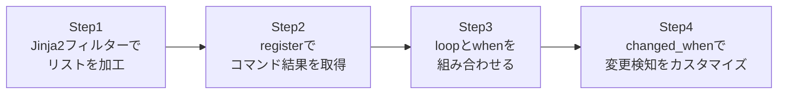

## はじめに

- **この記事で得られること**: [Ansibleのroles・Handlers・テンプレートで実務レベルの構成管理を体験する『上位1%』のハンズオン](/articles/ansible-roles-handson-guide)で扱ったJinja2テンプレートを一歩深掘りし、フィルターによるデータ加工、`loop`と`when`の組み合わせ、そして`register`変数の中身の実際の構造を体験します。
- **対象読者**: `{{ variable }}`程度のシンプルな変数展開は使ったことがあるが、フィルターや`register`変数の構造化されたデータを、実際に活用したことがない方を想定しています。
- **読むのにかかる想定時間**: 約20分(実際に構築しながら進める場合は35分程度を見込んでください)

この記事は[『上位1%』シリーズ 全記事ガイド](/sitemap)の一部、[Ansibleシリーズ](/sitemap#シリーズ一覧)の8本目です。

## 全体像をつかむ

このハンズオンで行うことは、次の4ステップです。



## ハンズオン手順

### Step 1: Jinja2フィルターでリストを加工する

パッケージ名のリストを、フィルターを使って加工します。

```yaml
- name: Show a filtered and sorted package list
  debug:
    msg: "{{ packages | select('match', '^nginx') | list | sort }}"
  vars:
    packages: ["nginx", "mysql-server", "nginx-extras", "redis"]
```

**`select`フィルターで条件に合う要素だけを抽出し、`list`で明示的にリスト化し、`sort`で並び替える、という3段階のパイプライン処理を1行で書いています。** Jinja2フィルターは`|`で連結でき、複数のフィルターを順番に適用できます。

### Step 2: registerでコマンド結果を取得する

コマンドの実行結果を`register`で変数に格納し、その中身を確認します。

```yaml
- name: Check running processes
  command: systemctl is-active nginx
  register: nginx_status
  ignore_errors: true

- name: Show the full register content
  debug:
    var: nginx_status
```

**`register`変数の中身は、単なる文字列ではなく、`stdout`・`stderr`・`rc`(終了コード)・`changed`といったキーを持つ、構造化された辞書です。** `nginx_status.stdout`のように、必要なキーだけを取り出して使うのが実務での基本です。

### Step 3: loopとwhenを組み合わせる

複数のサービスに対して、`loop`と`when`を組み合わせて、稼働中のものだけを再起動します。

```yaml
- name: Check each service status
  command: "systemctl is-active {{ item }}"
  register: service_status
  loop: ["nginx", "redis", "mysql"]
  ignore_errors: true

- name: Restart only the services that are currently active
  service:
    name: "{{ item.item }}"
    state: restarted
  loop: "{{ service_status.results }}"
  when: item.stdout == "active"
```

**ここで見落とされがちなのが、`when`が`loop`の各要素ごとに、個別に評価されるという仕様です。** `service_status.results`には、ループの各回の結果が配列として格納されており、そのうちの1つでも条件を満たせば全体が実行される、という誤解が実務でよく発生しますが、実際には各要素が独立して条件判定されます。

### Step 4: changed_whenで変更検知をカスタマイズする

`command`モジュールは既定で常に`changed`扱いになるため、`changed_when`で実際の変更検知をカスタマイズします。

```yaml
- name: Check nginx config syntax
  command: nginx -t
  register: nginx_check
  changed_when: false
  failed_when: nginx_check.rc != 0
```

**`changed_when: false`を指定することで、「このタスクは状態を確認しているだけで、何も変更していない」ということを、Ansibleに正確に伝えられます。** これを指定しないと、`command`モジュールを使うタスクはすべて「変更あり」として扱われ、Handlerが不必要に発火してしまうことがあります。

## プロが見ている視点(上位1%の理解)

### 冪等性とchanged判定は別の概念である

[Ansibleとは何かを『上位1%』の視点で理解する](/articles/ansible-guide)で扱った「冪等性」(同じPlaybookを何度実行しても同じ結果になること)と、「changed判定」(このタスクで実際に何かが変わったかどうかの報告)は、似ているようで別の概念です。`command`や`shell`モジュールは、そのコマンド自体が冪等かどうかをAnsibleが判断できないため、既定では常に`changed: true`として報告します。**実行結果を正確に報告させるには、`changed_when`で明示的に条件を書く必要がある**ことを理解していないと、Handlerが意図せず毎回発火してしまうという不具合の原因になります。

### なぜ`item.item`という書き方が必要になるのか

Step 3で`item.item`という、一見冗長な書き方をしています。これは、`loop: "{{ service_status.results }}"`で回している`item`が、実は「1つ前のタスクの実行結果全体」(`stdout`・`rc`などを含む辞書)であり、その中の`item`キーに、**さらにその前のループで使われた元の値**(`"nginx"`など)が格納されているためです。`register`した結果をそのまま次の`loop`に渡すという、実務で頻出するパターンを理解していないと、この`item.item`という表記の意味が分からず、コードを読み解けなくなります。

## よくある誤解・つまずきポイント

- **誤解1: 「whenは、loop全体に対して1回だけ評価される」**
  `when`は、`loop`の各要素ごとに個別に評価されます。1つの要素が条件を満たしても、他の要素の実行有無には影響しません。
- **誤解2: 「commandモジュールを使えば、Ansibleが自動的に冪等性を判断してくれる」**
  `command`・`shell`モジュールは、そのコマンドの中身をAnsibleが解釈できないため、冪等性の判断はできません。既定で常に`changed: true`になります。
- **誤解3: 「registerした変数は、常に単純な文字列である」**
  registerした変数は、`stdout`・`rc`・`changed`などのキーを持つ、構造化された辞書です。

## 障害・トラブルシューティングの視点

1. **`item.item`のような表記でエラーになる**: `register`した結果を`loop`に渡しているか、それとも元のリストを直接`loop`に渡しているかを確認し、`item`の実際の構造を`debug`モジュールで確認してください。
2. **Handlerが意図せず毎回発火する**: `command`・`shell`モジュールを使っているタスクに、`changed_when`が設定されているか確認してください。
3. **`select`フィルターの結果が空になる**: 正規表現のパターンが正しいか、`match`(先頭一致)と`search`(部分一致)のどちらを使うべきかを確認してください。

## まとめ

- Jinja2フィルターは`|`で連結でき、`select`・`list`・`sort`などを組み合わせたパイプライン処理が書けます。
- `register`した変数は、`stdout`・`rc`・`changed`などを持つ構造化された辞書です。
- `when`は`loop`の各要素ごとに個別に評価される仕様です。
- `command`・`shell`モジュールは既定で常に`changed: true`になるため、`changed_when`で明示的に制御する必要があります。

**今日から意識すべきこと**
1. `command`・`shell`モジュールを使うときは、必ず`changed_when`を検討しましょう。
2. `register`した変数の中身が分からなくなったら、まず`debug: var=変数名`で構造を確認しましょう。

## 参考文献

- [Jinja2 filters | Ansible Documentation](https://docs.ansible.com/ansible/latest/playbook_guide/playbooks_filters.html)
- [Conditionals | Ansible Documentation](https://docs.ansible.com/ansible/latest/playbook_guide/playbooks_conditionals.html)
