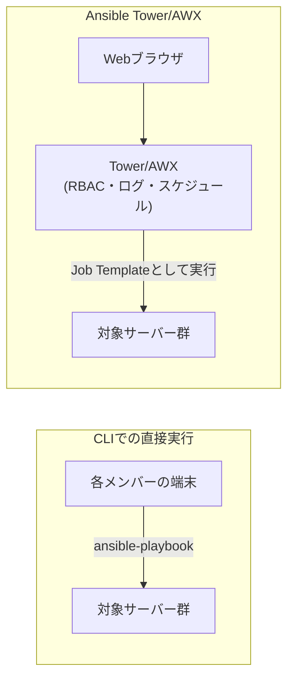

## はじめに

- **この記事で得られること**: [Ansibleとは何かを『上位1%』の視点で理解する](/articles/ansible-guide)から続くこのシリーズは、ここまで一貫して`ansible-playbook`コマンドを個人の端末やCI/CDパイプラインから直接実行してきました。この記事では、その運用が**組織の規模が大きくなるにつれてどう破綻していくのか**、そしてAnsible Tower(そのオープンソース版であるAWX)が、その課題をどう解決するのかを体系的に理解します。
- **対象読者**: `ansible-playbook`コマンドは使いこなせるが、「Ansible Tower」「AWX」という言葉を聞いたことはあっても、CLIでの実行と何が違うのかを説明できない方を想定しています。
- **読むのにかかる想定時間**: 約13分

この記事は[『上位1%』シリーズ 全記事ガイド](/sitemap)の一部、[Ansibleシリーズ](/sitemap#シリーズ一覧)の18本目です。

## 全体像をつかむ

## 基礎から徹底解説

### Ansible TowerとAWXの関係

**Ansible Tower**は、Red Hatが提供する、Ansibleの実行を一元管理するための商用Webアプリケーションです。**AWX**は、そのTowerの元になっている、オープンソース版のプロジェクトです。機能の呼び名は多少異なりますが、「Playbookの実行をWeb UI経由で一元管理する」という基本コンセプトは共通しています。

### CLIでの直接実行が抱える、組織規模での課題

`ansible-playbook`コマンドを、各メンバーが自分の端末やCI/CDパイプラインから直接実行する運用は、個人や小規模チームでは十分に機能します。しかし、組織の人数が増えると、次のような課題が顕在化します。

- **誰が、いつ、何を実行したのかが、追跡しづらい**: 各メンバーの端末のシェル履歴やログを、個別に確認する以外に、実行履歴を一元的に追う手段がありません。
- **本番環境への実行権限を、細かく制御できない**: SSH鍵やAWSの認証情報を、実行するメンバー全員に配布する必要があり、「このPlaybookは実行してよいが、あのPlaybookは実行してはいけない」といった、権限の細分化が難しくなります。
- **定期実行のスケジュール管理が、個別の`cron`任せになる**: どの端末の`crontab`に、どのジョブが登録されているのかが、属人化しがちです。

## プロが見ている視点(上位1%の理解)

### Tower/AWXが解決する、4つの具体的な課題

**Ansible Tower(AWX)は、CLIでの直接実行が抱える上記の課題を、それぞれ具体的な機能で解決します。**

- **RBAC(ロールベースアクセス制御)**: 「このユーザーグループは、この本番環境向けJob Templateだけを実行できる」といった、Playbook単位・環境単位での実行権限を、細かく設定できます。SSH鍵やクラウドの認証情報そのものは、Tower/AWXの内部で一元管理され、実行するメンバーの端末に配布する必要がなくなります。
- **実行ログの一元化**: 「誰が」「いつ」「どのPlaybookを」「どういう結果で」実行したかが、すべてWeb UI上の履歴として記録され、後から検索・監査できます。
- **スケジュール実行**: 個別の端末の`cron`に依存せず、Tower/AWX自体が、定期実行のスケジュールを一元管理します。
- **Job Template**: 「どのPlaybookを」「どのインベントリに対して」「どの認証情報を使って」実行するか、という組み合わせを、事前に定義し、実行権限を持つメンバーは、そのテンプレートを選んで実行するだけで済むようになります。**実行するメンバー自身が、SSH鍵や`ansible-playbook`コマンドの詳細なオプションを、直接扱う必要がなくなる**という点が、実務上、最も価値の大きい変化です。

**「個人の端末で認証情報を扱わせない」という設計は、[Ansible Vaultでパスワードをgitにプレーンテキストのまま置かないハンズオン](/articles/ansible-vault-handson-guide)で扱った、機密情報の管理という文脈の延長線上にある考え方です。** Vaultがファイル内の機密情報を暗号化する仕組みであるのに対し、Tower/AWXは、そもそも実行者の手元に認証情報そのものを渡さない、という、一段上のレイヤーでの解決策だと理解すると整理しやすくなります。

## よくある誤解・つまずきポイント

- **誤解1: 「Ansible TowerとAWXは、まったく別のソフトウェアである」**
  AWXはTowerの元になっているオープンソースプロジェクトであり、基本コンセプトと大部分の機能を共有しています。
- **誤解2: 「Tower/AWXを導入すれば、Playbookそのものの書き方が変わる」**
  Tower/AWXは、既存のPlaybookをどう実行・管理するかというレイヤーの仕組みであり、Playbook自体の記述方法(YAML、Task、Roleなど)には影響しません。
- **誤解3: 「小規模なチームでも、Tower/AWXを導入した方が常に良い」**
  RBACやスケジュール管理といった機能は、組織の人数や、実行権限を分ける必要性が高まって初めて価値を発揮するものであり、個人や小規模チームでは、CLIでの直接実行で十分な場合も多くあります。

## 障害・トラブルシューティングの視点

この記事はTower/AWXの全体像を扱う概要編のため、具体的なインストール手順やJob Templateの設定操作は扱いません。Tower/AWXの導入を検討する際は、まず「誰が、どのPlaybookを、どの環境に対して実行してよいか」という権限マトリクスを整理することが、最初の実務的なステップになります。

## まとめ

- Ansible Towerは商用のWebアプリケーションであり、AWXはその元になっているオープンソース版です。
- CLIでの直接実行は、組織の規模が大きくなると、実行履歴の追跡・権限の細分化・スケジュール管理の3点で課題を抱えます。
- Tower/AWXは、RBAC・実行ログの一元化・スケジュール実行・Job Templateという4つの機能で、これらの課題を解決します。

**今日から意識すべきこと**
1. チームの人数が増え、「誰が何を実行してよいか」の管理が煩雑になってきたら、Tower/AWXの導入を検討する材料にしましょう。
2. Job Templateの発想(実行の組み合わせを事前に定義し、実行者はそれを選ぶだけにする)は、Tower/AWXを導入しなくても、Playbookの構成を整理する際の指針として活用できます。

## 参考文献

- [Red Hat Ansible Automation Platform](https://www.redhat.com/en/technologies/management/ansible)
- [AWX Project (GitHub)](https://github.com/ansible/awx)
