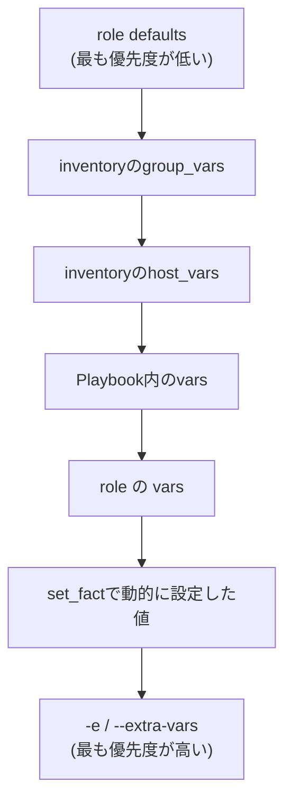

## はじめに

- **この記事で得られること**: [Ansibleでdev/staging/prodを1つのPlaybookで安全に使い分けるハンズオン](/articles/ansible-environments-handson-guide)で扱った`group_vars`を含め、Ansibleには変数を定義できる場所が数多く存在します。この記事では、それらが競合した場合に、**最終的にどの値が採用されるのか**を体系的に理解します。
- **対象読者**: `group_vars`や`host_vars`、`-e`(extra-vars)を個別には使ったことがあるが、それらが同時に同じ変数名を定義した場合にどうなるかを説明できない方を想定しています。
- **読むのにかかる想定時間**: 約13分

この記事は[『上位1%』シリーズ 全記事ガイド](/sitemap)の一部、[Ansibleシリーズ](/sitemap#シリーズ一覧)の14本目です。

## 全体像をつかむ

## 基礎から徹底解説

### 変数を定義できる、代表的な6つの場所

- **role defaults(`roles/*/defaults/main.yml`)**: そのroleにおける「初期値」です。利用者が上書きすることを前提にした、最も優先度の低い変数です。
- **group_vars(`group_vars/<グループ名>.yml`)**: インベントリ内の特定グループに所属する全ホストへ、一括で適用される変数です。
- **host_vars(`host_vars/<ホスト名>.yml`)**: 特定の1台のホストにだけ適用される変数です。
- **Playbook内の`vars`**: Playbookファイルの中に直接書き込む変数です。
- **role の`vars`(`roles/*/vars/main.yml`)**: そのroleにおける「基本的に上書きされたくない」設定値です。
- **`-e`/`--extra-vars`**: `ansible-playbook`実行時に、コマンドラインから直接渡す変数です。

### 優先順位の基本原則:「より具体的・より直前」なものが勝つ

Ansibleの変数優先順位には、公式ドキュメントに全21段階の詳細な一覧がありますが、実務でまず押さえるべきは、**「対象が広いものより狭いもの」「先に読み込まれるものより後に読み込まれるもの」が優先される**、という大原則です。上の図の通り、role defaultsのような「広く・早く」定義される変数は上書きされやすく、`-e`のように「実行のたびに・直接」指定する変数は、他のすべてを上書きします。

## プロが見ている視点(上位1%の理解)

### 「-eで指定したのに反映されない」は、ほぼ起きない——だから怖い

**`-e`(extra-vars)は、Ansibleの変数優先順位の中で、事実上最も強い力を持ちます。** これは裏を返せば、**Playbookの実行時に`-e`で誤った値を1つ渡してしまうと、role defaultsやgroup_varsでどれだけ慎重に設定していても、その値が問答無用で上書きされてしまう**ということです。CI/CDパイプラインからAnsibleを呼び出す構成では、パイプライン側の設定ミスで意図しない`-e`が渡され、本番環境にステージング用の値が適用されてしまう、という事故が典型的に起こり得ます。

**この強さゆえに、`-e`は「一時的な上書き」や「CI/CDからの明示的な注入」といった、限定された用途にとどめ、恒常的な設定値は`group_vars`や`host_vars`で管理するのが実務での定石です。** 逆に、role defaultsは「利用者が自由に上書きしてよい初期値」を書く場所であるため、role側で本当に固定したい値がある場合は、`vars`(defaultsではなく)に書くことで、group_varsなどからの上書きを避けられます。

## よくある誤解・つまずきポイント

- **誤解1: 「group_varsとhost_varsでは、後から読み込んだ方が優先される」**
  読み込み順序ではなく、対象範囲の広さで決まります。host_varsは特定の1台にしか適用されないため、group_varsより優先されます。
- **誤解2: 「role defaultsに書いた値は、そのroleの中で絶対に変わらない」**
  role defaultsは最も優先度の低い変数であり、group_varsやhost_vars、extra-varsなど、他のほぼすべての場所で簡単に上書きされます。
- **誤解3: 「-eで指定した変数は、そのPlaybook実行の一部でだけ有効になる」**
  `-e`はコマンドライン全体、つまりそのPlaybook実行のすべてのTaskに対して、他のあらゆる定義元より優先して適用されます。

## 障害・トラブルシューティングの視点

1. **想定と違う変数の値が使われている**: `ansible-playbook`に`-v`(詳細出力)オプションを付けて実行するか、`ansible-inventory --host <ホスト名>`で、そのホストに最終的に適用される変数の値を確認します。
2. **CI/CDパイプライン経由の実行だけ、意図しない設定が適用される**: パイプラインの実行コマンドに、意図しない`-e`オプションが埋め込まれていないかを確認します。
3. **roleを再利用したら、想定していたdefaultsの値が使われなかった**: そのroleを呼び出す側(Playbookやgroup_vars)で、同名の変数が定義されていないかを確認します。

## まとめ

- Ansibleの変数は、role defaults・group_vars・host_vars・Playbook内のvars・role のvars・extra-varsなど、複数の場所で定義できます。
- 優先順位の大原則は「対象が広いものより狭いもの」「先に読み込まれるものより後に読み込まれるもの」が勝つ、という考え方です。
- `-e`(extra-vars)は、他のほぼすべての定義元より優先される、最も強い上書き手段です。

**今日から意識すべきこと**
1. 恒常的な設定値はgroup_vars/host_varsで管理し、`-e`は一時的な上書きやCI/CDからの注入といった限定用途にとどめましょう。
2. 想定外の変数値に遭遇したら、`ansible-inventory --host <ホスト名>`で、最終的にどの値が採用されているかを確認する習慣をつけましょう。

## 参考文献

- [Using Variables | Ansible Documentation](https://docs.ansible.com/ansible/latest/playbook_guide/playbooks_variables.html)
- [Ansible Variable Precedence | Ansible Documentation](https://docs.ansible.com/ansible/latest/playbook_guide/playbooks_variables.html#variable-precedence-where-should-i-put-a-variable)
