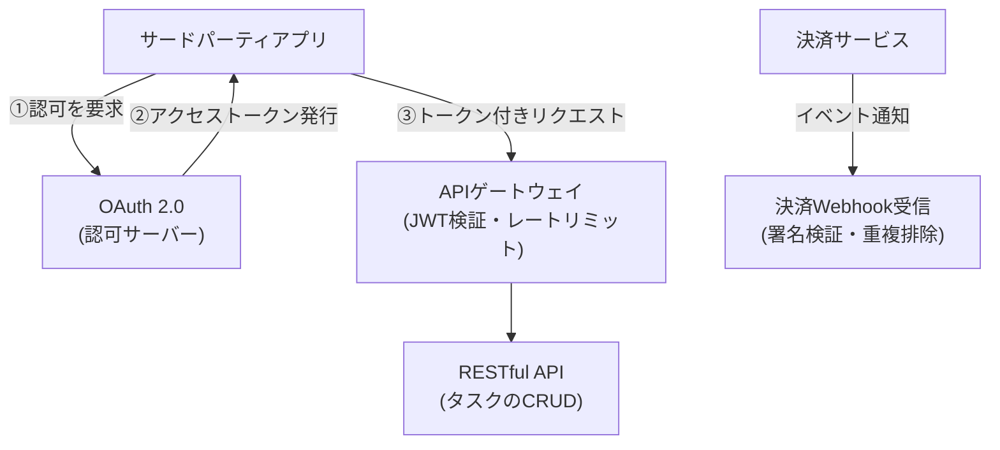

## はじめに

- **この記事で得られること**: ここまでのハンズオンで、1つずつ個別に習得してきた技術(RESTful APIの冪等性・ページネーション設計、OAuth 2.0による認可、Webhookの署名検証と重複排除、レートリミットアルゴリズム、JWT検証の安全な実装)を、**1つの架空のSaaSスタートアップの公開APIプラットフォームへ、自分の力で統合する**、Web/API学科の卒業制作です。これまでの記事が「手順をなぞって、1つの技術を確実に身につける」ことを目的としていたのに対し、この記事は**要件だけを提示し、どの技術を、どう組み合わせるかを、自分で設計する**という、実務そのものに近い形式を取ります。
- **対象読者**: Web/API学科の3年生・4年生・大学院の内容を一通り終え、個々のハンズオンは実施できるが、それらを組み合わせて1つのAPIプラットフォームを設計した経験がない方を想定しています。
- **読むのにかかる想定時間**: 設計・構築・文書化を含めて、数日〜1週間程度を想定しています(1回のハンズオンとしては最も重量級です)。

この記事は[『上位1%』シリーズ 全記事ガイド](/sitemap)の一部です。[Web/API学科の全カリキュラム](/university#webapi学科)の、卒業制作にあたる位置づけです。

## 前提知識

このハンズオンは、新しい技術を教えるものではありません。**以下の、すでに実施済みのハンズオンで習得した技術を、組み合わせて使います。**

- [RESTful APIとは何か？HTTP・JSONの基礎から実務設計まで『上位1%』の視点で理解する](/articles/restful-api-guide)
- [自分の手でシンプルなRESTful APIを構築し、冪等性とページネーションをcurlで検証するハンズオン](/articles/restful-api-handson-guide)
- [決済APIの裏側の仕組みを『上位1%』の視点で理解する](/articles/payment-api-guide)
- [OAuth 2.0の仕組みを『上位1%』の視点で理解する](/articles/oauth2-guide)
- [GraphQLとRESTful APIの違いを『上位1%』の視点で理解する](/articles/graphql-vs-rest-guide)
- [Webhookの受信エンドポイントを自分の手で構築し、署名検証と再送への対応を体験するハンズオン](/articles/webhook-signature-handson-guide)
- [トークンバケットでレートリミットを自分の手で実装し、固定ウィンドウ方式の境界バーストを再現するハンズオン](/articles/rate-limiting-handson-guide)
- [JWTの『alg: none』脆弱性を自分の手で再現し、許可アルゴリズムの明示的な制限による防御を確認するハンズオン](/articles/jwt-alg-none-handson-guide)

## 課題設定:架空のSaaSスタートアップの公開APIプラットフォーム

**あなたは、架空のSaaSスタートアップ「KoiKoi Tasks」のインフラエンジニアです。この会社は、タスク管理サービスを運営しており、サードパーティの開発者が自分のアプリから、ユーザーのタスクを操作できる公開APIプラットフォームを立ち上げることになりました。あなたに与えられた課題は、次の要件をすべて満たす、APIプラットフォームを、自分の手で構築することです。**

### 要件1: サードパーティ開発者が、ユーザーの許可なしにデータへアクセスできないようにする

**サードパーティアプリが、ユーザーの代わりにタスクを操作する前に、ユーザー自身の明示的な許可を得る仕組みを構築してください。** パスワードをサードパーティアプリへ一切渡さないことが前提です。

### 要件2: タスクのCRUD操作を、冪等性を正しく守ったRESTful APIとして設計する

**タスクの作成・取得・更新・削除を行うAPIを構築してください。** 特に、更新操作が、同じリクエストを複数回送っても安全であるように設計してください。

### 要件3: 発行したトークンの検証処理が、構造的に安全であることを保証する

**APIゲートウェイが、受け取ったトークンを検証する際、トークン自身の情報を無条件に信用してしまう設計上の弱点を排除してください。**

### 要件4: 特定のクライアントによる過剰なリクエストから、サービス全体を保護する

**1つのクライアントが、短時間に大量のリクエストを送ってきても、サービス全体の処理能力が奪われないようにしてください。** 単純な実装が抱える、意図しない抜け道にも注意してください。

### 要件5: 決済サービスからの通知を、安全に受信する

**ユーザーがプレミアムプランに加入した際、決済サービスから送られてくる通知を受信し、本当に正規の決済サービスから送られてきたものかを検証してください。** 同じ通知が複数回届いても、二重にプレミアムプランが有効化されないようにしてください。

### 要件6: 複数の異なるクライアントの要件に、柔軟に対応できるかを検討する

**Webアプリとモバイルアプリという、異なるクライアントが、それぞれ異なる形のデータを必要とする可能性があります。** 将来的にこの要件に対応する必要が出てきた場合、どのような設計上の選択肢があるかを検討してください。

## 成果物の要件:ポートフォリオとしてまとめる

**このハンズオンの最終的な成果物は、実際に動いた構成の確認結果だけではありません。** GitHubなどのリポジトリに、次の内容を含む形でまとめてください。

- **README.md**: このシナリオの概要、あなたが採用したAPIプラットフォームの全体像(mermaidなどの図を含む)
- **設計判断の記録**: 「なぜその技術・構成を選んだのか」という、判断の理由。特に、セキュリティと開発者の使いやすさのトレードオフが発生した箇所について
- **実施手順**: 実際に実行した設定や、検証コマンドの記録
- **振り返り**: 実施してみて分かった課題、実際の実務であれば追加で検討すべき点(API利用状況の監視、APIドキュメントの自動生成など)

**この成果物こそが、転職活動やポートフォリオとして提示できる、具体的な実績になります。** 単に「OAuth 2.0のハンズオンをやりました」と説明するよりも、「サードパーティ連携という現実的な制約の中で、複数の技術を組み合わせて設計し、セキュリティと使いやすさのトレードオフを言語化できる」ことを示せる方が、はるかに説得力があります。

## プロが見ている視点(上位1%の理解)

### 「手順をなぞる力」と「要件から設計する力」は、まったく別のスキルである

これまでのハンズオンは、いずれも「Step 1、Step 2……」という、決められた手順をなぞる形式でした。**しかし、実際の実務で評価されるのは、手順書通りに作業を実行する力ではなく、与えられた要件(この記事でいう「要件1〜6」)から、どの技術を、どう組み合わせるべきかを、自分で設計する力です。** この2つは、似ているようでまったく別のスキルです。個々のハンズオンをすべて完了していても、それらを組み合わせて1つの一貫したAPIプラットフォームを設計した経験がなければ、実務での即戦力にはなりません。この卒業制作は、その橋渡しを行うための、意図的な設計になっています。

### なぜ「サードパーティ連携+決済連携」という設定なのか

このハンズオンが、単発の技術デモではなく、あえて「外部の開発者と、外部の決済サービスの両方と連携する」という、現実的なプロジェクトを模した設定にしているのには理由があります。**実務のAPIプラットフォーム構築の多くは、単一の目的だけで完結せず、認可・認証の安全性・過剰利用への耐性・外部サービスとの安全な連携という、複数の軸を同時に満たす必要があります。** RESTful APIの基本設計だけを知っていても、その先にあるOAuth 2.0・JWTの安全な検証・レートリミット・Webhookの安全な受信までを見通せなければ、実際のプロジェクトでは通用しません。この卒業制作を通じて、個々の技術の知識を、**外部との接続点すべてを見通す設計力**へと昇華させることが、最終的な狙いです。

## よくある誤解・つまずきポイント

- **誤解1: 「このハンズオンは、決められた1つの正解の構成が存在する」**
  このハンズオンには、唯一の正解はありません。要件を満たす設計であれば、複数の妥当なアプローチが存在します。README.mdに、あなたが選んだ設計とその理由を記録することが重要です。
- **誤解2: 「成果物は、動作した証拠の確認結果だけで十分である」**
  動作確認は重要ですが、それだけでは不十分です。設計判断の理由を言語化できることが、このハンズオンの本当の価値です。
- **誤解3: 「個々のハンズオンをすべて完了していれば、このハンズオンも簡単に終わる」**
  個々の技術を知っていることと、それらを1つの一貫した設計へ統合することの間には、大きな距離があります。多くの時間を要することを想定しておいてください。

## 障害・トラブルシューティングの視点

このハンズオンは、個々の技術的なトラブルシューティングよりも、**設計上の手戻り**が主な課題になります。

1. **要件を満たしているつもりが、後から矛盾に気づく**: 実装を始める前に、README.mdの設計部分だけを先に書き上げ、要件1〜6のすべてを満たせているかを、文章の段階で確認してください。
2. **個々のハンズオンの手順を忘れてしまっている**: 各要件に対応する前提記事のリンクを、遠慮なく読み返してください。この卒業制作は、暗記力ではなく設計力を試すものです。
3. **どこまで作り込めばよいか分からない**: 「転職活動で、初対面の面接官にこのREADME.mdを見せて、設計判断を説明できるか」を、完成度の目安にしてください。

## まとめ

- この卒業制作は、Web/API学科でこれまで個別に習得した技術を、1つの架空のSaaSスタートアップの公開APIプラットフォームへ統合する、総合演習です。
- 求められているのは、手順をなぞる力ではなく、要件から自分で設計する力です。
- 成果物は、動作確認の結果だけでなく、設計判断の理由を言語化した文書として、ポートフォリオにまとめてください。

**今日から意識すべきこと**
1. 個々のハンズオンを学ぶときも、「これは、将来どんな要件の中で使うことになるか」を意識する習慣をつけましょう。
2. 技術的な成果物だけでなく、セキュリティと使いやすさのトレードオフを言語化する習慣を、日々の業務でも意識しましょう。

## 参考文献

- [Web/API学科の全カリキュラム](/university#webapi学科)
