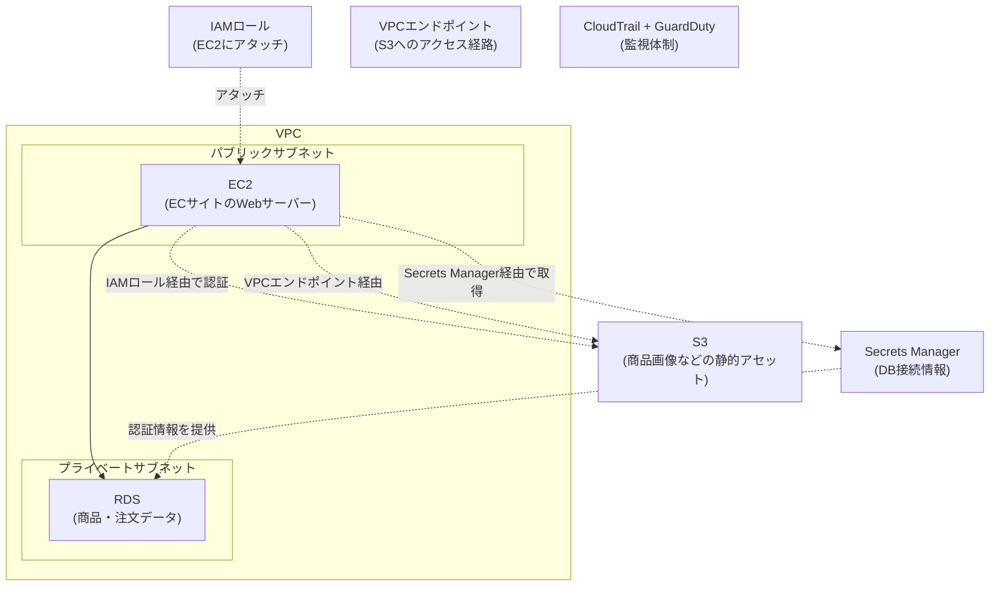

## はじめに

- **この記事で得られること**: ここまでのハンズオンで、1つずつ個別に習得してきた技術(VPC設計、EC2、RDS/Secrets Manager、S3、IAMロール、VPCエンドポイント、EBSバックアップ、最小権限ポリシー、CloudTrail/GuardDuty)を、**1つの架空のECサイトのインフラへ、自分の力で統合する**、AWS学科の卒業制作です。これまでの記事が「手順をなぞって、1つの技術を確実に身につける」ことを目的としていたのに対し、この記事は**要件だけを提示し、どの技術を、どう組み合わせるかを、自分で設計する**という、実務そのものに近い形式を取ります。
- **対象読者**: AWS学科の3年生・4年生・大学院の内容を一通り終え、個々のハンズオンは実施できるが、それらを組み合わせて1つの環境を設計した経験がない方を想定しています。
- **読むのにかかる想定時間**: 設計・構築・文書化を含めて、数日〜1週間程度を想定しています(1回のハンズオンとしては最も重量級です)。

この記事は[『上位1%』シリーズ 全記事ガイド](/sitemap)の一部です。[AWS学科の全カリキュラム](/university#aws学科)の、卒業制作にあたる位置づけです。

## 前提知識

このハンズオンは、新しい技術を教えるものではありません。**以下の、すでに実施済みのハンズオンで習得した技術を、組み合わせて使います。**

- [パブリック/プライベートサブネットを持つVPCを自力で構築するハンズオン](/articles/aws-vpc-handson-guide)
- [AWSでEC2インスタンスを起動し、Webサーバーを公開するハンズオン](/articles/aws-ec2-webserver-handson-guide)
- [RDSとSecrets Managerでアプリにパスワードを一切書かせないハンズオン](/articles/aws-rds-secrets-handson-guide)
- [S3バケットで静的Webサイトを公開するハンズオン](/articles/aws-s3-static-website-handson-guide)
- [IAMロールでEC2にアクセスキーを一切持たせないハンズオン](/articles/aws-iam-role-handson-guide)
- [VPCエンドポイントでNATゲートウェイを経由せずS3にアクセスするハンズオン](/articles/aws-vpc-endpoint-handson-guide)
- [EBSスナップショットとAMIでバックアップ・リストア戦略を組むハンズオン](/articles/aws-ebs-snapshot-handson-guide)
- [過剰な権限を持つIAMポリシーの危険性を再現し、最小権限に絞り込むハンズオン](/articles/aws-least-privilege-policy-handson-guide)
- [CloudTrailとGuardDutyで漏洩したアクセスキーの不正利用を検知するハンズオン](/articles/aws-cloudtrail-guardduty-handson-guide)

## 課題設定:架空のECサイト運営会社のインフラ構築

**あなたは、架空のECサイト運営会社「KoiKoi Shop」のインフラエンジニアです。この会社は、オンプレミスで運用していたECサイトを、AWSへ全面的に移行することになりました。あなたに与えられた課題は、次の要件をすべて満たす、統合されたAWS環境を、自分の手で構築することです。**

### 要件1: パブリック/プライベートサブネットを持つVPCを設計する

ECサイトのWebサーバーは外部からアクセスできる必要がありますが、**データベースは、インターネットから直接アクセスできない、プライベートサブネットに配置してください。**

### 要件2: EC2でWebサーバーを構築し、認証情報をコードに一切書かせない

ECサイトのアプリケーションコードは、データベースへの接続や、S3へのアクセスに、**アクセスキーやパスワードを一切ハードコードしない構成にしてください。**

### 要件3: 商品データベースをRDSへ、商品画像をS3へ配置する

**注文・商品データはRDSへ、商品画像などの静的アセットはS3へ**、それぞれ適切に配置してください。

### 要件4: NATゲートウェイの通信コストを最適化する

EC2からS3への大量のアクセスが見込まれています。**NATゲートウェイの通過データ量に対する課金を避けられる構成を、検討・実装してください。**

### 要件5: バックアップ体制を確立する

**EC2インスタンスについて、定期的なバックアップの仕組みを確立し、実際に復元できることを検証してください。**

### 要件6: 最小権限のセキュリティレビューを実施する

移行を急いだ結果、**IAMポリシーが必要以上に広い権限を持ってしまっている可能性があります。実際に権限を棚卸しし、必要最小限のポリシーへ絞り込んでください。**

### 要件7: 監視・検知体制を確立する

**万が一、認証情報が漏洩した場合に備え、不審なAPI呼び出しを検知できる監視体制を構築してください。**

## 成果物の要件:ポートフォリオとしてまとめる

**このハンズオンの最終的な成果物は、実際に動いた画面のスクリーンショットや、AWSマネジメントコンソールの設定結果だけではありません。** GitHubなどのリポジトリに、次の内容を含む形でまとめてください。

- **README.md**: このシナリオの概要、あなたが採用したアーキテクチャの全体像(mermaidなどの図を含む)
- **設計判断の記録**: 「なぜそのインスタンスタイプ・ストレージクラス・ポリシー範囲を選んだのか」という、判断の理由。特に、コストとセキュリティのトレードオフが発生した箇所について
- **実施手順**: 実際に実行したAWS CLIコマンドや、コンソールでの設定変更の記録(アクセスキーなどの機密情報は必ず除去してください)
- **振り返り**: 実施してみて分かった課題、実際の実務であれば追加で検討すべき点(オートスケーリング、マルチAZ構成など)

**この成果物こそが、転職活動やポートフォリオとして提示できる、具体的な実績になります。** 単に「RDSとSecrets Managerのハンズオンをやりました」と説明するよりも、「ECサイトのAWS移行という現実的な制約の中で、複数の技術を組み合わせて設計し、コストとセキュリティのトレードオフを言語化できる」ことを示せる方が、はるかに説得力があります。

## プロが見ている視点(上位1%の理解)

### 「手順をなぞる力」と「要件から設計する力」は、まったく別のスキルである

これまでのハンズオンは、いずれも「Step 1、Step 2……」という、決められた手順をなぞる形式でした。**しかし、実際の実務で評価されるのは、手順書通りに作業を実行する力ではなく、与えられた要件(この記事でいう「要件1〜7」)から、どのAWSサービスを、どの構成で、どう組み合わせるべきかを、自分で設計する力です。** この2つは、似ているようでまったく別のスキルです。個々のハンズオンをすべて完了していても、それらを組み合わせて1つの一貫したアーキテクチャを設計した経験がなければ、実務での即戦力にはなりません。この卒業制作は、その橋渡しを行うための、意図的な設計になっています。

### なぜ「架空のECサイト移行」という設定なのか

このハンズオンが、単発の技術デモではなく、あえて「オンプレミスからの全面移行」という、複数の要素が絡み合う現実的なプロジェクトを模した設定にしているのには理由があります。**実務のAWSプロジェクトの多くは、単一のサービスを導入するだけでは完結せず、可用性・コスト・セキュリティという、複数の軸を同時に満たす必要があります。** VPCの設計だけを知っていても、その先にあるコスト最適化・最小権限・監視体制までを見通せなければ、実際のプロジェクトでは通用しません。この卒業制作を通じて、個々のサービスの知識を、**プロジェクト全体を見通す設計力**へと昇華させることが、最終的な狙いです。

## よくある誤解・つまずきポイント

- **誤解1: 「このハンズオンは、決められた1つの正解の構成が存在する」**
  このハンズオンには、唯一の正解はありません。要件を満たす設計であれば、複数の妥当なアプローチが存在します。README.mdに、あなたが選んだ設計とその理由を記録することが重要です。
- **誤解2: 「成果物は、動作した証拠のスクリーンショットだけで十分である」**
  スクリーンショットは重要ですが、それだけでは不十分です。設計判断の理由を言語化できることが、このハンズオンの本当の価値です。
- **誤解3: 「個々のハンズオンをすべて完了していれば、このハンズオンも簡単に終わる」**
  個々の技術を知っていることと、それらを1つの一貫した設計へ統合することの間には、大きな距離があります。多くの時間を要することを想定しておいてください。

## 障害・トラブルシューティングの視点

このハンズオンは、個々の技術的なトラブルシューティングよりも、**設計上の手戻り**が主な課題になります。

1. **要件を満たしているつもりが、後から矛盾に気づく**: 実装を始める前に、README.mdの設計部分だけを先に書き上げ、要件1〜7のすべてを満たせているかを、文章の段階で確認してください。
2. **個々のハンズオンの手順を忘れてしまっている**: 各要件に対応する前提記事のリンクを、遠慮なく読み返してください。この卒業制作は、暗記力ではなく設計力を試すものです。
3. **どこまで作り込めばよいか分からない**: 「転職活動で、初対面の面接官にこのREADME.mdを見せて、設計判断を説明できるか」を、完成度の目安にしてください。

## まとめ

- この卒業制作は、AWS学科でこれまで個別に習得した技術を、1つの架空のECサイト移行シナリオへ統合する、総合演習です。
- 求められているのは、手順をなぞる力ではなく、要件から自分で設計する力です。
- 成果物は、動作の証跡だけでなく、設計判断の理由を言語化した文書として、ポートフォリオにまとめてください。

**今日から意識すべきこと**
1. 個々のハンズオンを学ぶときも、「これは、将来どんな要件の中で使うことになるか」を意識する習慣をつけましょう。
2. 技術的な成果物だけでなく、コストとセキュリティのトレードオフを言語化する習慣を、日々の業務でも意識しましょう。

## 参考文献

- [AWS学科の全カリキュラム](/university#aws学科)
