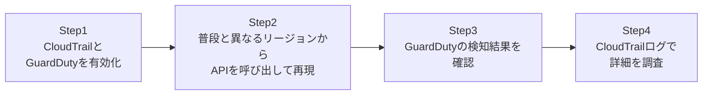

## はじめに

- **この記事で得られること**: [過剰な権限を持つIAMポリシーの危険性を再現し、最小権限に絞り込む『上位1%』のハンズオン](/articles/aws-least-privilege-policy-handson-guide)で扱った「認証情報が漏洩したらどうなるか」というリスクに対して、実際に検知する側の仕組みを体験します。**CloudTrail**による全API操作の証跡記録と、**GuardDuty**による異常検知の役割分担を理解し、漏洩したアクセスキーが不正利用された状況を、自分の検証環境の中で再現・検知します。**このハンズオンは、自分が管理する検証環境の防御力を高めるための、教育・防御目的のものです。実運用中の他者の環境に対して、許可なくこの手順を実行しないでください。**
- **対象読者**: CloudTrailやGuardDutyという名前は聞いたことがあるが、有効化しただけで満足しており、実際に何を検知してくれるのかを体験したことがない方を想定しています。
- **読むのにかかる想定時間**: 約25分(実際に構築しながら進める場合は40分程度を見込んでください)

この記事は[『上位1%』シリーズ 全記事ガイド](/sitemap)の一部、[AWS基礎シリーズ](/sitemap#シリーズ一覧)の10本目です。

## 全体像をつかむ

このハンズオンで行うことは、次の4ステップです。



## ハンズオン手順

### Step 1: CloudTrailとGuardDutyを有効化する

まだ有効化していなければ、両方を有効化します。

```bash
aws cloudtrail create-trail --name my-trail --s3-bucket-name my-cloudtrail-logs-bucket
aws cloudtrail start-logging --name my-trail

aws guardduty create-detector --enable
```

**CloudTrailは、有効化した瞬間からアカウント内のほぼすべてのAPI呼び出しを記録し始めます。** GuardDutyは、このCloudTrailのログや、VPC Flow Logs、DNSログなどを分析対象として、有効化されます。

### Step 2: 普段と異なるリージョンからAPIを呼び出して再現する

検証用のアクセスキーを使い、普段そのユーザーが利用したことのないリージョンから、APIを呼び出します(GuardDutyの検知対象の1つである、通常と異なる利用パターンを模擬します)。

```bash
AWS_ACCESS_KEY_ID=<検証用キー> AWS_SECRET_ACCESS_KEY=<検証用シークレット> \
  aws ec2 describe-instances --region ap-southeast-2
```

**このコマンド自体は正常に成功しますが、そのユーザーが過去に一度もアクセスしたことのないリージョンからの操作であるという点が、GuardDutyの異常検知アルゴリズムにとって着目すべき挙動になります。**

### Step 3: GuardDutyの検知結果を確認する

しばらく待ってから、GuardDutyの検知結果(Findings)を確認します。

```bash
aws guardduty list-findings --detector-id <detector-id>
aws guardduty get-findings --detector-id <detector-id> --finding-ids <finding-id>
```

**検知結果には、`UnauthorizedAccess:IAMUser/InstanceCredentialExfiltration`や、通常と異なる場所からのAPI呼び出しを示す種別の、重要度付きの通知が含まれます。** 「何が」「いつ」「どのIAMエンティティによって」行われたかという情報が、すぐに確認できる形でまとまっています。

### Step 4: CloudTrailログで詳細を調査する

GuardDutyの検知結果に含まれるイベントIDを使い、CloudTrailのログから、そのAPI呼び出しの詳細を確認します。

```bash
aws cloudtrail lookup-events --lookup-attributes AttributeKey=EventName,AttributeValue=DescribeInstances --max-results 5
```

**GuardDutyが「何かおかしい」と教えてくれるのに対し、CloudTrailのログは、そのAPI呼び出しの送信元IPアドレス、User-Agent、リクエストパラメータまで含む、事後調査に必要な生のエビデンスを提供します。** この2つを組み合わせて初めて、「何が起きたか」の検知と、「なぜ、どのように起きたか」の調査の両方が可能になります。

## プロが見ている視点(上位1%の理解)

### CloudTrailは「記録する」、GuardDutyは「分析して知らせる」という明確な役割分担

CloudTrailとGuardDutyを混同してしまう実務者は少なくありませんが、この2つの役割はまったく異なります。**CloudTrailは、あらゆるAPI呼び出しを、判断を加えずにひたすら記録し続けるログサービスです。** 一方**GuardDutyは、そのログ(および他のデータソース)を機械学習や既知の脅威インテリジェンスと突き合わせて分析し、「これは異常だ」という判断をしたうえで通知するサービスです。** CloudTrailが有効化されているだけでは、誰もそのログを毎日読んで異常を見つけ出すことはできません。GuardDutyという「分析して知らせる」レイヤーが組み合わさって初めて、実務で機能する検知の仕組みになります。

### インシデント対応において、CloudTrailログの保持期間が持つ意味

GuardDutyが検知した時点で、そのインシデントの発生から既に数時間から数日が経過していることは珍しくありません。この時、調査に必要なCloudTrailのログが、既に削除・上書きされていたら、事後調査は不可能になります。**CloudTrailのログをS3バケットに長期保存し、さらにそのバケット自体をMFA削除の有効化やバージョニングで保護しておくことが、「検知はできたが、証拠がなくて何も調査できない」という事態を防ぐ、実務上の前提条件**です。

## よくある誤解・つまずきポイント

- **誤解1: 「CloudTrailを有効化すれば、不正アクセスを自動的に検知してくれる」**
  CloudTrailは記録するだけのサービスです。異常の検知にはGuardDutyのような分析サービスが別途必要です。
- **誤解2: 「GuardDutyを有効化すれば、CloudTrailは不要になる」**
  GuardDutyの多くの検知はCloudTrailのログを分析対象としており、CloudTrailが無効だとGuardDutyの検知能力も低下します。
- **誤解3: 「GuardDutyの検知結果さえあれば、詳しい調査は不要」**
  GuardDutyは「何かがおかしい」ことを教えてくれますが、送信元IPアドレスやリクエストパラメータといった詳細な調査には、CloudTrailログの参照が必要です。

## 障害・トラブルシューティングの視点

1. **GuardDutyが有効なのに、想定した検知結果が出ない**: GuardDutyの学習期間(ベースラインとなる通常の利用パターンの学習)にはある程度の期間が必要です。有効化直後は検知精度が低いことがあります。
2. **CloudTrailのログが見当たらない**: `lookup-events`はデフォルトで直近90日分のイベント履歴のみを対象とします。それ以前のログはS3バケットに保存されたファイルを直接参照する必要があります。
3. **GuardDutyの検知結果からCloudTrailログへの紐付けが分からない**: 検知結果に含まれるアクセスキーID・IAMエンティティ名・時刻を`lookup-events`のフィルター条件として使用してください。

## まとめ

- CloudTrailは全API操作を判断なく記録するログサービス、GuardDutyはそのログを分析して異常を通知するサービスです。
- 検知(GuardDuty)と事後調査(CloudTrail)は、両方が揃って初めて実務で機能するインシデント対応の仕組みになります。
- CloudTrailログの長期保存と保護は、検知後の調査を可能にするための前提条件です。
- GuardDutyには一定の学習期間が必要で、有効化直後は検知精度が低いことがあります。

**今日から意識すべきこと**
1. CloudTrailのログを保存するS3バケットには、バージョニングとアクセス制限を必ず設定しましょう。
2. GuardDutyの検知結果が出たときに備え、CloudTrailログを使った調査の手順をあらかじめチームで共有しておきましょう。

## 参考文献

- [Amazon GuardDuty | AWS Documentation](https://docs.aws.amazon.com/guardduty/latest/ug/what-is-guardduty.html)
- [AWS CloudTrail | AWS Documentation](https://docs.aws.amazon.com/awscloudtrail/latest/userguide/cloudtrail-user-guide.html)
