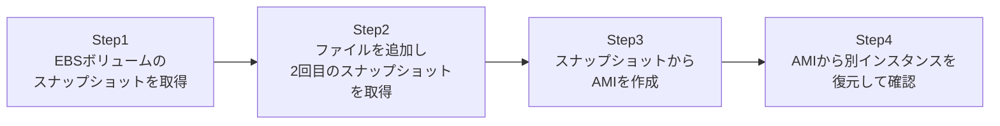

## はじめに

- **この記事で得られること**: 稼働中のEC2インスタンスから、EBSボリュームのスナップショットを取得し、そのスナップショットからAMI(Amazon Machine Image)を作成して、別のインスタンスとして復元する一連の流れを体験します。あわせて、スナップショットが実は「増分バックアップ」であるという裏側の仕組みと、EBSのボリュームタイプ(gp3/io2)の使い分けを理解します。
- **対象読者**: EC2インスタンスをコンソールから手動でバックアップしたことはあるが、スナップショットの内部の仕組みや、削除時の注意点を意識したことがない方を想定しています。
- **読むのにかかる想定時間**: 約20分(実際に構築しながら進める場合は35分程度を見込んでください)

この記事は[『上位1%』シリーズ 全記事ガイド](/sitemap)の一部、[AWS基礎シリーズ](/sitemap#シリーズ一覧)の8本目です。

## 全体像をつかむ

このハンズオンで行うことは、次の4ステップです。



## ハンズオン手順

### Step 1: EBSボリュームのスナップショットを取得する

稼働中のEC2インスタンスにアタッチされているEBSボリュームの、1回目のスナップショットを取得します。

```bash
aws ec2 create-snapshot --volume-id vol-xxxx --description "Snapshot 1: initial state"
```

**この1回目のスナップショットには、その時点でのボリュームの全データが含まれます。** 見た目上は「フルバックアップ」に見えますが、この後のステップで、その裏側の仕組みが実はそうではないことが分かります。

### Step 2: ファイルを追加し2回目のスナップショットを取得する

インスタンス内で新しいファイルを作成し、2回目のスナップショットを取得します。

```bash
echo "new data" > /home/ec2-user/new-file.txt

aws ec2 create-snapshot --volume-id vol-xxxx --description "Snapshot 2: after adding a file"
```

**2回目のスナップショットの作成にかかる時間とコストは、1回目よりも大幅に小さくなります。** これは、AWSが2回目のスナップショットとして、1回目からの「差分」だけを保存しているためです。

### Step 3: スナップショットからAMIを作成する

2回目のスナップショットの状態を、AMIとして登録します。

```bash
aws ec2 create-image --instance-id i-xxxx --name "my-app-backup-$(date +%Y%m%d)" --no-reboot
```

**AMIは、スナップショットに加えて、OS・インスタンスタイプ・起動時の設定などのメタデータをまとめたものです。** このAMIさえあれば、まったく同じ状態のEC2インスタンスを、いつでも新規に起動できます。

### Step 4: AMIから別インスタンスを復元して確認する

作成したAMIから、新しいEC2インスタンスを起動します。

```bash
aws ec2 run-instances --image-id ami-xxxx --instance-type t3.micro --key-name my-key

ssh ec2-user@<新しいインスタンスのIP>
cat /home/ec2-user/new-file.txt
```

**`new-file.txt`の中身が正しく復元されていれば成功です。** 元のインスタンスとは完全に独立した、新しいインスタンスとして、まったく同じ状態が再現されていることを確認できます。

## プロが見ている視点(上位1%の理解)

### スナップショットは増分バックアップであり、1つ目を消しても後続は壊れない

EBSスナップショットの最も重要な仕組みは、**2回目以降のスナップショットが、直前のスナップショットからの「差分」だけを保存する増分バックアップ**だということです。ここで実務上よく誤解されるのが、「1回目のスナップショットを削除すると、2回目以降のスナップショットも壊れてしまうのではないか」という懸念です。実際にはAWSが内部でブロックの参照関係を管理しており、**1回目のスナップショットを削除しても、2回目のスナップショットは単独で正常に復元できる状態が保たれます**(1回目にしか存在しないブロックのデータは、2回目の中に引き継がれる形で保持されます)。この仕組みを理解していないと、「古いスナップショットは容量の無駄だから、闇雲に古いものから削除してよい」という誤った運用をしてしまいがちですが、実際にはライフサイクルポリシーに従った計画的な削除で問題ありません。

### gp3とio2、ボリュームタイプの使い分け

EBSの汎用ボリュームである**gp3**は、ストレージ容量とIOPS(1秒あたりの読み書き回数)・スループットを、それぞれ独立して指定でき、多くのワークロードに対してコストパフォーマンスに優れています。一方、**io2**は、データベースなど、極めて高いIOPSと高い耐久性が求められるワークロード向けの、プロビジョンドIOPS型のボリュームです。「なんとなく容量だけ見てボリュームタイプを決める」のではなく、そのワークロードが要求するIOPS・スループット・耐久性の水準を見て、gp3で十分か、io2が必要かを判断することが、実務でのコスト最適化とパフォーマンスの両立につながります。

## よくある誤解・つまずきポイント

- **誤解1: 「1回目のスナップショットを削除すると、それ以降のスナップショットも一緒に壊れる」**
  AWSが内部でブロックの参照関係を管理しているため、1回目を削除しても、以降のスナップショットは単独で正常に復元できます。
- **誤解2: 「2回目以降のスナップショットも、1回目と同じだけの時間とコストがかかる」**
  2回目以降は差分だけを保存する増分バックアップのため、時間とコストの両方が大幅に小さくなります。
- **誤解3: 「AMIを作成すれば、元のEBSスナップショットは不要になる」**
  AMIは内部的にスナップショットを参照しています。AMIを登録抹消(deregister)しても、紐づくスナップショットは自動的には削除されません。

## 障害・トラブルシューティングの視点

1. **スナップショットからの復元後、一部のファイルが古い状態に見える**: `create-image`実行時に`--no-reboot`を付けなかった場合、書き込みバッファの内容が正しくフラッシュされていない可能性があります。整合性を重視する場合は再起動を伴う取得を検討してください。
2. **AMI登録抹消後もストレージ課金が続いている**: 紐づくスナップショットが自動削除されていないためです。不要なスナップショットは個別に削除する必要があります。
3. **io2ボリュームのコストが想定より高い**: プロビジョンドIOPSは実際の使用量に関わらず、設定したIOPS値に応じて課金されます。過剰にIOPSを設定していないか確認してください。

## まとめ

- EBSスナップショットは、2回目以降が直前との差分だけを保存する増分バックアップです。
- 1回目のスナップショットを削除しても、AWSが内部で参照関係を管理しているため、後続のスナップショットは単独で復元可能な状態が保たれます。
- AMIはスナップショットに加えて、OSやインスタンスタイプなどのメタデータをまとめたものです。
- gp3は多くのワークロードにコストパフォーマンスが良く、io2は極めて高いIOPS・耐久性が必要な場合に向いています。

**今日から意識すべきこと**
1. スナップショットのライフサイクルポリシーを設定し、古いスナップショットの削除を自動化しましょう。
2. EBSボリュームタイプを選ぶ際は、容量だけでなく要求されるIOPS・スループットの水準も確認しましょう。

## 参考文献

- [Amazon EBS snapshots | AWS Documentation](https://docs.aws.amazon.com/AWSEC2/latest/UserGuide/EBSSnapshots.html)
- [Amazon EBS volume types | AWS Documentation](https://docs.aws.amazon.com/AWSEC2/latest/UserGuide/ebs-volume-types.html)
