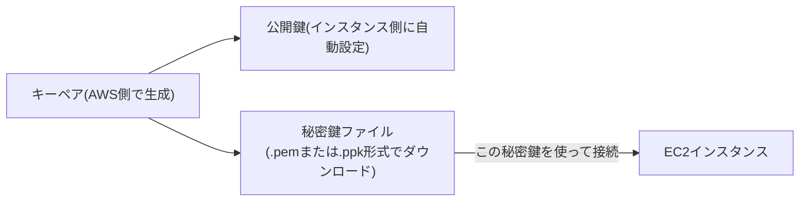
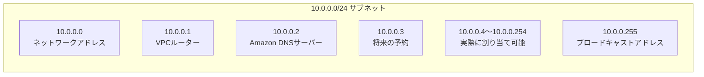

## はじめに

- **この記事で得られること**: EC2インスタンスを起動する際に必ず作成・指定する**キーペア**について、**.pemと.ppkという2つの形式が何が違うのか、どちらを選ぶべきなのか**を理解します。あわせて、AWSでVPC内にサブネットを作成すると、**利用可能なIPアドレスの範囲から、先頭4つと末尾1つが予約IPとして使えなくなる**理由と、それぞれの用途を体系的に整理します。
- **対象読者**: EC2インスタンスの構築やVPCのサブネット設計に携わったことはあるものの、キーペアの形式の違いや、予約IPの具体的な用途を説明できない方を想定しています。
- **読むのにかかる想定時間**: 約16分

この記事は[『上位1%』シリーズ 全記事ガイド](/sitemap)の一部、AWS基礎をテーマにした新シリーズの1本目です。

## 前提知識

- **公開鍵暗号方式**: 対になる2つの鍵(公開鍵・秘密鍵)を使い、公開鍵で暗号化したデータは対応する秘密鍵でしか復号できない、という性質を利用した暗号技術です。詳しくは[PKIとデジタル証明書の仕組みを『上位1%』の視点で理解する](/articles/pki-guide)を参照してください。

## 全体像をつかむ

### EC2のキーペアが果たしている役割

EC2インスタンスを起動する際に指定する**キーペア**は、そのインスタンスへ**パスワードなしで安全にログインするための、公開鍵暗号方式に基づく認証情報**です。AWS側は公開鍵をインスタンスに設定し、利用者は対になる秘密鍵ファイルを使って接続します。**この秘密鍵ファイルの"形式"の違いが、.pemと.ppkという2つの拡張子の違い**です。

## 基礎から徹底解説

### .pemと.ppkの違い:形式の違いであり、暗号技術自体の違いではない

**.pemと.ppkは、同じ秘密鍵の情報を、異なるファイル形式で表現したもの**です。

| 形式 | 主な利用ソフトウェア | 特徴 |
|---|---|---|
| **.pem** | OpenSSH(Linux・macOS標準、およびWindows 10以降に標準搭載されたOpenSSHクライアント) | Base64エンコードされたテキスト形式。多くのSSHクライアントの標準的な形式です。 |
| **.ppk** | PuTTY(Windowsで伝統的に使われてきたSSH/Telnetクライアント) | PuTTY独自のバイナリ形式です。 |

**AWSがEC2のキーペート作成時にダウンロードできるのは、既定では.pem形式です。** PuTTYのようなツールは、この独自形式(.ppk)以外のファイルを直接読み込めないため、**PuTTYを使って接続したい場合は、AWSからダウンロードした.pem形式のファイルを、PuTTY附属の変換ツール(PuTTYgen)で.ppk形式へ変換する**という手順が必要になります。

**どちらを選ぶべきかは、実質的には「どのSSHクライアントソフトウェアを使うか」で決まります。** 現在のWindows 10・11には、標準でOpenSSHクライアントが搭載されているため、コマンドプロンプトやPowerShellから直接.pem形式のファイルでSSH接続できます。PuTTYを使い慣れている、あるいは既存の運用でPuTTYを使い続けている場合は、.ppkへの変換が必要になります。

暗号技術としての強度・安全性に違いはない

.pemと.ppkは、あくまで同じ秘密鍵情報を格納する**ファイル形式(コンテナ)**の違いであり、鍵自体が使っている暗号アルゴリズム(RSA、ED25519など)や、鍵としての安全性そのものに違いはありません。PuTTYgenでの変換は、単に同じ鍵情報を異なる形式へ再エンコードしているだけの操作です。

### AWSサブネットの予約IPアドレス

VPC内にサブネットを作成すると、そのサブネットのCIDR範囲の中から、**先頭4つと末尾1つの合計5つのIPアドレスが、AWSによって予約され、EC2インスタンスなどへ割り当てることができなくなります。**

たとえば`10.0.0.0/24`というサブネットを作成した場合、次のように予約されます。

| IPアドレス | 用途 |
|---|---|
| `10.0.0.0` | ネットワークアドレス(そのサブネット自体を示す、慣習的な予約) |
| `10.0.0.1` | VPCのルーター用に予約 |
| `10.0.0.2` | AmazonのDNSサーバー用に予約(VPC内の名前解決に使われる) |
| `10.0.0.3` | AWSが将来の用途のために予約 |
| `10.0.0.255`(末尾) | ネットワークブロードキャストアドレス(AWSではブロードキャストをサポートしていませんが、慣習的に予約されています) |

**先頭3つ(ルーター・DNS・将来の予約)は、AWSのVPCというサービス自体が内部的な管理・機能提供のために必要とするアドレスです。** 特に`10.0.0.2`は、VPC内のインスタンスが名前解決を行う際に問い合わせる、Amazon提供のDNSサーバー(Route 53 Resolver)のアドレスとして機能します。**先頭の`10.0.0.0`と末尾の`10.0.0.255`は、AWS上では実質的な機能を持ちませんが、従来のIPネットワークの慣習(ネットワークアドレス・ブロードキャストアドレス)を踏まえて、同様に予約IPとして扱われています。**

**この5つの予約IPアドレスがあるため、サブネットのCIDR設計をする際は、想定する台数に対して単純にCIDR範囲のホスト数を当てはめるのではなく、この5つ分を差し引いた実際の割り当て可能数で考える必要があります。** たとえば`/28`(16個のIPアドレス)のサブネットであれば、実際にインスタンスへ割り当てられるのは`16 - 5 = 11`個です。

## プロが見ている視点(上位1%の理解)

### サブネットサイズ設計での実務上の注意点

小さすぎるサブネット(`/28`など)を多数作成する構成では、この5つの予約IPアドレスの影響が相対的に大きくなり、想定していたよりも早くIPアドレスが枯渇する、という事態につながりえます。将来的なスケールを見越して、余裕を持ったサブネットサイズを設計段階から検討しておくことが実務上重要です。

## よくある誤解・つまずきポイント

- **誤解1: 「.pemと.ppkは、暗号強度が異なる別々の鍵の種類である」**
  両者は同じ秘密鍵情報を格納するファイル形式の違いに過ぎず、鍵自体の暗号アルゴリズムや安全性に違いはありません。
- **誤解2: 「AWSのサブネットで予約されている5つのIPアドレスは、単なる無駄な制約である」**
  先頭3つはVPCのルーター・DNSサーバー・将来の拡張という、AWSの内部的な機能提供のために必要なアドレスです。
- **誤解3: 「サブネットのCIDR範囲のホスト数が、そのままインスタンスへ割り当てられる台数になる」**
  実際に割り当て可能なIPアドレス数は、CIDR範囲のホスト数から予約された5つを差し引いた数になります。

## 障害・トラブルシューティングの視点

EC2・VPCのネットワーク関連の問題は、**「キーペアの形式の問題か、サブネットの設計・予約IPに起因する問題か」を切り分ける**のが基本です。

1. **PuTTYで接続しようとしたが、鍵ファイルを認識してくれない**: AWSからダウンロードした.pem形式のファイルを、PuTTYgenで.ppk形式へ変換していないことが原因である可能性が高いです。
2. **サブネット内でインスタンスに想定したIPアドレスが割り当てられない**: そのIPアドレスが、先頭4つ・末尾1つの予約IPアドレスに該当していないかを確認します。
3. **小さなサブネットで、想定より早くIPアドレスが枯渇した**: 5つの予約IPアドレスの影響を踏まえた実際の割り当て可能数を再計算し、サブネットサイズの見直しを検討します。

### 予防策・恒久対策

- SSHクライアントとしてPuTTYを使う予定がある場合は、キーペア作成後すぐにPuTTYgenで.ppk形式へ変換しておく。
- サブネットのCIDR設計時は、5つの予約IPアドレスを差し引いた実際の割り当て可能数を基準に、必要な台数分の余裕を確保する。

## まとめ

- .pemと.ppkは、同じ秘密鍵情報を格納する異なるファイル形式であり、暗号技術としての強度・安全性に違いはありません。選択は使用するSSHクライアントソフトウェアに応じて決まります。
- AWSのサブネットでは、先頭4つ(ネットワークアドレス、ルーター、DNSサーバー、将来の予約)と末尾1つ(ブロードキャストアドレス)の合計5つのIPアドレスが予約され、割り当てに使用できません。
- サブネットサイズを設計する際は、CIDR範囲のホスト数からこの5つを差し引いた、実際の割り当て可能数で考える必要があります。

**今日から意識すべきこと**
1. キーペアの形式を検討する際は、暗号強度の違いではなく、使用するSSHクライアントソフトウェアとの互換性で判断しましょう。
2. サブネットのサイズを設計する際は、必ず5つの予約IPアドレスを差し引いた実際の割り当て可能数で計算しましょう。

## 参考文献

- [Amazon EC2 key pairs and Amazon EC2 instances | AWS Documentation](https://docs.aws.amazon.com/AWSEC2/latest/UserGuide/ec2-key-pairs.html)
- [VPCs and subnets | AWS Documentation](https://docs.aws.amazon.com/vpc/latest/userguide/configure-subnets.html)
- [Amazon DNS server | AWS Documentation](https://docs.aws.amazon.com/vpc/latest/userguide/vpc-dns.html)
