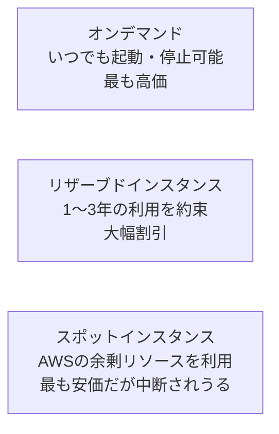

## はじめに

- **この記事で得られること**: [AWSでEC2インスタンスを起動し、Webサーバーを公開するハンズオン](/articles/aws-ec2-webserver-handson-guide)では、無料利用枠の対象である`t2.micro`をそのまま使いましたが、実務では、コストを最適化するために、複数ある**料金モデル**を使い分ける必要があります。この記事では、**オンデマンド・リザーブドインスタンス・スポットインスタンス**という3つの料金モデルが、それぞれどういう仕組みで成立していて、どう使い分けるべきかを体系的に理解します。
- **対象読者**: EC2インスタンスをオンデマンドで起動したことはあるが、リザーブドインスタンスやスポットインスタンスがなぜ安くなるのか、その仕組みを説明できない方を想定しています。
- **読むのにかかる想定時間**: 約15分

この記事は[『上位1%』シリーズ 全記事ガイド](/sitemap)の一部、[AWS基礎シリーズ](/sitemap#シリーズ一覧)の12本目です。

## 全体像をつかむ

## 基礎から徹底解説

### オンデマンドインスタンス:最も基本的な、従量課金モデル

**オンデマンドインスタンス**は、使った分だけ、秒単位で課金される、最も基本的な料金モデルです。長期的な利用の約束は一切不要で、いつでも起動・停止できます。**その分、3つのモデルの中で最も単価が高い**という特徴があります。急なアクセス増加への対応や、利用パターンがまだ読めない新規サービスの立ち上げ時に向いています。

### リザーブドインスタンス:利用を約束する代わりに、大幅な割引を受ける

**リザーブドインスタンス**は、特定のインスタンスタイプ・リージョンでの利用を、1年または3年という単位で事前に約束する代わりに、オンデマンドと比べて大幅な割引(最大70%程度)を受けられる料金モデルです。**なぜこの割引が成立するのかというと、AWS側から見れば、そのリソースの需要を長期的に確実に見込めるため、価格を下げてでも確保してもらう方が合理的だから**です。**常時稼働させることが分かっている、本番環境のデータベースサーバーのような、利用パターンが安定しているワークロードに向いています。**

### スポットインスタンス:AWSの余剰リソースを、格安で借りる

**スポットインスタンス**は、AWSのデータセンターで、その時点で使われていない余剰の計算リソースを、需要と供給に応じて変動する価格で借りる料金モデルです。**オンデマンドと比べて最大90%程度安くなることもありますが、その代わり、AWS側が別の需要(オンデマンドやリザーブドの利用者)のために、そのリソースを回収する必要が生じた場合、わずかな猶予時間(既定で2分)の通知の後、インスタンスが強制的に中断されます。**

なぜスポットインスタンスはこれほど安くなるのか

AWSのデータセンターには、常に一定量の未使用リソースが存在します。これは、オンデマンド・リザーブドの需要変動に備えるための、いわば予備の容量です。**この予備容量を、何もしなければ完全に無駄になってしまうリソースとして扱うのではなく、「いつでも取り上げられる」という制約付きで安く貸し出すことで、AWSにとっても収益機会になり、借りる側にとっても大幅なコスト削減になる**、という、双方にメリットのある経済的な仕組みが、スポットインスタンスの本質です。

## プロが見ている視点(上位1%の理解)

### スポットインスタンスは「いつ中断されてもよい」設計が大前提

スポットインスタンスを実務で使う際、最も重要な心構えは、**「このワークロードは、予告なく(実際には短い猶予はありますが)中断されても、致命的な問題にならないか」を、設計段階で必ず自問する**ことです。バッチ処理・データ分析・CI/CDのビルドジョブのように、**途中で中断されても、後で再実行すればよいという性質のワークロード**は、スポットインスタンスと非常に相性が良く、実務でのコスト削減効果も大きくなります。逆に、状態を保持し続ける必要があるデータベースサーバーのようなワークロードに、安易にスポットインスタンスを使うのは、実務では避けるべき設計です。

### 料金モデルは、1つのシステムの中で組み合わせて使うのが基本

実務では、1つのシステムの中で、複数の料金モデルを組み合わせて使うのが一般的です。たとえば、**常時稼働する最小限の台数はリザーブドインスタンスで確保し、アクセス増加時に一時的に追加する台数はオンデマンドで、そしてバッチ処理のような中断耐性のあるワークロードはスポットインスタンスで**、という組み合わせです。「どれか1つのモデルに統一する」のではなく、ワークロードの性質ごとに料金モデルを使い分けることが、コスト最適化の実務における基本方針です。

## よくある誤解・つまずきポイント

- **誤解1: 「リザーブドインスタンスは、実際にそのインスタンスを起動し続けなければならない」**
  リザーブドインスタンスは、あくまで料金の割引契約であり、実際に起動していない時間があっても、契約自体は継続します(起動していない時間も課金され続けます)。
- **誤解2: 「スポットインスタンスは、いつ中断されるか完全に予測できる」**
  中断のタイミングは、AWS側の需要状況に依存し、正確な予測はできません。既定で2分程度の猶予通知があるだけです。
- **誤解3: 「料金モデルは、システム全体で1つに統一するべきである」**
  実務では、ワークロードの性質ごとに複数の料金モデルを組み合わせて使うのが基本です。

## 障害・トラブルシューティングの視点

1. **スポットインスタンスが突然停止した**: 想定内の中断です。中断通知(2分前通知)を検知して、処理を安全に終了させる仕組みが実装されているかを確認してください。
2. **リザーブドインスタンスを契約したのに、想定より請求額が高い**: 契約したインスタンスタイプ・リージョン・OSが、実際に起動しているインスタンスと一致しているかを確認してください。一致していないと割引が適用されません。
3. **コストを最適化したいが、どのワークロードにどの料金モデルを使うべきか分からない**: そのワークロードが「中断されても後で再実行すればよい」性質かどうかを、まず判断基準にしてください。

## まとめ

- オンデマンドは最も柔軟だが高価、リザーブドは利用を約束する代わりに大幅割引、スポットは中断リスクがある代わりに最も安価という、3つの料金モデルがあります。
- スポットインスタンスは、AWSの余剰リソースを借りる仕組みであり、需要変動によって強制的に中断されうることが前提です。
- スポットインスタンスは、中断されても後で再実行できる性質のワークロードと相性が良い設計です。
- 実務では、1つのシステムの中で複数の料金モデルを組み合わせて使うのが基本です。

**今日から意識すべきこと**
1. 新しいワークロードを設計するときは、「中断されても問題ないか」を基準に、適した料金モデルを検討しましょう。
2. 常時稼働することが分かっているリソースについては、リザーブドインスタンスによるコスト削減を検討しましょう。

## 参考文献

- [Amazon EC2 Pricing | AWS](https://aws.amazon.com/ec2/pricing/)
- [Amazon EC2 Spot Instances | AWS Documentation](https://docs.aws.amazon.com/AWSEC2/latest/UserGuide/using-spot-instances.html)
