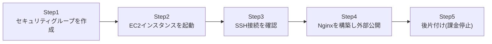

## はじめに

- **この記事で得られること**: [EC2のキーペア(.pem/.ppk)とサブネットの予約IPを『上位1%』の視点で理解する](/articles/aws-ec2-networking-basics-guide)で扱った知識を使い、実際にAWSの無料利用枠でEC2インスタンスを起動し、セキュリティグループで必要最小限の穴だけを開け、SSH接続してWebサーバー(Nginx)を構築し、インターネット経由で実際にアクセスできることを確認します。そして、AWSで最初につまずきやすい「使い終わった後、本当に課金を止めるにはどうすればよいか」という後片付けまでを扱います。
- **対象読者**: AWSのアカウントは作成したものの、実際にEC2インスタンスを起動してWebサーバーを公開したことがない方を想定しています。
- **読むのにかかる想定時間**: 約25分(実際に構築しながら進める場合は1時間程度を見込んでください)

この記事は[『上位1%』シリーズ 全記事ガイド](/sitemap)の一部です。

## 前提知識

- [EC2のキーペア(.pem/.ppk)とサブネットの予約IPを『上位1%』の視点で理解する](/articles/aws-ec2-networking-basics-guide): キーペアの仕組みについて、この記事の前提になっています。
- **AWSアカウント**: 無料利用枠(12ヶ月間、t2.microインスタンスなどが一定時間無料)が使えるAWSアカウントを事前に作成しておいてください。

## 全体像をつかむ

このハンズオンで行うことは、次の5ステップです。



## ハンズオン手順

### Step 1: セキュリティグループを作成する

AWSマネジメントコンソールから、EC2 → セキュリティグループ → 「セキュリティグループを作成」を選び、次の2つのインバウンドルールだけを追加します。

| タイプ | ポート | ソース |
|---|---|---|
| SSH | 22 | マイIP(自分のグローバルIPのみ) |
| HTTP | 80 | Anywhere(0.0.0.0/0) |

**この時点で、SSHのソースを「Anywhere」ではなく「マイIP」に絞っている点に注目してください。** [サーバーセキュリティの実践的対策を『上位1%』の視点で理解する](/articles/practical-server-security-measures-guide)で扱った「不要な通信は許可しない」という原則を、クラウド環境ではセキュリティグループという形で実践します。SSH(22番ポート)を世界中に公開したままにするのは、実務では避けるべき設定です。

### Step 2: EC2インスタンスを起動する

EC2 → 「インスタンスを起動」から、次の設定で起動します。

- **AMI**: Ubuntu Server(無料利用枠の対象になっているもの)
- **インスタンスタイプ**: `t2.micro`(無料利用枠の対象)
- **キーペア**: 新規作成し、`.pem`形式でダウンロード(すでに持っている場合は既存のものを選択)
- **セキュリティグループ**: Step 1で作成したものを選択

起動後、インスタンスの状態が「実行中」になり、**パブリックIPv4アドレス**が割り当てられていることを確認してください。

### Step 3: SSH接続を確認する

ダウンロードした`.pem`ファイルのパーミッションを、SSH接続前に必ず絞り込みます。

```bash
chmod 400 my-key.pem
ssh -i my-key.pem ubuntu@<パブリックIPv4アドレス>
```

**`chmod 400`を実行せずに接続しようとすると、`Permissions 0644 for 'my-key.pem' are too open`という警告とともに接続を拒否されます。** これは、秘密鍵ファイルが自分以外の誰からも読み取れない状態になっていることを、SSHクライアント自身が確認する仕組みです。

### Step 4: Nginxを構築し、外部からアクセスできることを確認する

SSH接続できたら、Nginxをインストールして起動します。

```bash
sudo apt update
sudo apt install -y nginx
```

`sudo apt install`だけで、Nginxのインストールと同時に自動起動の設定まで完了します(パッケージにsystemdのユニットファイルが同梱されているため)。念のため、状態を確認しておきましょう。

```bash
sudo systemctl status nginx
```

インスタンス自身から、ローカルで疎通確認します。

```bash
curl http://localhost/
```

Nginxの初期ページのHTMLが返ってくれば成功です。続いて、**自分の手元のPCから**、インターネット経由でアクセスできるかを確認します。

```bash
curl http://<パブリックIPv4アドレス>/
```

ブラウザで同じアドレスにアクセスしても、Nginxの初期ページが表示されるはずです。**ここまでで、インターネット上の誰からでもアクセスできるWebサーバーを、実際に自分の手で公開できたことになります。**

### Step 5: 後片付け(課金を止める)

検証が終わったら、インスタンスを終了します。EC2コンソールでインスタンスを選択し、「インスタンスの状態」→「インスタンスを終了」を選びます。

<details>
<summary>重要: 「stop」と「terminate」の違い、そして見えない課金の罠</summary>

AWSには、インスタンスを止める方法が2つあります。

- **停止(Stop)**: インスタンスの実行を止めますが、**アタッチされているEBSボリューム(ディスク)は残り続け、そのストレージ分の課金は継続します。** また、後で同じ設定のまま再起動できます。
- **終了(Terminate)**: インスタンス自体を完全に削除します。既定の設定では、ルートボリュームのEBSも同時に削除され、以降の課金は発生しなくなります(ただし、EBSの「終了時に削除」設定がオフになっている場合、EBSだけが残り続けることがあるので注意してください)。

**このハンズオンのように、検証だけが目的で今後使う予定がないインスタンスは、Stopではなく完全にTerminateすることをお勧めします。** また、もし今回の手順で**Elastic IP**(固定パブリックIP)を確保していた場合は要注意です。**Elastic IPは、稼働中のインスタンスにアタッチされている間は無料ですが、インスタンスを終了させてアタッチ先を失った(あるいは最初から未アタッチのままにしている)Elastic IPには、課金が発生します。** 「使っていないから課金されないだろう」という思い込みが、AWSで最も実害の大きい誤解の1つです。インスタンスを終了させたら、確保したままのElastic IPが残っていないかも必ず確認してください。

</details>

## プロが見ている視点(上位1%の理解)

### なぜ今回、デフォルトVPCをそのまま使ったのか

このハンズオンでは、意図的にVPCを新規作成せず、AWSアカウント作成時に自動的に用意されている**デフォルトVPC**をそのまま使っています。デフォルトVPCは、すべてのサブネットがインターネットゲートウェイに接続済みで、パブリックIPが自動割り当てされる設定になっており、「とにかく最短でインターネットに公開する」という今回の目的には最適です。しかし実務では、**用途ごとにVPC・サブネットを設計し、パブリックサブネットとプライベートサブネットを明確に分離する**のが基本です。デフォルトVPCをそのまま本番環境で使い続けることは、セキュリティ設計を放棄しているのとほぼ同義だと理解しておいてください。

### セキュリティグループは「ステートフル」である

セキュリティグループでは、インバウンドルールでSSH(22番)を許可しましたが、**アウトバウンド(応答パケットの送信)については何も設定していません。** それでもSSH接続が正常に成立するのは、セキュリティグループが**ステートフル**(往路の通信を許可すると、その応答となる復路の通信は自動的に許可される)な仕組みだからです。オンプレミス環境のステートレスなファイアウォールに慣れていると、「戻りの通信も別途許可しないといけないのでは」と身構えがちですが、AWSのセキュリティグループではその心配は不要です。

## よくある誤解・つまずきポイント

- **誤解1: 「インスタンスをStopすれば、課金は完全にゼロになる」**
  Stopしてもアタッチされたままのストレージ(EBS)の課金は継続します。完全に課金を止めたいなら、Terminate(終了)が必要です。
- **誤解2: 「Elastic IPは、確保しておくだけなら無料である」**
  稼働中のインスタンスにアタッチされていないElastic IPには課金が発生します。
- **誤解3: 「セキュリティグループでは、インバウンドだけでなくアウトバウンドも個別に許可しないと通信が成立しない」**
  セキュリティグループはステートフルなので、インバウンドで許可した通信の戻りは自動的に許可されます。

## 障害・トラブルシューティングの視点

1. **SSH接続がタイムアウトする**: セキュリティグループのインバウンドルールで22番ポートが許可されているか、ソースが自分の現在のグローバルIPと一致しているかを確認してください(自宅のグローバルIPは変動することがあります)。
2. **`curl`で外部からアクセスできない**: セキュリティグループで80番ポートが許可されているか、そして`sudo systemctl status nginx`でNginxが実際に起動しているかを確認してください。
3. **想定より課金が発生していた**: 「請求とコスト管理」ダッシュボードで、EBSボリュームやElastic IPなど、稼働中のインスタンスがなくても課金され続けるリソースが残っていないかを確認してください。

## まとめ

- セキュリティグループでは、SSHのソースを「マイIP」に絞るなど、必要最小限の穴だけを開けるのが基本です。
- `.pem`ファイルは`chmod 400`でパーミッションを絞ってからSSH接続します。
- `sudo apt install nginx`だけで、インストールと自動起動設定が同時に完了します。
- インスタンスの完全な課金停止にはStopではなくTerminateが必要で、Elastic IPは未アタッチのままでも課金される点に注意が必要です。
- セキュリティグループはステートフルなため、アウトバウンドを個別に許可する必要はありません。

**今日から意識すべきこと**
1. 検証用のAWSリソースを使い終わったら、必ずTerminateまで実行し、Elastic IPなど残っているリソースがないかを確認しましょう。
2. セキュリティグループのSSHルールは、「Anywhere」ではなく「マイIP」に絞る習慣をつけましょう。

## 参考文献

- [Amazon EC2 Instance Lifecycle | AWS Documentation](https://docs.aws.amazon.com/AWSEC2/latest/UserGuide/ec2-instance-lifecycle.html)
- [Amazon EC2 Security Groups | AWS Documentation](https://docs.aws.amazon.com/AWSEC2/latest/UserGuide/ec2-security-groups.html)
- [Elastic IP Addresses | AWS Documentation](https://docs.aws.amazon.com/AWSEC2/latest/UserGuide/elastic-ip-addresses-eip.html)
