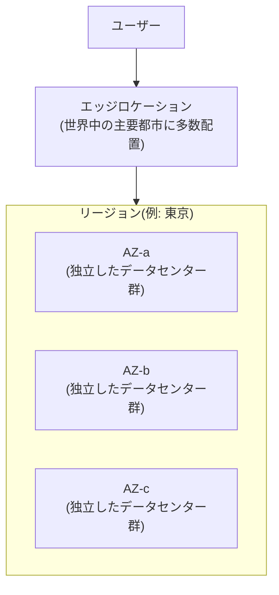

## はじめに

- **この記事で得られること**: [パブリック/プライベートサブネットを持つVPCを自力で構築するハンズオン](/articles/aws-vpc-handson-guide)などで、当たり前のように「リージョン」「アベイラビリティーゾーン」という言葉を使ってきました。この記事では、AWSのグローバルインフラが、**リージョン・アベイラビリティーゾーン(AZ)・エッジロケーション**という3つの階層でどう構成されているのかを、体系的に理解します。
- **対象読者**: マネジメントコンソールでリージョンを選んだことはあるが、AZという単位が何のために存在し、なぜ複数のAZにまたがった設計が推奨されるのかを説明できない方を想定しています。
- **読むのにかかる想定時間**: 約15分

この記事は[『上位1%』シリーズ 全記事ガイド](/sitemap)の一部、[AWS基礎シリーズ](/sitemap#シリーズ一覧)の11本目です。

## 全体像をつかむ

## 基礎から徹底解説

### リージョン:地理的に独立した、最上位の単位

**リージョン**は、AWSがサービスを提供している、地理的に独立した区画です。東京・大阪・バージニア北部・シンガポールなど、世界中に多数存在します。**多くのAWSリソースは、選択したリージョンの中だけに存在します。** あるリージョンでEC2インスタンスを作成しても、別のリージョンのコンソール画面には表示されません。これは、法規制(データを特定の国・地域の外に出せない場合がある)への対応や、ユーザーに地理的に近い場所にリソースを置くことによる低遅延化のためです。

### アベイラビリティーゾーン(AZ):リージョン内の独立した障害単位

1つのリージョンは、内部的に複数の**アベイラビリティーゾーン**(AZ)で構成されています。**それぞれのAZは、独立した電源・空調・ネットワーク回線を持つ、物理的に離れた1つ以上のデータセンターの集まりです。** AZ同士は低遅延の専用回線で結ばれていますが、片方のAZで発生した電源障害や自然災害が、他のAZに直接影響することはない、という設計が前提になっています。

**[パブリック/プライベートサブネットを持つVPCを自力で構築するハンズオン](/articles/aws-vpc-handson-guide)で扱ったサブネットは、必ず1つのAZに属します。** 実務では、同じ役割のリソース(Webサーバーなど)を、あえて複数のAZに分散して配置することで、1つのAZが丸ごと使えなくなっても、サービス全体は停止しない、という可用性設計が基本になります。

### エッジロケーション:ユーザーに最も近い場所

**エッジロケーション**は、リージョンよりもさらに数多く、世界中の主要都市に配置されている拠点です。CloudFront(CDN)のようなサービスが、コンテンツのキャッシュをユーザーに最も近いエッジロケーションに配置することで、リージョンまで問い合わせに行くよりも低遅延でコンテンツを配信します。**エッジロケーションは、リージョンのようにEC2インスタンスを起動できる場所ではなく、あくまでキャッシュや一部の軽量な処理(Lambda@Edgeなど)のための拠点**である、という違いを理解しておいてください。

## プロが見ている視点(上位1%の理解)

### リージョン間でデータが自動的に同期されない、という前提

多くのAWSサービスは、既定ではリージョンをまたいだデータの複製を行いません。**あるリージョンのS3バケットに保存したデータは、別のリージョンには自動的にコピーされません。** これは制約というより、意図的な設計です。リージョンをまたぐ複製は、通信コストと複雑さを伴うため、本当に必要な場合(災害復旧、法規制で複数リージョンへの保管が求められる場合など)にだけ、クロスリージョンレプリケーションのような機能を明示的に有効化する、というのがAWSの基本方針です。「リージョンを分ければ自動的にバックアップになる」という思い込みは、実務でよくある誤解です。

### マルチAZ設計と、マルチリージョン設計は、目的も難易度もまったく異なる

複数のAZにまたがる設計(マルチAZ)は、AWSのマネージドサービス(RDSのマルチAZ配置など)を使えば、比較的簡単に実現できます。一方、複数のリージョンにまたがる設計(マルチリージョン)は、データの整合性・レイテンシ・コストの面で、はるかに難易度の高い設計判断が必要になります。**「可用性を高めたい」という要求に対して、まずマルチAZで十分なのか、本当にマルチリージョンが必要なのかを見極めることが、実務における設計判断の第一歩です。**

## よくある誤解・つまずきポイント

- **誤解1: 「別のリージョンを見れば、他のリージョンで作成したリソースも表示される」**
  多くのAWSリソースはリージョンごとに独立しています。表示されない場合は、まずリージョンの選択を確認します。
- **誤解2: 「複数のリージョンにデータを置けば、それだけで自動的にバックアップになる」**
  リージョンをまたぐ複製は既定では行われず、必要な場合は明示的に有効化する必要があります。
- **誤解3: 「エッジロケーションでもEC2インスタンスを起動できる」**
  エッジロケーションは、CDNのキャッシュなどのための拠点であり、EC2インスタンスを起動できる場所ではありません。

## 障害・トラブルシューティングの視点

1. **作成したはずのリソースが見当たらない**: リージョンの選択が、作成時と表示時で異なっていないかを確認します。
2. **マルチAZ構成のはずなのに、片方のAZの障害で全体が止まった**: 実際にリソースが複数のAZに分散配置されているか、ロードバランサーなどが正しく複数AZを対象にしているかを確認します。
3. **CDN経由のコンテンツ配信が遅い**: ユーザーの地理的位置と、実際にキャッシュがヒットしているエッジロケーションを、CloudFrontのログで確認します。

## まとめ

- リージョンは地理的に独立した最上位の単位で、多くのAWSリソースはリージョンごとに独立しています。
- AZはリージョン内の独立した障害単位で、複数AZに分散配置することが可用性設計の基本です。
- エッジロケーションは、CDNのキャッシュなどのための、ユーザーに最も近い拠点です。
- リージョン間のデータ複製は既定では行われず、必要な場合は明示的に有効化する設計判断が必要です。

**今日から意識すべきこと**
1. 可用性を高めたいという要求が出たら、まずマルチAZで十分かを検討し、その上でマルチリージョンが本当に必要かを見極めましょう。
2. 重要なデータについては、リージョン間の複製が既定で行われていないことを前提に、バックアップ戦略を設計しましょう。

## 参考文献

- [AWS Global Infrastructure](https://aws.amazon.com/about-aws/global-infrastructure/)
- [Regions and Zones | AWS Documentation](https://docs.aws.amazon.com/AWSEC2/latest/UserGuide/using-regions-availability-zones.html)
