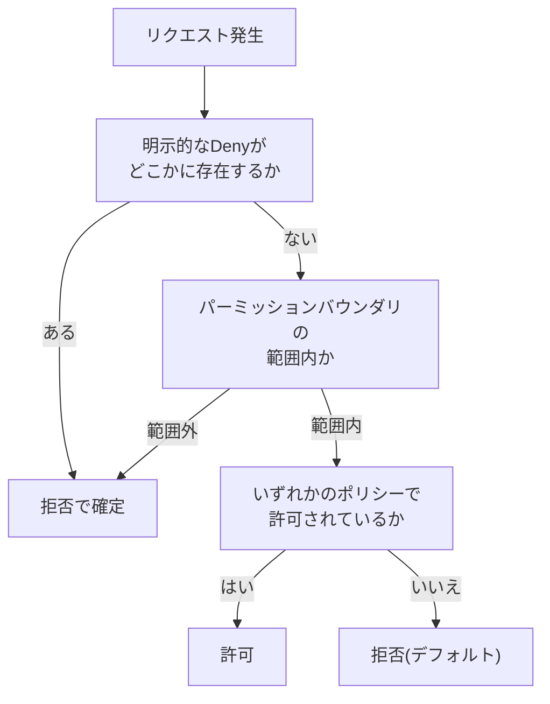

## はじめに

- **この記事で得られること**: [過剰な権限を持つIAMポリシーの危険性を再現し最小権限に絞り込むハンズオン](/articles/aws-least-privilege-policy-handson-guide)で、「明示的なDenyが常にAllowより優先される」という評価順序に触れました。この記事では、その評価ロジックを、**複数の種類のポリシーが同時に存在する、より実務的なケース**まで含めて、体系的に理解します。
- **対象読者**: 1つのIAMポリシーだけを見て許可・拒否を判断したことはあるが、複数のポリシーが重なった場合に、最終的な結果がどう決まるのかを説明できない方を想定しています。
- **読むのにかかる想定時間**: 約15分

この記事は[『上位1%』シリーズ 全記事ガイド](/sitemap)の一部、[AWS基礎シリーズ](/sitemap#シリーズ一覧)の14本目です。

## 全体像をつかむ

## 基礎から徹底解説

### 大原則:既定はすべて拒否、明示的な許可が必要

IAMの評価ロジックにおける最も基本的な前提は、**「明示的に許可されていない操作は、すべて拒否される」**、という既定拒否(Implicit Deny)の原則です。IAMポリシーを何も設定していないユーザーは、何もできません。ここに、`Allow`を明示するポリシーを追加して初めて、特定の操作ができるようになります。

### ポリシーの種類:アイデンティティベースとリソースベース

IAMポリシーには、大きく分けて2種類があります。

- **アイデンティティベースポリシー**: IAMユーザー・グループ・ロールに直接アタッチする、「このエンティティは何ができるか」を定義するポリシーです。[IAMロールでEC2にアクセスキーを一切持たせないハンズオン](/articles/aws-iam-role-handson-guide)で扱ったポリシーは、これにあたります。
- **リソースベースポリシー**: S3バケットポリシーのように、リソース側に直接アタッチし、「このリソースには誰がアクセスできるか」を定義するポリシーです。

**この2種類は、どちらか一方だけで完結するのではなく、両方が同時に評価対象になる**点が重要です。あるIAMユーザーがS3バケットにアクセスしようとした場合、そのユーザーのアイデンティティベースポリシーと、バケット側のリソースベースポリシーの、両方が確認されます。

### パーミッションバウンダリという「上限」の仕組み

**パーミッションバウンダリ**は、IAMユーザーやロールが持てる権限の**上限**を定義する、特殊な仕組みです。通常のアイデンティティベースポリシーで`Allow`されていても、パーミッションバウンダリでその操作が許可されていなければ、最終的には拒否されます。**「実際に持っている権限」は、常に「アイデンティティベースポリシーで許可された範囲」と「パーミッションバウンダリで許可された範囲」の、共通部分(積集合)になる**という理解が重要です。

## プロが見ている視点(上位1%の理解)

### 明示的なDenyが、常にすべてに優先する

[過剰な権限を持つIAMポリシーの危険性を再現し最小権限に絞り込むハンズオン](/articles/aws-least-privilege-policy-handson-guide)で扱った通り、**アイデンティティベースポリシー・リソースベースポリシー・パーミッションバウンダリ・SCP(サービスコントロールポリシー)のどこかに、明示的な`Deny`が1つでも存在すれば、他のすべての`Allow`に関わらず、その操作は拒否されます。** この「明示的なDenyの絶対的な優先順位」は、IAMの評価ロジックの中で唯一、例外なく成立する原則です。実務でのトラブルシューティングでは、「Allowを追加したのに、まだアクセスできない」という状況に遭遇したら、まずこのDenyの発生源(SCPやパーミッションバウンダリを含む)を疑う、という順序で調査を進めるのが定石です。

### SCP(サービスコントロールポリシー)という、組織全体の上限

複数のAWSアカウントを組織(AWS Organizations)でまとめて管理している場合、**SCP**という、アカウント全体に対する上限を設定する仕組みが存在します。SCPは、パーミッションバウンダリの考え方を、個々のIAMエンティティではなく、**アカウント全体**に適用したものだと理解すると分かりやすいです。あるアカウント内でどれだけ寛容なIAMポリシーを設定していても、そのアカウントが所属する組織単位にSCPで制限がかかっていれば、その制限が優先されます。

## よくある誤解・つまずきポイント

- **誤解1: 「1つのポリシーでAllowされていれば、その操作は必ず実行できる」**
  他のポリシー(パーミッションバウンダリ、SCP、リソースベースポリシーなど)のどこかにDenyがあれば、そちらが優先されます。
- **誤解2: 「アイデンティティベースポリシーとリソースベースポリシーは、どちらか一方だけが評価される」**
  両方が同時に評価対象になり、どちらか一方でも許可されていなければアクセスできません(明示的なDenyがある場合を除く)。
- **誤解3: 「パーミッションバウンダリは、通常のポリシーと同じように、権限を追加するものである」**
  パーミッションバウンダリは権限の上限を定義するものであり、それ自体が権限を付与するものではありません。

## 障害・トラブルシューティングの視点

1. **Allowポリシーを追加したのに、まだアクセスできない**: パーミッションバウンダリ、SCP、リソースベースポリシーのいずれかに、明示的なDenyが存在しないかを確認します。
2. **S3バケットへのアクセスが、IAM側の設定では問題ないはずなのに拒否される**: バケットポリシー(リソースベースポリシー)側で、意図しない制限がかかっていないかを確認します。
3. **組織内の特定のアカウントだけ、想定した権限が使えない**: そのアカウントが所属する組織単位に、SCPによる制限がかかっていないかを確認します。

## まとめ

- IAMの評価は「既定拒否、明示的な許可が必要」という大原則の上に成り立っています。
- アイデンティティベースポリシーとリソースベースポリシーは、両方が同時に評価対象になります。
- パーミッションバウンダリは権限の上限を定義し、実際の権限は常にその範囲内に収まります。
- 明示的なDenyは、発生源(どのポリシーの種類か)に関わらず、常にすべてのAllowに優先します。

**今日から意識すべきこと**
1. 「Allowしたのにアクセスできない」というトラブルに遭遇したら、まず明示的なDenyの発生源を疑いましょう。
2. 組織でAWSアカウントを管理している場合は、SCPによる組織全体の制限も、調査対象に含めましょう。

## 参考文献

- [Policy evaluation logic | AWS Documentation](https://docs.aws.amazon.com/IAM/latest/UserGuide/reference_policies_evaluation-logic.html)
- [Permissions boundaries for IAM entities | AWS Documentation](https://docs.aws.amazon.com/IAM/latest/UserGuide/access_policies_boundaries.html)
