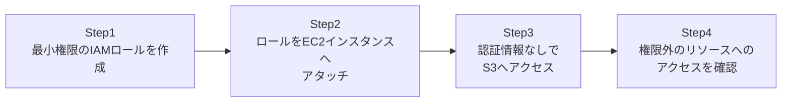

## はじめに

- **この記事で得られること**: [AWSでEC2インスタンスを起動し、Webサーバーを公開するハンズオン](/articles/aws-ec2-webserver-handson-guide)の発展として、EC2上で動くアプリケーションが、S3のようなAWSサービスへアクセスする際、アクセスキー・シークレットキーを一切ハードコードすることなく、**IAMロール**を使って安全にアクセスする方法を体験します。これは、AWSを使ううえで最も基本的かつ、最も軽視されがちな、重要なセキュリティ実践です。
- **対象読者**: `aws configure`でアクセスキーを設定したり、コード内にアクセスキーを直接書き込んだりする以外の方法を知らない方を想定しています。
- **読むのにかかる想定時間**: 約20分(実際に構築しながら進める場合は40分程度を見込んでください)

この記事は[『上位1%』シリーズ 全記事ガイド](/sitemap)の一部、[AWS基礎シリーズ](/sitemap#シリーズ一覧)の3本目です。

## 前提知識

- [AWSでEC2インスタンスを起動し、Webサーバーを公開するハンズオン](/articles/aws-ec2-webserver-handson-guide): EC2インスタンスの起動について、この記事の前提になっています。

## そもそも、なぜアクセスキーのハードコードが問題なのか

EC2上で動くアプリケーションが、S3バケットからファイルを読み込む必要があるとします。最も安易な方法は、IAMユーザーを作成し、そのアクセスキーとシークレットキーを発行して、アプリケーションの設定ファイルやコードに直接書き込む、というものです。**しかし、この方法には重大な問題があります。** そのEC2インスタンスが何らかの形で侵害された場合、攻撃者はこの静的なアクセスキーをそのまま盗み出せます。**このアクセスキーには有効期限がなく、管理者が意識的にローテーション(更新・失効)しない限り、盗まれた後もずっと有効なままです。** さらに、複数のサーバーに同じ認証情報をコピーして回るという運用は、どのサーバーがどの認証情報を使っているかの管理も煩雑にします。

## 全体像をつかむ

このハンズオンで行うことは、次の4ステップです。



## ハンズオン手順

### Step 1: 最小権限のIAMロールを作成する

特定の1つのS3バケットへの読み取り専用アクセスだけを許可する、IAMポリシーとロールを作成します。

```bash
aws iam create-role --role-name EC2-S3-ReadOnly-Role --assume-role-policy-document '{
  "Version": "2012-10-17",
  "Statement": [{"Effect": "Allow", "Principal": {"Service": "ec2.amazonaws.com"}, "Action": "sts:AssumeRole"}]
}'
```

**この`AssumeRolePolicyDocument`(信頼ポリシー)が指定しているのは、「EC2サービスだけが、このロールを引き受けてよい」という点です。** これとは別に、実際にS3への読み取りアクセスを許可する、権限ポリシー(アクセス許可ポリシー)を、特定の1つのバケットだけに限定してアタッチします。

### Step 2: ロールをEC2インスタンスへアタッチする

作成したロールを、対象のEC2インスタンスへアタッチします。

```bash
aws ec2 associate-iam-instance-profile --instance-id i-xxxxxxxx --iam-instance-profile Name=EC2-S3-ReadOnly-Role
```

**この操作は、稼働中のインスタンスに対しても、再起動を挟まずに実行できます。**

### Step 3: 認証情報なしでS3へアクセスする

そのEC2インスタンスへSSH接続し、`aws configure`を一切実行しないまま、次のコマンドを実行してみてください。

```bash
aws s3 ls s3://my-allowed-bucket/
```

**アクセスキーもシークレットキーも一切設定していないにもかかわらず、このコマンドが成功することを確認してください。** AWS CLIは、インスタンスメタデータサービスへ自動的に問い合わせ、そのインスタンスにアタッチされたロールの、一時的な認証情報を自動的に取得して使っています。

### Step 4: 権限外のリソースへのアクセスを確認する

今度は、ロールのポリシーで許可していない、別のS3バケットへアクセスしてみてください。

```bash
aws s3 ls s3://some-other-bucket/
```

**`Access Denied`というエラーになることを確認してください。** ロールに付与した権限が、意図した通り、特定の1つのバケットだけに限定されていることが分かります。

## プロが見ている視点(上位1%の理解)

### IAMロールの認証情報は、STSが発行する一時的なものである

IAMロールをアタッチしたインスタンスが実際に使っている認証情報は、静的なアクセスキーではありません。**STS(Security Token Service)という仕組みが、有効期限付きの、一時的な認証情報を自動的に発行しています。** この一時的な認証情報は、既定で数時間ごとに自動的に更新され続けます。つまり、万が一この一時的な認証情報が漏洩したとしても、その有効期限が切れれば、それだけで無効になります。人間が意識的にローテーション作業を行う必要がある静的なアクセスキーと比べて、この「放っておいても自動的に無効化される」という性質こそが、IAMロールが根本的に安全とされる理由です。

### インスタンスメタデータサービスと、IMDSv2が必須になった理由

Step 3で、AWS CLIが自動的に認証情報を取得できた裏側では、EC2インスタンス自身が、`169.254.169.254`という特殊なアドレスへ問い合わせる、**インスタンスメタデータサービス**という仕組みが使われています。この仕組みには、古いバージョン(IMDSv1)と、新しいバージョン(IMDSv2)があります。**IMDSv1は、単純なHTTP GETリクエストだけで認証情報を取得できてしまうため、アプリケーション側にSSRF(サーバーサイドリクエストフォージェリ)という種類の脆弱性があった場合、外部の攻撃者が、そのアプリケーションを踏み台にして、間接的にインスタンスの認証情報を盗み出せてしまう**、という実際に悪用された経緯があります。IMDSv2は、事前にトークンを取得するという追加の手順を必須にすることで、この種の攻撃を防いでいます。新しく起動するインスタンスでは、IMDSv2を必須にする設定を、必ず有効にしてください。

## よくある誤解・つまずきポイント

- **誤解1: 「IAMロールをアタッチしても、アプリケーション側で`aws configure`を実行する必要がある」**
  IAMロールがアタッチされていれば、AWS CLIやSDKは自動的に認証情報を取得するため、`aws configure`の実行は不要です。
- **誤解2: 「IAMロールとIAMユーザーは、本質的に同じものである」**
  IAMユーザーは、長期的な認証情報を持つ、永続的なアイデンティティです。IAMロールは、必要なときにその都度「引き受ける」ものであり、それ自体に静的な認証情報を持ちません。
- **誤解3: 「IAMロールの認証情報は、一度取得すれば永久に有効である」**
  IAMロールの認証情報は、STSによって発行される一時的なものであり、既定で数時間ごとに自動更新が必要です。

## 障害・トラブルシューティングの視点

1. **ロールをアタッチしたのに、`Access Denied`になる**: ロールの信頼ポリシー(誰がこのロールを引き受けられるか)と、権限ポリシー(このロールで何ができるか)の両方を確認してください。前者はEC2サービスを許可していても、後者で対象のバケットへのアクセスが許可されていなければ失敗します。
2. **`aws s3 ls`コマンド自体が、認証情報が見つからないというエラーになる**: インスタンスにロールが正しくアタッチされているか、`aws ec2 describe-iam-instance-profile-associations`で確認してください。
3. **インスタンスメタデータサービスへの問い合わせがタイムアウトする**: IMDSv2が必須に設定されている場合、古いバージョンのAWS CLIやSDKでは、正しくトークンを取得できないことがあります。バージョンを更新してください。

## まとめ

- EC2上のアプリケーションがAWSサービスへアクセスする際は、アクセスキーのハードコードではなく、IAMロールを使うべきです。
- IAMロールの認証情報は、STSが自動的に発行・自動更新する一時的なものであり、静的なアクセスキーより本質的に安全です。
- IMDSv2を必須にすることで、SSRFを経由した認証情報の窃取を防げます。
- IAMロールに付与する権限は、必要最小限のリソース・操作だけに限定するべきです。

**今日から意識すべきこと**
1. 新しいEC2インスタンスを起動する際は、まずIAMロールで実現できないかを検討し、アクセスキーのハードコードを避けましょう。
2. 新規インスタンスでは、IMDSv2を必須にする設定を必ず有効にしましょう。

## 参考文献

- [IAM Roles for Amazon EC2 | AWS Documentation](https://docs.aws.amazon.com/AWSEC2/latest/UserGuide/iam-roles-for-amazon-ec2.html)
- [Use IMDSv2 | AWS Documentation](https://docs.aws.amazon.com/AWSEC2/latest/UserGuide/configuring-instance-metadata-service.html)
