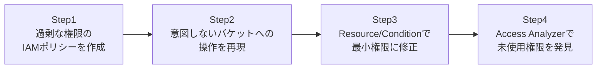

## はじめに

- **この記事で得られること**: 「とりあえず動けばいいから」という理由で付与されがちな、過剰に広いIAMポリシーが、実際にどのようなリスクを生むのかを、自分が管理する検証環境の中で再現します。そのうえで、`Resource`と`Condition`を使って範囲を絞り込んだ、最小権限のポリシーへ修正する手順と、**IAM Access Analyzer**を使って、既に付与されている未使用の権限を発見する方法を体験します。**このハンズオンは、自分が管理する検証環境の防御力を高めるための、教育・防御目的のものです。実運用中の他者の環境に対して、許可なくこの手順を実行しないでください。**
- **対象読者**: IAMポリシーを`"Resource": "*"`のまま運用してしまっている、あるいはその危険性を具体的にイメージできていない方を想定しています。
- **読むのにかかる想定時間**: 約25分(実際に構築しながら進める場合は45分程度を見込んでください)

この記事は[『上位1%』シリーズ 全記事ガイド](/sitemap)の一部、[AWS基礎シリーズ](/sitemap#シリーズ一覧)の9本目です。

## 全体像をつかむ

このハンズオンで行うことは、次の4ステップです。



## ハンズオン手順

### Step 1: 過剰な権限のIAMポリシーを作成する

「S3を使うアプリ用」として、よくある形の、過剰に広いポリシーを検証用IAMユーザーへアタッチします。

```json
{
  "Version": "2012-10-17",
  "Statement": [{
    "Effect": "Allow",
    "Action": "s3:*",
    "Resource": "*"
  }]
}
```

**このポリシーは、特定のアプリ用バケット1つだけを操作させたいという意図とは裏腹に、アカウント内のすべてのS3バケットに対する、読み取り・書き込み・削除を含むすべての操作を許可しています。**

### Step 2: 意図しないバケットへの操作を再現する

このIAMユーザーの認証情報で、本来アクセスさせるつもりのなかった、別の重要なバケットに対して操作を試みます。

```bash
aws s3 ls s3://another-important-bucket-in-same-account/
aws s3 rm s3://another-important-bucket-in-same-account/critical-file.txt
```

**このコマンドは、意図せず成功してしまいます。** アプリ用のつもりで発行した認証情報が漏洩した場合、攻撃者はこのアプリとは無関係な、アカウント内の他のすべてのバケットに対しても、読み取りや削除を行えてしまうことが再現できました。

### Step 3: Resource/Conditionで最小権限に修正する

ポリシーを、特定のバケットの特定の操作だけに絞り込みます。

```json
{
  "Version": "2012-10-17",
  "Statement": [{
    "Effect": "Allow",
    "Action": ["s3:GetObject", "s3:PutObject"],
    "Resource": "arn:aws:s3:::my-app-specific-bucket/*",
    "Condition": {
      "StringEquals": { "aws:RequestedRegion": "ap-northeast-1" }
    }
  }]
}
```

**`Resource`を特定のバケットのARNだけに絞り込み、`Action`も本当に必要な`GetObject`/`PutObject`だけに限定し、さらに`Condition`でリージョンまで制約しています。** この状態でStep 2と同じコマンドを再実行すると、`AccessDenied`になることを確認してください。

### Step 4: Access Analyzerで未使用権限を発見する

IAM Access Analyzerを使い、実際に使われている権限とポリシー上の権限の差分を確認します。

```bash
aws accessanalyzer list-findings --analyzer-arn <analyzer-arn>
aws accessanalyzer generate-policy --policy-generation-details '{"principalArn": "<検証用IAMユーザーのARN>"}'
```

**`generate-policy`は、CloudTrailの実際の利用履歴を分析し、そのIAMユーザーが実際に使った操作だけに基づいた、最小権限のポリシー案を自動生成します。** 「このユーザーには本当は何の権限が必要なのか」を、推測ではなく実際の利用実績から導き出せる点が重要です。

## プロが見ている視点(上位1%の理解)

### 「とりあえず動く」ポリシーが、実務で量産される構造的な理由

`"Resource": "*"`のような広すぎるポリシーは、多くの場合、悪意によってではなく、「開発中にアクセス拒否のエラーで止まりたくない」という、開発速度を優先した判断の積み重ねで生まれます。**この問題の根本的な難しさは、権限が広すぎることによる被害は、実際にインシデントが起きるまで目に見えないのに対し、権限が狭すぎることによる不具合は、開発中すぐに気づける**という非対称性にあります。この非対称性を理解したうえで、開発中は広めのポリシーで進めつつ、本番投入前には必ずAccess Analyzerの`generate-policy`のような仕組みで最小権限化する、というプロセスをチームの標準とすることが、実務上の現実的な解決策です。

### IAMポリシーの評価順序という誤解されやすい仕様

IAMポリシーは、`Allow`と`Deny`が同時に存在する場合、**明示的な`Deny`が常に`Allow`より優先されます。** これは、[権限移譲でヘルプデスクにパスワードリセット権限だけを渡す『上位1%』のハンズオン](/articles/ad-delegation-handson-guide)で扱ったADのACL評価順序(明示的な拒否が優先)と、発想としてまったく同じ仕組みです。この評価順序を理解していないと、「Allowポリシーを1つ追加したのに、なぜかまだアクセスできない」という調査で、SCP(Service Control Policy)やパーミッションバウンダリに存在する`Deny`を見落とし、時間を浪費することになります。

## よくある誤解・つまずきポイント

- **誤解1: 「開発中に広いポリシーを使っても、本番投入前に絞り込めば問題ない」**
  理論上はその通りですが、実務では「動いているものは触りたくない」という心理から、本番投入前の絞り込みが先送りにされ続けることが頻発します。プロセスとして強制する仕組みが必要です。
- **誤解2: 「IAM Access Analyzerは、セキュリティ上の問題を自動的に修正してくれる」**
  Access Analyzerは、問題の発見と改善案の提示までを行うツールであり、実際にポリシーを修正して適用するのは人間の判断です。
- **誤解3: 「ResourceをARNで絞り込めば、Conditionは不要」**
  ResourceとConditionは補完し合うものです。特定の時間帯・IPアドレス範囲・MFA必須化など、Resourceだけでは表現できない制約はConditionで追加します。

## 障害・トラブルシューティングの視点

1. **最小権限化した後、正規の処理までアクセス拒否になった**: CloudTrailのイベント履歴で、実際に拒否された`Action`を確認し、ポリシーに漏れている操作がないか確認してください。
2. **`generate-policy`の実行結果が空になる**: 対象のIAMユーザー・ロールについて、CloudTrailに十分な利用履歴の期間が蓄積されているか確認してください。
3. **明示的なDenyの発生源が分からない**: IAMユーザーのポリシーだけでなく、SCPやパーミッションバウンダリにもDenyが存在しないか確認してください。

## まとめ

- `"Resource": "*"`のような広すぎるポリシーは、認証情報漏洩時の被害範囲を、意図せず大きく広げます。
- `Resource`と`Condition`を組み合わせることで、範囲を正確に絞り込んだ最小権限ポリシーを実現できます。
- IAM Access Analyzerの`generate-policy`は、実際の利用実績に基づいた最小権限ポリシー案を自動生成します。
- IAMポリシーは、明示的なDenyが常にAllowより優先されるという評価順序を持ちます。

**今日から意識すべきこと**
1. 開発中に広いポリシーを使う場合でも、本番投入前に必ずAccess Analyzerで絞り込む工程をプロセスに組み込みましょう。
2. 「なぜかアクセス拒否になる」という調査では、対象のポリシーだけでなくSCP・パーミッションバウンダリも確認しましょう。

## 参考文献

- [IAM Access Analyzer | AWS Documentation](https://docs.aws.amazon.com/IAM/latest/UserGuide/what-is-access-analyzer.html)
- [Policy evaluation logic | AWS Documentation](https://docs.aws.amazon.com/IAM/latest/UserGuide/reference_policies_evaluation-logic.html)
