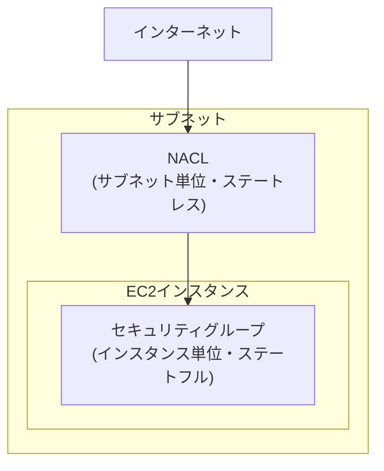

## はじめに

- **この記事で得られること**: [AWSでEC2インスタンスを起動し、Webサーバーを公開するハンズオン](/articles/aws-ec2-webserver-handson-guide)で扱った**セキュリティグループ**は、VPCの中で通信を制御する仕組みの1つにすぎません。この記事では、もう1つの通信制御の仕組みである**ネットワークACL**(NACL)との違いを、**適用単位**と**ステートフル/ステートレス**という2つの軸から体系的に理解します。
- **対象読者**: セキュリティグループを設定したことはあるが、NACLという別の仕組みが存在することを知らない、あるいは両者の違いを説明できない方を想定しています。
- **読むのにかかる想定時間**: 約15分

この記事は[『上位1%』シリーズ 全記事ガイド](/sitemap)の一部、[AWS基礎シリーズ](/sitemap#シリーズ一覧)の16本目です。

## 全体像をつかむ

## 基礎から徹底解説

### 適用単位の違い:インスタンス単位か、サブネット単位か

- **セキュリティグループ**は、**EC2インスタンス(正確にはネットワークインターフェイス)単位**で適用されます。同じサブネットの中にあるインスタンスでも、異なるセキュリティグループをアタッチすれば、それぞれ異なる制御ができます。
- **NACL**は、**サブネット単位**で適用されます。あるサブネットにNACLを紐づけると、そのサブネット内のすべてのインスタンスに、同じルールが一律に適用されます。

**この違いから、NACLは「サブネット全体に対する、大まかな防波堤」、セキュリティグループは「インスタンスごとの、きめ細かい制御」という役割分担が生まれます。**

### 設計思想の違い:ステートフルか、ステートレスか

これが、両者の最大の違いです。

- **セキュリティグループ(ステートフル)**: [AWSでEC2インスタンスを起動し、Webサーバーを公開するハンズオン](/articles/aws-ec2-webserver-handson-guide)で扱った通り、インバウンドで許可した通信の「戻り」となるアウトバウンド通信は、自動的に許可されます。アウトバウンドルールを別途書く必要はありません。
- **NACL(ステートレス)**: **インバウンドとアウトバウンドを、完全に独立した、別々のルールとして設定する必要があります。** インバウンドで80番ポートへの通信を許可しても、その応答(戻りの通信)を許可するアウトバウンドルールを別途書かなければ、通信は成立しません。

## プロが見ている視点(上位1%の理解)

### NACLでアウトバウンドの許可を忘れると、通信が「なぜか」壊れる

オンプレミス環境のステートレスなファイアウォールに慣れていない人が、NACLを初めて設定する際に最もよく踏む落とし穴が、**「インバウンドさえ許可すれば、通信は成立するはずだ」という思い込み**です。セキュリティグループのステートフルな挙動に慣れていると、NACLでも同じように振る舞ってくれると錯覚しがちですが、**NACLは応答パケットも独立した通信として扱うため、戻りのポート範囲(エフェメラルポート、一般的に1024〜65535番)へのアウトバウンドを明示的に許可しておかないと、せっかく許可したはずの通信が、応答を受け取れずに失敗します。** [トップページ](/)で扱っているような、通信のトラブルシューティングを行う際は、「セキュリティグループは通ったが、NACLで止まっている」という可能性を、常に選択肢に入れておく必要があります。

### ルールの評価順序:番号の小さいルールが優先される

NACLのルールには、それぞれ番号(ルール番号)が付いています。**NACLは、番号の小さい順にルールを評価し、最初にマッチしたルールが適用されます。** これは、[過剰な権限を持つIAMポリシーの危険性を再現し最小権限に絞り込むハンズオン](/articles/aws-least-privilege-policy-handson-guide)で扱った、IAMポリシーの「明示的なDenyが優先される」という評価ロジックとは、根本的に異なる仕組みです。NACLでは、Denyのルールであっても、それより小さい番号のAllowルールが先にマッチしてしまえば、そのAllowが適用されてしまいます。**ルール番号の設計(将来のルール追加を見越した、余裕を持った間隔での採番)が、NACL運用における実務上の重要なポイントです。**

## よくある誤解・つまずきポイント

- **誤解1: 「NACLも、セキュリティグループと同じようにステートフルに動作する」**
  NACLはステートレスであり、インバウンドとアウトバウンドを、それぞれ独立して許可する必要があります。
- **誤解2: 「セキュリティグループとNACLは、どちらか一方だけを設定すればよい」**
  両方が同時に評価対象になります。どちらか一方でブロックされれば、通信は成立しません。
- **誤解3: 「NACLでは、Denyルールが常にAllowルールより優先される」**
  NACLは番号の小さい順にルールを評価し、最初にマッチしたルールが適用されます。IAMポリシーの評価ロジックとは異なります。

## 障害・トラブルシューティングの視点

1. **セキュリティグループでは許可しているはずなのに、通信が届かない**: サブネットに紐づいたNACLで、インバウンド・アウトバウンドの両方が正しく許可されているかを確認します。特に、応答用のエフェメラルポート範囲へのアウトバウンド許可を見落としていないかを確認します。
2. **NACLのルールを追加したのに、意図通りに機能しない**: ルール番号を確認し、意図しない番号の小さいルールが先にマッチしていないかを確認します。
3. **一部のインスタンスだけ通信できない**: そのインスタンスにアタッチされているセキュリティグループが、他のインスタンスと異なっていないかを確認します(NACLはサブネット単位で共通のはずです)。

## まとめ

- セキュリティグループはインスタンス単位、NACLはサブネット単位で適用されます。
- セキュリティグループはステートフルで戻りの通信が自動許可されますが、NACLはステートレスでインバウンド・アウトバウンドを個別に許可する必要があります。
- NACLは番号の小さい順にルールが評価され、最初にマッチしたルールが適用されます。
- セキュリティグループとNACLは両方が同時に評価対象になり、どちらか一方でブロックされれば通信は成立しません。

**今日から意識すべきこと**
1. NACLを設定する際は、インバウンドだけでなく、応答用のアウトバウンド(エフェメラルポート範囲)も必ず許可しましょう。
2. 通信トラブルの切り分けでは、セキュリティグループとNACLの両方を、独立して確認する習慣をつけましょう。

## 参考文献

- [Network ACLs | AWS Documentation](https://docs.aws.amazon.com/vpc/latest/userguide/vpc-network-acls.html)
- [Security groups for your VPC | AWS Documentation](https://docs.aws.amazon.com/vpc/latest/userguide/VPC_SecurityGroups.html)
