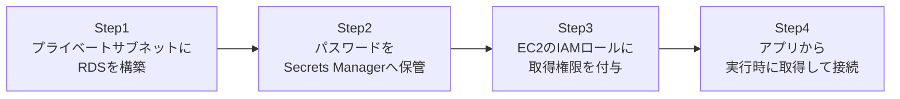

## はじめに

- **この記事で得られること**: [IAMロールでEC2にアクセスキーを一切持たせない『上位1%』のハンズオン](/articles/aws-iam-role-handson-guide)で扱ったIAMロールの考え方を、データベースの認証情報にも拡張します。プライベートサブネットにRDSを構築し、そのDB接続パスワードをアプリのコードや設定ファイルに一切書かず、**Secrets Manager**から実行時に取得する構成を体験します。
- **対象読者**: RDSに接続する際、パスワードを環境変数や設定ファイルにベタ書きしたことがある方を想定しています。
- **読むのにかかる想定時間**: 約25分(実際に構築しながら進める場合は50分程度を見込んでください)

この記事は[『上位1%』シリーズ 全記事ガイド](/sitemap)の一部、[AWS基礎シリーズ](/sitemap#シリーズ一覧)の6本目です。

## 前提知識

- [パブリック/プライベートサブネットを持つVPCを自力で構築する『上位1%』のハンズオン](/articles/aws-vpc-handson-guide): このハンズオンでは、そこで構築したプライベートサブネットへRDSを配置します。

## 全体像をつかむ

このハンズオンで行うことは、次の4ステップです。



## ハンズオン手順

### Step 1: プライベートサブネットにRDSを構築する

前回構築したプライベートサブネットに、MySQL互換のRDSインスタンスを作成します。

```bash
aws rds create-db-instance \
  --db-instance-identifier my-app-db \
  --db-instance-class db.t3.micro \
  --engine mysql \
  --master-username admin \
  --master-user-password "TemporaryP@ss123!" \
  --allocated-storage 20 \
  --db-subnet-group-name my-private-subnet-group \
  --no-publicly-accessible
```

**`--no-publicly-accessible`を明示的に指定していることに注目してください。** RDSにパブリックIPを持たせず、プライベートサブネット内からしか到達できないようにすることが、本番運用の大前提です。ここで指定した`master-user-password`は、あくまで作成時の初期値であり、この後すぐにSecrets Manager経由の運用へ切り替えます。

### Step 2: パスワードをSecrets Managerへ保管する

DB接続に必要な情報一式を、Secrets Managerのシークレットとして保管します。

```bash
aws secretsmanager create-secret \
  --name my-app-db-credentials \
  --secret-string '{"username":"admin","password":"TemporaryP@ss123!","host":"my-app-db.xxxx.ap-northeast-1.rds.amazonaws.com","port":3306}'
```

**この時点で、アプリ側のコードや設定ファイルには、パスワードが一切登場しません。** アプリが必要としているのは「このシークレット名から情報を取得する権限」だけであり、パスワードの値そのものではありません。

### Step 3: EC2のIAMロールに取得権限を付与する

アプリが動作するEC2インスタンスのIAMロールに、このシークレットだけを読み取れる権限を付与します。

```json
{
  "Version": "2012-10-17",
  "Statement": [{
    "Effect": "Allow",
    "Action": "secretsmanager:GetSecretValue",
    "Resource": "arn:aws:secretsmanager:ap-northeast-1:123456789012:secret:my-app-db-credentials-*"
  }]
}
```

**`Resource`を特定のシークレットのARNだけに絞り込んでいる点が重要です。** ワイルドカードで全シークレットを対象にしてしまうと、このEC2が乗っ取られた場合に、他のアプリのDBパスワードまで読み取られてしまいます。

### Step 4: アプリから実行時に取得して接続する

アプリの起動時に、SDK経由でSecrets Managerからこのシークレットを取得し、DB接続に使います。

```python
import boto3
import json
import pymysql

client = boto3.client("secretsmanager", region_name="ap-northeast-1")
secret = json.loads(client.get_secret_value(SecretId="my-app-db-credentials")["SecretString"])

conn = pymysql.connect(
    host=secret["host"], user=secret["username"],
    password=secret["password"], port=secret["port"]
)
```

**このコードには、アクセスキーもDBパスワードも、一切書かれていません。** `boto3.client`は、EC2にアタッチされたIAMロールの一時的な認証情報を自動的に使い、その認証情報を使ってSecrets Managerから初めてDBパスワードを取得しています。

## プロが見ている視点(上位1%の理解)

### パスワードのローテーションが、コード変更なしで実現できる

Secrets Managerには、保管しているシークレットを定期的に自動でローテーション(値を新しいものへ入れ替える)する機能があります。RDSと組み合わせた場合、RDS側のパスワード変更とSecrets Manager側のシークレット更新を、Lambda関数が自動的に同期して行います。**アプリ側のコードは「実行時にSecrets Managerから取得する」という処理のままで変更不要**であり、パスワードが裏側で定期的に入れ替わっていることに、アプリは気づく必要すらありません。これは、アクセスキーの定期ローテーションを運用でやろうとすると非常に手間がかかるのに対し、パスワードという別の種類の認証情報でも同じ設計思想(認証情報を短命化し、露出の窓を狭める)が実現できることを示しています。

### RDSがプライベートサブネットに置かれるべき理由

[パブリック/プライベートサブネットを持つVPCを自力で構築する『上位1%』のハンズオン](/articles/aws-vpc-handson-guide)で扱った通り、プライベートサブネットは「外部から接続を開始できない」サブネットです。RDSのようなデータベースは、正規のアプリサーバー以外から接続を受け付ける必要が本来一切ないため、プライベートサブネットに置き、パブリックアクセスを完全に無効化することが、実務上の標準的な設計です。**「開発中は楽だから」という理由でRDSをパブリックアクセス可能にしたまま本番へ持ち込んでしまう**のは、実務で頻発する重大な設計ミスです。

## よくある誤解・つまずきポイント

- **誤解1: 「Secrets Managerに保管すれば、アプリ側は一切何もしなくてよい」**
  アプリ側には、実行時にSecrets Managerからシークレットを取得するコードと、それを許可するIAM権限の両方が必要です。
- **誤解2: 「IAMロールにSecretsManagerFullAccessのような広い権限を付与しておけば安全」**
  特定のシークレットのARNだけに絞り込んだ、最小権限のポリシーを付与するべきです。
- **誤解3: 「RDS作成時のmaster-user-passwordがそのまま本番運用のパスワードになる」**
  作成時のパスワードはあくまで初期値であり、Secrets Manager経由の運用に切り替えた後は、自動ローテーションによって定期的に変わっていくべきものです。

## 障害・トラブルシューティングの視点

1. **アプリからSecrets Managerへのアクセスが`AccessDenied`になる**: EC2にアタッチされたIAMロールに、そのシークレットのARNに対する`secretsmanager:GetSecretValue`権限があるか確認してください。
2. **アプリからRDSへの接続がタイムアウトする**: RDSとEC2が同じVPC内にあり、RDSのセキュリティグループがEC2からの接続元IPまたはセキュリティグループを許可しているか確認してください。
3. **パスワードローテーション後、アプリが古いパスワードで接続エラーになる**: アプリがシークレットをキャッシュしたままにしていないか、ローテーションのたびに再取得する設計になっているか確認してください。

## まとめ

- Secrets Managerを使うと、DBパスワードをアプリのコードや設定ファイルに一切書かずに済みます。
- IAMロールに付与するSecrets Managerの権限は、特定のシークレットのARNだけに絞り込みます。
- Secrets Managerの自動ローテーション機能により、アプリのコード変更なしでパスワードを定期的に入れ替えられます。
- RDSはプライベートサブネットに置き、パブリックアクセスを完全に無効化することが標準的な設計です。

**今日から意識すべきこと**
1. DBパスワードを環境変数や設定ファイルに書いている既存のアプリがあれば、Secrets Manager経由への移行を検討しましょう。
2. IAMロールに権限を付与する際は、常に「そのロールが本当に必要とする、最小限のリソースだけ」に絞り込みましょう。

## 参考文献

- [Rotate secrets | AWS Documentation](https://docs.aws.amazon.com/secretsmanager/latest/userguide/rotating-secrets.html)
- [Amazon RDS | AWS Documentation](https://docs.aws.amazon.com/AmazonRDS/latest/UserGuide/Welcome.html)
