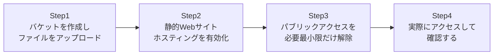

## はじめに

- **この記事で得られること**: AWSの中でも最も基本的なサービスの1つである**S3**(Simple Storage Service)で、実際にバケットを作成し、静的Webサイトホスティングを有効化して、インターネットから実際にアクセスできる状態にします。**S3が既定ではすべてのパブリックアクセスをブロックしている**という安全側の設計を理解したうえで、そのブロックを「バケット単位で」「本当に必要な操作だけ」正しく解除する方法を体験します。
- **対象読者**: S3にファイルをアップロードしたことはあるが、パブリックアクセスの仕組みや、公開設定でつまずいたことがある方を想定しています。
- **読むのにかかる想定時間**: 約20分(実際に構築しながら進める場合は40分程度を見込んでください)

この記事は[『上位1%』シリーズ 全記事ガイド](/sitemap)の一部、[AWS基礎シリーズ](/sitemap#シリーズ一覧)の4本目です。

## 全体像をつかむ

このハンズオンで行うことは、次の4ステップです。



## ハンズオン手順

### Step 1: バケットを作成し、ファイルをアップロードする

S3バケットを作成し、簡単なHTMLファイルをアップロードします。

```bash
aws s3 mb s3://my-unique-bucket-name-12345
echo '<h1>Hello from S3!</h1>' > index.html
aws s3 cp index.html s3://my-unique-bucket-name-12345/
```

**バケット名は、自分のAWSアカウント内だけでなく、全世界のAWSユーザーの中で一意でなければなりません。** この時点でアップロードしたファイルへ、既定の設定のままブラウザからアクセスしようとしても、`AccessDenied`エラーになります。

### Step 2: 静的Webサイトホスティングを有効化する

バケットのプロパティから、静的Webサイトホスティングを有効化します。

```bash
aws s3 website s3://my-unique-bucket-name-12345/ --index-document index.html
```

**この設定だけでは、まだサイトは公開されません。** 静的Webサイトホスティングの有効化と、実際にファイルを外部から読み取れるようにする権限設定は、別々の話です。

### Step 3: パブリックアクセスを必要最小限だけ解除する

まず、このバケットの「パブリックアクセスをすべてブロック」設定を無効化します。

```bash
aws s3api put-public-access-block --bucket my-unique-bucket-name-12345 --public-access-block-configuration "BlockPublicAcls=false,IgnorePublicAcls=false,BlockPublicPolicy=false,RestrictPublicBuckets=false"
```

**この設定は、あくまで「バケットポリシーによるパブリックアクセスの設定自体を、AWS側がブロックしなくなる」ようにするだけです。** 続けて、バケットポリシーで、実際に許可する操作を明示的に指定します。

```bash
cat > policy.json << 'EOF'
{
  "Version": "2012-10-17",
  "Statement": [{
    "Sid": "PublicReadGetObject",
    "Effect": "Allow",
    "Principal": "*",
    "Action": "s3:GetObject",
    "Resource": "arn:aws:s3:::my-unique-bucket-name-12345/*"
  }]
}
EOF
aws s3api put-bucket-policy --bucket my-unique-bucket-name-12345 --policy file://policy.json
```

**このポリシーで許可しているのは、`s3:GetObject`(オブジェクトの読み取り)だけです。** 誰でもファイルを読めるようにはなりますが、アップロード・削除・上書きといった操作は、このポリシーだけでは一切許可されません。

### Step 4: 実際にアクセスして確認する

静的Webサイトホスティングのエンドポイントへ、ブラウザまたは`curl`でアクセスしてください。

```bash
curl http://my-unique-bucket-name-12345.s3-website-<リージョン>.amazonaws.com/
```

**`<h1>Hello from S3!</h1>`が返ってくれば成功です。** ここまでの手順を通じて、「パブリックアクセスブロックの解除」と「実際に何を許可するかのバケットポリシー」という、2段階の設定が必要だったことを振り返ってください。

## プロが見ている視点(上位1%の理解)

### なぜ「パブリックアクセスのブロック」が、バケットポリシーとは別に存在するのか

S3には、バケットポリシーやACLとは別に、**パブリックアクセスブロック**という、アカウントレベル・バケットレベルの安全装置が存在します。**この設計の背景には、S3バケットの意図しない公開設定が、クラウド業界全体で最も頻発する情報漏洩事故の原因の1つだった、という歴史的経緯があります。** 誰かが誤って「全世界に公開」を意味するバケットポリシーやACLを設定してしまっても、このパブリックアクセスブロックが有効になっている限り、実際には公開されません。**「うっかりミスをしても、最後の砦がブロックしてくれる」という、多層防御(Defense in Depth)の考え方の、AWSにおける具体的な実装**がこの機能です。今回のハンズオンのように、本当に公開したいバケットに限って、意図的にこのブロックを解除するという運用が、実務での正しい使い方です。

### バージョニングという、S3自身が持つ「元に戻す」機能

S3には、[誤って削除したユーザー・OUを復元するAD ごみ箱のハンズオン](/articles/ad-recycle-bin-handson-guide)で扱ったAD ごみ箱と、発想の似た機能があります。**バージョニング**を有効化すると、同じキー(ファイルパス)へファイルを上書き・削除しても、過去のバージョンが自動的に保持され、後から復元できます。

```bash
aws s3api put-bucket-versioning --bucket my-unique-bucket-name-12345 --versioning-configuration Status=Enabled
```

**バージョニングを有効化すると、削除操作は実際にはファイルを消すのではなく、「削除マーカー」という特殊なバージョンを追加するだけの操作になります。** この削除マーカーを削除すれば、元のファイルが復活します。誤ってファイルを上書き・削除してしまうという、実務で頻発する事故への備えとして、重要なデータを置くバケットでは有効化しておくことが推奨されます。

## よくある誤解・つまずきポイント

- **誤解1: 「S3バケットは既定でパブリックに公開されている」**
  現在のS3バケットは、既定ですべてのパブリックアクセスがブロックされています。かつては既定が異なっていた時期もありましたが、現在は安全側がデフォルトです。
- **誤解2: 「パブリックアクセスブロックを解除すれば、それだけでファイルが公開される」**
  パブリックアクセスブロックの解除は、あくまでバケットポリシーやACLによる公開設定を「許可する」だけです。実際に公開するには、別途バケットポリシーなどで明示的に許可を与える必要があります。
- **誤解3: 「バージョニングを有効化すると、ストレージ容量が際限なく増え続ける」**
  ライフサイクルポリシーを組み合わせることで、一定期間が経過した古いバージョンを自動的に削除し、コストを制御できます。

## 障害・トラブルシューティングの視点

1. **静的Webサイトホスティングを有効化したのに、`AccessDenied`になる**: パブリックアクセスブロックの解除と、バケットポリシーでの`s3:GetObject`許可の両方が設定されているかを確認してください。
2. **`PutBucketPolicy`コマンド自体が失敗する**: そのバケットのパブリックアクセスブロック設定(特に`BlockPublicPolicy`)が、まだ有効なままになっていないかを確認してください。
3. **誤って上書き・削除したファイルを復元したい**: バージョニングが事前に有効化されていたか、`aws s3api list-object-versions`で過去のバージョンを確認してください。

## まとめ

- S3バケットは既定ですべてのパブリックアクセスがブロックされており、公開するには明示的な解除が必要です。
- パブリックアクセスブロックの解除と、バケットポリシーでの許可は、別々の2段階の設定です。
- パブリックアクセスブロックは、意図しない公開設定に対する多層防御の安全装置です。
- バージョニングを有効化すると、削除は実際には削除マーカーの追加になり、後から復元できます。

**今日から意識すべきこと**
1. S3バケットを公開する際は、バケット全体ではなく、必要なオブジェクト・操作だけに絞ったポリシーを書きましょう。
2. 重要なデータを置くバケットでは、バージョニングの有効化を標準の運用にしましょう。

## 参考文献

- [Blocking public access to your Amazon S3 storage | AWS Documentation](https://docs.aws.amazon.com/AmazonS3/latest/userguide/access-control-block-public-access.html)
- [Hosting a static website using Amazon S3 | AWS Documentation](https://docs.aws.amazon.com/AmazonS3/latest/userguide/WebsiteHosting.html)
