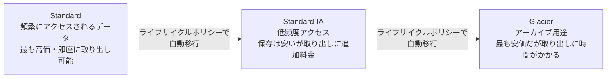

## はじめに

- **この記事で得られること**: [S3バケットで静的Webサイトを公開するハンズオン](/articles/aws-s3-static-website-handson-guide)では、S3の既定のストレージクラス(Standard)をそのまま使いました。この記事では、S3が、**なぜ複数の「ストレージクラス」を用意しているのか**、それぞれがどういうアクセス頻度を前提に設計されているのか、そして**ライフサイクルポリシー**による自動移行の仕組みを体系的に理解します。
- **対象読者**: S3にファイルを保存したことはあるが、Standard以外のストレージクラスを意識して使い分けたことがない方を想定しています。
- **読むのにかかる想定時間**: 約15分

この記事は[『上位1%』シリーズ 全記事ガイド](/sitemap)の一部、[AWS基礎シリーズ](/sitemap#シリーズ一覧)の15本目です。

## 全体像をつかむ

## 基礎から徹底解説

### なぜストレージクラスが複数存在するのか

S3の料金は、**保存容量そのものの単価**と、**データを取り出す際の追加料金**という、2つの要素で構成されています。**この2つの要素のバランスを、データのアクセス頻度に応じて変えているのが、ストレージクラスの正体**です。

- **S3 Standard**: 頻繁にアクセスされることを前提とした、既定のクラスです。保存容量の単価は最も高いですが、取り出しに追加料金は発生しません。
- **S3 Standard-IA(低頻度アクセス)**: 月に1回程度など、アクセス頻度が低いデータ向けです。保存容量の単価はStandardより安い代わりに、データを取り出すたびに追加料金が発生します。
- **S3 Glacier**: 法定保存期間中のログのような、ほぼアクセスされないアーカイブ用途向けです。保存容量の単価は極めて安い代わりに、取り出しには数分から数時間の時間がかかります。

**「保存は安いが取り出しは高い」というトレードオフの構造そのものは、すべての低頻度向けクラスに共通しています。** アクセス頻度を見誤って、実際には頻繁にアクセスするデータをGlacierに置いてしまうと、取り出し料金が積み重なり、かえって高くつくことがあります。

### ライフサイクルポリシー:時間の経過に応じた自動移行

**ライフサイクルポリシー**を設定すると、「作成から30日経過したらStandard-IAへ、90日経過したらGlacierへ」というように、**データのアクセス頻度が時間とともに下がっていくという前提**に基づいて、ストレージクラスの移行を自動化できます。ログファイルやバックアップデータのように、**作成直後はよく参照されるが、時間が経つにつれてほとんど参照されなくなる**という、典型的なアクセスパターンを持つデータに、特に有効です。

## プロが見ている視点(上位1%の理解)

### 「安いから」という理由だけでGlacierを選ぶことの危険性

Glacierは保存単価が最も安いため、コスト削減の観点だけで安易に選ばれがちですが、**実務で重要なのは、そのデータを実際に取り出す必要が生じたときの、時間的な制約と追加コストです。** 障害調査で過去のログを緊急に確認したい、といった場面で、そのログがGlacierに保存されていた場合、取り出しに数時間かかることで、調査そのものが遅延してしまいます。**ストレージクラスの選定は、「保存コストをどれだけ下げられるか」だけでなく、「実際に必要になったとき、どれだけ早く取り出せる必要があるか」という、事業継続の観点からも判断するべき**です。

### バージョニングとライフサイクルポリシーの組み合わせ

[S3バケットで静的Webサイトを公開するハンズオン](/articles/aws-s3-static-website-handson-guide)で扱った**バージョニング**を有効化すると、上書き・削除のたびに過去のバージョンが蓄積していきます。**ライフサイクルポリシーは、この「過去のバージョン」に対しても、一定期間経過後の削除や、より安価なストレージクラスへの移行を設定できます。** バージョニングを有効化したまま、ライフサイクルポリシーを設定し忘れると、古いバージョンが際限なく蓄積し、ストレージコストが静かに膨らみ続ける、という実務上よくある落とし穴につながります。

## よくある誤解・つまずきポイント

- **誤解1: 「Glacierは、保存コストが安いので、常にGlacierを選ぶべきである」**
  取り出しにかかる時間と追加コストを考慮せずにGlacierを選ぶと、緊急時の対応が遅れたり、かえって高くつくことがあります。
- **誤解2: 「ライフサイクルポリシーは、削除だけを自動化する機能である」**
  削除だけでなく、より安価なストレージクラスへの自動移行も、ライフサイクルポリシーの重要な機能です。
- **誤解3: 「バージョニングを有効化すると、ストレージコストは必ず際限なく増え続ける」**
  ライフサイクルポリシーで、古いバージョンの自動削除や自動移行を設定すれば、コストを制御できます。

## 障害・トラブルシューティングの視点

1. **想定よりS3のコストが高い**: 頻繁にアクセスするデータが、誤ってStandard-IAやGlacierに置かれていないか、そのアクセスに伴う取り出し料金が発生していないかを確認します。
2. **Glacierに保存したデータをすぐに取り出したい**: Glacierには複数の取り出しオプション(標準・迅速・大容量)があり、迅速オプションを使えば数分での取り出しも可能ですが、追加コストが発生します。
3. **バケットのストレージ使用量が想定より増え続けている**: バージョニングが有効化されているにもかかわらず、ライフサイクルポリシーが設定されていない可能性を確認します。

## まとめ

- S3のストレージクラスは、保存単価と取り出し料金のバランスを、アクセス頻度に応じて変えたものです。
- Standard-IAやGlacierは保存が安い代わりに、取り出しに追加料金や時間がかかります。
- ライフサイクルポリシーを使うと、時間経過に応じたストレージクラスの自動移行や削除を実現できます。
- ストレージクラスの選定は、コストだけでなく、実際に取り出す必要が生じたときの時間的制約も踏まえて判断するべきです。

**今日から意識すべきこと**
1. データを保存する際は、そのアクセス頻度を見積もった上で、適切なストレージクラスを選びましょう。
2. バージョニングを有効化するバケットには、必ずライフサイクルポリシーもあわせて設定しましょう。

## 参考文献

- [Amazon S3 Storage Classes | AWS Documentation](https://docs.aws.amazon.com/AmazonS3/latest/userguide/storage-class-intro.html)
- [Managing your storage lifecycle | AWS Documentation](https://docs.aws.amazon.com/AmazonS3/latest/userguide/object-lifecycle-mgmt.html)
