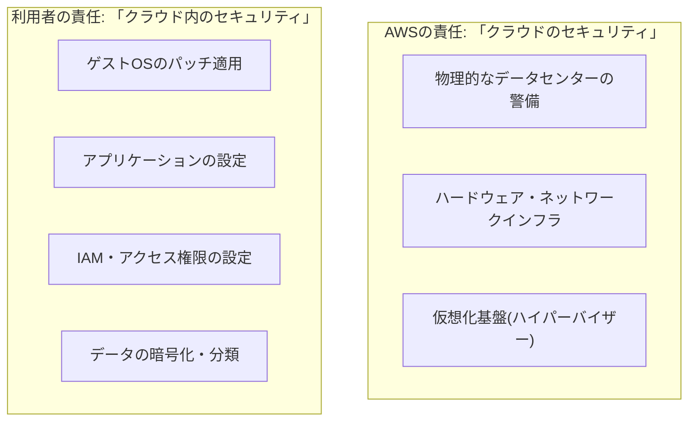

## はじめに

- **この記事で得られること**: [過剰な権限を持つIAMポリシーの危険性を再現し最小権限に絞り込むハンズオン](/articles/aws-least-privilege-policy-handson-guide)などで、暗黙のうちに「これはAWSが守ってくれる部分」「これは自分たちで守るべき部分」という前提を使ってきました。この記事では、その前提となっている**責任共有モデル**(Shared Responsibility Model)を、体系的に理解します。
- **対象読者**: AWSを使っているが、「セキュリティはAWSにお任せしていれば安心」だと漠然と思っている、あるいは逆にどこまでが自分たちの責任範囲なのか説明できない方を想定しています。
- **読むのにかかる想定時間**: 約15分

この記事は[『上位1%』シリーズ 全記事ガイド](/sitemap)の一部、[AWS基礎シリーズ](/sitemap#シリーズ一覧)の13本目です。

## 全体像をつかむ

## 基礎から徹底解説

### 「クラウドのセキュリティ」と「クラウド内のセキュリティ」

AWSの責任共有モデルは、責任の範囲を、次の2つの言葉で明確に分けています。

- **「クラウドのセキュリティ(Security OF the Cloud)」**: AWS自身が担う責任です。物理的なデータセンターの警備、ハードウェア、ネットワークインフラ、そして仮想化基盤(ハイパーバイザー)そのものの安全性がここに含まれます。
- **「クラウド内のセキュリティ(Security IN the Cloud)」**: 利用者(自社)が担う責任です。ゲストOSへのパッチ適用、アプリケーションの設定、IAMによるアクセス権限の管理、データの暗号化・分類などが、ここに含まれます。

**この2つの言葉が、たった前置詞1つ(of/in)で区別されているという点が、この責任共有モデルの本質を端的に表しています。** AWSが「クラウドという建物そのもの」を守り、利用者が「その建物の中に置いた自分の荷物」を守る、という役割分担です。

### 責任の境界線は、使うサービスによって変わる

**責任の境界線は、すべてのサービスで同じ位置にあるわけではありません。** [AWSでEC2インスタンスを起動し、Webサーバーを公開するハンズオン](/articles/aws-ec2-webserver-handson-guide)で扱ったEC2のような、**インフラ型のサービス**(IaaS)では、OSより上のレイヤー(OSのパッチ適用、ミドルウェアの設定、アプリケーションのコードなど)は、すべて利用者の責任です。一方、RDSのような**マネージド型のサービス**(マネージドサービス)では、OSやデータベースエンジン自体のパッチ適用は、AWS側の責任範囲に含まれます。**サービスの種類が変わると、利用者が自分で守らなければならない範囲そのものが変わる**、という理解が重要です。

## プロが見ている視点(上位1%の理解)

### 「AWSを使っているから安全」という思い込みが生む、実際のセキュリティ事故

クラウド関連のセキュリティ事故の多くは、AWS側のインフラが破られたことによるものではなく、**利用者側の責任範囲、つまり「クラウド内のセキュリティ」の設定ミスが原因**です。[S3バケットで静的Webサイトを公開するハンズオン](/articles/aws-s3-static-website-handson-guide)で扱った、意図しないS3バケットの公開設定などは、その典型例です。**AWSが「クラウドのセキュリティ」をどれだけ堅牢に守っていても、利用者側が「クラウド内のセキュリティ」を誤って設定すれば、その部分からいくらでも情報は漏洩します。** 「クラウドを使えば、それだけでセキュリティが向上する」という発想は危険で、正しくは「クラウドは、利用者が正しく設定した範囲についてのみ、高いセキュリティを提供してくれる」と理解するべきです。

### マネージドサービスを選ぶことは、責任範囲を意図的に減らす選択である

EC2の代わりにRDSを選ぶ、自前のロードバランサーの代わりにELBを選ぶ、といった判断は、単なる機能・コストの比較だけでなく、**「自社が背負う責任範囲を、意図的にAWS側へ寄せる」という、セキュリティ上の設計判断でもあります。** OSのパッチ適用を自社で管理し続ける体制がない、あるいはその工数を他の業務に使いたい場合、マネージドサービスを積極的に選ぶことは、責任共有モデルを踏まえた、合理的な選択です。

## よくある誤解・つまずきポイント

- **誤解1: 「AWSを使っていれば、セキュリティ対策は基本的に不要である」**
  AWSが担うのは「クラウドのセキュリティ」だけであり、「クラウド内のセキュリティ」は利用者自身の責任です。
- **誤解2: 「責任の境界線は、どのAWSサービスを使っても同じ位置にある」**
  EC2のようなIaaS型のサービスと、RDSのようなマネージドサービスでは、利用者が責任を持つべき範囲が異なります。
- **誤解3: 「クラウド関連のセキュリティ事故は、主にAWS側の不具合が原因である」**
  実際には、利用者側の設定ミス(「クラウド内のセキュリティ」)が原因であることが大半です。

## 障害・トラブルシューティングの視点

1. **セキュリティインシデントが発生した際、どちらの責任範囲かを切り分けたい**: AWSが公開している、サービスごとの責任共有モデルの詳細ドキュメントを確認し、そのサービスでどこまでがAWSの責任範囲かを確認します。
2. **監査で「AWSのセキュリティ対策」について説明を求められた**: 自社が管理すべき「クラウド内のセキュリティ」の項目(IAM設定、暗号化、パッチ適用状況など)を、まず棚卸しします。
3. **マネージドサービスへの移行を検討している**: 現在自社が担っている責任範囲のうち、どこまでをAWS側に移せるかを、責任共有モデルに沿って整理します。

## まとめ

- AWSの責任共有モデルは、「クラウドのセキュリティ」(AWSの責任)と「クラウド内のセキュリティ」(利用者の責任)を明確に分けています。
- 責任の境界線は、EC2のようなIaaS型サービスか、RDSのようなマネージドサービスかによって変わります。
- クラウド関連のセキュリティ事故の多くは、利用者側の「クラウド内のセキュリティ」の設定ミスが原因です。
- マネージドサービスを選ぶことは、責任範囲を意図的にAWS側へ寄せる、セキュリティ上の設計判断でもあります。

**今日から意識すべきこと**
1. 新しいAWSサービスを使い始めるときは、そのサービスにおける責任の境界線がどこにあるかを、まず確認しましょう。
2. 「AWSを使っているから安全」という思い込みを捨て、自社が担うべき「クラウド内のセキュリティ」の項目を定期的に棚卸ししましょう。

## 参考文献

- [Shared Responsibility Model | AWS](https://aws.amazon.com/compliance/shared-responsibility-model/)
