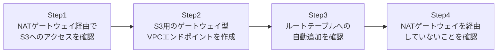

## はじめに

- **この記事で得られること**: [パブリック/プライベートサブネットを持つVPCを自力で構築する『上位1%』のハンズオン](/articles/aws-vpc-handson-guide)で扱った「NATゲートウェイは通過データ量に課金される」という課題への、実務上の具体的な解決策を体験します。プライベートサブネットからS3へ、NATゲートウェイを経由せず、**VPCエンドポイント**経由で直接アクセスする構成を構築します。
- **対象読者**: NATゲートウェイの課金明細を見て「S3への通信だけでこんなにかかるのか」と驚いたことがある方、あるいはこれから驚くことになる方を想定しています。
- **読むのにかかる想定時間**: 約20分(実際に構築しながら進める場合は35分程度を見込んでください)

この記事は[『上位1%』シリーズ 全記事ガイド](/sitemap)の一部、[AWS基礎シリーズ](/sitemap#シリーズ一覧)の7本目です。

## 全体像をつかむ

このハンズオンで行うことは、次の4ステップです。



## ハンズオン手順

### Step 1: NATゲートウェイ経由でS3へのアクセスを確認する

まず、[パブリック/プライベートサブネットを持つVPCを自力で構築する『上位1%』のハンズオン](/articles/aws-vpc-handson-guide)で構築したプライベートサブネットのEC2から、S3へアクセスします。

```bash
aws s3 ls s3://my-unique-bucket-name-12345/
```

**この時点では、この通信はプライベートサブネットのルートテーブルに従い、NATゲートウェイを経由してS3まで到達しています。** データ量に応じたNATゲートウェイの通過課金が発生する経路です。

### Step 2: S3用のゲートウェイ型VPCエンドポイントを作成する

S3向けの、ゲートウェイ型VPCエンドポイントを作成します。

```bash
aws ec2 create-vpc-endpoint \
  --vpc-id vpc-xxxx \
  --service-name com.amazonaws.ap-northeast-1.s3 \
  --route-table-ids rtb-private \
  --vpc-endpoint-type Gateway
```

**`--vpc-endpoint-type Gateway`(ゲートウェイ型)を指定していることに注目してください。** S3とDynamoDBの2つのサービスだけは、このゲートウェイ型のVPCエンドポイントに対応しており、料金は無料です。

### Step 3: ルートテーブルへの自動追加を確認する

指定したルートテーブルの内容を確認します。

```bash
aws ec2 describe-route-tables --route-table-ids rtb-private
```

**ゲートウェイ型のVPCエンドポイントを作成すると、指定したルートテーブルに、S3のIPアドレス範囲(プレフィックスリスト)を宛先とするルートが自動的に追加されます。** 自分でルートを手動追加する必要はありません。

### Step 4: NATゲートウェイを経由していないことを確認する

再度S3へアクセスし、通信経路が変わったことを、NATゲートウェイの通過データ量のメトリクスで確認します。

```bash
aws s3 ls s3://my-unique-bucket-name-12345/

aws cloudwatch get-metric-statistics \
  --namespace AWS/NATGateway \
  --metric-name BytesOutToDestination \
  --dimensions Name=NatGatewayId,Value=nat-xxxx \
  --start-time 2026-09-26T00:00:00Z --end-time 2026-09-26T23:59:59Z \
  --period 3600 --statistics Sum
```

**VPCエンドポイント経由の通信は、ルートテーブル上でS3宛のルートがVPCエンドポイント経由に切り替わっているため、そもそもNATゲートウェイを通過しません。** CloudWatchのメトリクスにも、このS3アクセス分の通過データ量が計上されなくなっていることが確認できます。

## プロが見ている視点(上位1%の理解)

### ゲートウェイ型とインターフェイス型は、仕組みからして別物

VPCエンドポイントには、S3・DynamoDB専用の**ゲートウェイ型**と、それ以外の大半のAWSサービス(EC2 API、Secrets Manager、SSMなど)向けの**インターフェイス型**という、2つの異なる仕組みが存在します。ゲートウェイ型はルートテーブルへのルート追加という形で実現され、料金は無料です。一方インターフェイス型は、サブネット内にENI(Elastic Network Interface、プライベートIPを持つ仮想NIC)を作成し、そのENI経由でトラフィックを転送する仕組みで、時間課金とデータ処理課金の両方が発生します。**「VPCエンドポイントを使えば必ず無料になる」という思い込みは誤りで、対象サービスによって課金体系がまったく異なる**ことを理解しておく必要があります。

### コスト最適化の実務における優先順位

[RDSとSecrets Managerでアプリにパスワードを一切書かせない『上位1%』のハンズオン](/articles/aws-rds-secrets-handson-guide)で使ったSecrets Managerへのアクセスも、インターフェイス型のVPCエンドポイントを経由させることができます。ただし、インターフェイス型は有料であるため、「NATゲートウェイの課金 vs インターフェイス型VPCエンドポイントの課金」を比較したうえで導入を判断する必要があります。一方、S3・DynamoDBへの通信量が多い設計であれば、無料のゲートウェイ型VPCエンドポイントを導入しない理由がほとんどありません。コスト最適化は「とにかく全部エンドポイント化する」のではなく、通信量とサービスの種類を見て、費用対効果を判断する仕事です。

## よくある誤解・つまずきポイント

- **誤解1: 「VPCエンドポイントを使えば、すべてのAWSサービスへのアクセスが無料になる」**
  無料なのはS3・DynamoDB向けのゲートウェイ型だけです。それ以外のサービス向けのインターフェイス型は有料です。
- **誤解2: 「ゲートウェイ型VPCエンドポイントを作成したら、手動でルートテーブルにルートを追加する必要がある」**
  ゲートウェイ型は、指定したルートテーブルへ自動的にルートが追加されます。手動追加は不要です。
- **誤解3: 「VPCエンドポイントを作れば、NATゲートウェイ自体が不要になる」**
  S3・DynamoDB以外のインターネット向け通信(外部APIへのアクセスなど)には、引き続きNATゲートウェイが必要です。

## 障害・トラブルシューティングの視点

1. **VPCエンドポイントを作成したのに、まだNATゲートウェイを経由しているように見える**: 対象のルートテーブルIDが、実際にプライベートサブネットに関連付けられているルートテーブルと一致しているか確認してください。
2. **インターフェイス型VPCエンドポイント経由でアクセスできない**: そのENIに紐づくセキュリティグループが、接続元からの通信を許可しているか確認してください。
3. **想定よりコスト削減効果が小さい**: NATゲートウェイの通過データ量のうち、実際にS3・DynamoDB向けの通信がどれだけの割合を占めていたか、導入前にCloudWatchメトリクスで確認してください。

## まとめ

- ゲートウェイ型VPCエンドポイントは、S3・DynamoDB専用で、料金は無料です。
- インターフェイス型VPCエンドポイントは、それ以外の大半のAWSサービス向けで、ENI経由の通信となり、料金が発生します。
- ゲートウェイ型は、指定したルートテーブルに自動的にルートを追加します。
- コスト最適化は、通信量とサービスの種類を見て費用対効果を判断する仕事であり、「とにかく全部エンドポイント化する」ことではありません。

**今日から意識すべきこと**
1. NATゲートウェイの通過データ量のうち、S3・DynamoDB向け通信の割合をCloudWatchで確認しましょう。
2. VPCエンドポイントを導入する際は、対象サービスがゲートウェイ型かインターフェイス型かを必ず確認しましょう。

## 参考文献

- [VPC endpoints | AWS Documentation](https://docs.aws.amazon.com/vpc/latest/privatelink/vpc-endpoints.html)
- [Gateway endpoints for Amazon S3 | AWS Documentation](https://docs.aws.amazon.com/vpc/latest/privatelink/vpc-endpoints-s3.html)
