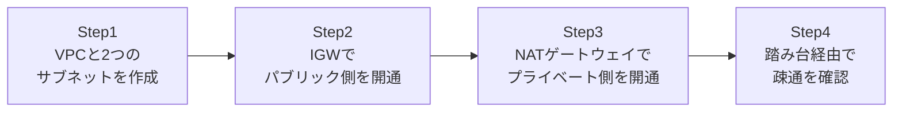

## はじめに

- **この記事で得られること**: [EC2のキーペアとサブネットの予約IPを『上位1%』の視点で理解する](/articles/aws-ec2-networking-basics-guide)で扱ったデフォルトVPCの話を踏まえ、パブリックサブネットとプライベートサブネットを持つ、実務レベルのVPCを自分の手で構築します。インターネットゲートウェイ(IGW)・NATゲートウェイ・ルートテーブルという3つの部品が、それぞれ何をしていて、なぜ3つとも必要なのかを、実際に動かしながら理解します。
- **対象読者**: デフォルトVPCの中でEC2を起動したことはあるが、自分でVPCを一から設計・構築したことがない方を想定しています。
- **読むのにかかる想定時間**: 約25分(実際に構築しながら進める場合は50分程度を見込んでください)

この記事は[『上位1%』シリーズ 全記事ガイド](/sitemap)の一部、[AWS基礎シリーズ](/sitemap#シリーズ一覧)の5本目です。

## 全体像をつかむ

このハンズオンで行うことは、次の4ステップです。



## ハンズオン手順

### Step 1: VPCと2つのサブネットを作成する

`10.0.0.0/16`のVPCの中に、パブリックサブネット用とプライベートサブネット用の、2つのサブネットを作成します。

```bash
aws ec2 create-vpc --cidr-block 10.0.0.0/16
# 出力されたVpcIdを以降のコマンドで使う

aws ec2 create-subnet --vpc-id vpc-xxxx --cidr-block 10.0.1.0/24 --availability-zone ap-northeast-1a
aws ec2 create-subnet --vpc-id vpc-xxxx --cidr-block 10.0.2.0/24 --availability-zone ap-northeast-1a
```

**この時点では、2つのサブネットに実質的な違いは何もありません。** 「パブリック」「プライベート」というのはAWSがサブネットに付けているタグや属性ではなく、これから設定するルートテーブルの内容によって生まれる、あくまで運用上の区分にすぎません。

### Step 2: IGWでパブリック側を開通する

インターネットゲートウェイ(IGW)を作成してVPCにアタッチし、パブリックサブネット用のルートテーブルに、インターネット向けの経路を追加します。

```bash
aws ec2 create-internet-gateway
aws ec2 attach-internet-gateway --vpc-id vpc-xxxx --internet-gateway-id igw-xxxx

aws ec2 create-route-table --vpc-id vpc-xxxx
aws ec2 create-route --route-table-id rtb-public --destination-cidr-block 0.0.0.0/0 --gateway-id igw-xxxx
aws ec2 associate-route-table --subnet-id subnet-public --route-table-id rtb-public
```

**IGWをVPCにアタッチしただけでは、まだどのサブネットもインターネットと通信できません。** `0.0.0.0/0`(すべての宛先)をIGWへ向けるルートを、そのサブネットに紐づくルートテーブルへ明示的に追加して初めて、そのサブネットは「パブリックサブネット」と呼べる状態になります。

### Step 3: NATゲートウェイでプライベート側を開通する

プライベートサブネット側は、IGWへ直接ルートを向けるのではなく、パブリックサブネット内に作成したNATゲートウェイを経由させます。

```bash
aws ec2 allocate-address --domain vpc
aws ec2 create-nat-gateway --subnet-id subnet-public --allocation-id eipalloc-xxxx

aws ec2 create-route-table --vpc-id vpc-xxxx
aws ec2 create-route --route-table-id rtb-private --destination-cidr-block 0.0.0.0/0 --nat-gateway-id nat-xxxx
aws ec2 associate-route-table --subnet-id subnet-private --route-table-id rtb-private
```

**NATゲートウェイは、IGWの代わりになるものではありません。** IGWがインターネットとの双方向の通信を可能にするのに対し、NATゲートウェイが可能にするのは「プライベートサブネット側から外向きに通信を開始する」という、一方向の通信だけです。インターネット側からプライベートサブネット内のインスタンスへ、NATゲートウェイ経由で接続を開始することはできません。

### Step 4: 踏み台経由で疎通を確認する

パブリックサブネットに踏み台(bastion)用のEC2を、プライベートサブネットに本番想定のEC2を、それぞれ起動します。

```bash
# 踏み台経由でプライベートサブネットのEC2へSSH
ssh -J ec2-user@<踏み台のパブリックIP> ec2-user@10.0.2.xxx

# プライベートサブネットのEC2内で、外向き通信を確認
sudo yum update -y
```

**`yum update`が成功すれば、NATゲートウェイ経由の外向き通信が機能していることが確認できます。** 一方で、このEC2に対してインターネット側から直接SSHしようとしても、そもそもパブリックIPを持っていないため到達すらできません。

## プロが見ている視点(上位1%の理解)

### 「パブリック/プライベート」は属性ではなく、ルートテーブルが生む結果

このハンズオンを通じて体験した最も重要な事実は、**サブネットの「パブリック」「プライベート」という区分は、AWSコンソール上のチェックボックスのような属性ではなく、そのサブネットに紐づくルートテーブルの内容によって、結果的に決まっているだけ**だということです。同じサブネットでも、ルートテーブルの`0.0.0.0/0`の向き先をIGWからNATゲートウェイに変更(あるいは削除)すれば、その瞬間に性質が変わります。「このサブネットはパブリックだから安全」という思い込みは危険で、実際にはルートテーブルの中身を確認するまで、そのサブネットの本当の性質は分かりません。

### NATゲートウェイは有料であるという、設計上の現実的な制約

NATゲートウェイは、起動している時間に対する課金に加えて、通過するデータ量に対しても課金が発生します。プライベートサブネットからS3やDynamoDBへ大量のデータを送る設計にしてしまうと、想定外にNATゲートウェイの通過データ量課金が膨らむことがあります。この課題への実務的な解決策(VPCエンドポイントでNATゲートウェイを経由せずにAWSサービスへ直接アクセスする方法)は、ニッチな仕様編の別記事で扱います。

## よくある誤解・つまずきポイント

- **誤解1: 「IGWをVPCにアタッチすれば、VPC内のすべてのサブネットがインターネットと通信できるようになる」**
  IGWのアタッチはVPC全体に対する操作ですが、実際に通信できるかどうかは、サブネットごとのルートテーブルの設定次第です。
- **誤解2: 「NATゲートウェイがあれば、インターネット側からプライベートサブネットへ接続できる」**
  NATゲートウェイが可能にするのは、プライベートサブネット側から外向きに通信を開始する場合だけです。外部から接続を開始することはできません。
- **誤解3: 「プライベートサブネットにはセキュリティグループの設定は不要」**
  ルートテーブルによる到達性と、セキュリティグループによる許可は別のレイヤーです。両方を正しく設定する必要があります。

## 障害・トラブルシューティングの視点

1. **プライベートサブネットのEC2から`yum update`が失敗する**: そのサブネットのルートテーブルに、NATゲートウェイへの`0.0.0.0/0`ルートが正しく設定されているか確認してください。
2. **NATゲートウェイの作成自体が失敗する**: NATゲートウェイには、Elastic IPアドレスの割り当てが必須です。事前に`allocate-address`を実行したか確認してください。
3. **踏み台経由でプライベートサブネットのEC2にSSHできない**: 踏み台側とプライベート側、双方のセキュリティグループでSSH(22番ポート)が許可されているか確認してください。

## まとめ

- 「パブリック/プライベートサブネット」は属性ではなく、ルートテーブルの設定によって決まる区分です。
- IGWは双方向の通信を可能にし、NATゲートウェイはプライベート側からの一方向の通信だけを可能にします。
- NATゲートウェイは時間課金とデータ処理量課金の両方が発生する、有料のコンポーネントです。
- ルートテーブルによる到達性と、セキュリティグループによる許可は、別々に正しく設定する必要があります。

**今日から意識すべきこと**
1. あるサブネットが本当にパブリックかプライベートかを判断するときは、ルートテーブルの中身を必ず確認しましょう。
2. NATゲートウェイを経由する設計にする際は、通過データ量のコストも設計段階で見積もりましょう。

## 参考文献

- [NAT gateways | AWS Documentation](https://docs.aws.amazon.com/vpc/latest/userguide/vpc-nat-gateway.html)
- [Route tables | AWS Documentation](https://docs.aws.amazon.com/vpc/latest/userguide/VPC_Route_Tables.html)
