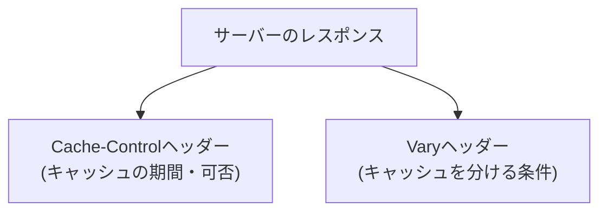

## はじめに

- **この記事で得られること**: [HTTPSの普及とプロキシキャッシュの終焉](/articles/http-caching-cdn-guide)で扱った、ブラウザキャッシュとCDNの基礎を前提に、**Cache-Controlヘッダーの各ディレクティブが、具体的に何を制御しているのか**、そして**Varyヘッダーが、同じURLに対して複数のキャッシュを使い分けさせる仕組み**を体系的に理解します。
- **対象読者**: `Cache-Control: no-cache`や`max-age`という文字列を見たことはあるものの、それぞれが具体的に何を指示しているのか、そしてVaryヘッダーが何のために存在するのかを説明できない方を想定しています。
- **読むのにかかる想定時間**: 約18分

この記事は[『上位1%』シリーズ 全記事ガイド](/sitemap)の一部、[Webプロキシ/キャッシュ基礎シリーズ](/sitemap#シリーズ一覧)の6本目です。

## 前提知識

- **ブラウザキャッシュとCDNの基礎**: [HTTPSの普及とプロキシキャッシュの終焉](/articles/http-caching-cdn-guide)で扱った、キャッシュがどこで(ブラウザ/CDN)行われるようになったかという基礎です。本記事では、そのキャッシュの挙動を、サーバー側がどう制御するのかを扱います。

## 全体像をつかむ

キャッシュを制御する仕組みは、大きく2つの役割に分かれます。**「このレスポンスを、どのくらいの期間キャッシュしてよいか」を指示するCache-Control**と、**「同じURLでも、どんな条件が違えば、別々のキャッシュとして扱うべきか」を指示するVary**です。



## 基礎から徹底解説

### Cache-Control:よく使われる主要なディレクティブ

| ディレクティブ | 意味 |
|---|---|
| `max-age=<秒>` | レスポンスが「新鮮」とみなされる期間を、秒数で指定します。 |
| `no-cache` | **キャッシュに保存すること自体は許可しますが、使う前に必ずサーバーへ再検証(有効性の確認)を行うことを強制します。** |
| `no-store` | キャッシュへの保存そのものを、一切禁止します。 |
| `private` | ブラウザなど、個人専用のキャッシュにのみ保存を許可し、CDNのような共有キャッシュへの保存は禁止します。 |
| `public` | 共有キャッシュへの保存も明示的に許可します。 |

<details>
<summary>「no-cache」という名前なのに、なぜキャッシュに保存されるのか</summary>

**`no-cache`という名前は、実務で最も誤解されやすいディレクティブです。** 名前からは「キャッシュしない」ことを期待しがちですが、実際には「**キャッシュには保存するが、使う前に必ずサーバーへ確認を取る**」という指示です。`no-cache`が指定されたレスポンスは、確かにキャッシュに保存されますが、次に同じリクエストが来たときには、保存されている内容をそのまま返す前に、必ずサーバーへ「このキャッシュはまだ有効か」を問い合わせます(ETagなどを使った再検証)。**「一切キャッシュに保存しない」ことを意図する場合は、`no-store`を使う必要があります。** この2つのディレクティブの違いを取り違えると、「キャッシュしないつもりだったのに、古い内容が一瞬だけ表示された」といった、実務上の混乱につながります。

</details>

### Age:レスポンスが「どれだけ古いか」を伝えるヘッダー

キャッシュサーバー(CDNなど)が、自分のキャッシュに保存されているレスポンスを返す際、**`Age`ヘッダーで、そのレスポンスが、オリジンサーバーから取得されてから、すでに何秒経過しているかを伝えます。** クライアントは、この`Age`の値と、`max-age`の値を比較することで、「このレスポンスは、まだ有効期間内なのか」を判断できます。

### Vary:同じURLでも、キャッシュを複数の実体として管理する

ここまでのディレクティブは、「キャッシュしてよいか、どのくらいの期間か」を制御するものでした。**Varyヘッダーが扱う問題は、これとは別の軸です。** 同じURL(`/products`など)であっても、**リクエストヘッダーの内容によって、返すべきレスポンスの内容が変わる**場合があります。

```
Vary: Accept-Language, User-Agent
```

このVaryヘッダーが指定されたレスポンスを、キャッシュサーバーがキャッシュに保存する際、**「URL」だけをキーにするのではなく、「URL + 指定されたリクエストヘッダーの値の組み合わせ」を、キャッシュの実体を区別するキーとして使います。** これにより、同じ`/products`というURLでも、`Accept-Language: ja`のリクエストに対しては日本語版のレスポンスを、`Accept-Language: en`のリクエストに対しては英語版のレスポンスを、それぞれ別々のキャッシュとして、正しく使い分けることができます。

<details>
<summary>Varyの指定を忘れると、何が起きるのか</summary>

サーバー側が、言語ごとに異なるレスポンスを返す実装になっているにもかかわらず、**Varyヘッダーで`Accept-Language`を指定し忘れると、キャッシュサーバーは「URLが同じだから、同じレスポンスでよい」と誤認してしまいます。** その結果、**最初にアクセスしたユーザーの言語設定に基づくレスポンスが、キャッシュに保存され、以降、まったく違う言語設定を持つ別のユーザーにまで、そのキャッシュされたレスポンスが、誤って配信されてしまう**という、実務上非常によく起きる障害が発生します。[GraphQLとRESTの違い](/articles/graphql-vs-rest-guide)で、GraphQLのレスポンスがURLベースの単純なキャッシュに乗りにくいと扱いましたが、Varyヘッダーが必要になる場面も、根底では同じ問題——「URLという1つの軸だけでは、レスポンスの実体を正しく区別できない」という構造——を抱えています。

</details>

## プロが見ている視点(上位1%の理解)

### キャッシュの不具合は、「保存されすぎている」か「区別が足りない」かのどちらかである

キャッシュに関する実務上の障害は、ほぼ必ず、「**意図せず長くキャッシュされすぎている**」(Cache-Controlの設定ミス)か、「**本来別々であるべきレスポンスが、同じキャッシュとして扱われてしまっている**」(Varyの設定不足)の、どちらかに分類できます。この2つを、別々の軸の問題として切り分けられることが、キャッシュ関連のトラブルシューティングにおける、最も重要な視点です。「キャッシュが古い」という報告を受けたときに、まずこの2つのどちらに該当するかを判断することで、調査すべき箇所が一気に絞られます。

## よくある誤解・つまずきポイント

- **誤解1: 「no-cacheを指定すれば、キャッシュに一切保存されない」**
  no-cacheは「保存はするが、使う前に再検証する」という指示です。一切保存しないことを意図する場合は、no-storeを使う必要があります。
- **誤解2: 「Varyヘッダーは、キャッシュする期間を指定するものである」**
  Varyヘッダーは、期間の指定ではなく、「どの条件が異なれば、別々のキャッシュとして扱うべきか」を指示するものです。
- **誤解3: 「Ageヘッダーは、クライアント側が設定するものである」**
  Ageヘッダーは、キャッシュサーバー側が、自分のキャッシュの鮮度を伝えるために、レスポンスに付加するヘッダーです。

## 障害・トラブルシューティングの視点

1. **更新したはずのコンテンツが、古いまま表示される**: `max-age`の値が長すぎないか、あるいは`no-store`が必要な場面で`no-cache`が使われていないかを確認します。
2. **言語設定の異なるユーザーに、間違った言語のページが表示される**: `Accept-Language`に応じてレスポンスを変える実装になっているにもかかわらず、`Vary: Accept-Language`の指定を忘れていないかを確認します。
3. **モバイルユーザーに、PC版のレスポンスがキャッシュ経由で表示される**: デバイスによってレスポンスを変える実装で、`Vary: User-Agent`(または同等のヘッダー)の指定を確認します。

## まとめ

- `max-age`はキャッシュの有効期間、`no-cache`は「保存するが再検証が必要」、`no-store`は「一切保存しない」という、それぞれ異なる指示です。
- `Age`ヘッダーは、キャッシュサーバーが、自分の持つレスポンスがどれだけ古いかをクライアントへ伝えるためのものです。
- `Vary`ヘッダーは、同じURLへのリクエストでも、指定したリクエストヘッダーの値が異なれば、別々のキャッシュとして管理させる仕組みです。
- `Vary`の指定漏れは、異なるユーザーへ、誤った言語やデバイス向けのキャッシュが配信される、実務上よくある障害の原因になります。

**今日から意識すべきこと**
1. キャッシュの不具合に遭遇したら、「保存期間の問題」か「区別の問題」かを、まず切り分けましょう。
2. レスポンスの内容がリクエストヘッダーによって変わる実装を行う際は、`Vary`ヘッダーの指定を忘れないようにしましょう。

## 参考文献

- [RFC 7234 - HTTP/1.1 Caching](https://datatracker.ietf.org/doc/html/rfc7234)
- [HTTP Caching | MDN Web Docs](https://developer.mozilla.org/en-US/docs/Web/HTTP/Caching)
