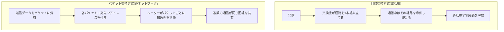
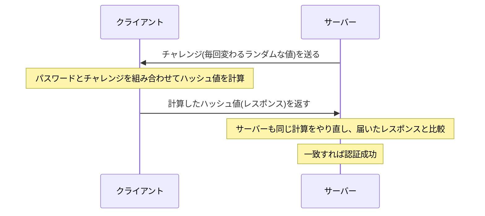
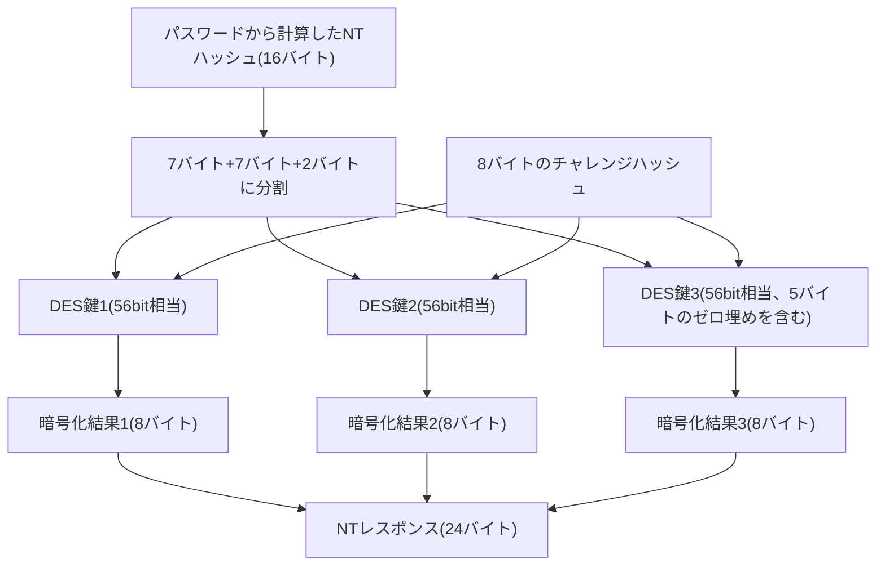

## はじめに

- **この記事で得られること**: 「電話回線」と「IPネットワーク」がそもそも何を指し、何が違うのか——回線交換とパケット交換という2つの通信方式の仕組みと、なぜその違いが生まれたのかという歴史的背景、ダイヤルアップ時代に生まれたPPPというプロトコルが、なぜその後もPPPoEやVPNなど姿を変えながら使われ続けているのか、そして現在も広く使われるMS-CHAPv2認証が内部で何を計算しているのかを、体系的に理解できます。
- **対象読者**: インフラエンジニアとして就業しており、「電話回線」「モデム」「ダイヤルアップ」といった言葉を知識としては知っているものの、それが現在のIPネットワークとどう違い、なぜ関連する技術（PPPなど）が今のネットワーク機器やVPNの中に残っているのかを説明できない方を想定しています。
- **読むのにかかる想定時間**: 約20分

この記事は[『上位1%』シリーズ 全記事ガイド](/sitemap)の一部です。

## 前提知識

- **回線**: 送信元と宛先の間でデータをやり取りするための物理的・論理的な「通り道」を指す言葉です。指し示す実体は文脈によって変わりますが、「データが通る道」という点は共通しています。
- **交換機**: 複数の回線の間を、必要に応じてつなぎ替える装置です。電話網の交換機（exchange/switch）は、発信者と着信者の間に1本の伝送路を組み立てる役割を担います。
- **パケット**: ネットワーク上でやり取りされるデータのまとまりです。送信元・宛先などの制御情報（ヘッダー）とデータ本体（ペイロード）で構成されます。
- **IPアドレス**: IPネットワーク上で、ある端末を一意に識別するための住所にあたる情報です。

## 全体像をつかむ

### 一言で言うと

**電話網は「通話のたびに1対1の専用回線を組み立て、通話が終わるまでそれを占有し続ける」回線交換方式であり、IPネットワークは「1本の回線を多数の通信が共有し、データをパケット単位に分割して宛先ごとに振り分ける」パケット交換方式です。** PPPは、この回線交換方式の世界（電話回線）で「2点間を直接つなぐ」ことを前提に生まれたプロトコルであり、パケット交換方式であるIPネットワークへの「入り口」を作るために使われてきました。

この2つの方式は、単なる技術的な優劣ではなく、 **「リアルタイムの音声を途切れさせずに運びたい」電話網と、「送りたい時にまとめて送ればよく、多少の遅延は許容できるデータ通信を効率よく多重化したい」コンピューターネットワークという、そもそも解きたい問題が違ったことに起因する** という点を押さえておくと、後の話が繋がりやすくなります。

## 基礎から徹底解説

### 回線交換方式の仕組み：電話網

電話網における「発信」とは、交換機に対して「発信者から着信者までの間に、この通話専用の伝送路を組み立ててほしい」と要求する行為です。初期の電話網では、この経路の組み立てを人間の交換手が電話線を手作業でつなぎ替えることで行っていましたが、19世紀末に自動交換機（ストロージャー式交換機）が発明されて以降、交換機自身がダイヤルされた番号に従って自動的に経路を組み立てるようになりました。

現代のデジタル化された電話網では、この「経路の組み立て」は **TDM（Time Division Multiplexing、時分割多重）** という技術で実現されています。1本の伝送路を一定間隔のタイムスロットに分割し、1つの通話に対して「このタイムスロットを使ってよい」という割り当てを、経由するすべての交換機に対して行います。この割り当ては通話が終わるまで変わらず維持され続けるため、結果として「発信者から着信者まで、通話の間ずっと固定された1本の論理的な経路」が成立します。

**ここで重要なのは、経由する交換機の数ではなく、「その経路が通話の間ずっと固定され、他の通信に横取りされない」という性質です。** 実際の電話網では、最寄りの交換局から相手先の交換局まで複数の交換機を経由するのが普通ですが、いずれの交換機も、一度確立した経路（タイムスロットの割り当て）を通話終了まで変更しません。この「経路が呼（通話）の間ずっと固定される」性質があるからこそ、電話番号をダイヤルした時点で相手が確定してしまえば、**以降のやり取りに宛先情報を一切含める必要がなくなります。** これは後述するPPPの設計にとって決定的に重要な前提になります。

交換機は次にどの交換機へつなぐかをどう決めているのか

「080なら3番ポート、0570なら4番ポートに固定で振り分ける」といった、宛先ごとに配線があらかじめ固定されたポートマッピングではありません。電話番号は国番号・市外局番（または携帯電話の番号帯）・加入者番号という階層構造（E.164という国際的な採番規則で標準化されています）を持っており、各交換機は自分が扱うべき番号の範囲と、その番号を次にどの交換機（トランク）へ転送すればよいかを対応付けた**ルーティングテーブル**を持っています。ダイヤルされた番号の先頭から一致する範囲を探して次の転送先を決めるという発想は、IPネットワークのルーティングテーブルにおける経路選択と本質的には同じですが、電話網では番号の階層（国→地域→事業者→加入者）があらかじめ決まっているぶん、経路の探索がより単純です。

さらに重要なのは、この経路探索が**実際の音声を運ぶ回線（タイムスロット）とは別の、制御専用のチャンネル**で先に行われるという点です（現代の電話網ではSS7という共通線信号方式が使われています）。発信者がダイヤルすると、まずこの制御チャンネル上で「この番号への経路を用意してほしい」という要求が交換機を1台ずつリレーされ、着信側の交換機（あるいは着信者自身）まで到達して呼び出し可能であることが確認できて初めて、今度は逆向きに、実際に通話で使うタイムスロットが経由した各交換機で1つずつ確保されていきます。つまり「経路を探す（シグナリング）」と「その経路に実際の通話データを流すための帯域を確保する」は別の2段階に分かれており、後者が確保された時点で初めて、その経路（の各区間のタイムスロット）は他の通話に使われなくなります。SS7の内部動作については[VoIPとSS7、そして実際の通信経路を『上位1%』の視点で理解する](/articles/voip-ss7-guide)で詳しく扱っています。

### パケット交換方式の仕組み：IPネットワーク

一方、IPネットワークでは、1本の物理回線や中継するルーターを無数の通信が同時に共有しています。そのため送り出すデータの宛先を、パケット1つ1つにIPアドレスとして明示しなければ、途中のルーターはどこへ転送すればよいか判断できません。さらに各ルーターはパケットを受け取るたびに独立して次の転送先を決めるため、同じ宛先へ送った複数のパケットが必ずしも同じ経路を通るとは限らず、途中の混雑状況によって遅延・順序の入れ替わり・消失が起こり得ます。

この設計は、1969年に運用が始まったARPANET以来、意図的に選ばれてきたものです。電話網のように通信ごとに専用の経路を確保する方式は、確保している間は帯域を無駄なく使い続けられる保証がある一方、通信が発生していない間もその経路を専有し続けるため、間欠的でバースト性の高いコンピューター間のデータ通信には非効率でした。パケット交換方式は、経路を専有せず1本の回線を多数の通信で統計的に共有する（統計的多重化）ことで、この非効率を解消するために設計されています。

### 2つの方式の比較

| 観点 | 回線交換(電話網) | パケット交換(IPネットワーク) |
|---|---|---|
| 経路 | 通信ごとに1本を組み立て、通信中は専有・固定 | 共有される経路をパケット単位で都度選択 |
| 宛先情報 | 発信時（ダイヤル時）に1度確定すれば以降は不要 | パケットごとに宛先IPアドレスが必須 |
| 順序 | 経路が固定されるため、原則として順序が保たれる | パケットごとに経路が変わりうるため、順序が入れ替わることがある |
| 帯域効率 | 専有中は他の通信に使われず、非効率になりやすい | 統計的多重化により効率が高い一方、輻輳時は遅延・損失が起こりうる |
| 得意な用途 | 遅延・順序の乱れが許されないリアルタイム音声 | 多数の端末が間欠的にデータをやり取りする通信全般 |

### PPPはなぜ生まれたのか

回線交換とパケット交換がここまで異なる設計思想を持つのなら、なぜ電話回線をそのまま使ってIPネットワークに接続しようとしたのか、という疑問が浮かぶかもしれません。答えは技術的な相性の良さではなく、**1980〜90年代の時点で、一般家庭までほぼ確実に届いていた通信用配線が電話回線しかなかった**という、当時のインフラ普及状況にあります。各家庭に新たにデータ通信専用のケーブルを敷設するには、電柱や地下管路の工事を伴う莫大な設備投資が必要になりますが、電話網は何十年もかけてすでに各家庭の壁の中まで届いていました。この「すでに繋がっている配線を使い回す」という制約の中で、電話回線（アナログの音声帯域）の上でどうにかデジタルデータをやり取りする方法として、モデムとPPPが必要とされたのです。**「電話回線が余っていたから」という消極的な理由ではなく、当時実現可能な選択肢の中で家庭とネットワークをつなぐ唯一の現実的な手段だった** という積極的な必然性がある点を押さえておくと、以降の設計思想の話がつながりやすくなります。

**PPP（Point-to-Point Protocol、RFC 1661）** は、この回線交換方式の電話回線を使ったダイヤルアップ接続で、2点間を直接つなぐために設計されたプロトコルです。「回線を確立する（LCP）」「ユーザー名とパスワードで認証する（認証フェーズ）」「IPアドレスを割り当てる（IPCP）」という一連の手順を規定しています。

PPPは「電話をかけるため」に発明された規格ではない

PPP自体は、「電話をかけるために発明された」規格ではありません。PPPは**2点間を直接つなぐシリアルリンク全般（電話回線によるダイヤルアップに限らず、専用線など他のポイントツーポイント回線も含む）の上で、リンクの確立・認証・IPアドレス設定を行うための汎用プロトコル**として設計されています。電話回線は、当時安価に入手できた「2点間のシリアルリンク」の実現手段の1つとして使われたに過ぎません。つまり「電話をかける」という行為自体にPPPは一切必須ではなく、PPPが必要になるのは、その2点間リンクを使って**データ通信（IPネットワークへの接続）を行いたい場合に限られる**、というのが正確な理解です。

このPPPの設計が「回線交換」という前提の上に成り立っている、という点が本記事の核心です。回線交換方式の電話回線では、通信中は相手との間に他の誰の通信も割り込まない1本の物理回線が占有され続けるため、「今この回線を流れているデータの相手は誰か」を毎回明示する必要がありません——回線そのものが相手を一意に決めているからです。また、データは1本の物理的な経路をそのまま流れるだけなので、送った順番通りに届くことも（物理層のエラーを除けば）前提にできます。**PPPが「宛先アドレスを持たず、届いたフレームをただ順番に処理する」というシンプルな設計で成立しているのは、この「1対1で専有され、順序も保たれる回線」という前提の上に乗っているから**です。

### モデムとダイヤルアップ接続の実際の手順

PPPが実際に電話回線の上でどう動いていたのかを、時系列で見てみます。 **モデム（modulator-demodulator、変復調装置）** は、コンピューターが扱うデジタル信号と、電話回線を流れるアナログの音声信号とを相互に変換する機器で、送信側で変換したアナログ信号を受信側のモデムが再びデジタル信号に戻すことで、本来デジタル通信用ではない電話回線の上でデータ通信を成立させます。

発信ボタンを押してからIPで通信できるようになるまでを時系列で並べると、次のようになります。

1. **発信〜回線接続**: 電話番号をダイヤルすると、電話交換網の中でその通話専用の伝送路が一時的に確保されます。これはOSI参照モデルでいえば **L1（物理層）** の出来事であり、まだデータリンクのフレーミングすら成立していません。「土管」が繋がっただけで、その上で何のプロトコルが動くかはまだ決まっていない段階です。
2. **モデムハンドシェイク**: 双方のモデムが（俗に「ピーガガガ」と表現される）ハンドシェイクを行い、アナログの音声信号としてデジタルデータをやり取りできるシリアルリンクを確立します。ここまではPPPもIPもまだ登場しません。
3. **PPPのLCP**: このシリアルリンクの上でPPPのLCPが動き始め、リンクパラメータ（MRUなど）と使用する認証方式を合意します。ここで初めてL2的な「フレーム」の概念が成立します。
4. **PPP認証フェーズ**: 合意した方式（PAP/CHAPなど）に従い、ユーザー名とパスワードが**モデム間のデジタル信号として自動的に**やり取りされます。着信はデータ着信として扱われるため、人間のオペレーターが応対して口頭でID・パスワードを聞き取る、という場面はありません。ステップ2のモデムハンドシェイクによって回線がすでに音声用途からデータ通信用途に切り替わった後、モデムが変調した連続的なデジタルデータの中にLCP→認証→IPCPというPPPの制御データが最初に流れているだけであり、この時間帯の回線を人間が耳で聞いても、意味の分かる言葉や音声ではなく、モデム特有の連続したノイズにしか聞こえません。
5. **IPCP（IP Control Protocol、RFC 1332）** : 認証が成功して初めて、接続先（後述のISP）がクライアントにIPアドレスを1つ払い出します。**この瞬間まで、クライアント側には一切IPアドレスがありません。**

なお、電話番号を指定する行為はL1レベルの回線確保であり、L2のフレーミングを行っているわけではありません（L2相当のフレーミングは、この後動くPPPのLCPが担います）。1本のモデム回線は同時に1通話しか受けられないため、話し中の間は同じ番号に他の人がかけても繋がりませんが、接続先の事業者は通常、代表番号の背後に**多数のモデムを収容したモデムプール**を持ち、空いているモデムに着信を自動的に割り振ります。したがって「1人が接続している間は他の誰もそこに繋げない」わけではなく、モデムプールの空き回線数だけ同時接続が可能だった、というのが実態です。

ISP（Internet Service Provider）とは

利用者の回線（ダイヤルアップ時代なら電話回線、現在ならxDSL・光回線・モバイル回線など）を、インターネットという世界規模のネットワークに接続する「境目」を担う事業者です。ダイヤルアップ時代であれば、利用者が電話をかけた先にあるISPのモデムプールがPPP接続を受け付けて認証を行い、利用者にIPアドレスを払い出した上で、その先の広大なインターネットのバックボーン網へパケットを中継します。

### 認証フェーズの中身：CHAP/MS-CHAPv2のチャレンジレスポンス

前節のステップ4で「ユーザー名とパスワードがやり取りされる」と述べましたが、実際に流れているデータの中身は認証方式によって大きく異なります。ここではPPPの認証方式の中で現在も広く使われている **MS-CHAPv2(RFC 2759)** を中心に、その内部動作を掘り下げます。

まず前提として、PPPの認証方式は大きく3段階の進化を辿っています。

| 方式 | パスワードの扱い | 認証の向き |
|---|---|---|
| PAP(RFC 1334) | ユーザー名・パスワードを**平文のまま**送る | クライアント→サーバーの一方向のみ |
| CHAP(RFC 1994) | パスワードそのものは送らず、**チャレンジレスポンス方式**でハッシュ値のみをやり取りする | クライアント→サーバーの一方向のみ |
| MS-CHAPv2(RFC 2759) | CHAPと同じくチャレンジレスポンス方式だが、Microsoftが拡張し**双方向の相互認証**に対応 | クライアント→サーバー、サーバー→クライアントの両方向 |

**PAPが平文でパスワードを送ってしまう**のに対し、**CHAP以降はパスワードそのものを一度もネットワーク上に送らない**という点が決定的な違いです。この「チャレンジレスポンス」という発想の基本形は次の通りです。

サーバーは、あらかじめ知っている(保存している)パスワード情報とチャレンジを使って同じ計算をやり直すだけで検証できるため、**パスワードそのものを経路上に一切流さずに済みます。** 万が一この通信を盗聴されても、盗聴者が入手できるのは「毎回変わるチャレンジ」と「そのチャレンジに対応する1回限りのハッシュ値」だけであり、そこから元のパスワードを直接読み取ることはできません。

#### MS-CHAPv2が実際に計算している内容

MS-CHAPv2は、このチャレンジレスポンスの仕組みをさらに具体化し、次の手順で認証を行います。

1. **サーバーが16バイトのチャレンジ値**をクライアントに送ります。
2. **クライアントも自分自身の16バイトのランダムな値(Peer Challenge)を生成**し、サーバーのチャレンジ・Peer Challenge・ユーザー名を組み合わせてハッシュ計算(SHA-1)を行い、8バイトの「チャレンジハッシュ」を作ります。この段階でクライアント側の乱数も混ぜ込むことで、後述のレスポンスがサーバー側のチャレンジだけに依存しない(サーバーが同じチャレンジを使い回すリプレイ攻撃を試みても、クライアント側の乱数が毎回変わるため同じレスポンスにならない)ようにしています。
3. **クライアントはあらかじめ、自分のパスワードからNTハッシュ(MD4によるハッシュ値、16バイト)を計算**しています(このNTハッシュ自体は、Windowsがパスワードを保存する際の内部形式そのものです)。
4. この16バイトのNTハッシュを**7バイト・7バイト・2バイトの3つに分割**し、それぞれを56ビットのDES暗号鍵として使えるように加工します(2バイトしかない最後の断片は、残り5バイトをゼロで埋めて7バイト相当にします)。
5. この**3つのDES鍵それぞれで、ステップ2の8バイトのチャレンジハッシュを暗号化**し、その結果を連結した24バイトのデータを「NTレスポンス」としてサーバーに送ります。
6. サーバー側は、自分が保持しているはずの同じNTハッシュを使って、クライアントとまったく同じ計算(ステップ2〜5)を独立に行い、**送られてきたNTレスポンスと一致するかを検証**します。
7. 認証が成功すると、サーバーは**逆方向にも同じ発想で「Authenticator Response」を計算してクライアントに返し**、クライアント側もこれを検証します。これにより、「クライアントが正しいサーバーに繋がっているか」までを確認できる、双方向の相互認証が成立します。

**なぜこの記事の前段で触れているMS-CHAPv2の「解析コストが単一のDES鍵(2^56通り)にまで還元できる」という既知の弱点が成り立つのか**、ここまでの手順を踏まえると理解できます。24バイトのNTレスポンスは、**同じ1つの8バイトチャレンジハッシュを、独立した3つのDES鍵でそれぞれ暗号化した結果を単純に連結しただけ**です。3つの鍵を同時に(組み合わせとして)総当たりする必要はなく、**それぞれのDES鍵を独立に、個別に総当たりできてしまいます。** 特に3つ目の鍵は実質2バイト(16ビット)分の情報しか持たないため即座に特定でき、残る2つの56ビット鍵も、それぞれ単独のDES鍵の総当たりコストで突破できてしまいます。本来16バイト(128ビット)のNTハッシュ全体を守るはずが、 **「3分割してそれぞれ独立に暗号化する」という構造そのものによって、実質的な解読コストが単一の56ビットDES鍵の総当たりにまで落ちてしまう** 、というのがこの弱点の正体です。

### IPCPが果たす役割：回線をIPネットワークの一部に昇格させる

ステップ5で払い出されたIPアドレスは、以降そのPPPリンク上を流れる全IPパケットの送信元アドレスとして使われます。ここで注意したいのは、「モデムを通してISPに接続する時点ですでにIPネットワークになっている」という理解は、実は前後関係が逆だという点です。電話回線という物理的な土管そのものはIPネットワークではなく、**PPP（のIPCP）によってIPアドレスが払い出された瞬間から、そのリンクがIPネットワークの一部として機能し始めます。** IPCPは「すでにあるIPネットワークに接続するための手続き」ではなく、 **「その1対1のリンクをIPネットワークの一部に昇格させる手続き」そのもの** です。

ここまでの手順は、あくまで「電話回線を使ってデータ通信（インターネット接続）をしたい」場合の話である点にも注意してください。単なる音声通話（普通の電話）であれば、モデムハンドシェイクもPPPのLCP・認証・IPCPも一切発生せず、回線が繋がった後は送受話器が拾ったアナログの音声信号がそのまま相手に伝わるだけです。

## プロが見ている視点（上位1%の理解）

### なぜPPPは「ダイヤルアップが廃れた後」も生き残ったのか

ADSLや光回線が普及し、電話回線を使ったダイヤルアップ接続そのものはほぼ姿を消しましたが、PPPというプロトコル自体は消えませんでした（ADSL・光回線というアクセス回線自体の技術的な仕組みは[ADSL・光回線などアクセス回線の技術変遷を『上位1%』の視点で理解する](/articles/access-network-guide)で扱っています）。理由は、PPPが提供する **「1対1のリンクの上で、ユーザー単位の認証を行い、IPアドレスを動的に払い出す」という機能セットが、電話回線に限らず広く需要のあるものだった** からです。

- **PPPoE（PPP over Ethernet、RFC 2516）** : ADSL・光回線の時代、契約者はイーサネット（LAN内）を経由してISPに接続するようになりましたが、「回線ごとに誰が使っているかを認証し、IPアドレスを動的に割り当てる」という電話回線時代の商習慣・課金モデルはそのまま引き継がれました。PPPoEは、PPPフレームをイーサネットフレームの中にカプセル化することで、物理的には共有型のイーサネットの上に、論理的には元のPPPと同じ「1対1のリンク」を再現する規格です。
- **L2TP（Layer 2 Tunneling Protocol、RFC 2661）** : リモートアクセスVPNの世界では、社内ネットワークに接続するクライアントごとに「ユーザー名・パスワードで認証し、社内向けの仮想IPアドレスを払い出す」という、電話回線のダイヤルアップ接続とまったく同じ体験が求められました。L2TPは、PPPフレームをIPネットワーク上の仮想的なトンネルの中にカプセル化することで、物理的な回線が存在しないIPネットワークの上に、PPPが前提とする「1対1のリンク」を仮想的に再現しています。L2TPとIPsecを組み合わせたVPN（L2TP/IPsec）の内部動作は、[L2TP/IPsecの仕組みを『上位1%』の視点で理解する](/articles/l2tp-ipsec-guide)で詳しく扱っています。

つまり、PPPoEもL2TPも、媒体（イーサネット／IPネットワーク）は違えど、 **「PPPが送り出した1つのフレームを、そのまま別プロトコルのペイロードとして包み、決まった1台の相手にだけ届ける」という同じ発想** でPPPを流用しています。物理的な電話回線が消えた後も、PPPという「ソフトウェアの契約」だけが生き残り、様々な媒体の上に移植され続けた、と捉えると全体像が掴みやすくなります。

### 現代の電話網も内部はパケット化が進んでいる

やや発展的な補足として、現代の電話網は、加入者宅から交換局までの「アクセス回線」こそ従来の回線交換的な性質を残していますが、交換局間を結ぶ基幹網（コア網）は、VoIP技術やSS7（Signaling System No. 7、呼制御用のプロトコル群）のIP化が進み、内部的にはパケット交換技術の上に構築されているケースが主流になっています（VoIPとSS7の内部動作、そして実際にIPネットワーク上をデータがどう流れるのかの具体例は[VoIPとSS7、そして実際の通信経路を『上位1%』の視点で理解する](/articles/voip-ss7-guide)で扱っています）。ただし、**利用者から見た「ダイヤルすると1本の経路が確立し、通話中はそれが維持される」という体験自体は変わっていません。** これは、下位の実装技術が回線交換からパケット交換へ移行しても、上位から見えるサービスの性質（呼ごとに専用の経路が確保されているように振る舞うこと）は別の話である、という良い例です。

## よくある誤解・つまずきポイント

- **誤解1: 「モデムを通してISPに接続した時点で、すでにIPネットワークに繋がっている」**
  電話回線という物理的な土管そのものはIPネットワークではありません。PPPのIPCPによってIPアドレスが払い出された瞬間から、そのリンクが初めてIPネットワークの一部として機能し始めます。
- **誤解2: 「モデムの『ピーガガガ』という音は、人間同士が話す代わりに機械同士が会話している」**
  あの音は人間が聞き取ることを想定した信号ではなく、モデム同士が通信速度・変調方式などのパラメータを合意するための機械的なハンドシェイク音です。合意が済んだ後にやり取りされるPPPの認証データ（ユーザー名・パスワードなど）に至っては、連続したノイズにしか聞こえません。
- **誤解3: 「PPPは電話回線専用の規格である」**
  PPPは2点間を直接つなぐシリアルリンク全般向けの汎用プロトコルであり、電話回線はその実現手段の1つに過ぎません。この汎用性があったからこそ、後年PPPoEやL2TPのようにまったく異なる媒体の上でも再利用されました。
- **誤解4: 「電話回線は発信元から着信先まで交換機を1台しか経由しないから専用線と呼べる」**
  実際には複数の交換機を経由するのが普通です。「専用線」と呼べる理由は経由する交換機の数ではなく、**経路（タイムスロットの割り当て）が通話の間ずっと固定され、他の通信に横取りされない**という性質にあります。

## 障害・トラブルシューティングの視点

PPPは古い技術に見えますが、PPPoE（家庭用ブロードバンド回線の認証）やWAN専用線、L2TP VPNなど、現在も実務で遭遇する場面があります。切り分けの基本は、電話回線時代と同じ **「LCP→認証→IPCPのどの段階で止まっているか」** です。

1. **LCPが確立しない**: 対向機器とのリンクパラメータ（MRUなど）の不一致や、そもそも物理層・データリンク層でリンクが上がっていないことが典型的な原因です。PPPoEの場合はPADI/PADO/PADR/PADSという発見フェーズ（RFC 2516）でATM/イーサネット区間のセッションを確立してから、この上でLCPが始まります。
2. **認証で失敗する**: ユーザー名・パスワードの誤り、あるいはクライアント・サーバー間で合意できる認証方式（PAP/CHAPなど）が存在しないことが原因です。ISP・VPNサーバーそれぞれの設定でサポートしている認証方式を確認します。
3. **IPCPで止まる（認証は成功するがIPアドレスが振られない）** : 契約者情報とアカウントの不一致、割り当て可能なIPアドレスプールの枯渇などが典型的な原因です。

### 予防策・恒久対策

- PPPoEやWAN専用線の障害切り分けでは、まず物理層・データリンク層のリンクアップを確認したうえで、LCP→認証→IPCPの各段階のログを追う。
- 認証方式は可能な限り、平文でパスワードを送るPAPではなく、チャレンジレスポンス方式のCHAP以降を使う構成にする。

## まとめ

- 電話網は「通話ごとに専用の経路を組み立て、通話中は専有し続ける」回線交換方式、IPネットワークは「1本の回線を多数の通信が共有し、パケット単位で宛先ごとに振り分ける」パケット交換方式であり、リアルタイム音声とバースト性の高いデータ通信という、そもそも解決したい問題の違いに起因します。
- PPPは、回線交換方式の電話回線が持つ「1対1で専有され、順序も保たれる」という性質を前提に設計されたプロトコルであり、宛先アドレスを持たないシンプルな構造はこの前提の上に成り立っています。
- IPCPは「すでにあるIPネットワークに接続する手続き」ではなく、「1対1のリンクをIPネットワークの一部に昇格させる手続き」そのものです。
- PPPは電話回線専用の規格ではなく2点間シリアルリンク全般向けの汎用プロトコルであり、この汎用性ゆえにPPPoE（ブロードバンド回線）やL2TP（リモートアクセスVPN）など、物理的な電話回線が消えた後も形を変えて使われ続けています。

**今日から意識すべきこと**
1. VPNやブロードバンド回線の設定で「PPP」という単語に出会ったら、それが電話回線時代の「1対1リンクの認証＋IPアドレス払い出し」という発想の延長にあることを思い出しましょう。
2. PPP系の接続障害に遭遇したら、「LCP→認証→IPCP」のどの段階で止まっているかをまず切り分けましょう。

## 参考文献

- [The Point-to-Point Protocol (PPP) | RFC 1661](https://datatracker.ietf.org/doc/html/rfc1661)
- [The PPP Internet Protocol Control Protocol (IPCP) | RFC 1332](https://datatracker.ietf.org/doc/html/rfc1332)
- [PPP Password Authentication Protocol (PAP) | RFC 1334](https://datatracker.ietf.org/doc/html/rfc1334)
- [PPP Challenge Handshake Authentication Protocol (CHAP) | RFC 1994](https://datatracker.ietf.org/doc/html/rfc1994)
- [Microsoft PPP CHAP Extensions, Version 2 | RFC 2759](https://datatracker.ietf.org/doc/html/rfc2759)
- [A Method for Transmitting PPP Over Ethernet (PPPoE) | RFC 2516](https://datatracker.ietf.org/doc/html/rfc2516)
- [Layer Two Tunneling Protocol "L2TP" | RFC 2661](https://datatracker.ietf.org/doc/html/rfc2661)
