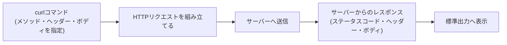

## はじめに

- **この記事で得られること**: `curl http://example.com/`のように何気なく使っている**curl**コマンドが、裏側でどのようなHTTPリクエストを組み立てて送信し、どのようにレスポンスを解釈しているのかを体系的に理解します。`-X`・`-H`・`-d`・`-i`といった主要オプションが、それぞれHTTPリクエストのどの部分に対応しているのかを、実際にブラウザの開発者ツールと突き合わせながら整理します。
- **対象読者**: `curl`コマンドをコピー&ペーストで使ったことはあるが、各オプションが何を意味しているのか、`curl`が何をしているのかを人に説明できない方を想定しています。
- **読むのにかかる想定時間**: 約15分

この記事は[『上位1%』シリーズ 全記事ガイド](/sitemap)の一部です。[Ansibleで複数サーバーへの設定投入を自動化する『上位1%』のハンズオン](/articles/ansible-handson-guide)や、[RESTful APIとは何かを『上位1%』の視点で理解する](/articles/restful-api-guide)など、このブログのさまざまな記事で当たり前のように登場する`curl`コマンドの、共通の土台となる内容です。

## 全体像をつかむ

### 一言で言うと

`curl`とは、**コマンドラインからHTTP(や他のさまざまなプロトコル)のリクエストを組み立てて送信し、レスポンスを受け取るためのツール**です。ブラウザが「URLを入力してEnterを押す」という操作の裏側で行っていることを、コマンドライン上で明示的に、1つ1つのオプションとして指定できるようにしたもの、とイメージすると理解しやすくなります。



## 基礎から徹底解説

### 最もシンプルな例:GETリクエスト

```bash
curl http://example.com/
```

オプションを何も付けずに`curl`を実行すると、既定で**GETメソッドによるHTTPリクエスト**が送信されます。これは、ブラウザでそのURLにアクセスしたときに送られるリクエストとほぼ同じものです。レスポンスとして返ってきたHTMLの本文(ボディ)だけが、標準出力にそのまま表示されます。

### ステータスコードやヘッダーも見たい場合:`-i`オプション

既定の`curl`はレスポンスのボディしか表示しないため、通信が実際に成功したのか、リダイレクトされているのかが分かりません。

```bash
curl -i http://example.com/
```

`-i`(`--include`)オプションを付けると、ボディの前に、HTTPステータスコード(`HTTP/1.1 200 OK`など)とレスポンスヘッダー一式が表示されます。「うまく繋がらない」という調査の第一歩は、まずこの`-i`オプションで、そもそもどんなステータスコードが返ってきているのかを確認することです。

### メソッドを指定する:`-X`オプション

```bash
curl -X POST http://example.com/api/users
```

`-X`(`--request`)オプションで、GET以外のHTTPメソッド(POST、PUT、DELETEなど)を明示的に指定できます。**ただし、次に説明する`-d`オプションでデータを送る場合は、`-X POST`を省略しても自動的にPOSTメソッドが使われます。** `-X`は、ボディを送らないDELETEリクエストのように、メソッドを明示する必要がある場面で使います。

### リクエストヘッダーを追加する:`-H`オプション

```bash
curl -H "Authorization: Bearer <トークン>" -H "Content-Type: application/json" http://example.com/api/users
```

`-H`(`--header`)オプションで、任意のHTTPリクエストヘッダーを追加できます。[RESTful APIとは何かを『上位1%』の視点で理解する](/articles/restful-api-guide)で扱った、`Authorization: Bearer <トークン>`のような認証情報も、この`-H`オプションで送信するのが基本的な形です。`-H`は複数回指定することで、複数のヘッダーを同時に付けられます。

### リクエストボディを送る:`-d`オプション

```bash
curl -X POST -H "Content-Type: application/json" -d '{"name": "taro"}' http://example.com/api/users
```

`-d`(`--data`)オプションで、リクエストボディ(POST/PUT/PATCHで送信するデータ本体)を指定します。**先述の通り、`-d`を指定すると、`-X POST`を省略してもPOSTメソッドが自動的に選ばれます。** JSON形式のAPIへ送信する場合は、`Content-Type: application/json`ヘッダーを`-H`で明示的に付けるのが定石です(付け忘れると、サーバー側がボディをJSONとして解釈してくれないことがあります)。

<details>
<summary>補足:ブラウザの開発者ツールの「Copy as cURL」機能</summary>

Chrome・EdgeなどのブラウザのDeveloper Tools(F12キー)にある「Network」タブでは、任意の通信を右クリックして「Copy as cURL」を選ぶと、その通信を再現するための`curl`コマンドが、必要なヘッダー・Cookie・ボディをすべて含んだ形でクリップボードにコピーされます。ブラウザで実際に成功している通信を、そのまま`curl`コマンドとして手元で再現・検証したいときに非常に便利な機能です。

</details>

## プロが見ている視点(上位1%の理解)

### curl単体ではなく、libcurlというライブラリのラッパーである

`curl`コマンドは、実は**libcurl**という、HTTPをはじめとする通信プロトコルを実装したC言語のライブラリを、コマンドラインから呼び出すための薄いラッパー(利用者向けのフロントエンド)にすぎません。libcurl自体は、PHP・Python(`requests`ライブラリの内部で使われることもある)・Node.jsなど、非常に多くのプログラミング言語やツールから直接呼び出されています。**つまり`curl`コマンドで手元で確認できた通信は、そのままアプリケーションのコードがlibcurl経由で行う通信の予行演習にもなっている**、という点が実務上のメリットです。[ライブラリ(library)とは何か——静的リンク・動的リンクの仕組みを『上位1%』の視点で理解する](/articles/software-library-guide)で扱った「ライブラリを様々なプログラムが共有して呼び出す」という構造の、身近な具体例の1つです。

### `curl`が「単なるHTTPクライアント」ではない理由

`curl`という名前は「Client for URLs」に由来しており、実際にはHTTP/HTTPSだけでなく、FTP、SMTP、LDAP、TelnetなどさまざまなプロトコルのURLを扱える、汎用的な通信ツールです。このブログの文脈では専らHTTP/HTTPSでの利用が中心ですが、「`curl`はHTTP専用のツールだ」という理解は正確ではなく、URLスキーム(`http://`、`ftp://`など)に応じて、内部で適切なプロトコル実装を選んで通信している、という理解が正確です。

## よくある誤解・つまずきポイント

- **誤解1: 「`-d`でデータを送るときは、必ず`-X POST`を明示しないといけない」**
  `-d`を指定すると、メソッドを省略してもPOSTが自動的に選ばれます。`-X POST`はあってもなくても同じ結果になります。
- **誤解2: 「`curl`は何も指定しなければ、通信が成功したかどうかを教えてくれない」**
  既定ではレスポンスのボディしか表示されませんが、`-i`オプションを付ければステータスコードとヘッダーも確認できます。
- **誤解3: 「`curl`はHTTP専用のコマンドである」**
  `curl`はHTTP/HTTPSを含む、多数のプロトコルに対応した汎用ツールです。

## 障害・トラブルシューティングの視点

1. **`curl`がハングしたように応答が返ってこない**: 名前解決やTCP接続自体に時間がかかっている可能性があります。`curl -v`(`--verbose`)オプションを付けると、DNS解決・TCP接続・TLSハンドシェイクなど、各段階の進捗が詳細に表示され、どこで止まっているかを切り分けられます。
2. **JSON APIへ`-d`でデータを送ったのに、サーバー側が正しく解釈してくれない**: `Content-Type: application/json`ヘッダーを`-H`で明示的に付け忘れていないかを確認してください。
3. **`curl: (60) SSL certificate problem`のようなエラーが出る**: サーバー証明書の検証に失敗しています。自己署名証明書を使った検証環境限定の応急処置として`-k`(`--insecure`)オプションがありますが、本番相当の環境でこのオプションを使うと証明書検証自体を無効化してしまうため、原則として使うべきではありません。

## まとめ

- `curl`は、コマンドラインからHTTPリクエストを組み立てて送信し、レスポンスを受け取るためのツールです。
- `-i`でステータスコード・ヘッダーを表示、`-X`でメソッドを指定、`-H`でヘッダーを追加、`-d`でボディを送信します。
- `-d`を指定すると、`-X POST`を省略してもPOSTメソッドが自動的に選ばれます。
- `curl`コマンドは、libcurlというライブラリの薄いラッパーであり、多くのプログラミング言語がlibcurl経由で同じ通信を行っています。

**今日から意識すべきこと**
1. 通信がうまくいかないときは、まず`-i`オプションでステータスコードを確認する癖をつけましょう。
2. ブラウザの開発者ツールの「Copy as cURL」を活用し、ブラウザで成功している通信を手元で再現してみましょう。

## 参考文献

- [curl公式ドキュメント](https://curl.se/docs/manpage.html)
- [everything curl(公式の詳細ガイド)](https://everything.curl.dev/)
