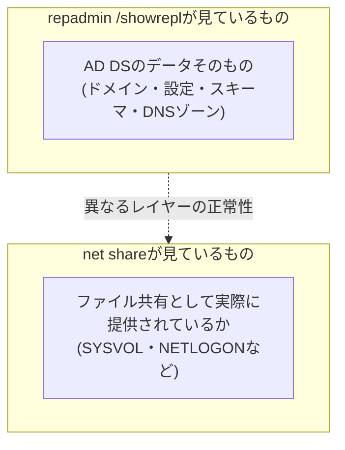

## はじめに

- **この記事で得られること**: AD移行やDC構築の手順書に必ず登場する`repadmin /showrepl`と`net share`という2つのコマンドについて、それぞれの出力が具体的に何を表しており、どういう基準で「正常」と判断できるのかを体系的に理解できます。`repadmin /showrepl`で確認できる5つのパーティションの正体、`net share`に表示される`C$`・`IPC$`・`ADMIN$`・`NETLOGON`・`SYSVOL`という共有の意味、そして`SysvolReady`レジストリ値が示していることまでを扱います。
- **対象読者**: AD移行やDC構築の手順書に沿って`repadmin /showrepl`や`net share`を実行したことはあるものの、その出力の意味を理解せずに「エラーが出ていなければOK」という表面的な判断にとどまっている方を想定しています。
- **読むのにかかる想定時間**: 約19分

この記事は[『上位1%』シリーズ 全記事ガイド](/sitemap)の一部、[Active Directoryシリーズ](/sitemap#シリーズ一覧)の7本目です。パーティションの種類については[ADとDC、ドメインとフォレストの違いを『上位1%』の視点で理解する](/articles/ad-dc-fundamentals-guide)、`_msdcs`・`ForestDnsZones`については[DNSゾーンとレコードの読み方を『上位1%』の視点で理解する](/articles/dns-zones-records-guide)を前提にしています。

## 前提知識

- **レプリケーション**: AD DSの変更内容を、DC間で複製し合う仕組みです。詳しくは[ADとDC、ドメインとフォレストの違いを『上位1%』の視点で理解する](/articles/ad-dc-fundamentals-guide)を参照してください。
- **SYSVOL**: グループポリシーオブジェクト(GPO)の実体ファイルやログオンスクリプトなどを格納する、DC間で複製される共有フォルダーです。

## 全体像をつかむ

### 一言で言うと

**`repadmin /showrepl`は「AD DSのデータそのものが、DC間で正しく複製されているか」を確認するコマンド、`net share`は「そのDCが実際にファイル共有として提供すべきものを、正しく提供できているか」を確認するコマンドです。** 両者は確認している対象のレイヤーが異なり、DCの正常性を確認する際はこの2つを組み合わせて見ていく必要があります。



## 基礎から徹底解説

### `repadmin /showrepl`が表示する5つのパーティション

`repadmin /showrepl`を実行すると、そのDCが保持している複数のパーティション(命名コンテキスト)それぞれについて、レプリケーション相手(パートナー)ごとの最終同期状況が表示されます。単一ドメインのフォレストで一般的な構成であれば、次の5つのパーティションが表示されます。

| パーティション | 内容 | レプリケーション範囲 |
|---|---|---|
| ドメインパーティション(例: `DC=corp,DC=example,DC=com`) | ユーザー・コンピューター・グループなどのオブジェクト | ドメイン内の全DC |
| 設定パーティション(`CN=Configuration,...`) | サイト構成、レプリケーショントポロジなどフォレスト全体の構成情報 | フォレスト内の全DC |
| スキーマパーティション(`CN=Schema,CN=Configuration,...`) | オブジェクトの型定義 | フォレスト内の全DC |
| DomainDnsZonesパーティション | AD統合DNSゾーンのうち、ドメイン単位で共有されるデータ | ドメイン内の全DC(DNSサーバーの役割を持つDC) |
| ForestDnsZonesパーティション | `_msdcs`などフォレスト全体で共有されるべきDNSゾーンデータ | フォレスト内の全DC(DNSサーバーの役割を持つDC) |

この5つの区分は、[ADとDC、ドメインとフォレストの違いを『上位1%』の視点で理解する](/articles/ad-dc-fundamentals-guide)で説明したドメイン/設定/スキーマという3パーティションに、[DNSゾーンとレコードの読み方を『上位1%』の視点で理解する](/articles/dns-zones-records-guide)で説明したDNS特有の2パーティション(DomainDnsZones・ForestDnsZones)を加えたものと正確に対応しています。**それぞれのパーティションは異なるレプリケーション範囲を持つため、レプリケーションの不整合を切り分ける際は「どのパーティションで問題が起きているか」を必ず確認する**ことが重要です。

### 「成功」とは何を意味しているのか

`repadmin /showrepl`の出力では、各パートナーからの受信レプリケーションについて、次のような情報が表示されます。

```
DC1\CORP.EXAMPLE.COM
DC Options: IS_GC
Site Options: (none)
DSA object GUID: xxxxxxxx-xxxx-xxxx-xxxx-xxxxxxxxxxxx
DSA invocationID: xxxxxxxx-xxxx-xxxx-xxxx-xxxxxxxxxxxx

==== INBOUND NEIGHBORS ======================================

DC=corp,DC=example,DC=com
    CN=Configuration,DC=corp,DC=example,DC=com
        DC2\CORP.EXAMPLE.COM via RPC
            DSA object GUID: yyyyyyyy-yyyy-yyyy-yyyy-yyyyyyyyyyyy
            Last attempt @ <日時> was successful.
```

ここで確認すべき最も重要な情報は、**各パートナーとの間で、最後に試みたレプリケーションが`was successful`(成功)になっているか、そしてその日時が現在時刻から見て妥当な範囲(通常は直近数時間以内)に収まっているか**です。**「成功」とは、あるパートナーとの間で直近のレプリケーション試行が正常に完了したことだけを意味しており、それ以前に長期間レプリケーションが停止していた可能性までは否定しません。** 直近の1回だけを見て安心するのではなく、失敗回数(Consecutive failures)が0であるか、最終成功時刻が異常に古くないかもあわせて確認する必要があります。

<details>
<summary>失敗している場合の表示</summary>

レプリケーションが失敗している場合、`was successful`の代わりに、たとえば次のようなエラーコードとその意味が表示されます。

```
Last attempt @ <日時> failed, result 1722 (0x6ba):
    The RPC server is unavailable.
    <失敗回数> consecutive failure(s).
Last success @ <日時>.
```

**`<失敗回数> consecutive failure(s)`が0より大きい場合は、確実に何らかの異常がある**ことを意味します。エラーコード(この例では1722)は、RPC(そのDC間の通信手段)自体が到達できない状況を示しており、ネットワーク疎通やファイアウォール、DNS名前解決に問題がないかを確認する手がかりになります。

</details>

### `net share`が表示する既定の共有:C$・IPC$・ADMIN$・NETLOGON・SYSVOL

DC(に限らずWindows Server全般)で`net share`コマンドを実行すると、明示的に作成した共有フォルダーに加えて、**既定で自動的に用意されている管理共有**が表示されます。

| 共有名 | 実体 | 用途 |
|---|---|---|
| `C$` | `C:\`ドライブ全体 | 管理者権限を持つユーザーが、リモートからそのドライブ全体へアクセスするための管理共有(ドライブレターごとに`D$`なども同様に自動作成される) |
| `ADMIN$` | `%SYSTEMROOT%`(通常`C:\Windows`) | リモートでの管理操作(サービスのインストールなど、多くのリモート管理ツールが内部的に利用)のための管理共有 |
| `IPC$` | 実体のあるフォルダーではなく、プロセス間通信用の名前付きパイプ | ファイル共有ではなく、リモートプロシージャコール(RPC)などのプロセス間通信をSMB経由で行うための特殊な共有。ファイルの中身を持たない点が他の共有と異なる |
| `NETLOGON` | SYSVOL配下の`scripts`フォルダー | ログオンスクリプトなどを配布するための共有 |
| `SYSVOL`| SYSVOLフォルダー全体 | グループポリシーオブジェクト(GPO)の実体ファイルを配布するための共有 |

**このうちC$・IPC$・ADMIN$の3つはAD DSやDC固有のものではなく、通常のWindows(Server)であれば既定で必ず作成される管理共有**です。一方**NETLOGONとSYSVOLの2つは、そのサーバーがDCとして正しく機能していることの証**であり、DCの正常性確認において特に重要な意味を持ちます。

### なぜNETLOGONとSYSVOLの共有有無がDCの正常性確認になるのか

NETLOGONとSYSVOLの共有は、SYSVOLフォルダーの複製(DFSRまたは旧FRS)が正常に完了し、Netlogonサービスがその内容を配布可能と判断した場合にのみ、自動的に作成されます。**DCへの昇格直後や、SYSVOLレプリケーションに問題が生じている場合には、この2つの共有が存在しない(あるいは一時的に非表示になる)ことがあります。** `net share`を実行してこの2つの共有が表示されない場合、そのDCはグループポリシーの適用やログオンスクリプトの配布ができない状態にある可能性が高く、実務上はDCとして完全には機能していないと判断すべきです。

この判断をより確実に行うためのコマンドが、`reg query`によるレジストリ値の確認です。

```powershell
reg query "HKLM\SYSTEM\CurrentControlSet\Services\Netlogon\Parameters" /v SysvolReady
```

このレジストリ値`SysvolReady`は、Netlogonサービスが**SYSVOLの複製が完了し、共有を開始してよいと判断した時点で`1`に設定されます。** `net share`で目視するだけでなく、この値が`1`になっていることを確認することで、「共有が一時的に見えていないだけなのか、本当にまだ複製が完了していないのか」をより確実に切り分けられます。

## プロが見ている視点(上位1%の理解)

### 降格させたDCの情報が残っていないことの確認

AD移行の実務では、DCを正式に降格・撤去した後、**そのDCの情報がAD DS内に一切残っていないこと**を確認する作業が発生します。これを`repadmin`の観点から確認する場合、次のようなコマンドが使われます。

```powershell
repadmin /replsummary
repadmin /showrepl *
```

これらのコマンドの出力に、**既に撤去したはずの旧DCの名前がレプリケーションパートナーとして依然として登場する場合、そのDCの降格処理が完全ではなく、AD DS上に古い参照(メタデータ)が残っている**ことを意味します。これは正常性を損なう明確な兆候であり、[DNSゾーンとレコードの読み方を『上位1%』の視点で理解する](/articles/dns-zones-records-guide)で扱った`_msdcs`ゾーンのSRVレコード・GUIDレコードの残存確認とあわせて、AD移行完了の判定基準として扱うべきポイントです。AD DS上のオブジェクトとしての削除確認(`dsa.msc`・`adsiedit.msc`などを使ったクリーンアップ)については、後続記事で扱います。

### 複数のDC・複数のパートナー間での確認の徹底

`repadmin /showrepl`は、実行したDC自身が受信側となっているレプリケーション(インバウンド)の状況を表示します。**DCが複数台ある環境では、1台だけで確認して終わりにするのではなく、各DC上でこのコマンドを実行し、すべてのDC間の組み合わせで正常にレプリケーションが成立しているかを確認する**ことが重要です。`repadmin /replsummary`を使うと、フォレスト内の全DCについて、失敗しているレプリケーションの概要を一覧でまとめて確認でき、大規模環境での効率的な健全性確認に役立ちます。

## よくある誤解・つまずきポイント

- **誤解1: 「repadmin /showreplでエラーが出ていなければ、AD DSは完全に正常」**
  `repadmin /showrepl`が確認しているのはAD DSのデータの複製状況だけです。SYSVOLの共有状況(`net share`で確認する内容)は別のレイヤーの正常性であり、両方をあわせて確認する必要があります。
- **誤解2: 「NETLOGONとSYSVOLの共有が一度でも表示されれば、以降は確認不要」**
  SYSVOLレプリケーションに後から問題が生じた場合、共有自体は残っていても中身(GPOファイルなど)の複製が滞っている可能性があります。共有の有無だけでなく、複製内容自体の健全性も継続的に確認する必要があります。
- **誤解3: 「C$やADMIN$はAD環境特有の危険な共有であり、DCでは無効化すべき」**
  C$・IPC$・ADMIN$はAD DS固有のものではなく、Windows Server全般で既定で作成される管理共有です。無効化するとリモート管理ツールの多くが正常に機能しなくなるため、通常は無効化せず、アクセス制御(誰が管理者権限を持つか)で保護するのが定石です。

## 障害・トラブルシューティングの視点

DCの正常性確認は、**「AD DSのデータの複製(repadmin)」と「SYSVOLの共有・複製(net share/SysvolReady)」の2つのレイヤーを両方確認する**のが基本です。

1. **特定のDC間でレプリケーションが失敗している**: `repadmin /showrepl`のエラーコードを確認し、RPC到達性・DNS名前解決・ファイアウォールのいずれに問題があるかを切り分けます。
2. **特定のDCでグループポリシーが適用されない**: そのDCで`net share`を実行し、NETLOGON・SYSVOL共有が存在するかを確認します。存在しない場合は`SysvolReady`レジストリ値と、SYSVOLレプリケーション(DFSR)サービスの状態を確認します。
3. **AD移行後、撤去したはずの旧DCの情報が残っている**: `repadmin /replsummary`や`repadmin /showrepl *`で、旧DCの名前がレプリケーションパートナーとして表示されないかを確認します。

### 予防策・恒久対策

- 複数のDCがある環境では、`repadmin /replsummary`を定期的に実行し、フォレスト全体のレプリケーション状況を一覧で監視する。
- DCを新規に構築・昇格させた直後は、`net share`と`SysvolReady`の両方でSYSVOLの共有開始を確認してから、本番運用(クライアントからの参照先として追加すること)に組み込む。
- DCを降格・撤去する際は、`repadmin`の出力から旧DCの名前が完全に消えたことを確認するまでを、作業完了の基準とする。

## まとめ

- `repadmin /showrepl`はAD DSのデータそのものの複製状況を、`net share`はSYSVOLなどのファイル共有としての提供状況を確認するコマンドであり、両者は異なるレイヤーの正常性を見ています。
- `repadmin /showrepl`で確認できる5つのパーティションは、ドメイン・設定・スキーマという3つの基本パーティションに、DomainDnsZones・ForestDnsZonesというDNS特有の2つを加えたものです。
- 「成功」という表示は直近の試行が成功したことしか意味せず、失敗回数や最終成功時刻もあわせて確認する必要があります。
- NETLOGON・SYSVOLの共有はSYSVOLレプリケーションの完了を示す証であり、`SysvolReady`レジストリ値と組み合わせて確認することで、DCの正常性をより確実に判断できます。

**今日から意識すべきこと**
1. `repadmin /showrepl`の出力を見るときは、「成功」の表示だけでなく、失敗回数と最終成功時刻もあわせて確認しましょう。
2. AD移行でDCを降格・撤去したら、`repadmin /replsummary`でその名前が完全に消えたことを確認してから作業完了と判断しましょう。

## 参考文献

- [Repadmin overview | Microsoft Learn](https://learn.microsoft.com/en-us/troubleshoot/windows-server/identity/repadmin-overview)
- [Monitoring and Troubleshooting Active Directory Replication Using Repadmin | Microsoft Learn](https://learn.microsoft.com/en-us/troubleshoot/windows-server/identity/useful-repadmin-commands)
- [Understanding SYSVOL Replication | Microsoft Learn](https://learn.microsoft.com/en-us/windows-server/storage/dfs-replication/migrate-sysvol-to-dfsr)
- [Overview of problems that are caused by disabling NTLM or administrative shares | Microsoft Learn](https://learn.microsoft.com/en-us/troubleshoot/windows-server/networking/disable-administrative-shares)
