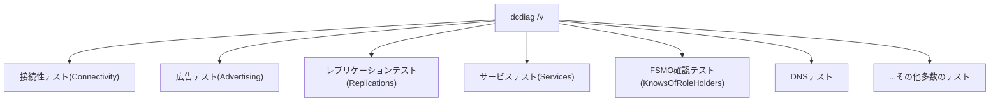

## はじめに

- **この記事で得られること**: AD移行やDC構築の手順書で必ず実行する`dcdiag /v`について、そもそも何を検証しているツールなのか、主要なテスト項目がそれぞれ具体的に何を確認しているのか、そして実際に表示された警告・エラーを見て、**「AD移行作業を進めても問題ない根拠」と「作業を止めて対処すべき根拠」をどう見分けるのか**を体系的に理解できます。
- **対象読者**: `dcdiag /v`を実行したことはあるものの、項目数の多さと出力の長さに圧倒され、警告が出ていても「よくあることだから」と流してしまっている、あるいは逆にすべての警告を過剰に恐れてしまっている方を想定しています。
- **読むのにかかる想定時間**: 約20分

この記事は[『上位1%』シリーズ 全記事ガイド](/sitemap)の一部、[Active Directoryシリーズ](/sitemap#シリーズ一覧)の9本目です。[DCの正常性確認を『上位1%』の視点で理解する](/articles/dc-health-check-guide)で扱った`repadmin`・`net share`とあわせて、DCの正常性確認の主要な手段の1つです。

## 前提知識

- **イベントログ**: Windowsの各種サービス・アプリケーションが記録する動作ログです。`dcdiag`の一部テストは、このイベントログの内容を検査します。
- **サービス**: Netlogon、KDC(Kerberos Key Distribution Center)など、DCとして機能するために必要なバックグラウンドプロセス群です。

## 全体像をつかむ

### `dcdiag`は何をしているツールなのか

**`dcdiag`(Domain Controller Diagnostics)は、DCが正常に機能するために必要な、多数の独立したテスト項目を一括で実行し、それぞれをPASS(合格)/FAIL(不合格)/警告として報告するツール**です。`/v`(verbose)オプションを付けると、各テストがPASS/FAILと判定した根拠となる、より詳細な情報まで出力されます。

**重要なのは、`dcdiag`の各テストは、それぞれ独立した別々の観点をチェックしている**という点です。あるテストがFAILしていても、それは「DC全体が完全にダウンしている」ことを意味するとは限らず、逆にすべてPASSしていても、`dcdiag`がそもそもチェック対象にしていない種類の問題(たとえば前述の`repadmin`が確認するレプリケーションの詳細な失敗回数など)が別に存在する可能性はあります。`dcdiag`は万能の1コマンドではなく、**多数の観点をまとめて効率的にチェックするための入り口**として位置づけるのが適切です。

## 基礎から徹底解説

### 主要なテスト項目とその意味

`dcdiag /v`が実行するテストは数十種類にのぼりますが、AD移行やトラブルシューティングの実務で特に頻繁に参照される項目を整理します。

| テスト名 | 検証している内容 | FAILが示す可能性 |
|---|---|---|
| **Connectivity** | 対象DCへのDNS名前解決とネットワーク的な到達性 | そもそもDCへ到達できない、DNS登録に誤りがある |
| **Advertising** | そのDCが、DCロケーター機能([DNSゾーンとレコードの読み方](/articles/dns-zones-records-guide)で扱ったSRVレコード)によって正しく「利用可能なDC」として広告されているか | クライアントがそのDCを発見できない状態にある |
| **NetLogons** | Netlogonサービスに必要な共有(NETLOGON・SYSVOL)へアクセスできるか | SYSVOLレプリケーションの問題、あるいはNetlogonサービス自体の異常 |
| **Replications** | そのDCの直近のレプリケーションに失敗がないか | `repadmin`で確認する内容の要約版。詳細な切り分けには`repadmin`を使う |
| **Services** | Netlogon・KDC・DNSなど、DCとして必須のサービスが正しく起動しているか | 特定のサービスが停止・異常終了している |
| **KnowsOfRoleHolders** | そのDCが、5つのFSMO役割それぞれの現在の保持者を正しく認識しているか | [FSMO](/articles/fsmo-guide)保持者の情報に不整合がある |
| **MachineAccount** | そのDC自身のコンピューターアカウントの設定(SPNなど)が正しいか | [コンピューター名の変更](/articles/ad-computername-netdom-guide)にまつわる不整合が残っている可能性 |
| **FrsEvent/DFSREvent** | SYSVOLレプリケーション(旧FRSまたはDFSR)関連のイベントログにエラーが記録されていないか | SYSVOLの複製自体は動いていても、過去にエラーが発生した記録が残っている |
| **DNS** | DCが必要とするDNSレコード(前述のSRVレコード群など)が正しく登録されているか | DNS登録の不備、ゾーンの構成ミス |

Connectivityテストは、具体的にどうやって「到達性」を確認しているのか

`Connectivity`テストは、単純な1つのチェックではなく、次の4つの確認を順番に行っています。

1. **DNS名前解決**: 対象DCのホスト名がDNSで正しく解決できるか
2. **ICMP ping応答**: 解決したIPアドレスへ、実際にpingが通るか
3. **LDAPバインド**: LDAPプロトコルで、対象DCのAD DSへ実際に接続(バインド)できるか
4. **RPCバインド**: `DsBindWithCred`というAPIを使い、AD DS用のRPCインターフェースへ接続できるか

この4つすべてに成功して初めて、`Connectivity`テストは合格になります。またこの仕組み上、`dcdiag /v`を実行しているコマンドプロンプトが対象DC自身の上にあるか、別のコンピューターの上にあるかにかかわらず、**あくまで「DNS解決→ping→LDAP→RPC」という一連の到達性が、コマンドを実行しているマシンから見て確認できるか**を検証している、という点は共通です。なお`Connectivity`テストはすべてのテストの前提になっており、これが失敗した対象DCに対しては、以降の他のテストは実行されません(実行しても意味のある結果にならないためです)。

### `/v`オプションが追加する情報の意味

`/v`を付けずに`dcdiag`を実行すると、各テストの結果は`passed test Connectivity`のような1行のPASS/FAILだけが表示されます。`/v`を付けると、**PASSしたテストについても、その判定の根拠となった詳細情報(確認したレコードの内容、応答時間、内部的な確認ステップなど)まで出力される**ようになります。これにより、テストが「PASSしたこと」だけでなく、**「何を根拠にPASSと判定したのか」まで確認でき、際どい状態(ぎりぎりPASSしているが余裕がない、など)を見逃しにくくなります。**

## プロが見ている視点(上位1%の理解)

### エラー・警告を無視してよい根拠、無視できない根拠

`dcdiag /v`は項目数が非常に多いため、実際のAD環境では**何かしらの警告が1つも出ない、という状態の方がむしろ珍しい**と言えます。ここで重要になるのが、**「無視してよい根拠」と「無視してはいけない根拠」を、以下の観点から個別に判断する**姿勢です。

- **無視してよい可能性が比較的高いケース**:
  - **一時的・過去のイベントに紐づく警告**: たとえば直近でそのDCを再起動したことに起因する、起動シーケンス中の一時的なサービス遅延に関するイベントログの記録。**「いつ発生した事象か」「その後正常化しているか」を必ず確認**した上で、既に解消済みの一過性の事象であれば、実務上のリスクは低いと判断できます。
  - **想定内の設計に起因する警告**: たとえば、意図的にファイアウォールで特定の通信を制限している構成に起因する、一部の到達性チェックの警告。**その制限が意図的なものであり、実際の運用に支障が出ていないことを確認済み**であれば、環境固有の想定内の結果として扱えます。
- **無視してはならないケース**:
  - **Replications・NetLogons・Services・KnowsOfRoleHoldersのFAIL**: これらは、DCとしての根幹機能(レプリケーション、認証、FSMO情報の把握)そのものに関わるテストであり、FAILしている場合は**その原因を特定し解消するまで、AD移行作業(特にFSMO転送やDCの降格)を先に進めるべきではありません。**
  - **原因が特定できない、あるいは説明のつかない警告**: 「よくあることだから」という理由だけで済ませず、**なぜその警告が出ているのかを説明できる状態になるまで調査する**ことが重要です。説明できない警告を放置したまま次の作業段階(FSMO転送や旧DCの降格など)に進むと、後になって原因の切り分けが格段に難しくなります。

**判断の基本方針は、「その警告・エラーが、これから実行しようとしている作業(FSMO転送、DCの降格など)に直接影響する種類のテストかどうか」を軸に据えることです。** 無関係な軽微な警告にまで時間をかけすぎず、一方で根幹に関わるテストのFAILは決して先送りにしない、というメリハリが実務上重要になります。

### `dcdiag`の実行タイミング

AD移行の実務では、`dcdiag /v`を**最低でも複数のタイミングで**実行し、状態の変化を比較することが推奨されます。

1. **移行作業を開始する前**: 既存環境がそもそも健全な状態にあるかを確認するベースライン
2. **新DCを追加した直後**: 新DC自体、および既存DCから見た新DCの見え方に問題がないかを確認
3. **FSMO転送の直後**: `KnowsOfRoleHolders`などが新しい保持者を正しく認識しているかを確認
4. **旧DCの降格・撤去の直後**: 旧DCの情報が残っていないか、残りのDCが正常な状態を維持しているかを確認

各段階で結果を保存しておき、**「移行前から存在していた警告」と「移行作業によって新たに発生した警告」を区別できるようにしておく**ことが、原因切り分けの効率を大きく左右します。この4段階のタイミングを実際に手を動かして体験したい場合は、[旧DCから新DCへのAD移行(リプレース)ハンズオン](/articles/ad-migration-handson-guide)を参照してください。dcdiagであえて警告を発生させて読み解く演習も扱っています。

## よくある誤解・つまずきポイント

- **誤解1: 「dcdiag /vで警告やエラーが1つでも出たら、AD環境全体に重大な問題がある」**
  実際のAD環境では軽微な警告が出ることは珍しくなく、警告の有無だけでなく、その警告がどのテスト項目に属し、何を意味しているのかを個別に判断する必要があります。
  

  
「警告が多い=不健全」という短絡的な判断のリスク

  警告の数だけを指標にしてしまうと、本当に重大なFAIL(NetLogonsやReplicationsなど)が、大量の軽微な警告の中に埋もれて見落とされるリスクがあります。件数ではなく、各警告・FAILが属するテストの種類とその意味を個別に評価することが重要です。
  

- **誤解2: 「dcdiagがすべてPASSすれば、AD環境に一切問題はない」**
  `dcdiag`はあくまで多数の代表的なテストの集合であり、たとえば`repadmin`が確認するような詳細なレプリケーション失敗回数など、`dcdiag`単体ではカバーしきれない観点も存在します。
- **誤解3: 「dcdiagは一度実行すれば十分で、作業の前後で繰り返す必要はない」**
  移行作業の各段階で結果を比較することで初めて、「元から存在していた問題」と「作業によって新たに発生した問題」を切り分けられます。1回きりの実行では、この比較ができません。

## 障害・トラブルシューティングの視点

`dcdiag /v`の結果を使ったトラブルシューティングは、**「根幹に関わるテストか、周辺的なテストか」で優先順位を決める**のが基本です。

1. **Replications/NetLogons/ServicesのいずれかがFAILしている**: 最優先で原因を特定します。[DCの正常性確認](/articles/dc-health-check-guide)で扱った`repadmin`・`net share`と組み合わせて、より詳細な状況を確認します。
2. **KnowsOfRoleHoldersがFAILしている**: [FSMO](/articles/fsmo-guide)保持者の情報に不整合がある可能性が高く、`netdom query fsmo`とあわせて実際の保持者を確認します。
3. **DNSテストで警告が出ている**: [DNSゾーンとレコードの読み方](/articles/dns-zones-records-guide)で扱った`_msdcs`配下のSRVレコードが正しく登録されているかを確認します。
4. **原因不明の警告が複数のDCで共通して出ている**: 個々のDC固有の問題ではなく、ネットワーク構成やDNS設定など、環境全体に共通する要因を疑います。

### 予防策・恒久対策

- AD移行の各段階(移行前・新DC追加後・FSMO転送後・旧DC撤去後)で`dcdiag /v`の結果を必ず保存し、比較できる状態にしておく。
- 警告が出た場合は、「いつから発生しているか」「再現性があるか」「想定内の構成に起因するものか」を必ず記録し、原因不明のまま放置しない。
- 根幹に関わるテスト(Replications・NetLogons・Services・KnowsOfRoleHolders)については、他の警告よりも優先度を高く設定した確認フローをチーム内で共有する。

## まとめ

- `dcdiag`は、DCが正常に機能するために必要な多数の独立したテストを一括で実行し、PASS/FAILを報告するツールであり、`/v`を付けると各テストの判定根拠まで確認できます。
- Connectivity・Advertising・NetLogons・Replications・Services・KnowsOfRoleHolders・DNSなど、テストごとに検証している観点が異なるため、FAILが出た場合はどのテストかを必ず確認します。
- 警告・エラーを無視してよいかどうかは、それが一時的・想定内の事象に起因するか、そして根幹に関わるテスト(Replications・NetLogons・Services・KnowsOfRoleHolders)かどうかを軸に判断します。
- `dcdiag /v`はAD移行の複数の段階で繰り返し実行し、結果を比較することで、元からあった問題と作業によって新たに発生した問題を切り分けられます。

**今日から意識すべきこと**
1. `dcdiag /v`の結果を見たら、警告の件数ではなく、どのテスト項目に属する警告かをまず確認しましょう。
2. AD移行作業の各段階で`dcdiag /v`の結果を保存し、作業前後で比較する習慣をつけましょう。

## 参考文献

- [Dcdiag | Microsoft Learn](https://learn.microsoft.com/en-us/windows-server/administration/windows-commands/dcdiag)
- [Diagnosing Active Directory replication problems with dcdiag | Microsoft Learn](https://learn.microsoft.com/en-us/troubleshoot/windows-server/identity/useful-repadmin-commands)
- [Active Directory Replication Concepts | Microsoft Learn](https://learn.microsoft.com/en-us/windows-server/identity/ad-ds/get-started/replication/active-directory-replication-concepts)
