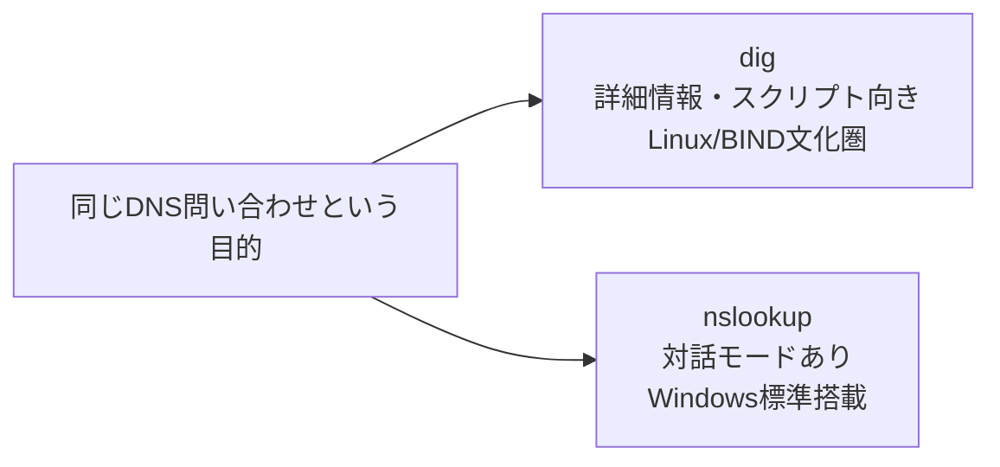

## はじめに

- **この記事で得られること**: [BINDでDNSサーバーを構築し、ゾーン転送を体験する『上位1%』のハンズオン](/articles/dns-server-handson-guide)などで使ってきた`dig`コマンドについて、その基本的な使い方と出力結果の読み方を体系的に理解します。あわせて、もう1つの代表的なDNS問い合わせコマンドである`nslookup`との違いと、実務での使い分けも扱います。
- **対象読者**: `dig`や`nslookup`をハンズオン記事の手順通りに実行したことはあるが、出力結果の各項目が何を意味しているのか、2つのコマンドの違いが何なのかを説明できない方を想定しています。
- **読むのにかかる想定時間**: 約15分

この記事は[『上位1%』シリーズ 全記事ガイド](/sitemap)の一部、[DNSサーバー基礎シリーズ](/sitemap#シリーズ一覧)の3本目です。

## 全体像をつかむ

`dig`と`nslookup`は、どちらも「あるドメイン名に対応するDNSレコードを問い合わせる」という、同じ目的のコマンドです。しかし、生まれた背景と得意分野が異なります。



## 基礎から徹底解説

### digの基本的な使い方と出力の読み方

`dig`の最も基本的な使い方は、次の形式です。

```bash
dig <問い合わせたいドメイン名> <レコードタイプ>
```

```bash
dig example.com A
```

実際に実行すると、出力は次のようないくつかのセクションに分かれています。

- **HEADER**: 問い合わせが成功したか(`status: NOERROR`)、何件の回答が得られたか(`ANSWER: 1`)などのサマリーです。
- **QUESTION SECTION**: 実際に何を問い合わせたか、そのままの内容です。
- **ANSWER SECTION**: 実際に返ってきたレコードの内容です。ここに、TTL・クラス(`IN`)・レコードタイプ・値が並びます。
- **Query time / SERVER / WHEN**: この問い合わせにかかった時間、どのDNSサーバーに問い合わせたか、いつ実行したかの情報です。

`@`を使うと、問い合わせ先のDNSサーバーを明示的に指定できます。

```bash
dig @8.8.8.8 example.com A
```

`@`を省略した場合は、そのマシンのOSに設定されている既定のDNSサーバー(`/etc/resolv.conf`など)へ問い合わせます。**特定のDNSサーバーが正しく機能しているかどうかを検証したいときは、`@`で明示的に指定することが重要です。** 指定を忘れると、意図せず別のDNSサーバー(既定のリゾルバなど)への問い合わせ結果を見てしまい、検証対象を取り違えることがあります。

<details>
<summary>+shortオプションで出力を簡潔にする</summary>

`dig`の出力は情報量が多く、スクリプトで結果だけを取り出したい場合には冗長です。`+short`オプションを付けると、レコードの値だけを簡潔に表示できます。

```bash
dig example.com A +short
```

自動化スクリプトの中で、IPアドレスの値だけを変数に取り込みたいような場面で重宝します。

</details>

### nslookupの基本的な使い方

`nslookup`も同様に、ドメイン名を指定するだけで問い合わせができます。

```bash
nslookup example.com
```

`nslookup`には対話モードがあり、コマンドだけを実行するとプロンプトが表示され、複数の問い合わせを連続して行えます。

```bash
nslookup
> set type=MX
> example.com
> exit
```

`set type=<レコードタイプ>`で、以降の問い合わせで取得するレコードタイプを指定できます。

### digとnslookup、実務でどう使い分けるか

**`nslookup`最大の強みは、Windows環境に標準搭載されている**という点です。Linuxサーバーの管理者であっても、クライアント側の動作確認でWindows PCから直接DNSを問い合わせたい場面では、追加のインストールなしに使える`nslookup`が便利です。一方、**`dig`は、TTLや各種フラグまで含めた詳細な情報を表示でき、`+short`のような出力制御オプションも豊富**なため、Linux/BIND文化圏では、より詳しい調査やスクリプトへの組み込みに`dig`が好まれる傾向があります。実務では、「Windowsクライアントからの簡易確認は`nslookup`、Linuxサーバーでの詳細調査やスクリプト化は`dig`」という使い分けが一般的です。

## プロが見ている視点(上位1%の理解)

### nslookupが「非推奨」と誤解されがちな理由

`dig`のマニュアルページなどで、しばしば「`nslookup`の使用は非推奨」という趣旨の記述を見かけることがあります。これは、`nslookup`が内部的に、OSの標準的な名前解決ライブラリ(リゾルバライブラリ)とは異なる、独自の問い合わせ経路を使っていた歴史的経緯に由来します。**この違いにより、ごく稀に、`nslookup`の結果と、実際にアプリケーションが使う名前解決の結果が一致しないケースがある**、というのが非推奨とされる技術的な理由です。ただし、単純なDNSレコードの確認用途であれば、この違いが実務上問題になることはほとんどなく、Windows環境での簡易確認用コマンドとして、今も広く使われ続けています。「非推奨だから使ってはいけない」ではなく、「用途によっては`dig`の方がより正確」という理解が実態に近いです。

## よくある誤解・つまずきポイント

- **誤解1: 「digとnslookupは、機能的にまったく同じコマンドである」**
  目的は同じですが、出力の詳細さ、対応するオプション、内部的な問い合わせ経路には違いがあります。
- **誤解2: 「dig ドメイン名だけで、常にそのマシンが実際に使っているDNSサーバーへ問い合わせている」**
  `@`で明示的に指定しない場合、OSの既定の設定を参照しますが、検証目的では`@`で問い合わせ先を明示するべきです。
- **誤解3: 「nslookupは古い非推奨のコマンドなので、もう使うべきではない」**
  内部的な問い合わせ経路の違いにより非推奨と言われることがありますが、簡易確認用途では実務上問題になることはほとんどなく、Windows環境では標準搭載の利点から広く使われ続けています。

## 障害・トラブルシューティングの視点

1. **`dig`の結果が期待と異なる**: `@`でどのDNSサーバーに問い合わせているかを確認し、キャッシュされた古い情報を見ていないか、`+short`を外して`ANSWER SECTION`のTTLも確認します。
2. **社内DNSサーバーへの問い合わせだけ失敗する**: ファイアウォールでUDP/TCP 53番ポートがブロックされていないか、`@<社内DNSサーバーのIP>`で明示的に問い合わせて切り分けます。
3. **`nslookup`と`dig`で結果が食い違う**: 双方が同じDNSサーバーに問い合わせているかをまず確認します(`nslookup`もサーバーを明示的に指定できます)。

## まとめ

- `dig`は詳細な情報を表示でき、`+short`などのオプションでスクリプト向けの出力にも対応する、Linux/BIND文化圏で好まれるコマンドです。
- `nslookup`は対話モードを持ち、Windows環境に標準搭載されているため、簡易確認用途で広く使われています。
- `@`で問い合わせ先のDNSサーバーを明示することが、検証目的では重要です。
- `nslookup`が非推奨とされるのは、内部的な問い合わせ経路の違いによるものであり、簡易確認用途では実務上問題になることはほとんどありません。

**今日から意識すべきこと**
1. 特定のDNSサーバーの動作を検証したいときは、`@`で問い合わせ先を明示する習慣をつけましょう。
2. スクリプトに組み込む場合は`dig +short`、Windows環境での簡易確認には`nslookup`と、場面に応じて使い分けましょう。

## 参考文献

- [dig(1) - Linux manual page](https://linux.die.net/man/1/dig)
- [nslookup | Microsoft Learn](https://learn.microsoft.com/en-us/windows-server/administration/windows-commands/nslookup)
