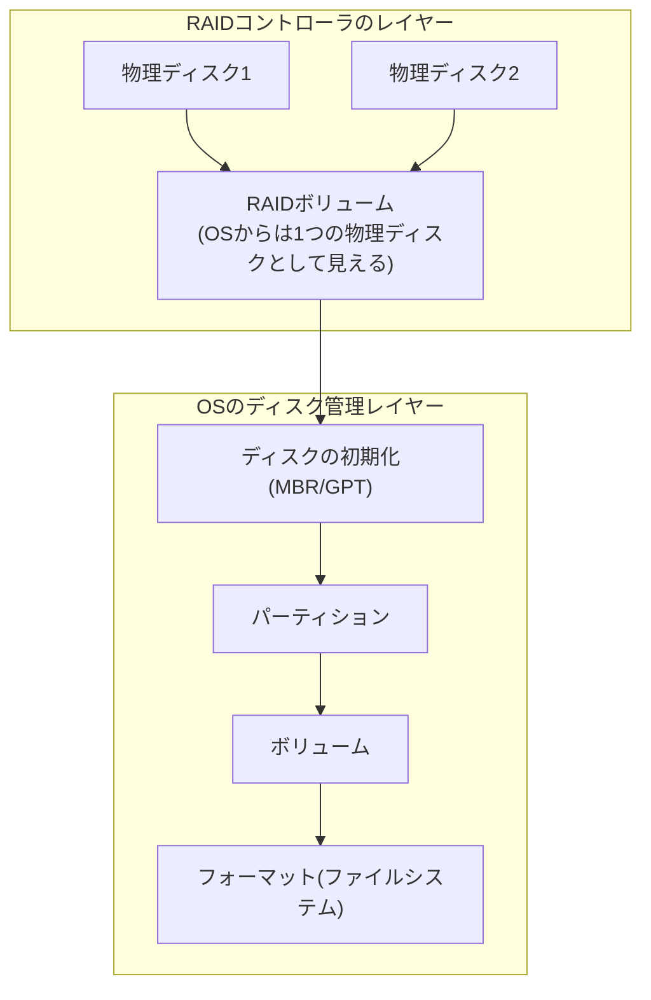

## はじめに

- **この記事で得られること**: 「RAIDを構築してからOSをインストールしたのに、なぜCドライブはすぐ使えて、Dドライブは使う前にディスクの初期化という作業が必要になるのか」という実務でよく遭遇する疑問を出発点に、**RAIDというレイヤーと、OSのディスク管理というレイヤーがそれぞれ何を担っているのか**を体系的に整理します。あわせて、**ディスクの初期化・MBR/GPT・ボリューム・フォーマット**という、ディスク管理コンソールで必ず登場する用語を、それぞれ「具体的に何をしている操作なのか」まで踏み込んで理解します。
- **対象読者**: サーバーのディスク管理・RAID構築に携わったことはあるものの、RAIDとOSのディスク管理の関係や、初期化・フォーマットが実際に何をしているのかを具体的に説明できない方を想定しています。
- **読むのにかかる想定時間**: 約19分

この記事は[『上位1%』シリーズ 全記事ガイド](/sitemap)の一部、ストレージ基礎をテーマにした新シリーズの1本目です。

## 前提知識

- **物理ディスク**: 実際に存在するハードディスクドライブ・SSDなどの記憶装置そのものです。

## 全体像をつかむ

### RAIDとOSのディスク管理は、まったく別のレイヤー

**RAID(コントローラ)は、複数の物理ディスクを束ねて、OSに対して「1つの(あるいは元の台数より少ない)物理ディスクであるかのように見せる」抽象化のレイヤーです。OSのディスク管理は、この「1つに見えるディスク」の中身を、パーティション・ボリューム・ファイルシステムという、さらに別の階層で管理するレイヤーです。** この2つは完全に独立したレイヤーであり、RAIDを構築したこと自体が、OS側のディスク管理を代替・省略してくれるわけではありません。

## 基礎から徹底解説

### なぜCドライブはすぐ使えて、Dドライブは初期化が必要なのか

これは、**OSのインストーラ自体が、インストール先として選択したディスク(多くの場合Cドライブになる1台目)については、インストール処理の一部としてパーティション作成・初期化・フォーマットまで自動的に済ませている**ためです。一方、**インストール先として選択しなかった、追加のRAIDボリューム(Dドライブ用に別途構成したRAIDアレイなど)は、OSインストーラの処理対象になっていません。** そのため、OSのインストールが完了した時点で、Dドライブに割り当てられるはずのRAIDボリュームは、まだ<strong>「OSからは物理的に存在すると認識されているが、パーティション情報が何も書き込まれていない、生の状態」</strong>のままです。ディスクの管理(`diskmgmt.msc`)を開くと、この未初期化のディスクが「未初期化」というステータスで表示され、手動での初期化作業が必要になります。

なお、このインストーラ自体がPOST後にどう起動し、ファームウェアからOSへ制御がどう受け渡されていくのかは[POST後のOS起動プロセス](/articles/os-boot-process-guide)で、そしてインストールメディアの実体であるISOファイルが具体的に何なのかは[インストーラのx64とx86の違い](/articles/windows-install-media-guide)で、それぞれ深掘りしています。

### ディスクの初期化とは、具体的に何をしているのか

**ディスクの初期化とは、そのディスクの先頭部分に、パーティションテーブル(MBRまたはGPT)を新規に書き込む操作**です。パーティションテーブルは、「このディスクの、どの範囲がどのパーティションとして使われているか」を記録する、いわば<strong>ディスクの目次(管理情報)</strong>です。初期化前のディスクにはこの目次自体が存在しないため、OSはそのディスクの存在自体は認識できても、「どこにどんな区切りでデータを配置すればよいか」を判断できず、**そのまま使うことができません。**

### MBR(Master Boot Record)とGPT(GUID Partition Table)の違い

初期化の際には、**MBR**と**GPT**という、2種類のパーティションテーブル形式のどちらかを選択します。

| | MBR(Master Boot Record) | GPT(GUID Partition Table) |
|---|---|---|
| 登場時期 | 古い方式 | UEFI環境を前提とした新しい方式 |
| パーティションテーブルの格納場所 | ディスク先頭の512バイトのみ(単一障害点) | 複数箇所に複製を保持(冗長性・破損検出のためのCRC32チェックサム付き) |
| パーティション数の上限 | 最大4つのプライマリパーティション(拡張パーティションで実質的に回避可能) | 最大128個 |
| 対応できるディスク容量の上限 | 最大2TB | 事実上の上限は非常に大きい(理論値では数十億TB規模) |

**MBRに2TBという容量の上限がある理由は、パーティションの開始位置・サイズを32bitのセクタ番号で管理しているためです。** 一般的な512バイトセクタのディスクでは、`2^32 × 512バイト = 2TB`が、この32bitアドレッシングで表現できる上限になります。この制約を受けないGPTが、現在では大容量ディスクの標準的な選択肢になっています。

MBRのパーティションテーブルがなぜ単一障害点になるのか

MBR形式では、パーティションテーブルの情報がディスク先頭の512バイトという、たった1箇所にしか存在しません。この領域が物理的な不良セクタや、何らかの書き込みエラーによって破損すると、**そのディスク上のすべてのパーティション情報が一度に失われるリスク**があります。GPTは、このリスクに対応するため、パーティションテーブルの複製をディスクの複数箇所(先頭と末尾など)に保持する設計になっています。

### ボリュームとは何か:パーティションとの違い

**パーティション**は、ディスク上に区切られた、物理的な領域そのものを指します。**ボリューム**は、OSがそのパーティション(あるいは、ダイナミックディスクの場合は複数のパーティションや複数の物理ディスクを束ねたもの)に対して、**ドライブ文字を割り当て、ファイルシステムを通じてアクセス可能にした、論理的な単位**です。

多くの一般的な構成(基本ディスク)では、**1つのパーティションが、そのまま1つのボリュームとして扱われる**ため、この2つの区別を意識する機会は少ないですが、**ダイナミックディスク**を使う構成では、複数のパーティション(あるいは複数の物理ディスク)をまとめて1つの大きなボリュームとして扱う、といった柔軟な構成も可能になります。この場合、「パーティション」と「ボリューム」は1対1で対応しない、明確に異なる概念になります。

### フォーマットとは、具体的に何をしているのか

**フォーマットとは、ボリューム上に、ファイルシステム(NTFS、ReFSなど)がデータを管理するために必要な、管理用のデータ構造そのものを新規に書き込む操作**です。たとえばNTFSであれば、<strong>MFT(マスターファイルテーブル、そのボリューム上に存在するすべてのファイル・フォルダーの情報を記録する中心的な管理データ)</strong>などがこの段階で作成されます。この管理データ構造が用意されることで、初めて「ファイル」「フォルダー」という単位でデータを保存・管理できるようになります。

| フォーマットの種類 | 動作 |
|---|---|
| **クイックフォーマット** | ファイルシステムの管理データ構造だけを新規に書き込み、既存のデータ領域自体のスキャン(不良セクタチェック)は行いません。短時間で完了します。 |
| **フル(通常)フォーマット** | 管理データ構造の作成に加え、ディスク全体をスキャンし、物理的な不良セクタの有無を確認します。ディスク容量に応じて長時間かかります。 |

## プロが見ている視点(上位1%の理解)

### ハードウェアRAIDとOSのソフトウェアRAID機能の使い分け

Windows Server自体も、<strong>ダイナミックディスクの機能を使った、OSレベルでのミラーリング(ソフトウェアRAID相当)</strong>を提供していますが、実務では専用のRAIDコントローラ(ハードウェアRAID)を使う構成が一般的です。**ハードウェアRAIDは、OSが起動する前の段階から冗長性が機能しており、専用のプロセッサでRAID関連の演算(パリティ計算など)を処理するため、OS・CPU側の負荷を圧迫しない**という利点があります。一方ソフトウェアRAIDは、追加の専用ハードウェアが不要な分、コスト面で有利になる場合があります。要件に応じて、どちらのレイヤーで冗長性を実現するかを選択します。

**ハードウェアRAIDを使うには、RAIDコントローラという専用の物理部品が、そのサーバーに搭載されている必要があります。** 多くのエンタープライズ向けラックサーバー(Dell PowerEdge、HPE ProLiantなど)は、マザーボード上にRAIDコントローラを標準搭載しているか、あるいはPCIe拡張カードとして追加できる構成になっており、購入時にこのRAIDコントローラを選択(あるいは後から追加)する必要があります。RAIDコントローラが搭載されていないサーバーでは、そもそもハードウェアRAIDという選択肢自体が存在せず、冗長性が必要であればOSのソフトウェアRAID機能(ダイナミックディスクなど)を使うことになります。

実務でどこを見れば、ハードウェアRAIDかソフトウェアRAIDかを見分けられるか

もっとも確実な見分け方は、**サーバーの起動直後、OSが立ち上がるより前の画面に、RAID設定専用の画面(BIOS/UEFI起動シーケンスの一部として動く、独立したユーティリティ)が表示されるかどうか**です。Dellサーバーの`PERC`(PowerEdge RAID Controller)であれば起動時に`Ctrl+R`、あるいは近年の機種ではUEFIの設定画面からRAID構成ユーティリティへ進めます。この画面でRAIDアレイ(仮想ディスク)を組んでいる場合、OSからは、実際の物理ディスクの台数によらず、**構成済みの仮想ディスクが1台の物理ディスクとして**見えます。

一方、この起動前のRAID設定画面自体が存在しない(あるいは搭載されているコントローラが単純なパススルーのHBAである)サーバーでは、OSのディスクの管理を開くと、実際の物理ディスクの台数がそのまま個別のディスクとして表示されます。この状態から、ディスクを**ダイナミックディスクへ変換**し、ミラーボリュームやRAID-5ボリュームを作成する操作が、Windows側のソフトウェアRAIDにあたります。「起動時にRAID専用の設定画面を経由したかどうか」と、「ディスクの管理を開いたときに見える台数が、実際の物理ディスクの台数と一致するかどうか」の2点を確認すれば、目の前のサーバーがどちらの方式なのかを切り分けられます。

## よくある誤解・つまずきポイント

- **誤解1: 「RAIDを構築すれば、OS側のディスク管理(初期化・フォーマットなど)は不要になる」**
  RAIDはあくまで複数の物理ディスクを1つに見せる抽象化のレイヤーであり、その上でOSが行うパーティション・ボリューム・ファイルシステムの管理は、RAIDの有無とは独立して必要です。
- **誤解2: 「パーティションとボリュームは同じものを指す別名である」**
  基本ディスクの構成では1対1で対応するため区別する機会が少ないですが、パーティションは物理的な区画、ボリュームはOSがアクセス可能にした論理的な単位という、明確に異なる概念です。
- **誤解3: 「フォーマットは、単にディスクの内容を消去するだけの操作である」**
  フォーマットは、ファイルシステムが動作するために必要な管理データ構造を新規に構築する操作です。内容の消去は、その過程で発生する結果の1つに過ぎません。

## 障害・トラブルシューティングの視点

ディスク関連の問題は、**「RAIDレイヤーの問題か、OSのディスク管理レイヤーの問題か」を切り分ける**のが基本です。

1. **新しく追加したディスクが「未初期化」と表示され、使用できない**: これは異常ではなく、初期化前の正常な状態です。ディスクの管理コンソールから初期化(MBR/GPTの選択)を行います。
2. **2TBを超えるディスクを初期化しようとしたのに、一部の容量しか使えない**: MBR形式を選択してしまった可能性があります。GPT形式で再初期化する必要があります(既存データがある場合は事前のバックアップが必須です)。
3. **RAIDボリューム自体がOSから認識されない**: RAIDコントローラ側の構成・ステータスを確認します。これはOSのディスク管理レイヤーより前の問題です。

### 予防策・恒久対策

- 2TBを超える容量が想定されるディスクには、初期化の時点で必ずGPT形式を選択する。
- ハードウェアRAIDを使う場合、OSのディスク管理はあくまでRAIDボリュームという「1つのディスク」に対する操作であることを踏まえ、RAIDコントローラ側の設定・ステータス確認と、OS側のディスク管理を明確に分けて切り分ける。

## まとめ

- RAIDは複数の物理ディスクを1つに見せる抽象化のレイヤー、OSのディスク管理はその上でパーティション・ボリューム・ファイルシステムを管理するレイヤーであり、両者は完全に独立しています。
- OSインストーラは、インストール先ディスクについてのみパーティション作成・フォーマットを自動的に済ませるため、追加のRAIDボリュームは未初期化のまま残り、手動での初期化が必要になります。
- ディスクの初期化はパーティションテーブル(MBRまたはGPT)を新規に書き込む操作であり、MBRは32bitセクタアドレッシングにより2TBの容量上限を持ちます。
- パーティションは物理的な区画、ボリュームはOSがアクセス可能にした論理的な単位であり、フォーマットはファイルシステムの管理データ構造を新規に構築する操作です。

**今日から意識すべきこと**
1. 新しく追加したディスクが「未初期化」と表示されても、異常ではなく初期化前の正常な状態であることを思い出しましょう。
2. 2TBを超える容量のディスクを初期化する際は、必ずGPT形式を選択しましょう。

## 参考文献

- [Windows and GPT FAQ | Microsoft Learn](https://learn.microsoft.com/en-us/windows-hardware/manufacture/desktop/windows-and-gpt-faq)
- [Basic and Dynamic Disks | Microsoft Learn](https://learn.microsoft.com/en-us/windows-server/storage/disk-management/basic-and-dynamic-disks)
- [NTFS Overview | Microsoft Learn](https://learn.microsoft.com/en-us/windows-server/storage/file-server/ntfs-overview)
