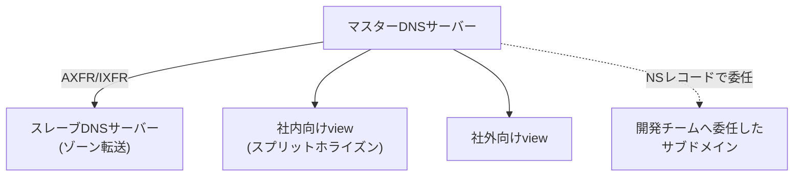

## はじめに

- **この記事で得られること**: ここまでのハンズオンで、1つずつ個別に習得してきた技術(マスター/スレーブ構成とゾーン転送、スプリットホライズン、サブドメインの委任、DNSSEC署名、DNS増幅攻撃に対するレスポンスレートリミティング)を、**1つの架空企業のDNS基盤へ、自分の力で統合する**、DNS基盤学科の卒業制作です。これまでの記事が「手順をなぞって、1つの技術を確実に身につける」ことを目的としていたのに対し、この記事は**要件だけを提示し、どの技術を、どう組み合わせるかを、自分で設計する**という、実務そのものに近い形式を取ります。
- **対象読者**: DNS基盤学科の3年生・4年生・大学院の内容を一通り終え、個々のハンズオンは実施できるが、それらを組み合わせて1つのDNS基盤を設計した経験がない方を想定しています。
- **読むのにかかる想定時間**: 設計・構築・文書化を含めて、数日〜1週間程度を想定しています(1回のハンズオンとしては最も重量級です)。

この記事は[『上位1%』シリーズ 全記事ガイド](/sitemap)の一部です。[DNS基盤学科の全カリキュラム](/university#dns基盤学科)の、卒業制作にあたる位置づけです。

## 前提知識

このハンズオンは、新しい技術を教えるものではありません。**以下の、すでに実施済みのハンズオンで習得した技術を、組み合わせて使います。**

- [BINDでDNSサーバーを構築し、ゾーン転送を体験するハンズオン](/articles/dns-server-handson-guide)
- [digとnslookupの使い方・使い分けを『上位1%』の視点で理解する](/articles/dig-nslookup-guide)
- [スプリットホライズンDNS(BINDのviews)の仕組みを『上位1%』の視点で理解する](/articles/dns-split-horizon-guide)
- [BINDでゾーンにDNSSEC署名を行い、検証失敗(SERVFAIL)を自分の手で再現するハンズオン](/articles/dns-dnssec-handson-guide)
- [サブドメインの委任(Delegation)を自分の手で構築し、Lame Delegationを再現するハンズオン](/articles/dns-delegation-handson-guide)
- [DNS増幅攻撃の仕組みを自分の目で確認し、レスポンスレートリミティング(RRL)で防御するハンズオン](/articles/dns-amplification-rrl-handson-guide)

## 課題設定:架空企業のDNS基盤

**あなたは、架空の企業「KoiKoi Corp」のインフラエンジニアです。この会社は、自社ドメインのDNS基盤を、社外のレジストラ任せの状態から、自社で管理する権威DNSサーバーへ移行することになりました。あなたに与えられた課題は、次の要件をすべて満たす、DNS基盤を、自分の手で構築することです。**

### 要件1: 単一障害点を作らない権威DNSサーバー構成にする

**マスターサーバーが1台だけでは単一障害点になります。ゾーン転送を使い、スレーブサーバーを少なくとも1台構築してください。**

### 要件2: 社内と社外で異なる応答を返す

**社内のアプリケーションサーバーには、社内ネットワークからのみプライベートIPで到達でき、社外からは別の公開用IPへ誘導する必要があります。同じドメイン名に対して、問い合わせ元によって異なる応答を返す仕組みを構築してください。**

### 要件3: 開発チームへサブドメインの管理を委任する

**開発チームが、独自に新しいサブドメインのレコードを追加・変更できるようにしたいという要望があります。委任の設定ミスによって、問い合わせが届かない「Lame Delegation」状態を引き起こさないよう、委任の設定を検証する手順もあわせて確立してください。**

### 要件4: DNS応答の正当性を暗号学的に保証する

**キャッシュポイズニングなどによる、偽のDNS応答のリスクに備え、ゾーンの応答が正当なものであることを暗号学的に検証できる仕組みを導入してください。** 導入時に、署名の更新を忘れて検証失敗(SERVFAIL)を引き起こさないための運用手順もあわせて文書化してください。

### 要件5: 自社のDNSサーバーが攻撃の踏み台にされることを防ぐ

**権威DNSサーバーが、DNS増幅攻撃の踏み台として悪用されるリスクに備え、過剰な応答を制限する仕組みを導入してください。**

### 要件6: 動作確認の手順を再現可能な形で残す

**上記のすべての設定について、digコマンドなどを使って動作を検証する具体的な手順を、誰が実行しても同じ結果を再現できる形で記録してください。**

## 成果物の要件:ポートフォリオとしてまとめる

**このハンズオンの最終的な成果物は、実際に動いた応答結果だけではありません。** GitHubなどのリポジトリに、次の内容を含む形でまとめてください。

- **README.md**: このシナリオの概要、あなたが採用したDNS基盤の全体像(mermaidなどの図を含む)
- **設計判断の記録**: 「なぜそのゾーン構成・view設計を選んだのか」という、判断の理由。特に、委任とセキュリティのトレードオフが発生した箇所について
- **実施手順**: 実際に実行した設定ファイルの記述や、dig/nslookupによる検証コマンドの記録
- **振り返り**: 実施してみて分かった課題、実際の実務であれば追加で検討すべき点(マネージドDNSサービスへの移行、監視体制の構築など)

**この成果物こそが、転職活動やポートフォリオとして提示できる、具体的な実績になります。** 単に「DNSSECのハンズオンをやりました」と説明するよりも、「社内外の要件が混在する現実的な制約の中で、複数の技術を組み合わせて設計し、委任とセキュリティのトレードオフを言語化できる」ことを示せる方が、はるかに説得力があります。

## プロが見ている視点(上位1%の理解)

### 「手順をなぞる力」と「要件から設計する力」は、まったく別のスキルである

これまでのハンズオンは、いずれも「Step 1、Step 2……」という、決められた手順をなぞる形式でした。**しかし、実際の実務で評価されるのは、手順書通りに作業を実行する力ではなく、与えられた要件(この記事でいう「要件1〜6」)から、どの技術を、どう組み合わせるべきかを、自分で設計する力です。** この2つは、似ているようでまったく別のスキルです。個々のハンズオンをすべて完了していても、それらを組み合わせて1つの一貫したDNS基盤を設計した経験がなければ、実務での即戦力にはなりません。この卒業制作は、その橋渡しを行うための、意図的な設計になっています。

### なぜ「社内外混在+委任」という設定なのか

このハンズオンが、単発の技術デモではなく、あえて「社内外で異なる応答」「他チームへの委任」という、複数の利害関係者が絡む現実的なプロジェクトを模した設定にしているのには理由があります。**実務のDNS基盤の多くは、単一の目的だけで完結せず、可用性・利便性・セキュリティという、複数の軸を同時に満たす必要があります。** ゾーン転送の設定方法だけを知っていても、その先にあるスプリットホライズン・委任管理・セキュリティ強化までを見通せなければ、実際のプロジェクトでは通用しません。この卒業制作を通じて、個々の技術の知識を、**複数の利害関係者を見通す設計力**へと昇華させることが、最終的な狙いです。

## よくある誤解・つまずきポイント

- **誤解1: 「このハンズオンは、決められた1つの正解のゾーン構成が存在する」**
  このハンズオンには、唯一の正解はありません。要件を満たす設計であれば、複数の妥当なアプローチが存在します。README.mdに、あなたが選んだ設計とその理由を記録することが重要です。
- **誤解2: 「成果物は、digコマンドの実行結果だけで十分である」**
  実行結果は重要ですが、それだけでは不十分です。設計判断の理由を言語化できることが、このハンズオンの本当の価値です。
- **誤解3: 「個々のハンズオンをすべて完了していれば、このハンズオンも簡単に終わる」**
  個々の技術を知っていることと、それらを1つの一貫した設計へ統合することの間には、大きな距離があります。多くの時間を要することを想定しておいてください。

## 障害・トラブルシューティングの視点

このハンズオンは、個々の技術的なトラブルシューティングよりも、**設計上の手戻り**が主な課題になります。

1. **要件を満たしているつもりが、後から矛盾に気づく**: 実装を始める前に、README.mdの設計部分だけを先に書き上げ、要件1〜6のすべてを満たせているかを、文章の段階で確認してください。
2. **個々のハンズオンの手順を忘れてしまっている**: 各要件に対応する前提記事のリンクを、遠慮なく読み返してください。この卒業制作は、暗記力ではなく設計力を試すものです。
3. **どこまで作り込めばよいか分からない**: 「転職活動で、初対面の面接官にこのREADME.mdを見せて、設計判断を説明できるか」を、完成度の目安にしてください。

## まとめ

- この卒業制作は、DNS基盤学科でこれまで個別に習得した技術を、1つの架空企業のDNS基盤へ統合する、総合演習です。
- 求められているのは、手順をなぞる力ではなく、要件から自分で設計する力です。
- 成果物は、動作確認の結果だけでなく、設計判断の理由を言語化した文書として、ポートフォリオにまとめてください。

**今日から意識すべきこと**
1. 個々のハンズオンを学ぶときも、「これは、将来どんな要件の中で使うことになるか」を意識する習慣をつけましょう。
2. 技術的な成果物だけでなく、委任とセキュリティのトレードオフを言語化する習慣を、日々の業務でも意識しましょう。

## 参考文献

- [DNS基盤学科の全カリキュラム](/university#dns基盤学科)
