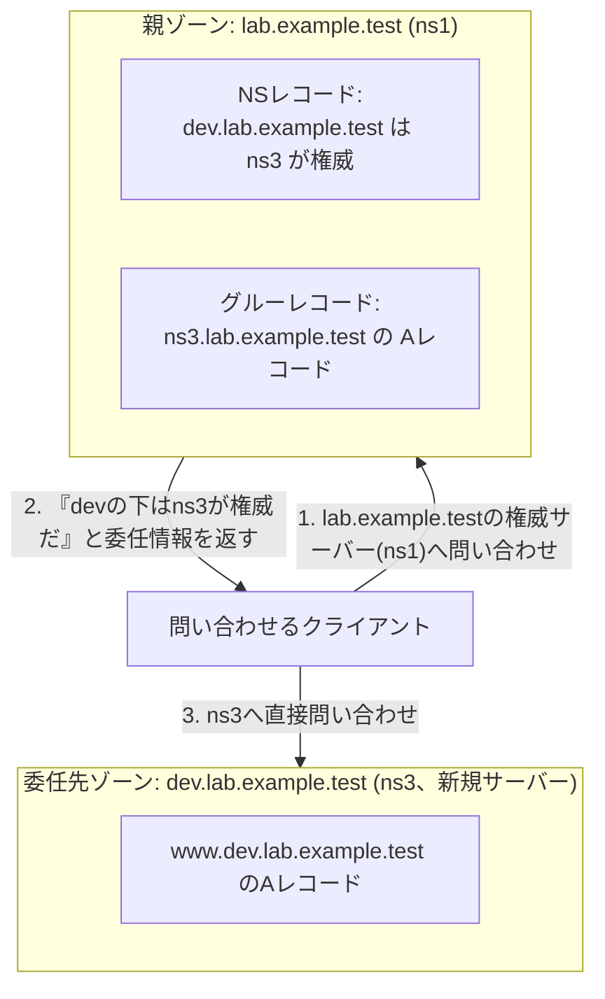

## はじめに

- **この記事で得られること**: [BINDでDNSサーバーを構築するハンズオン](/articles/dns-server-handson-guide)のFAQで軽く触れた「ドメインとゾーンは別の概念であり、1つのドメインの中の一部分だけを、別のDNSサーバーへ委任(Delegation)できる」という仕組みを、実際に2台目の権威サーバーを追加して構築します。親ゾーンのNSレコードと**グルーレコード**が、なぜ両方必要なのかを、**Lame Delegation**という典型的な障害を再現しながら理解します。
- **対象読者**: [BINDでDNSサーバーを構築するハンズオン](/articles/dns-server-handson-guide)をすでに終え、単一のゾーンの構築・運用には慣れているが、サブドメインを別のサーバーへ委任する構成は組んだことがない方を想定しています。
- **読むのにかかる想定時間**: 約40分

この記事は[『上位1%』シリーズ 全記事ガイド](/sitemap)の一部です。

## 前提知識

- **ゾーンファイルとNSレコード**: [DNSサーバーの基礎](/articles/dns-server-fundamentals-guide)を前提とします。
- **BINDでのゾーン構築**: [BINDでDNSサーバーを構築するハンズオン](/articles/dns-server-handson-guide)で作成した、`lab.example.test`ゾーンを持つ`ns1`(マスター)の環境を前提とします。

## 全体像をつかむ



## ハンズオン手順

### Step 1: 3台目のサーバー(ns3)に、委任先のゾーンを構築する

3台目のUbuntu ServerにBINDをインストールし、`dev.lab.example.test`という、独立したゾーンを新規に作成します。

```bash
sudo apt update && sudo apt install -y bind9 bind9utils dnsutils
```

```
# /etc/bind/named.conf.local (ns3)
zone "dev.lab.example.test" {
    type master;
    file "/etc/bind/db.dev.lab.example.test";
};
```

```
# /etc/bind/db.dev.lab.example.test (ns3)
$TTL 86400
@   IN  SOA   ns3.dev.lab.example.test. admin.dev.lab.example.test. (
                2026093001
                3600
                900
                604800
                86400 )
@       IN  NS      ns3.dev.lab.example.test.
ns3     IN  A       <ns3自身のIPアドレス>
www     IN  A       10.0.30.100
```

```bash
sudo named-checkzone dev.lab.example.test /etc/bind/db.dev.lab.example.test
sudo systemctl restart bind9
```

**この時点で、`dev.lab.example.test`は、ns3の中では完結した、独立したゾーンとして存在しています。しかし、親であるlab.example.testの側からは、まだ一切参照されていません。**

### Step 2: 親ゾーン(ns1)に、委任情報(NSレコード+グルーレコード)を追加する

`ns1`側の`db.lab.example.test`に、`dev`という下位のゾーンを、`ns3`へ委任する情報を追加します。

```
# /etc/bind/db.lab.example.test (ns1) に追記
dev     IN  NS      ns3.dev.lab.example.test.
ns3.dev IN  A       <ns3自身のIPアドレス>
```

**1行目のNSレコードが「委任」そのものであり、2行目の`ns3.dev`に対するAレコードが、いわゆる`グルーレコード`です。** シリアル番号を上げてから反映します。

```bash
sudo named-checkzone lab.example.test /etc/bind/db.lab.example.test
sudo systemctl restart bind9
```

`dig`で、委任が正しく機能しているかを確認します。

```bash
dig @<ns1のIP> www.dev.lab.example.test A
```

`ANSWER SECTION`に、`10.0.30.100`が返ってくれば成功です。裏側でどう動いているかを、`+trace`オプションでより詳しく確認できます。

```bash
dig +trace www.dev.lab.example.test A @<ns1のIP>
```

**`AUTHORITY SECTION`に`dev.lab.example.test`のNSレコードとして`ns3.dev.lab.example.test`が表示され、そこへ問い合わせが移っていく様子が確認できます。**

### Step 3: グルーレコードを意図的に間違え、Lame Delegationを再現する

ここが、このハンズオンの核心です。`ns1`側の`ns3.dev`のAレコードを、あえて存在しないIPアドレスに書き換えます。

```
dev     IN  NS      ns3.dev.lab.example.test.
ns3.dev IN  A       192.0.2.99
```

```bash
sudo named-checkzone lab.example.test /etc/bind/db.lab.example.test
sudo systemctl restart bind9
```

再度、`www.dev.lab.example.test`へ問い合わせます。

```bash
dig www.dev.lab.example.test A
```

**問い合わせが、実際には存在しない`192.0.2.99`へ送られてしまい、応答がなく、タイムアウトまたはSERVFAILになります。** これが**Lame Delegation**(委任先が実際には応答しない、壊れた委任)と呼ばれる状態です。グルーレコードを正しいIPアドレスへ戻すと、再び正常に解決できることを確認してください。

## プロが見ている視点(上位1%の理解)

### なぜグルーレコードという「二重管理」が必要なのか

一見すると、NSレコードだけで委任先のサーバー名は分かっているのだから、わざわざグルーレコードという形で親ゾーン側にもIPアドレスを持たせるのは、無駄な二重管理に見えます。**しかし、`ns3.dev.lab.example.test`という名前を解決するためには、本来`dev.lab.example.test`ゾーンへ問い合わせる必要があり、そのゾーンの権威サーバーこそが`ns3.dev.lab.example.test`自身である、という循環(Circular Dependency)が発生してしまいます。** グルーレコードは、この循環を断ち切るために、**親ゾーン自身が、委任先のサーバーのIPアドレスを、あらかじめ直接答えられるようにしておく**という、意図的な仕組みです。委任先のサーバー名が、委任するゾーン自身のドメインに含まれる場合(いわゆる「内包委任」)には、グルーレコードが構造的に必須になります。

### Lame Delegationが、実務で厄介な理由

Step 3で再現したLame Delegationは、**親ゾーン側の設定ミスによって発生するにもかかわらず、症状は子ゾーン側の名前解決の失敗として現れる**という、原因の切り分けを難しくする性質を持っています。子ゾーンを管理している担当者が、いくら自分のゾーンファイルを見直しても、原因は見つかりません。**この障害を疑ったら、まず親ゾーンの管理者に、NSレコードとグルーレコードの内容を確認してもらう**、という、組織をまたいだ調査の視点が必要になります。実際のインターネット上のドメインでも、レジストラに登録したネームサーバーのIPアドレス(グルーレコードに相当)が古いままになっている、というLame Delegationは、頻繁に発生する実務上のトラブルです。

## よくある誤解・つまずきポイント

- **誤解1: 「委任は、NSレコードを1行追加するだけで完了する」**
  委任先のサーバー名が、委任するゾーン自身に含まれる場合、NSレコードだけでなく、グルーレコード(委任先サーバーのAレコード)も、親ゾーン側に必要です。
- **誤解2: 「Lame Delegationは、子ゾーンの設定ミスが原因で起きる」**
  Lame Delegationの多くは、親ゾーン側のNSレコードやグルーレコードの誤りが原因であり、子ゾーン自体の設定は正しいことがほとんどです。
- **誤解3: 「グルーレコードは、常にすべての委任で必要になる」**
  委任先のサーバー名が、委任するゾーンの外にある場合(たとえば別のドメインが管理するDNSサーバーへ委任する場合)は、循環依存が発生しないため、グルーレコードは不要です。

## 障害・トラブルシューティングの視点

1. **サブドメインの名前解決だけが失敗する**: 親ゾーンのNSレコードとグルーレコードが、委任先サーバーの実際のIPアドレスと一致しているかを確認します。
2. **`dig +trace`で委任の連鎖が途中で止まる**: どの階層でタイムアウトしているかを確認し、その1つ上の階層の管理者に、委任情報を確認してもらいます。
3. **委任先のゾーンを変更したのに、反映されない**: 親ゾーン側のグルーレコードは、委任先ゾーンのAレコードとは独立しているため、委任先のIPアドレス自体を変更した場合は、親ゾーン側のグルーレコードも忘れずに更新する必要があります。

## まとめ

- 委任(Delegation)は、1つのゾーンの一部分を、別の権威サーバーへ管理させる仕組みであり、NSレコードによって宣言されます。
- 委任先のサーバー名が、委任するゾーン自身に含まれる場合、循環依存を断ち切るためのグルーレコードが、親ゾーン側に必要です。
- グルーレコードが誤っていると、Lame Delegationという、委任先が応答しない障害が発生します。
- Lame Delegationは親ゾーン側の設定ミスが原因であることが多く、子ゾーン側の設定を見直しても原因は見つかりません。

**今日から意識すべきこと**
1. 委任先のサーバー名が、委任するゾーンに含まれる構成では、グルーレコードの設定を必ず確認しましょう。
2. サブドメインの名前解決だけが失敗する障害に遭遇したら、親ゾーンの委任情報を疑いましょう。

## 参考文献

- [BIND 9 Administrator Reference Manual: Zones](https://bind9.readthedocs.io/en/latest/chapter3.html)
- [RFC 1034: Domain Names - Concepts and Facilities](https://datatracker.ietf.org/doc/html/rfc1034)
